# 2008 年金融危机

> 原文：<https://medium.datadriveninvestor.com/the-2008-financial-crisis-befa58d1ee96?source=collection_archive---------5----------------------->

管理和度过金融危机一点也不好玩。— 星巴克公司前首席执行官霍华德·舒尔茨

Photo by [Aditya Vyas](https://unsplash.com/@aditya1702?utm_source=medium&utm_medium=referral) on [Unsplash](https://unsplash.com?utm_source=medium&utm_medium=referral)

# 介绍

在 2000 年代早期和中期，由于稳定的金融区支撑着强劲的经济，美国房地产稳步上升。

为了从发放抵押贷款中赚更多的钱，银行决定提高他们的贷款限额，包括那些信用评分低的人。

银行发行了名为**抵押贷款支持证券**的工具。从本质上讲，利用房主债务，银行会将这些债务捆绑成小股，然后出售给投资者。这有助于通过允许第三方分担债务担保投资的风险来筹集资金。

但是，由于银行继续向不符合条件的人发放高额抵押贷款，很大一部分房主再也负担不起他们的月供。

因此，房屋抵押贷款余额激增，推高了房地产价格。事实上，抵押贷款上升*甚至比他们签约的房屋的实际价值还要高。这就是所谓的次级抵押贷款危机。*

那么，为什么要支付远高于实际房屋价值的抵押贷款呢？

例如，当你的房子只贷款 50 万美元时，你会支付价值 100 万美元的抵押贷款吗？

当然不是！

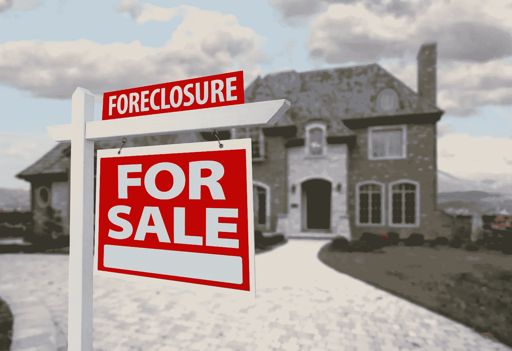

Credit: Andy Dean Photography/Shutterstock

房主意识到银行向他们收取这些过高的费用是不公平的，并决定最好的行动是干脆停止支付他们。

反过来，银行不能让“拖欠”的房主住在他们没有支付的房子里，因此他们没收了那些拒绝支付抵押贷款的人的房产。这就是所谓的取消抵押品赎回权。

# 银行业

如此多的人无家可归，银行已经承担了他们所有的抵押贷款债务。现在是他们完成所有付款的时候了。

但请记住，银行已经将所有投资组合债务作为抵押贷款支持证券出售，投资者看到市场崩溃，尽快撤出。

因此，银行在这些投资上损失了数十亿美元。

华尔街意识到自己的错误为时已晚，随着这次急剧的低迷，房价暴跌，银行所剩无几。

## 雷曼兄弟的倒闭

雷曼兄弟成立于 1850 年，是一家专注于股票和固定收益销售和交易的投资银行。在巅峰时期，他们是继高盛、摩根士丹利和美林之后的第四大投资银行。然而，在 2008 年 9 月之前的几个月里，雷曼兄弟(和许多其他银行)认为房地产泡沫是理所当然的，认为它不会影响其核心业务。

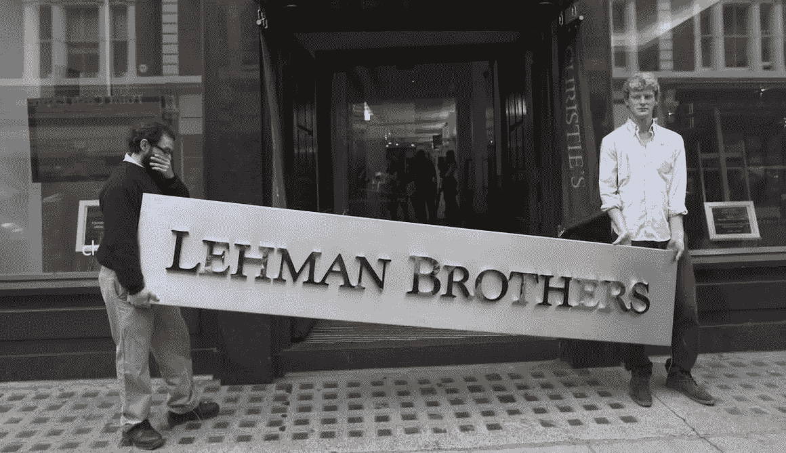

The fall of a titan. Credit: Oli Scarff/Getty Images

尽管抵押贷款违约率上升带来了风险，但雷曼兄弟继续承销抵押贷款支持证券。然后，一旦房地产市场开始恶化，雷曼就没有空间偿还其庞大的抵押贷款组合。

然而，由于雷曼的每股收益仍呈现正收益，投资者和董事会直到 9 月 12 日房地产市场崩盘、公司股价下跌 93%才认识到问题所在。

雷曼兄弟宣布破产后，员工被解雇，银行业的其他人亲眼目睹了糟糕的房地产市场问题，以及乐观的预期和缺乏远见。这在整个欧洲和亚洲市场以及华尔街的其他地方传播了悲观的反应，因为其他银行试图通过减少自己的抵押贷款支持证券来尽量减少未来的损失。

这种想法随后向下传播到微观经济的抵押贷款人和房主，特别是中低收入群体，他们将无法支付突然上升的拖欠。这些事件的总和导致了大范围的止赎，因为银行没收了拖欠的房主的财产；此外，随着全球市场受到美国房地产市场下滑的影响，南美和欧洲的发达国家开始经历同样的衰退，贸易不断减少。

另一方面，中国、印度和俄罗斯等“东方”社会相对未受影响；非洲大陆与世界其他地区没有多少根深蒂固的贸易协定，因此同样没有受到市场困境的影响。

有人可能会说，技术沟通不畅在市场衰退中比其他任何因素都起了更大的作用。2008 年 9 月之前，市场表现出看涨的回报，投资者、美联储官员和银行家被这些回报蒙蔽了双眼。

然而，随着抵押贷款市场的波动，衰退的迹象显而易见。为了吸引投资者，投资银行在季度股东大会上报告称，他们的抵押贷款支持证券基础良好，价格可能会上涨。

因此，随着抵押贷款违约率上升，资金不断流入银行系统，因为这一信息因低估而被隐瞒。几年后，在美联储分析了市场崩盘后，银行业被认为应对沟通不畅负责(尽管一些人认为这还不够)，加剧问题的投资银行因误导投资者和房主而被起诉，金额超过 300 亿美元。受影响的个人因此获得了主要宽恕的解决方案。

## 高盛:庄家总是赢家

高盛是一家投资银行和金融服务公司，总部设在纽约市。具体而言，该行目前专注于投资和资产管理、经纪和证券承销。在法律上，这种公司实体被称为“银行控股公司”，因为它控制着各种不同的银行部门。

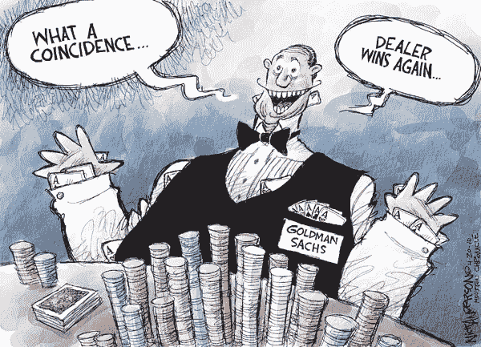

Goldman Sachs was quite aware of the market future, and adapted internal policies to benefit itself, as did all successful banks. Credit: Houston Chronicle

然而，在 2008 年之前，高盛并不是一家“银行控股公司”，而是一个由上述所有部门组成的单一银行部门。这是一个微妙的区别，因为核心功能保持不变，但法律术语反映了正式的结构。

作为证券承销商，高盛通过向房主贷款来承担住房抵押贷款债务，然后将这些债务重新打包成可交易指数(被称为 RMBS)。由于 2008 年前的房地产泡沫，房主们按时支付了抵押贷款，利率帮助 RMBS 投资者和他们的经纪中介获得了巨大利润。

结果，像标准普尔和穆迪这样的信用评级公司给了这些基金 AAA 评级(一个主要指标)。然而，在此期间，高盛的高层管理人员和分析师意识到了住房市场违约率的上升。但为了继续吸引投资者的资金并保持最高的 AAA 评级，他们没有在投资者会议上或向美国证券交易委员会透露这一信息。

随着雷曼兄弟的倒闭，华尔街看到整个银行业陷入困境；为了获得联邦救助资金，高盛将自己从一家投资银行转变为一家银行控股公司。这一点，再加上没有披露信用评级的波动性，帮助高盛在 2008 年金融危机中得以生存，并获得了巨大的利润。

然而，一旦该行业稳定下来，美国证券交易委员会(SEC)起诉高盛在房地产市场欺诈投资者，该公司必须向投资者、房主和政府支付 50.6 亿美元。

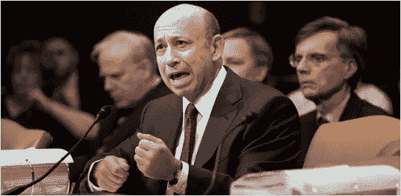

Goldman Sachs CEO defends against the SEC filing. Credit: Paul Legato

高盛证券承销的结构性金融产品主要影响投资者和房主，他们因此分别损失了大部分投资，甚至因丧失抵押品赎回权而失去了自己的房子。

在房地产泡沫和随后的联邦救助计划崩溃后，高盛的和解方案包括减少贷款人抵押贷款的已实现本金，作为消费者救济的一部分，以及向受欺诈的投资者支付现金。

尽管雷曼兄弟的倒闭向全世界表明金融危机迫在眉睫，但高盛的“欺诈性”活动从长远来看有助于保护自己，并获得利润。尽管美国证券交易委员会曾试图起诉高层管理人员，但高盛的策略使得复苏减轻了投资者和房主的损失。

与雷曼兄弟一样，缺乏沟通是高盛欺诈性报告的最大原因。由于房地产泡沫，2007 年末和 2008 年初的投资者会议没有包括该公司对抵押贷款违约率上升的调查。

因此，高盛的 AAA 级 RMBS 应该被评为 B 级 BBB-到 B-，这意味着这些证券应该作为高度投机性和几乎没有真正支持的证券呈现给投资者和贷款人。这些谎言被用来制造房地产市场的虚假潜力，最终导致崩盘。

# 记得使用保护:信用评级和保险

在这一点上，你可能会问:难道分析师没有意识到抵押贷款拖欠会赶上糟糕的贷款实践吗？而且公司没有保险保护自己吗？

是的，是的。

所以这个故事还有更多的内容…

信用评级机构告诉投资者一个交易工具有多可靠。

穆迪公司是一家商业服务和金融服务公司，最著名的是为美国证券市场提供信用评级的穆迪投资者服务公司(MIS)。穆迪与标准普尔金融服务公司和惠誉评级公司被认为是“三大”信用评级机构之一。

从 2000 年到 2008 年，特别是在 2007—2008 年的房地产泡沫中，穆迪(和其他信用评级机构)在债务证券市场(如货币市场和养老基金的抵押贷款支持证券)提供膨胀的 3a 信用评级，以增加销售，从中赚取佣金。

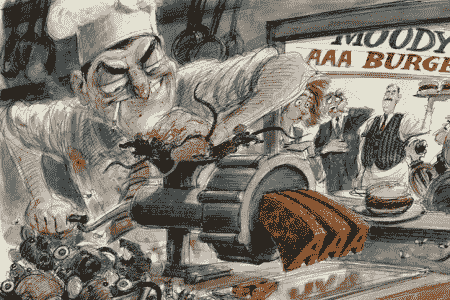

Providing inflated Triple A ratings out of “pink slime”. Credit: Victor Juhasz

结果，银行和投资者对出售证券的信心很高，购买越来越多，虚假地创造了高需求。但是，当不正当地获得高额抵押贷款的拖欠房主无力支付账单时，这种影响通过房地产市场和华尔街加剧，因为投资者意识到所有这些证券都被错误地估值了。

因此，雷曼兄弟破产了，因为他们的股票在一天之内暴跌了 93%，其余的银行都收回了现金，加剧了房主的拖欠问题，导致房地产价格飙升。

大多数回顾 2008 年金融危机的分析师强调，给予抵押贷款支持证券和债务证券的错误信用评级是事件中最具影响力的因素(正确使用公式，2007-2008 年债务证券的信用评级应该被归类为“垃圾级”，或 DDD 违约，而不是 AAA“优质”)。

错误的信用评级导致了银行恐慌和房屋止赎。因此，尽管信用评级公司成员感受到的冲击最小，但银行、投资者和公民损失惨重。

在美联储强行控制美国国际集团(AIG)稳定市场后，穆迪被美国司法部罚款 8.64 亿美元，原因是未能坚持自己的信用评级方案，且沟通不够透明。这些资金在司法部和各州之间分配，以努力把钱重新交到人们手中。

The settlement of S&P, another credit rating agency. Credit: Department of Justice

穆迪是技术沟通失败、透明度失败和需要知道的信息失败的一个例子。信用评级机构的顶级分析师获得了商业知识和通信，并利用这些信息继续以高评级膨胀债务证券市场，同时卖空自己的头寸。

这是一个未能遵守需要知道的信息的例子，公司事务通常只保留给高管。此外，由于穆迪没有公布其方案的评级过程，信任是盲目的。这是透明技术交流的失败。最后，虽然穆迪完全知道债务证券暴跌，但它没有与美国证券交易委员会和美联储(至少)或其客户银行分享这一信息。

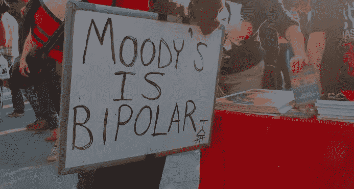

It is usually the end consumer who feels the brunt of poor policies, not the company. Credit: Alec Tabak

美国国际集团(AIG)是一家金融和保险公司，通过三个主要部门运营:一般保险、人寿和退休以及技术支持。尽管这些部门在公司内部是独立的实体，但资金池是一个整体，如果管理不善，经济低迷会对所有领域产生影响。

2008 年之前，AIG 是所有商业保险的最大管理者。尽管高盛和雷曼兄弟等银行承销了抵押贷款支持证券，但所有这些承销都是由 AIG 承保和管理的。

例如，AIG 持有超过 200 亿美元的高盛商业保险，尽管后者予以否认。其他主要投资银行估计也有类似或更多的数字。

因此，美国国际集团市场的波动将导致所有银行市场的波动，甚至会动摇美国联邦金融市场，而美国国际集团也为该市场提供了部分保险。

当其他银行继续为拖欠贷款的房主提供 RBMS 时，房地产泡沫破裂，雷曼兄弟于 2008 年 9 月 15 日申请破产。这是拖欠房主即将陷入大麻烦的主要指标。

当投资者意识到 RBMS 的高信用评级毫无根据时，AIG 的市场价值和其他银行的市场价值也因雷曼的破产而急剧下降。

美联储(美国金融稳定监督委员会)意识到了这一问题，立即出手 1500 亿美元纾困美国国际集团。他们通过基于利息的贷款控制了公司 80%的股权。这一救助拯救了 AIG，也防止了银行市场的其他部分崩溃。

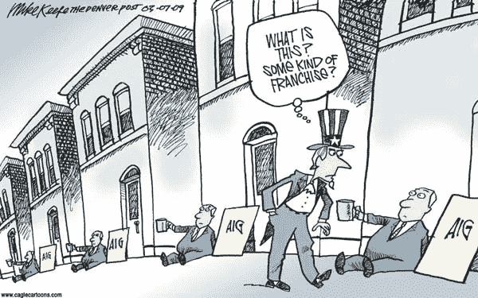

A satirical take on the bailout. Credit: Mike Keefe

尽管存在争议，但由于 AIG 为这笔贷款支付了 227 亿美元的利息，这一决定稳定了美国金融市场，最终让纳税人受益。救助 AIG 对美国纳税人的影响最大，其次是贷款人、房主和投资者。

如果美联储没有承担 AIG 的临时债务，美国金融市场可能会暴跌，这意味着随着美元价值下跌，通胀率将大幅上升。纳税人最终将背负这一负担，随着银行没收他们的债务，更多的房主将取消他们的房产赎回权。因此，这一事件的最大影响是预防可能发生的事情。

与针对高盛的诉讼以及雷曼兄弟破产背后的错误评级不同，对 AIG 的纾困展现了及时和真实的技术沟通。美国国际集团的高层管理人员正确地报告说，他们管理的投资银行的资金将很快面临损失数十亿美元的风险，尽管他们拥有优秀的 AAA 信用评级。

因此，美联储能够分析出，“如果美国国际集团倒闭，它将对已经摇摇欲坠的货币市场产生冲击波，因为数百万人在本应安全的投资中损失了金钱”(Gethard，2019)。这刺激了紧急援助。几年后，政府救助条款的法律技术沟通确保了纳税人将获得利息回报，显示出长期利润。

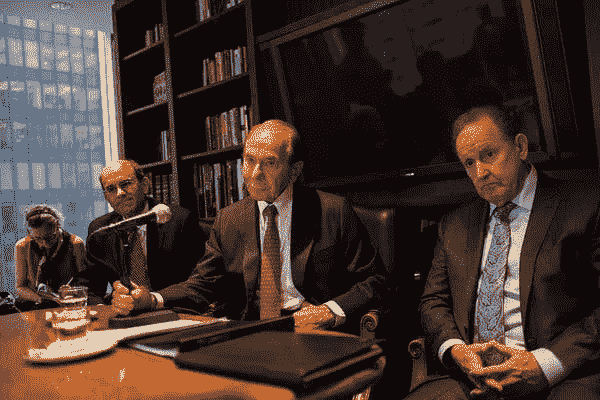

It was later ruled that it was illegal for the government to seize AIG’s assets. Credit: Christian Hansen

# 拯救世界

是官员介入的时候了。

金融危机爆发后，美国财政部创建了问题资产救助计划(TARP)来稳定市场。该法案由美国财长亨利保尔森(Henry Paulson)首创，并于 2008 年 10 月 3 日由美国总统乔治布什(George W. Bush)签署成为法律。

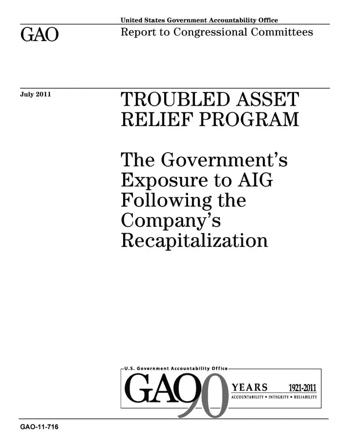

The TARP gave the US economy a chance to recover following sweeping bailouts. Credit: US Government Accountability Office

从本质上讲，该计划概述了政府从陷入困境的公司购买抵押贷款支持证券和银行股票的方法。通过持有这些股权，政府将增加**货币市场**和**次级抵押贷款市场**的流动性**。**

换句话说，这将再次刺激交易工具的交易，引发看涨反应。这一计划还让美国财政部在银行重组和董事会决策中拥有了一票，届时将对银行糟糕的管理和沟通进行惩罚。

TARP 无疑拯救了华尔街，但直到今天仍有争议，因为批评者认为它是一种不必要的提振，本来可以及时恢复。无论如何，政府的总支出是 4264 亿美元的救市投入和 4417 亿美元的回报；这些收益的一部分，减去通货膨胀，作为本金免除被重新分配给遭受损失的房主。

# 余波

经济和大企业整体复苏，但个人呢？

一些人受益于本金豁免，银行免除了他们不公平的高抵押贷款利率。但是其他人就没那么幸运了，尤其是低收入群体。让我们来看看一些房屋所有权数据，以获得一个总体概念。

我们将从止赎率开始，但首先，让我们思考一下这个问题:在过去的 20 年里，我们可以预期完成的止赎数量是多少？

因为金融危机发生在 2008 年，我们应该在 2008 年看到一个高峰，这似乎很直观，但这是不正确的！

请记住，在 2008 年之前，银行已经交易抵押贷款支持证券有一段时间了，但直到今年 9 月，违约才赶上投资损失。因此，在 2008 年之前，我们应该会看到止赎数量的缓慢增长。

但是 2008 年 9 月之后呢？政府救市发生了，市场稳定了；这难道不意味着一切都很好吗？

不完全是。2008 年，违约损失的资金达到了投资于抵押贷款债务的资金水平，然后很快就超过了这一水平。这意味着银行仍然需要努力达到收支平衡，我们应该继续看到止赎上升超过 2008 年，然后银行抓住他们的资本！

这种经济周期通常持续几年，而像 TARP 这样的有益项目需要 3-5 年才能真正生效。因此，一旦这项福利生效，银行就不需要没收房屋，强劲的经济意味着人们有工作，因此止赎率将降低，并回到 2008 年前的水平。

现在让我们来看看数据:

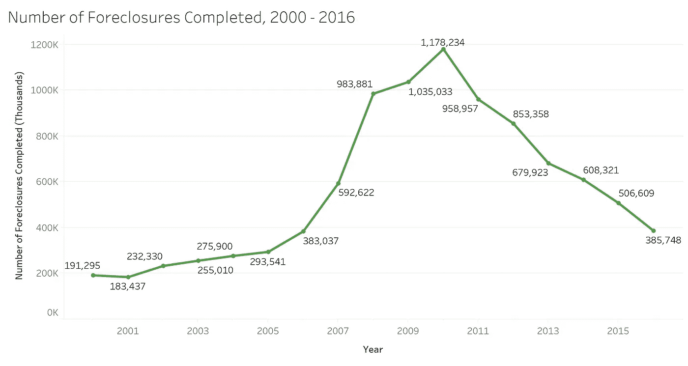

Notice the inflection in 2007–2008 as banks realized mortgage-backed securities were poor investments and the peak in 2010 as the debt finally stabilized with the prices of homes seized. Graph by Author

既然我们已经看到了金融危机是如何在全国范围内影响止赎权的，我们可能会问它在州一级是什么样子的。

因为卷入市场崩溃的所有银行都位于纽约市的华尔街，我们可能会认为纽约三州地区(NY、NJ 和 ct)受影响最大。

这是很好的直觉。然而，回想一下微观经济学沿着借贷链向下传播。因此，除了受纽约股市崩盘影响的当地地理位置，任何有核心商业联系的州都会受到类似的影响。

当然，整个国家在某种程度上都依赖于华尔街，但每个地区都有不同的核心产业。例如，中西部和非西海岸的西部各州主要在基础市场赚钱:农业、矿业、石油等。这些市场可能受到华尔街的保护，但不太容易受到银行破产的影响(因为它们的生产不依赖于银行；这取决于土地)，而不是汽车公司、科技公司等。东西海岸的市场对“商品”的依赖要少于库存商品。

那么，我们如何衡量政府对华尔街的“依赖”？

因为这和要求州级市场化收入是一样的，我们可以看一下州 GDP 实力:

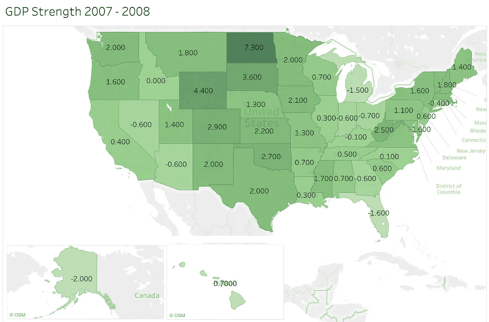

The darker the state color, the stronger its GDP held in 2007–2008\. Notice that North Dakota, a core oil producer, had a 7.3% *increase* in GDP during the financial crisis. This was in part due to the oil boom in that time period, as commodities usually boom when tech and finance fails (as a safety net). Furthermore, notice that Florida, a Northeastern citizen’s retirement state, had a nearly 2% decrease in GDP; this is because Florida’s income largely depends on the Northeast. Map by Author

请注意中西部的颜色最深，这表明在 2007-2008 年的关键波动时期 GDP 最强劲。

GDP，即国内生产总值(人均)，与普通公民的收入相当。反过来，如果中西部和非西海岸的西部各州拥有最强的 GDP，我们预计它们在此期间也将拥有最低的房屋空置率(因为更高的 GDP 意味着更高的就业强度和更好的支付房屋贷款的能力)。

让我们看看这个假设是否成立:

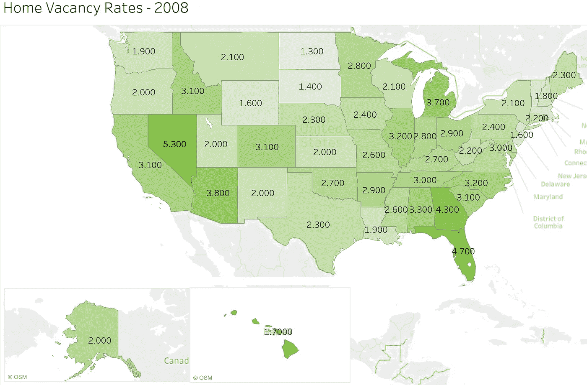

Lighter colored states have lower home vacancy rates. Notice that North Dakota has the lowest home vacancy rate at 1.3%. This correlates with its GDP strength. Furthermore, notice that Florida has the second highest vacancy rate after Nevada. This relates to its dependence on Northeast income. Map by Author

总的来说，一个州的 GDP 越强劲，其相应年份的房屋空置率就越低。浏览了两张地图后，这一点基本上成立(注意北达科他州和佛罗里达州)。

# 展望未来

在新冠肺炎疫情开始之前，美国市场在 2020 年初表现最佳。工作保障很强，股票市场前景也很好。

我们应该感谢谁？

在其他因素中，如国际贸易的持续增长，TARP 是经济增长的主要催化剂。

许多政客声称政府救市是荒谬的，并引用自由放任的经济学作为理由。虽然市场*本可以*自行复苏，但 TARP 加速了这一过程，这样受市场崩溃影响的人就最少了。这种争议就是为什么 TARP 经常被认为是奥巴马政府的一个污点。

但回想一下之前的情况，总的平均经济周期通常比当前的经济事件滞后 3-5 年(尽管每日波动被很好地代表了)。例如，尽管市场在 2008 年崩盘，TARP 在 2008 年稳定了市场，但直到 2010-2011 年止赎率最终开始下降时，人们才感受到真正的影响。

类似地，经济实力(或失败)源自之前事件的金融影响。

与我们的讨论主题相关，这意味着 2008 年的市场崩溃发生在奥巴马政府之前。相反，它与乔治·w·布什政府(甚至克林顿政府)的经济政策有关。特别是，2001 年和 2003 年的所得税削减、2003 年医疗保险 D 部分的实施以及巨额军费开支造成了对外国资本的依赖，从而吹大了 2004—2008 年的房地产泡沫。

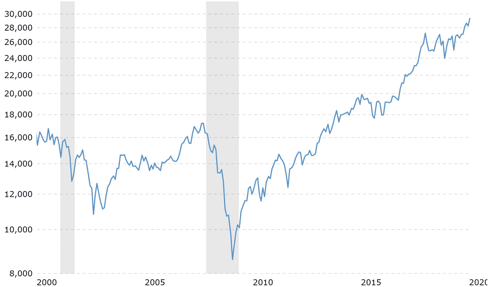

This graphs shows the Dow Jones Industrial Average (DJIA) from 2000–2020\. Notice the mid-cycle recession from 2002–2004\. This cycle, from a macroeconomic lens, insinuated the housing bubble of 2006–2008 as well as its subsequent plummet in 2008\. In other words, the 2008 market crash’s precursor was the economic policy of the previous term. Graph by Author, using [Macrotrends](https://www.macrotrends.net/)

奥巴马政府通过 TARP 和经济刺激计划挽救了这种依赖的崩溃，创造了近年来的就业优势。

类似地，不能将冠状病毒爆发前的所有市场波动完全归咎于特朗普政府。特朗普总统继承了奥巴马总统的强劲经济，并继续在此基础上发展。

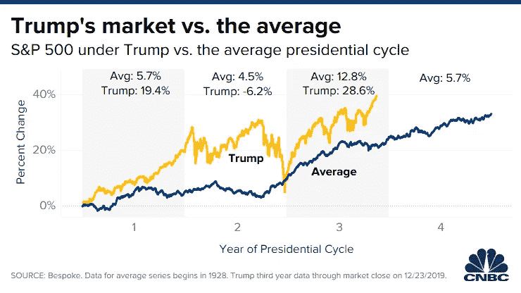

Graph courtesy of [Bespoke Investment Group, LLC](https://www.bespokepremium.com/), via [CNBC](https://www.cnbc.com/2019/12/26/trumps-stock-market-rally-is-far-outpacing-past-us-presidents.html)

如果我们看看特朗普的经济政策，包括贸易保护、公司税改革和严格的移民要求，我们会看到核心重点是确保美国资金和减少奥巴马政府为纾困银行而承担的债务。虽然“美国第一”的说法有争议，但其基本政策是通过减少政府赤字支出来利用奥巴马政府的增长，在财政上是必要的。“美国第一”的社会方面是另一个话题…

简而言之，特朗普总统继承了一个拥有同样庞大债务的强劲经济。他的工作是减少政府债务，以便下一届政府能够自由推进美国的外交政策，并在稳固的基础上开展贸易。

特别是随着来自东方(包括中国、印度和俄罗斯)的竞争日益激烈，美国必须在未来几代人的时间里保持其在全球范围内的领导地位和经济繁荣。

经济透明度是成功增长的一个重要方面。尽管奥巴马和特朗普政府无论如何都不完美，但两位总统都有他们倾向于坚持的明确财政政策。

技术交流，尤其是整个增长过程中的透明度，已被证明是影响市场的关键。缺乏良好的沟通会导致资金和投资被挪用(如雷曼兄弟、穆迪、高盛)，而及时的沟通和道德会带来应有的帮助(如 AIG、本金豁免、银行结算的再分配)。

通过这个 2008 年金融危机的案例研究，我们看到了这些关于经济透明度的叙述是如何导致房地产市场投机的。然后，我们看到了投机是如何导致一些公司的灭亡和其他公司的崛起的。最后，我们看到了由于 2008 年采取的行动，美国宏观经济和微观经济表现如何。

从这篇文章中最重要的收获是理解强大的技术交流，本质上只是透明和真实的交流，如何在国家范围内影响人们和团体。

随着我们进入下一个十年，鉴于市场的周期性，我们将迎来另一场大衰退。尽管仍有争议，但疫情冠状病毒正显示出令人担忧的迹象。技术交流和效率将有助于减轻或加重我们最终感受到的影响。问题是:历史注定会重演吗？还是我们已经吸取了教训？

# 参考

j .卡西迪(2019 年 7 月 9 日)。2008 年金融危机的真正代价。检索自[https://www . new Yorker . com/magazine/2018/09/17/the-real-cost of-the-the-2008-financial-crisis](https://www.newyorker.com/magazine/2018/09/17/the-real-cost-of-the-2008-financial-crisis)

CFR 工作人员。(2015 年 2 月 19 日)。信用评级争议。从 https://www.cfr.org/backgrounder/credit-rating-controversy[取回](https://www.cfr.org/backgrounder/credit-rating-controversy)

埃利斯博士(2008 年 12 月 16 日)。高盛公布亏损 21 亿美元。检索自[https://money . CNN . com/2008/12/16/news/companies/Goldman _ Sachs/index . htm？postversion=2008121612](https://money.cnn.com/2008/12/16/news/companies/goldman_sachs/index.htm?postversion=2008121612)

弗赖费尔德，K. (2017 年 1 月 14 日)。穆迪因危机前的评级向美国各州支付 8.64 亿美元。检索自[https://www . Reuters . com/article/us-moody-s-credit/moodys-pays-8.64 亿-对美国各州的危机前评级-idUSKBN14X2LP](https://www.reuters.com/article/us-moody-s-credit/moodys-pays-864-million-to-u-s-states-over-pre-crisis-ratings-idUSKBN14X2LP)

Gethard，G. (2019 年 12 月 4 日)。倒下的巨人:美国国际集团的案例研究。检索自[https://www . investopedia . com/articles/economics/09/American-investment-group-AIG-bailout . ASP](https://www.investopedia.com/articles/economics/09/american-investment-group-aig-bailout.asp)

c .希尔(2010 年)。为什么评级机构对次级证券的评级如此糟糕？。从[https://scholarship.law.umn.edu/cgi/viewcontent.cgi?取回 article = 1084&context =教员 _ 文章](https://scholarship.law.umn.edu/cgi/viewcontent.cgi?article=1084&context=faculty_articles)

卡斯佩尔科维奇，J. (2016 年 4 月 11 日)。高盛(Goldman Sachs)将为其在 2008 年金融危机中的角色支付 50 亿美元。检索自[https://www . the guardian . com/business/2016/apr/11/Goldman-Sachs-2008-金融危机-抵押担保证券](https://www.theguardian.com/business/2016/apr/11/goldman-sachs-2008-financial-crisis-mortagage-backed-securities)

雷曼兄弟破产 A:概述。(2017 年 12 月 12 日)。检索自[https://som . Yale . edu/case/2014/the-Lehman-brothers-business-overview](https://som.yale.edu/case/2014/the-lehman-brothers-bankruptcy-overview)

新泽西州利乌迪斯(2020 年 1 月 9 日)。雷曼兄弟的倒闭:案例研究。检索自[https://www . investopedia . com/articles/economics/09/Lehman-brothers-collapse . ASP](https://www.investopedia.com/articles/economics/09/lehman-brothers-collapse.asp)

p . Martens 和 r . Martens(2019 年 4 月 15 日)。2008 年的金融崩溃以及为什么华尔街仍然是一个危险的赌场。检索自[https://wallstreetonparade . com/2019/04/this-Goldman-Sachs-chart-explains-the-2008-financial-collapse-and-why-wall-street-is-a-dangerous-casino/](https://wallstreetonparade.com/2019/04/this-goldman-sachs-chart-explains-the-2008-financial-collapse-and-why-wall-street-is-still-a-dangerous-casino/)

麦克唐纳和保尔森(2015 年 8 月 3 日)。AIG 出了什么问题？检索自[https://insight . Kellogg . northwestern . edu/article/美国国际集团出了什么问题](https://insight.kellogg.northwestern.edu/article/what-went-wrong-at-aig)

路透社。(2017 年 1 月 14 日)。在 2008 年金融危机前夕，穆迪因评级问题被罚款 8.64 亿美元。检索自[https://www . the guardian . com/business/2017/Jan/14/moodys-864m-2008 年金融危机前评级惩罚](https://www.theguardian.com/business/2017/jan/14/moodys-864m-penalty-for-ratings-in-run-up-to-2008-financial-crisis)

根，A. (2019 年 3 月 6 日)。对 AIG 的救助结束了 10 年前的金融危机。现在，分析师喜欢这只股票。检索自[https://www . barrons . com/articles/AIG s-bailout-crisis-analysts-like-the-stock-51551910738](https://www.barrons.com/articles/aigs-bailout-crisis-analysts-like-the-stock-51551910738)

北卡罗来纳州沙伯(2014 年 9 月 28 日)。最后，关于救助美国国际集团的真相。检索自[https://www . nytimes . com/2014/09/29/opinion/finally-the-truth-about-the-help . html](https://www.nytimes.com/2014/09/29/opinion/finally-the-truth-about-the-bailout.html)

美国参议院常设调查小组委员会。华尔街与金融危机:金融崩溃的剖析。(2011 年 4 月 13 日)。检索自[https://archive . nytimes . com/www . nytimes . com/interactive/2011/04/14/business/14 crisis-doc viewer . html？_r=0](https://archive.nytimes.com/www.nytimes.com/interactive/2011/04/14/business/14crisis-docviewer.html?_r=0)

Vaheb，E. (2013 年)。2008 年金融危机:美国经济自大萧条以来最严重的衰退。金融与财务管理。从[https://opencommons.uconn.edu/cgi/viewcontent.cgi?取回 article = 1325&context = Sr honors _ themes](https://opencommons.uconn.edu/cgi/viewcontent.cgi?article=1325&context=srhonors_theses)

扎伊迪 d，王 m，霍尔 k . g . &菲茨杰拉德 A. (2016 年 3 月 19 日)。信用评级机构在 2008 年崩溃中无可争议的作用，以及为什么什么都没有改变。检索自[https://tru thout . org/articles/the-exhibit-role-of-the-credit-ratings-agency-in-the-the-the-2008-collapse-and-why-nothing-change/](https://truthout.org/articles/the-indisputable-role-of-credit-ratings-agencies-in-the-2008-collapse-and-why-nothing-has-changed/)

# 数据源

房屋空置和房屋所有权，来自 https://www.census.gov/housing/hvs/data/prevann.html

止赎率，来自[https://www . corelogic . com/research/赎-report/national-赎-report-10 year . pdf](https://www.corelogic.com/research/foreclosure-report/national-foreclosure-report-10-year.pdf)

国家国内生产总值，来自[https://www . bea . gov/news/2009/gross-GDP-state-advance-2008-and-revised-2005-2007](https://www.bea.gov/news/2009/gross-domestic-product-state-advance-2008-and-revised-2005-2007)