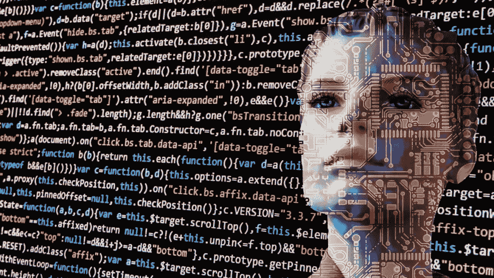
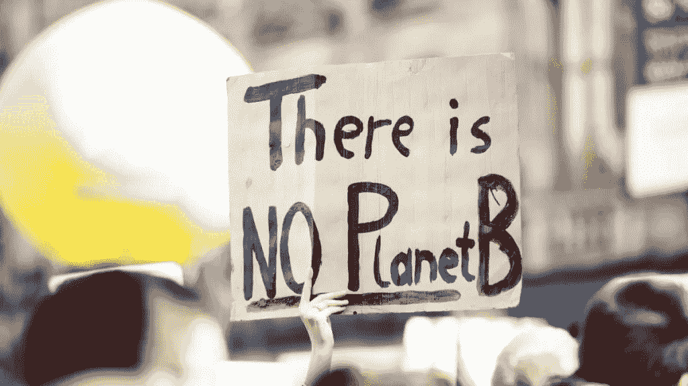
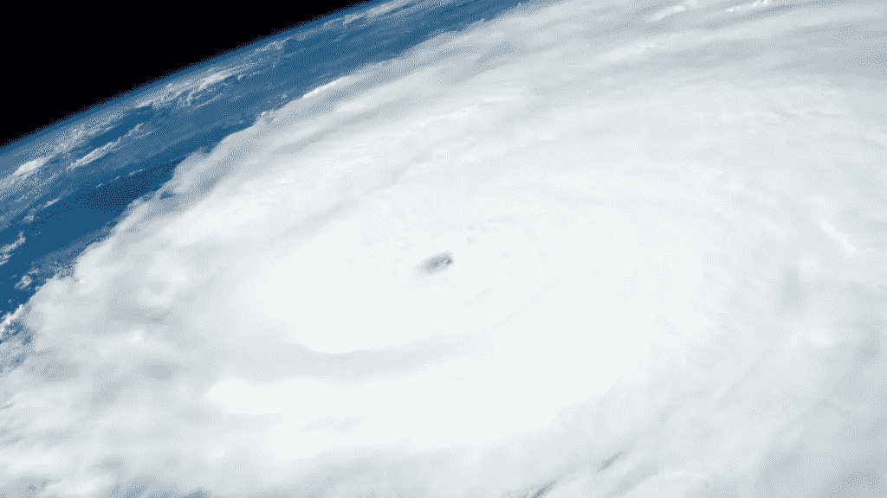
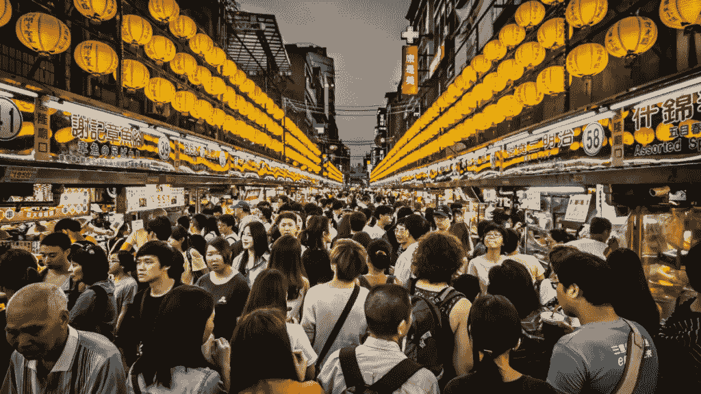
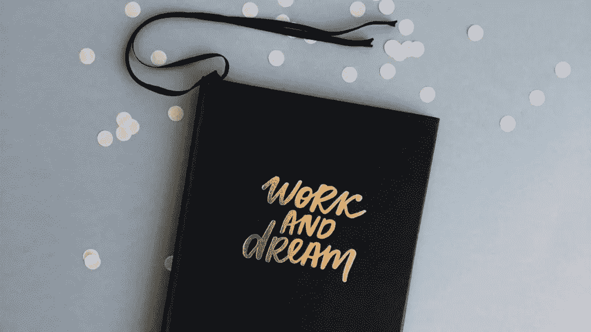

# 2020 美元——新十年的繁荣——金融幻想家

> 原文：<https://medium.datadriveninvestor.com/the-2020-thriving-in-the-new-decade-financial-imagineer-13f8f2057e50?source=collection_archive---------9----------------------->

我们的世界转动的速度正在加快:持续的技术破坏、混乱的政治和“永远在线”的工作场所让我们许多人喘不过气来。冠状病毒为这个快速变化的领域增添了新的动力。

让我们保持乐观:改变通常伴随着机会。人类在过去经历了文化、经济体系和政治的多重转变。如果你回头看，很明显变化是历史中唯一不变的。我们仍然处在一个新十年的开端。

即将到来的变化和趋势将影响我们生活的许多方面。不管你住在哪里。无论你做什么？不管你是谁。利用当前疫情的情况放慢脚步，向后靠，反思，并试着向前看——穿过烟雾和噪音。

向前看很重要。

除了[找到你的 Ikigai](https://www.financial-imagineer.com/2020/07/24/ikigai/) 和[建立多种收入来源](https://www.financial-imagineer.com/2020/08/01/how-to-build-your-abundant-waterfall-of-income-streams/)之外，关注前方的道路，并尝试预测新趋势会如何影响你的生活，以及如何为它们做好最好的准备。

Recession proof your life.

去他妈的生存，是时候茁壮成长了！

# 1.准备好为你的工作而战

不到一年前，我们根本无法想象疫情会对我们的工作环境产生怎样的影响。虽然由于 covid，办公室工作人员目前享受到了更多的时间灵活性，但在幕后有更多的力量在移动。

在 corona 锁定期间，我们可以通过 Linkedin、脸书和其他社交媒体渠道观察新发现的位置和时间自由是如何庆祝的。没有更多浪费在通勤、交通堵塞、无聊会议上的时间，总体而言，日常生活质量更高。

更多的工作是在家里完成的，花在办公室的时间更少了。

在那段时间，生产力实际上提高了！人们感觉更有权力，贡献更大，随着绩效以实现目标的方式得到监控，过去长时间工作得分高的同事突然变得不再重要。

这在很多方面都是一把双刃剑。

展望未来，尤其是在 corona 之后，我想说弹性工作制将不再仅仅是提供给少数精选员工的额外津贴。这将是未来十年劳动力的一大需求。

 [## 来自当前疫情|数据驱动投资者的最大金融教训

### 由于当前的健康危机导致的封锁已经影响了每个人的精神、身体和经济。然而……

www.datadriveninvestor.com](https://www.datadriveninvestor.com/2020/04/19/the-greatest-financial-lesson-from-the-current-pandemic/) 

甚至在疫情之前，就已经有了减少工作时间的实验，比如日本和微软的每周四天工作制。令人惊讶的发现证实了我们最近观察到的现象:减少工作时间不会影响结果。情况正好相反，因为管理层可以更专注于了解谁交付了什么。

时间和地点的灵活性正在增加。

这是好消息。

一旦你改变你的视角，故事的另一面是惊人的:因为你不需要在办公室，你的工作，你的工作可以由任何具有必要技能的人完成——从任何地方！这并不是对所有人都适用，而是对很多领域都适用。如果同样的工作可以由国外的人完成，管理层为什么要继续给生活成本高的国家的高成本员工支付工资呢？

世界是平的。

换句话说，大量工作可以外包，高成本领域的“工作”面临的风险最大。您的附加值比以往任何时候都重要。当心你的底线贡献。跟踪结果和贡献变得容易多了。未来，企业将更加注重提高“每个工人的生产率”或“每美元支出的生产率”。

物有所值。

在第一轮中，要做的工作将被外包给成本效益更高的地区的越来越多的技术工人。第二轮将结束，工作将更加简化，并得到更好的工具、系统、人工智能的支持，最终由机器人执行。

这一趋势在过去十年中已经开始，但我的最佳猜测是，最近的疫情局势将使其加速数倍。

在这里茁壮成长的挑战或机遇，以管理好这一点，并充分利用它。

# 结论

由于现在的疫情让不去办公室成为了新的常态，你在办公室的时间不再算数了。真正重要的是你的贡献、结果以及你是否及时完成了工作。注意你增加价值的部分。专注于不容易外包的那部分工作。提高你在相关领域的技能。

新的竞争正在兴起:准备好为你的工作而战吧！

## 获奖者:

善于“独立工作”，懂得增值，物有所值的人。精通 IT 的自由职业者，他们已经知道如何在网上推销自己。博客作者或在社交媒体渠道有知名度的人。住在公司附近或靠近客户已经不重要了。你也可以在巴厘岛、冰岛或新西兰出售你的服务。只要你交付:你会得到报酬。最佳的地理套利机会！

## 失败者:

仅仅专注于出售“他们的时间”或“办公室政治”的员工很容易被来自其他(更便宜)国家的远程员工所取代。随着通勤的人越来越少，办公空间租赁和相关业务将受到影响。这一趋势最终也将影响高收入人口城市和国家目前的税收收入以及他们目前居住的住宅房地产。

# 2.吸引注意力和眼球的全球战争

你是否有时会漫不经心地浏览你的脸书或推特信息？你有时会忘记你最初是如何到达那里的吗？你被抓住了——而且:你并不孤单！社交媒体、互联网和一般企业在“吸引你的注意力”方面变得如此出色。

作为消费者，你现在就是产品。眼球和观众是 21 世纪的新货币。

每天在社交媒体上浪费至少一个小时的习惯正在消耗你的真正潜力！无论是在工作中、在家里还是在家人面前，你都无法集中注意力。如果你知道如何在所有的干扰下集中注意力，你就已经在这个趋势上赢得了一半的胜利！

同样，对于社交媒体，最具挑战性的领域是我们如何看电视。

老实说，即使在 covid 期间，你可能会看几个小时的电视？嗯，最终还是不够！2020 年预计将会比 20 世纪 90 年代整整十年花在原创剧本电视上的钱还要多。

如果你认为电视时代已经过去，你可能错了。

今年，苹果和迪士尼推出了他们的服务，以与网飞、亚马逊和 Hulu 等老牌流媒体播放器竞争并迎头赶上。更多，如 HBO Max，孔雀(NBC)和 Quibi 将在 2020 年跟进。网飞曾经是“城里唯一的游戏”,而现在，突然间，我们举办了流媒体奥运会！

它的竞争者是这个星球上最有创造力、资源最丰富的公司，他们有一个共同点:他们都想吸引你的眼球。)以及这一不断增长的业务中的一大块。

虽然网飞仍然拥有先发优势——我们自己的家庭电视遥控器上确实有一个网飞按钮——但苹果、亚马逊和迪士尼正在迎头赶上，他们创造了一个完整的生态系统，流媒体只是客户的一个潜在接触点。

你的注意力可以通过多种方式出售！

这些巨头正在推动诸如游乐园、活动人偶、iPhones 或亚马逊 Prime 交付等货币化机会。另一方面，较小的玩家将不得不向大玩家支付费用，以吸引终端客户的注意力和设备。

# 结论

你的眼球和注意力是 21 世纪的新货币。有太多的注意力要出售。流媒体战争即将变得血腥。会有伤亡。在“科罗纳-疫情”的头几个月，大多数科技公司都成比例地增长了。当心监管者如何在这一领域变得越来越重要。

## 获奖者:

人们学会了如何保持注意力，知道如何控制他们的技术。现金流充裕的强大社交媒体和流媒体公司已做好充分准备，未来将“压榨”市场。拥有独特技能的人在网上吸引大众的注意力。

## 失败者:

对生活持更消极态度的人。更传统的电视和内容频道。没有网络战略的报纸。

# 3.终身学习:人工智能、技术和劳动力再培训

关于机器人和人工智能将如何接管我们的工作，有许多预测。我们似乎没有花足够的时间去思考人们将如何在这个新的现实中茁壮成长，以及什么样的技能不能被新的“威胁”所取代。到目前为止，最好的答案通常是 UBI——通用基本收入。

我的观点是，你需要提升你的技能，让自己做好灵活的准备。你知道吗，10 个学生中有 6 个将从事现在还不存在的工作？那么，学校和大学如何培养下一代劳动力来满足这一需求呢？你的学位，你的工商管理硕士学位将来还值多少钱？

我最好的回答是:你必须学习——如何学习！

就这么简单。

独立的终身学习必须在我们的社会中根深蒂固。我们必须保持灵活性，适应快速变化的环境。最好的方法是让学习变得有趣，成为日常生活的一部分。

我们有互联网，这真的很神奇！您可以在线访问我们的综合全球知识。随时欢迎。从任何地方。我们每个人都有责任用指尖掌握的如此非凡的力量做些什么。不要让它白白浪费，要学会如何用好它。

随着越来越多的全球业务量通过互联网、在线或应用程序进行交易，教育技术将变得更加重要。如果你愿意，[你可以访问哈佛大学的(免费)在线课程——今天](https://online-learning.harvard.edu/catalog/free)！

你可以利用无数的在线资源来进行终身学习。无数的博客、播客、youtube 频道和在线课程被提供——我们被越来越多试图吸引我们注意力的“知识”所淹没。

你在哪里长大或者现在住在哪里也不再重要，因为这些知识可以跨越国界和语言。知识正在被大众化。再次声明:世界是平的。

这听起来很可怕，但这是 21 世纪早期生活中的惊人事实。

对于我们这个社会来说，似乎有三种方法可以解决这个问题:

1.把教育和提高教育技能留给个人——优秀的人会照顾好自己，增强自己的能力，签约工作并能挣些钱，

2.把它留给公司，希望他们投资把他们的人才留在工资单上并保持更新——这很昂贵，如果人才离开了怎么办？如果他们不投资于自己的才能而留下来，岂不是成本更高？嗯……或者

3.让政府来处理吧。

# 结论

我的结论是——对人们来说是个好消息——作为一种资源:在上面的等式中，人是最灵活的。他们可以跨越国界和公司。公司也可以跨越国界——寻找人才、机会或更好的生态系统，但人们不一定会跟随。最后但并非最不重要的一点是，一些国家将被甩在后面。因此，他们——各国——面临着为这一挑战做准备的压力。如果他们不这样做，越来越全球化的劳动力和越来越强大的大公司就会因为吸引力不够而抛弃他们。各国必须专注于保持法律的竞争力、地理位置的吸引力以及对优秀企业和熟练劳动力的开放。

作为个人，你面临的挑战或机遇是保持相关性，并有可能开始在网上推销自己。我称网站为“21 世纪房地产”，这不是开玩笑。你可以通过博客、播客、youtube、社交媒体或许多其他方式建立你的在线形象。我的朋友皮特甚至建立了一个完整的业务，为那些希望赶上各自新技能的人服务，它被称为你甚至博客/在线影响。

## 获奖者:

赢家将是灵活的人，渴望学习、成长和适应新的现实。作为工人，不断积累你的知识和技能。如果你从商业的角度来看，你能教给世界的任何东西都会变得有市场。这样，服务可以帮助人们获得新的技能，在新的数字经济中茁壮成长(例如，你甚至写博客)。大型国际公司也在通过降低成本利用更大的全球人才库来获利。拥有强大甚至全球声誉的大学将能够从这一趋势中获益，因为它们可以利用自己的在线资源吸引越来越多的学生。胜者全拿走。

迎接这些挑战并提供最佳生态系统的国家或许能够吸引灵活的个人和企业。

## 失败者:

首当其冲的将是传统的教育供应商，它们的适应速度不够快，或者无法与进军新市场的全球教育品牌竞争。不好奇或不渴望不断积累知识和技能的人会很快被甩在后面。

一些国家或“民族国家”正在走上保护主义的道路，而不是通过改善生态系统来吸引更多的全球人才和公司，从而接受变革。

# 4.气候变化和房地产

整个电晕的情况似乎推迟了这个问题——目前。就在去年，格蕾塔·图恩伯格被《时代》杂志评为年度人物，在她的努力下，围绕气候危机的公众压力以很少人预料到的方式逐渐增加。

现在，2030 年倒计时开始。在这十年中，184 个国家——我们所有人——必须兑现减排承诺，以将全球气温上升幅度保持在 2 摄氏度以下。由于最初的承诺没有实现，活动人士要求将纸面上的目标降至 1.5 摄氏度，以纠正这一趋势。

在某种程度上，我真的希望有一天我们可以回顾这个时候——一个新十年的开始——我们决定抗击气候变化的威胁并成功避免它。我们以前对臭氧层做过同样的事情，目前的预测显示臭氧层可能会在 2060 年完全恢复。对我来说，臭氧层的愈合证明我们必须听从科学，实施一些规则，并在为时过晚之前采取行动。

对我们星球的最大威胁是相信别人会拯救它。我们还没有一个“B 星球”，不是吗？埃隆·马斯克正在努力！太空探索将是这一趋势的另一个受益者。

# 结论

Covid 似乎暂时搁置了气候变化运动。有些问题有望由疫情自己解决——比如更少的航班，更少的交通，更普遍的节约。一旦我们想出如何与 covid 共处/或摆脱它，结果会如何还有待观察。

气候变化将对受影响的地区或国家产生持久的影响。大规模移民可能会再次发生。房地产和保险费将受到影响。风暴、洪水、火灾或经济中心转移的风险增加将是驱动因素。保持保险和再保险业务在这里的观点，他们可能会明显过度暴露和覆盖不足，特别是在这些低利率时期。

## 获奖者:

生产更可持续产品和服务的公司。潜在的电动汽车、更环保的飞机、可持续能源，等等。受潜在全球变暖影响较小的国家(比如冰岛、新西兰)。独立于位置的人。

## 失败者:

无法根据新形势和不断变化的需求快速调整战略的公司。受气候变化影响更大的国家。必要时不能或不能灵活移动的人。

# 5.亚洲世纪即将到来

2020 年，亚洲经济体将自 19 世纪以来首次超过“世界其它地区的总和”。此外，亚洲现在是世界上一半以上中产阶级的家园。几年来，世界经济的重心一直在移动。最近它从大西洋中部缓慢向东移动，几年后应该会到达中国南部的某个地方。

当然，过渡和“起义”不会是平静和稳定的，远东的紧张局势和抗议活动可能会减缓这一趋势。然而，从经济和人口的角度来看，结果必然是这样的:亚洲将是未来十年的焦点。

中国和印度取得了惊人的增长，成功地让人类历史上前所未有的大量人口摆脱了贫困。仅中国就感动了 8 亿多人！)脱离贫困——直接进入中产阶级。一旦这一转变完成，问题将是:下一步是什么？

亚洲不仅仅是中国，还有更多国家正在崛起。

# 结论

这一次到底会有多少人参加还有待观察。政治将是这里的关键驱动力。看到已经开始的贸易战。

## 获奖者:

关注亚洲日益壮大的中产阶级的公司和企业。

## 失败者:

那些专注于当前市场份额，而不花时间或精力来与这块不断增长的经济蛋糕同步增长的公司。

# 6.肉类替代品将大行其道

肉类替代品越来越受到消费者的青睐。超越肉类(现在在比萨饼、意大利面条酱和汉堡中也有)和更多新的竞争者将形成一个全新的食品类别，与传统肉类养殖业直接竞争。

在我家，我们最近在盲测设置中测试了纯“安格斯牛肉汉堡”与“超越汉堡”的对比。我的孩子更喜欢超越。最有可能的是，他们的汉堡被设计成比汉堡闻起来、尝起来或感觉起来更好。所以，是的，肉类替代品赢得了我们自己的盲品！

虽然目标市场正在快速增长——一些消费者希望享受他们的蛋白质，并认为转向生态和伦理上更好的解决方案是有益的——但农业行业正在行动，并计划实施新的法律，限制使用肉类、汉堡、牛奶或动物产品等词。这类提案已经提交给了美国国会和欧盟委员会。

利害攸关的市场是巨大的:到 2020 年，每年 1400 亿美元！

未来 10 年，改变游戏规则的将是人工养殖、无屠宰场肉类的出现。牛肉、猪肉、鸡肉以及更多在实验室中从动物细胞中生长出来的东西。这个行业的每个人都在密切关注突破。成功的关键是贴上标签并以正确的方式销售。

为了取得成功，替代生产商希望并需要他们的产品出现在肉类通道、肉类柜台和相应的餐厅内或附近。目标客户不再是纯素食者或素食者，而是每个人，包括尤其是肉食者。如果最坚定的肉食者按照他们的方式消费，他们就赢了。

# 结论

这种趋势已经开始，可以与过去 20-30 年在餐馆、公共场所和办公室禁止吸烟的情况相提并论，想象一下如果食用/消费(真正的)肉类被公开羞辱会发生什么。

让我们看看。我尝试过更多，但我自己仍然更喜欢美味的牛排、汉堡和香肠。

## 获奖者:

健康、美味和负担得起的肉类替代品的生产者。

## 失败者:

忽视这一趋势的公司。

# 7.资本主义——什么？

我们所知的资本主义将会受到挑战。对冲基金经理、美国亿万富翁雷伊·达里奥认为这是 21 世纪 20 年代的最大威胁，他表示，“世界正接近一场重大范式转变”。电晕带来的历史性印钞实际上加速了这种潜在的转变。

资本主义是并将继续是我们星球上指导经济活动的最有效的制度。然而，最近似乎越来越多的声音发出了这样的信息:纯粹的资本主义不再适用于所有人。真正的问题来自于以永无止境的增长为目标，不平等日益加剧，人工智能和机器人等新技术实际上甚至可能成为加速不平等的催化剂。电晕进一步帮助。

2020 年底，国际货币基金组织将再次举行特别提款权篮子再平衡会议，这是一次每 5 年举行一次的会议，决定我们最大的全球货币在接下来的 5 年中将获得多少权重。上一次 IMF 特别提款权会议是在 2015 年举行的，中国是大赢家，而欧盟、日本和英国则是输家。回到 2015 年，美国可以很好地保护自己的美元。

# 结论

资本主义和制度从来都不是“一成不变”的。它在历史上进一步发展。期待接下来的行动将会很有趣，2020 年看起来肯定会有巨大的潜力在这个领域再次发生更大的转变。经济学家目前担心，传统的刺激工具，如降息、债券购买计划、更多的量化宽松政策，在当前的经济衰退中刺激投资的能力将会下降。

如果你正在计划你的未来或者考虑退休，请注意以下几点。退休危机很可能即将到来。这次要有不同的计划。

## 获奖者:

低量化宽松、低通胀和低债务水平经济体的货币。全球储备货币的潜在替代品，也许是新的中央银行发行的数字货币。通胀稳定的股票保护企业。房地产、黄金、白银等实物资产，以及各自的矿商。有健全退休计划的人不仅仅依靠政府帮助、现金或储蓄。

## 失败者:

债券持有人、受全球权力转移影响的货币、无法快速适应新的全球秩序的国家的货币。完全依赖政府支持来满足日常生活或退休需求的人。

# 8.活生生的喷火

随着新十年的开始，尽管受到科罗纳·疫情的影响，FIRE(财务独立/提前退休——或退休创业——或休闲就业)运动仍在发展壮大。

事实上，质疑不断工作和消费以寻求幸福的价值观从未像现在这样流行。

这种趋势是全球性的。

在欧洲，工作时间仍在减少。大火继续在美国蔓延。甚至在亚洲那些更注重工作的文化中，人们也开始反抗朝九晚六的工作模式(一周工作 6 天，早上 9 点到晚上 9 点)。

我们变得越富有成效，我们就越珍惜时间这一生命中最稀缺的资源。

“饥饿”一直是进步和增长的健康组成部分。如果这一部分被完全中和，这难道不是对人类的自我限制吗？一方面，饥饿的消失可能是因为我们获得了当之无愧的富足果实，而另一方面，对资本主义本身更深层次的担忧正在蔓延。

改变的欲望通常与痛苦和对未来的不确定性直接相关。一件好事是，我们大多数人有更多的时间去深入思考。

保持一致，充分利用即将到来的一切，变得更加强大才是正道！

# 结论

在我上面尝试过滤一些趋势的过程中，你的主要问题是:

“我如何证明自己的未来，或者我如何在 2020 年茁壮成长？"

对此，我的简单回答是:专注于你的 iki Gai T1，致力于技能而不是文凭，不断学习，通过增加价值来保持相关性，警惕新的竞争和机会(世界是平的)。

从自我品牌开始，走向自主创业，让你周围的人更多地提醒你未来，而不是过去。

去他的生存——是时候茁壮成长了！

马特(男子名ˌ等于 Matthew)

[关注@FI_Imagineer](https://twitter.com/FI_Imagineer?ref_src=twsrc%5Etfw)

*原载于 2020 年 8 月 8 日 https://www.financial-imagineer.com***。**

***访问专家视图—** [**订阅 DDI 英特尔**](https://datadriveninvestor.com/ddi-intel)*