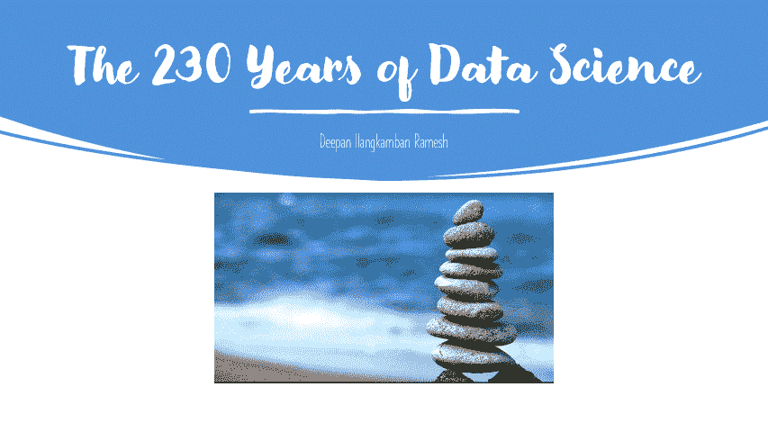
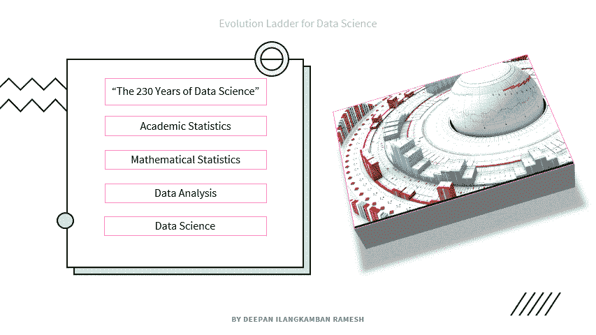

# 《数据科学的 230 年》/S _ 002 _ 数据科学的演变

> 原文：<https://medium.datadriveninvestor.com/the-230-years-of-data-science-a99092ed0108?source=collection_archive---------13----------------------->

## **世界第一数据:**

随着人工智能引领技术时代，生活在各个方面都变得简单了。简单的例子，1876 年 ***t —分布*** 由弗里德里希·罗伯特·赫尔默特教授和雅各布·吕罗斯导出为后验分布。那个只会除法、加法、乘法和减法的计算器时代。后来由威廉·希利·戈塞在 1908 年开发，样本大小为 3，现在我们在大数据的新竞赛中，并借助简单的 Excel、Python 等。，只需一个命令，我们就可以换算 t 或 z 值。因此，这一背景是以赫尔默特教授和吕罗斯教授提出的 t 分布为基础的。

The 230 Years of Data Science

> 尽管第一次官方人口普查是丹麦在 1976 年借助与登记册有关的数据进行的。美国在 1790 年进行了第一次人口普查，登记的人口数量为 3，929，214。所以，我们的旅程从这里开始。

# **数据分析(1962)**

1962 年，**约翰·图基**一个天才的大脑出现了，他在他的论文《数据分析的未来(FoDA)》中告诉世界“随着数理统计的进步，未来将会有学术统计的改革”，人们感兴趣的主题将是从数据中学习。

> **为什么是科学？也不是数学或整个统计的？**
> 
> 使它成为科学而不是数学或统计的观点，由 Tukey 提出的观点是:
> 
> I)知识内容
> 
> ii)以可理解的形式组织
> 
> iii)依赖经验测试作为有效性的最终标准。

# **想法变成现实**

Tukey 在 1962 年对数据分析的定义以及我们今天使用的定义。

> -它使用统计的正式理论，但它不会使用全部统计(根据他的说法，统计起主要作用，但有一些局限性)
> 
> 计算机和显示设备将会有巨大的发展
> 
> -在大量数据的帮助下，确定了许多领域的挑战。
> 
> -没有限制，可用于更广泛的学科

# **数据科学(2001)**

作为图基研究的证明，威廉·克利夫兰、约翰·钱伯斯、利奥·布雷曼证明了图基的工作:

## **证明这不是完整的统计数据**

更强调的是数据准备和展示，而不是 ***商会的*** 所述的统计建模

***布雷曼*** 声称其强调预测而非推断。

**命名仪式:**

威廉·克利夫兰创造了名称**“数据科学”**，并按比例分配工作。

工具的使用将是主要的兴趣，而不是工具开发所依据的理论将具有以下比例的直接特征:

> 多学科调查(25%)
> 
> -数据的模型和方法(20%)
> 
> -用数据计算(15%)
> 
> 教育学(15%)
> 
> -工具评估(5%)
> 
> -理论(20%)

重复了约翰·图基早期的所有鉴定。

***感谢阅读让我们追上 S_003 "？***

> **参见**
> 
> [S _ 001 _ 数据科学导论](https://medium.com/analytics-vidhya/s-001-introduction-to-data-science-377167c7b62a?sk=1a9d30ea170661430e2418dffde24fe3)
> 
> [P _ 001 _ 让我们玩骰子](https://medium.com/datadriveninvestor/p-001-lets-play-with-dice-bb23f5f4fbf0?sk=a3d536fe45c8c4921192e75f082db7d2)

***参考文献***

*多诺霍博士，2015。50 年的数据科学。9 月 15 日。*