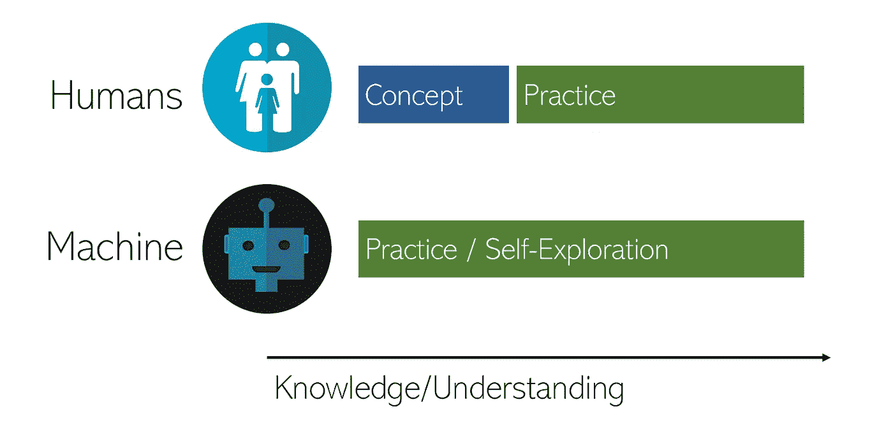
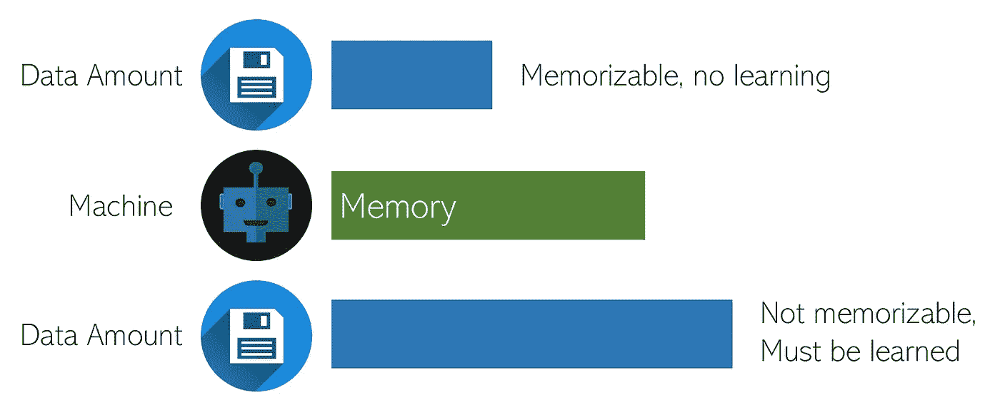

# 根据世界上最快的学习者:人工智能，高效学习的三个关键

> 原文：<https://medium.datadriveninvestor.com/the-3-keys-to-learning-efficiently-according-to-the-worlds-fastest-learner-ai-e994e4d78d45?source=collection_archive---------3----------------------->

[Unsplash](https://unsplash.com/photos/JjGXjESMxOY)

## 利用人工智能的智慧更高效地学习

人工智能旨在快速学习——他们被告知每秒钟以原始的准确性迭代数百个练习题。机器学习算法可以开发对世界的视觉，学习整个语言，诊断医生需要多年学习的医疗状况，在人类最具挑战性的游戏中击败世界冠军——只需几个小时。与速度较慢的人类相比，人工智能是迄今为止世界上最快的学习者。当然，它可能无法艺术地或创造性地“思考”，这本身是一个激烈的争论，但每个人都同意，机器在学习如何非常好、非常快地做一件事情方面非常棒。

在机器学习领域，机器如何学习有许多属性和概念，其中许多可以重新用作人类更有效学习的原则。在广泛研究机器学习后，我发现在学习中应用这些原则可以提高效率和记忆力，这两种属性都可以在人工智能对其接受训练的主题的理解中观察到。

这三个原则基于机器学习中的三个概念:自我探索、反向传播和过拟合(输入多样性)。

# 自我探索

**不要只是学习，*实践。***

“熟能生巧”——这是每个人都听过一遍又一遍的老话，但看到这个原则与机器如何学习的关系是很有启发性的。通常情况下——尤其是随着人们进入更高的教育层次——学习者*倾向于忘记实践*,而更专注于“学习”概念。

为了澄清，像通读几遍你的课本这样的行为将被认为是“学习”，而像做练习题这样的行为将被认为是“练习”。太多时候，我们把实践等同于学习，机器证明了前者的巨大价值。

机器通过反复练习和自我探索来学习。它们从随机初始化的参数开始。然后，对于每个“练习题”(训练示例)，该模型检索一个答案。参数的更新与模型答案的不正确程度成比例，这意味着如果模型表现良好，参数将不会更新太多，如果模型表现不佳，参数将进行更大的调整。

让我们以一台机器和一个小学生学习求一个二次方程的解为例: *x* +3 *x* +2 = 0。小学生第一次从老师那里学习到*学习*的概念。学生学习了如何将方程分解为( *x* +1)( *x* +2)的规则，因此可以将方程分解为*x*=-1 和*x*=-2。然而，每个人都记得他们为了理解和巩固这个概念而进行的大量实践。

另一方面，机器根本不能学习，因为人类教师给人类学生的概念无法向机器表达。相反，机器会练习数百万次，从猜测开始，随着它收到来自猜测的反馈(不正确或正确)，慢慢地纠正它的答案，直到它始终收到正确的分数。即使没有学习概念的最初推动，通过反复练习，机器的学习速度也比人快几个数量级——而且它们也不会像人类经常做的那样忘记。

Studying concepts won’t get you far, practice will. Machines achieve knowledge purely without any prerequisite concept studies.

为了有效地学习一些东西，研究概念是很好的，例如反复阅读你的教科书或浏览定义词汇表——这是人类相对于机器的优势，机器只能通过智能试错来构建这些复杂的关系。然而，练习应该成为学习的习惯——不是一个、两个甚至十几个练习题就足够了。实际上，数量很重要(前提是每个练习题都是质量)。阅读一篇文章或文本并期望在很长一段时间内记住它的大部分内容对我们大多数人来说是不可能的，但创造和解决许多实践问题将巩固并进一步建立在概念上(“学习”)。

# 反向传播

从你的错误中获取最大价值。

更新模型中参数的过程称为反向传播，其中数学公式计算每个参数应该更新多少，以优化精度并减少误差。机器学习算法之所以能够如此快速地学习，是因为它们的反向传播算法的有效性，这些算法在过去几年的人工智能研究中在形状和形式上得到了发展。

AI 出错的一个练习题，就可以海量调整参数，让它走上正轨。简而言之，AI 从每个练习题中榨取尽可能多的价值，从不正确的问题中获得视角，从正确的问题中获得验证。然而，机器学习模型最有价值的问题是它出错的问题:这些问题是定义边界和最大限度地理解的问题。事实上，在数学上，人工智能对不正确的问题比对正确的问题给予更高的权重，这是它有效学习的关键秘密。

尽管大多数人理解理解错误背后的原因的重要性，但练习题的全部价值经常被忽略。大多数人类学习者认为一个正确的问题和一个不正确的问题一样重要，这是完全不正确的——采用正确和错误回答问题的加权实践的机器学习模型比不正确问题的加权更差。

当一个人遇到错误时，他应该理解错误答案的以下几个方面:

*   哪里出了问题？在我的思考过程中，我哪里出错了？模型使用数学计算来确定网络中的哪些节点是错误问题的主要原因，以便更有效地实现最小化错误的目标。
*   *我的思维过程有多不正确？*尽管答案可能是“是”或“否”,但思维过程更加连续，即使仍然是错误的，也能更接近正确的答案。将得出错误答案的思维过程视为同样错误会阻碍进步。相反，如果思考过程比以前更接近答案，但最终答案仍然是错误的，那么应该承认这种改进。
*   *我能把这个问题归纳一下，或者归结为一个问题群吗？*机器学习的整个目标是重复归纳或最小化粒度细节，以符合更大的问题集。在神经网络中，当网络认为某个问题属于特定的问题集时，特定的节点就会被激活。分别处理每个问题集可以提高效率和理解。
    已经学习了各种问题集的概念，例如， *x* +3 *x* +2 和 3 *x* +3 *x* +2 由于需要应用的过程/概念略有不同而位于不同的问题集中，大多数错误都可以追溯到缺乏对特定问题类型组的明确归因，其中解决过程被清楚地概述。

这三个问题概述了人工智能能够从一个不正确的问题中获得什么。即使是正确的问题，也有助于快速验证思维过程。一些假阳性——两个错误偶然相互抵消——会破坏学习效率。没有从错误中挖掘出所有可能的价值是一个人在学习中可能犯的最大错误。错误是自然的，如果你意识到每个错误的全部价值，它们最终会消失。

# 输入的过度拟合和多样性

**通过生成多样化的训练数据，学习而不是反刍。**

随着机器学习方法变得越来越复杂，人工智能研究人员面临的一个共同问题是过度拟合，例如，随着拥有数百万参数的巨大神经网络的兴起。过度拟合是指当模型能够容纳如此多的信息，以至于不顾一切地奔向更低的错误时，它只是记住特定输入组合的所有答案，并在输入匹配该特定组合时检索它们。

过度拟合意味着模型不能适应问题的任何变化，只能适应问题本身。通常情况下，人类认为的“学习”是伪装的过度适应。从记忆词汇到复述事实，我们的学习与其说是在学习，不如说是在短期记忆中储存输入和答案的组合。因为它只是作为字典中的另一个条目存储在你的记忆中，而不是作为*学习*，它很快就会被遗忘。

为了解决过度拟合的问题，研究人员添加了更多的数据。最终，数据达到如此大的规模，以至于模型不能简单地将它们都存储在它的存储器中，因此当它试图使用记录和回流方法时会有很高的误差，迫使算法学习关系并进行归纳。在人工智能的背景下，收集了数百万，如果不是数十亿，甚至在某些背景下数万亿的训练样本。在数据收集困难的情况下，数据科学家将通过以合理且忠实于上下文的方式向训练数据添加变化来生成新数据。

Solution to overfitting — more data.

在人类学习的情况下，数百万个数据点很难获得。幸运的是，人类的思维也更复杂，我们有概念的优势。然而，需要更多的数据。老师为蒂姆准备的 20 个单词的测试正好产生 20 个问题和答案。在这种背景下，以‘增加更多数据’的名义增加新词是很可笑的，因为它们不会被测试。因此，Tim 应该求助于数据生成或输入多样化——从当前可用的问题中创建额外的问题。

“丰富的——在数量上非常丰富”,蒂姆读着老师给他的学习指导。根据这一点，并结合其他词的定义，Tim 提出了其他问题:

*   “农场里有 __________ 个苹果。我们会有很多苹果酒。”
*   "丰富的同义词是……？"
*   "解读 *udaantbn* "

通过创建额外的训练数据，Tim 能够获得对单词的额外理解。第一个生成的问题让 Tim 体验了如何在句子中使用不同形式的单词，以使其有意义。第二个测试他对定义的了解。最后一个测试他对如何拼写和识别世界的理解，在测试的其他 19 个单词中，给出了一个无序的字母列表。

通过使用已经多样化的生成的训练数据，Tim 不仅能够比他的朋友们(他们一直盯着学习指南或使用简单的抽认卡)学得更快、更有乐趣，他还发展了对单词的强记忆和理解。

# 概括起来

我们可以从机器如何学习中得出 3 条原则:

*   **不要只是“学习”，要实践。**不是通过看课本复习概念(被动学习)，而是反复练习(主动学习)。练习需要理解和记忆，这是学习做不到的。
*   **从你的错误中获取最大价值。**对你学习最有帮助的问题和你做错的问题。每当你犯错的时候，问自己三个问题:哪里出错了？我的思维过程有多不正确？我可以把这个问题概括一下，或者归结到一个问题组吗？
*   **通过生成多样化的训练数据，学习而不是反刍。为了避免过度适应，创造(或让一个朋友创造)一些问题，这些问题与你已经有的问题有合理的不同。这不仅会提高学习效率——盯着学习指南和翻抽认卡会慢很多，也少了很多乐趣——而且还会增加信息的记忆。**

如果你喜欢，请投赞成票。