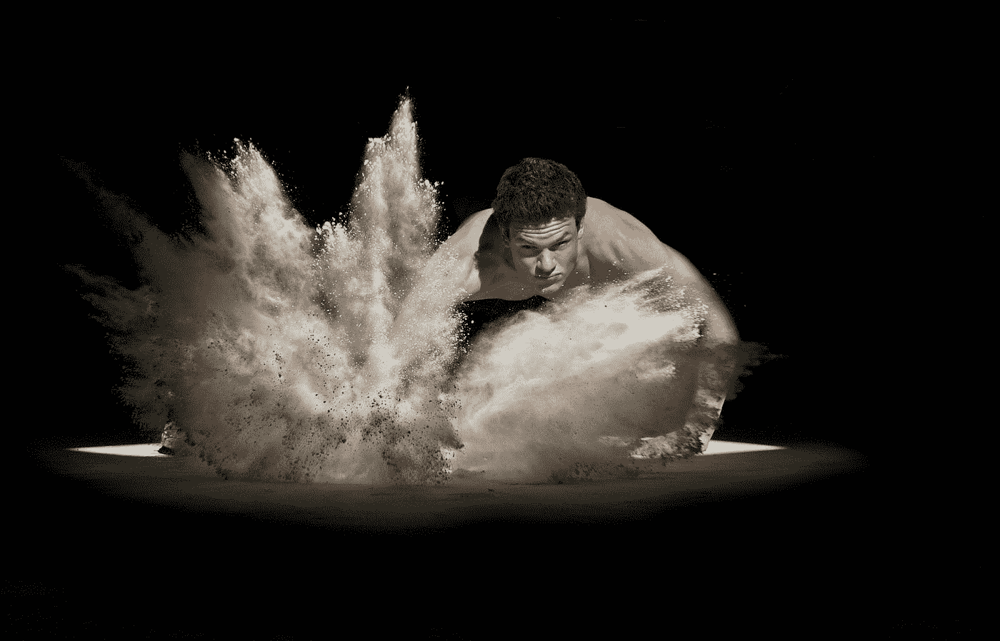

# 营销中最强大的三种情绪

> 原文：<https://medium.datadriveninvestor.com/the-3-most-powerful-emotions-in-marketing-5981add762a7?source=collection_archive---------7----------------------->

## 这些是营销中的收入野兽

Photo by [Lopez Robin](https://unsplash.com/@lopezrobin?utm_source=medium&utm_medium=referral) on [Unsplash](https://unsplash.com?utm_source=medium&utm_medium=referral)

如果你还没有把情感加入你的营销武库，你就错过了大好时机！世界上许多成功的营销人员都是情绪大师。因为情感在一件事上很重要——激发行动，为企业创造收入。

作为一名营销人员，你的成功不仅仅在于你有能力精心制作能引起共鸣的引人注目的营销信息，还在于你有能力激发潜在买家的行动。

这是每一个营销人员在营销活动中应该使用的三种情绪，以提高效果。

# 1.好奇心

人类天生好奇。还记得小时候，你忍不住要打开父母给你的圣诞礼物吗？最后，你甚至没告诉他们就打开了。这是你一生中最快乐的一天。

兴奋和想知道里面是什么的复杂情绪让你打开了礼物。同样的道理也适用于你的营销。一旦你找到了正确的受众，并在正确的时间传达了正确的信息，你的提议就像是给受众的礼物。他们忍不住想知道里面是什么。

乔治·洛温斯坦(1994)曾经把好奇心描述成和饥饿一样的驱动状态。我们饿的时候会吃东西。这是我们潜意识做出的本能决定，以确保我们身体的健康。洛温斯坦认为好奇心也是如此。

我们无法忍受开环。我们的大脑会迫使我们将这些点连接起来，以满足填补信息缺口的需要。这更是好奇心成为一种强大营销工具的原因。

** *给你的提示:*在你的营销中使用好奇心的最佳方式是以一个强有力的价值主张开始对话，并将另一半留给你的受众去理解。最好是与强烈的行动号召相结合。

# 2.神入

同理心建立信任。而信任是营销的本质。你贴一个广告，所有人都蜂拥而至购买你的产品的时代已经一去不复返了。除非你是耐克这样的品牌，否则广告对你没多大作用。如果你想一想，耐克利用同理心取得了他们今天的成就。

再来看看耐克的受众。它由重视成绩高于一切的运动员组成。这些人是超级运动员。他们知道自己的能力，耐克也意识到了观众的内在价值。耐克的广告总是展示他们的核心价值观。简而言之，这就是移情。

耐克是一家市值 10 亿美元的公司，通过移情营销蓬勃发展。从确定完美的受众到讲故事，耐克通过在更深层次上联系和影响受众的能力证明了其营销能力。自从耐克开始推销其著名的口号“只管去做”以来，它的品牌就一直主导着体育市场。

如果做得好，同理心可以建立一个持续几十年的品牌。一个能够改变我们做事方式以及我们与品牌沟通方式的品牌。当建立一个忠实的粉丝群时，同理心具有巨大的潜力。

** *给你的建议*:瞄准你的理想客户，通过换位思考与他们互动。这将与你的观众建立起强烈的情感联系。一旦你建立了这种联系，推销你的产品或服务将会更容易。

# 3.害怕

这是他们当中最强壮的。据说它有两倍于愉悦情绪的效果。恐惧不一定要明确表达出来才能得到它的全部效果。像害怕错过这样的小事足以激发行动。

我们对恐惧的反应可以追溯到我们祖先的时代。我们的祖先用恐惧来生存的时代。对他们来说，恐惧是逃避可能带来伤害的事物的工具。今天，营销人员使用恐惧(道德上)作为解决不作为的工具，特别是在数字空间。

情绪是行动的催化剂。当恐惧被注入我们的大脑时，情绪开始接管理性思维。恐惧就像是我们身体的向导，告诉我们做一些事情来避免痛苦或生存。因此，我们几乎无法控制这种冲动反应。这是一种生存机制。

作为营销人员，不活跃是一个令人头痛的问题。无论我们的价值主张构建得多么好，或者我们的提议多么不可抗拒，唯一重要的是我们客户的活动。像 FOMO 和损失厌恶这样的策略是维持任何营销努力的最好方法。

** *给你的建议*:尽可能清楚不采取行动的后果。人们拖延是因为他们有时间和选择。一旦这些都被拿走了，你就会有一种强烈的紧迫感在你身边。

# 使用它们

作为一名营销人员，你在营销中投入情感的那一天，就是你生活发生变化的那一天。你将拥有前所未有的订户和潜在客户。你现在能做的最好的事情就是测试一下什么样的情绪对你的生意有好处，并把它用在你的优势上。