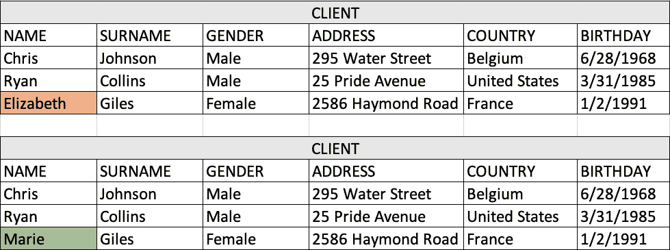
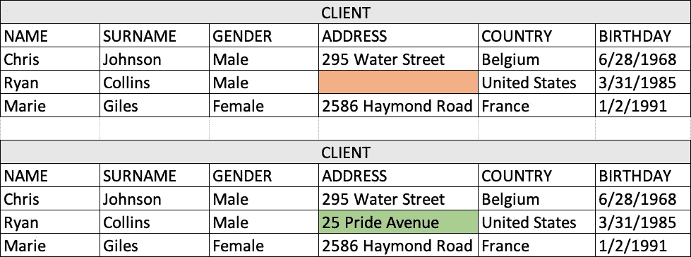
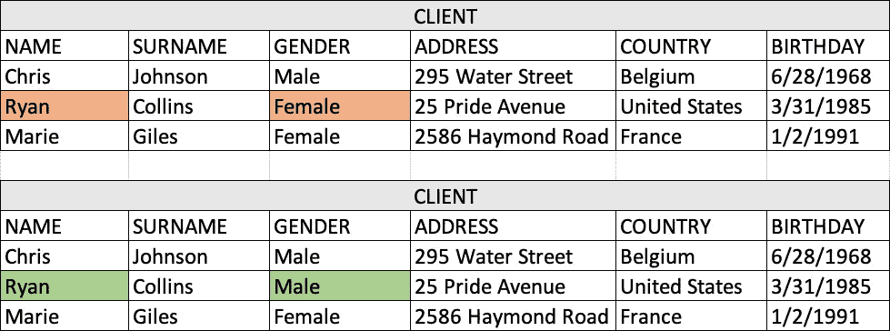
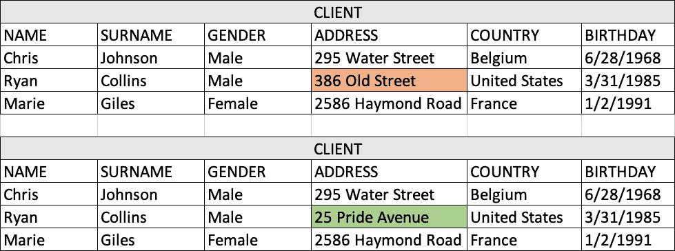
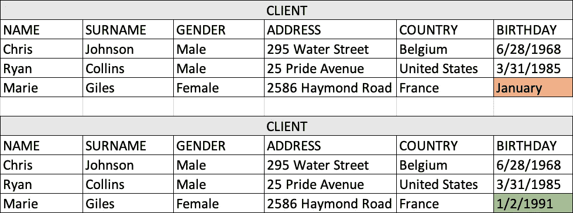
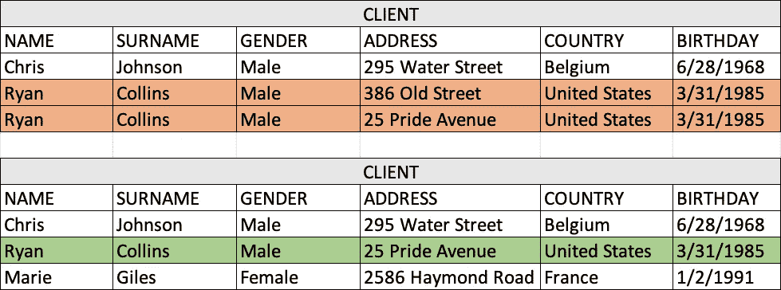

# 数据质量的 6 个维度

> 原文：<https://medium.datadriveninvestor.com/the-3-sources-and-6-dimensions-of-data-quality-d3159badae81?source=collection_archive---------3----------------------->

## 了解较差的数据质量及其来源

Photo by [Tarang Dave](https://unsplash.com/@tarangdave?utm_source=medium&utm_medium=referral) on [Unsplash](https://unsplash.com?utm_source=medium&utm_medium=referral)

在我之前的文章中，我谈到了糟糕的数据质量会严重损害一家公司，增加其成本结构，从而减少其潜在收入。除了成本之外，还有其他与数据质量差间接相关的问题，例如客户产生的不信任、商业机会的丧失、欺诈或糟糕的决策。

然而，在大多数情况下，数据质量差并不是由于特定的问题或错误，而是由于长时间重复的习惯、行为和过程导致的小错误，这些小错误的成本可能看起来微不足道，但最终会成为组织的一个大问题。此外，数据质量问题通常是在过程结束时发现的，例如，当数据将被用来创建报告或预测时。这使得修理更加困难。数据质量计划必须贯穿其整个生命周期，以便在早期阶段就能预测到最大数量的问题，从而将造成的成本降至最低。

 [## 大数据颠覆了我们所知的信贷应用|数据驱动的投资者

### 融合是金融领域的最新流行词，由于支付和贷款之间的关系，我们现在…

www.datadriveninvestor.com](https://www.datadriveninvestor.com/2020/03/19/big-data-disrupts-credit-applications-as-we-know-them/) 

# 质量差的数据的三大来源

*   **美国。**是的，这是真的，我们是低质量数据的最坏来源。为什么？因为我们并不完美:我们拼写错误，我们不能清楚地表达自己，我们不想浪费时间将数据输入系统，然后我们缩写或不检查我们所写的内容。有什么区别吗？没有，对吗？系统现在将纠正不正确的数据，这正是它的用途。无论一个应用程序的编程和测试有多好，都不可能验证用户输入系统的所有数据并强迫他们遵循严格的标准。这证明了一个质量差的数据源不是仅仅用技术就能解决的，它需要培训。应用程序的最终用户必须符合数据质量目标。
*   **系统**。不良数据的第二个来源是系统。无论应用程序的开发和测试有多好，或者系统有多健壮，它们总是暴露在导致计算和/或通信错误的错误中。此外，应用程序通常使用数据模型来存储它们处理的信息。仔细设计数据模型非常重要，这样才能尽可能保证数据的正确保存。必须正确评估对数据模型所做的所有更改，因为它们可能会完全破坏数据模型的完整性。修复数据库中的结构模型设计问题可能非常昂贵。
*   **第三方和遗留系统。**有时，我们需要整合第三方或迁移遗留系统来满足业务需求，这意味着要处理来自其他来源的数据。有了数据，我们就拖住了他们的问题。那么，如何才能保证数据具有良好的质量呢？在将来自第三方或遗留系统的信息输入我们的系统之前，我们必须确保这些信息符合我们认为适当的质量要求，否则，我们可能会像对待我们的数据一样损害我们的系统或结果。

# 我们如何衡量数据质量？

我想和您一起探讨 6 个维度，让您了解如何衡量数据的质量。当我们考虑数据质量问题时，首先想到的是拼写错误，但事实是这只是数据质量的 6 个基本方面之一。让我们看看他们。

## 准确(性)

这是更难衡量的数据质量维度之一。它表示数据代表真实世界实体的程度，或者换句话说，什么数据是正确的。有时，可以使用第二个已经验证过的数据源来比较它们，从而知道第一个数据源的准确程度。

Accuracy example

## 完全

测量报告的必需值的数量。它可以在记录、属性或数据集级别进行测量。我的数据集中哪些数据是完整的？在某些情况下，此维度不仅影响必填字段，还影响可选值。

Completeness example (at a record level)

## 一致性

这是指确保数据值在一个数据集中得到一致的表示。当完整性发生时，一致性可以在同一记录的不同属性内或记录之间进行评估。一致性也可以用来评估格式问题。

Consistency example (at a record level)

## 及时

及时性的衡量标准应该从波动性的角度来理解。我的数据多久更改一次？我的数据更新了吗？一个非常常见的例子是股票价格:当市场开放时，股票价格会经常变化，但当市场关闭时，股票价格不会变化，但它们仍然是当前价格。

Timeliness example

## 有效期

衡量数据值与其值域一致的程度。有效性是指数据类型、范围、格式或精度。这个维度在科学数据集中特别重要，因为它们有很高程度的这种要求。

Validity example

## 独特性

除了准确性和完整性，维度通常是质量最差的。唯一性是指断言给定的实体只存在一次。当集成多个数据集时，重复问题非常频繁，并且没有应用正确的规则来统一候选记录。

Uniqueness example

# 这样够了吗？

当然不是。在本文中，我们只研究了数据质量的 3 个主要来源和 6 个基本支柱，以了解数据质量的基础和来源。然而，一份完整的数据质量报告必须更进一步。测量数据集中这 6 个参数的值可以给出数值，但是如果没有提出正确的问题，这项工作就没有多大价值。在数据质量分析中真正必须评估的度量是 KPI，这些 KPI 必须在公司的环境中根据其目标和需求为特定的业务领域进行定义。只有这样，您才能全面了解公司系统中的数据质量，并根据这些结果设计提高数据质量的策略，建立必要的控制策略，以便在为时过晚之前预测问题。

**进入专家视图—** [**订阅 DDI 英特尔**](https://datadriveninvestor.com/ddi-intel)