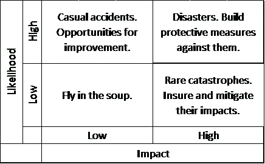

# 威胁您项目的 4 种风险

> 原文：<https://medium.datadriveninvestor.com/the-4-types-of-risk-that-threat-your-projects-ceefc3905b98?source=collection_archive---------24----------------------->

## 以及如何使用*影响与可能性*矩阵。

Diagram made by the author

评估风险的一个简单而有效的方法是*影响与可能性矩阵。*我们经常在商学院学习，但后来在我们的职业生涯和项目中，我们忘记了。大错特错！在评估不可控风险时，这是企业家和管理者的一个非常好的工具，因此，虽然你无法压制危机，但你可以让你的企业做好准备，在危机中生存(并茁壮成长)。

我把它用于我的生意，它帮助我们度过了像 2020 年这样麻烦的一年。

## 你无法预测下一次危机，但你可以为它预演。

风险分析是[令人印象深刻的商业计划](https://medium.com/swlh/how-to-write-an-impressive-business-plan-35c763c92f62)的重要组成部分。使用该矩阵的第一步是绘制一张图表，其中 X 轴衡量影响——风险利润率或任何其他合适的衡量标准，Y 轴衡量*可能性*。

确定灾难性事件的可能性必须格外小心，因为人类往往会低估灾难发生的可能性(除非他们刚刚经历了一场灾难)。确定可能性的一个常用方法是观察事件发生的频率。然而，这可能导致无法检测到罕见但并非不可能的情况——纳西姆·塔勒布称之为黑天鹅。顺便说一下，关于黑天鹅的知识在新冠肺炎危机期间帮助拯救了我的公司。

要发现可能的黑天鹅，最好的方法是集思广益，想出每一个可能的逆境、事故或灾难。既然你是一个远道而来的创业者，那就带着你土地上的知识包袱，把你所知道的风险汇总到你在新地方所想象的风险中。如果可能的话，与其他企业家或邻近居民一起集思广益。

一旦你有了不愉快情况的相关调查，根据可能性和影响，在下面的矩阵中对它们进行分类。

# 4 种类型的商业风险

## ***汤里飞***

低概率低影响象限的名称不言自明。当你的汤里有一只苍蝇时，你只需要再拿一碗。您不需要安装昂贵的安全系统或为这个象限的问题创建详细的缓解协议，因为投资将远远超过避免的损失。但是要确保你放在汤象限的*苍蝇是真正的低概率事件，因为即使它们的影响很低，如果它频繁发生，它就会堆积起来，变成一个金钱和时间消耗的问题。*

## ***偶然事故***

你创业道路上的频繁颠簸在高可能性、低影响象限中占有一席之地。举例？当我在波兰开始创业时，很难招到人。对雇主来说，接近零的失业率可能是一种风险，尽管这可能比高失业率要好。

从孤立的角度来看，招聘工作的每一笔费用都不算大，但是把培训、招聘广告、人手不足和不确定性的所有成本加起来，就变得相当可观了。因此，这是一个管理挑战，也是一个改进的机会，对大多数写在*偶然事故*象限中的问题都有效。来自竞争对手公司的突然变动也属于这一类，并且，如本文中所解释的[，应该特别小心地进行评估。](https://entrepreneurshandbook.co/how-to-analyze-your-competition-e351b59337e5)

## ***灾难***

高影响、高概率的风险是我们主动避免的。大学毕业后，我搬到了智利首都圣地亚哥。该地区是世界上最容易发生地震的地区之一，记录了所有 8.5 级以上地震的三分之一。地震在智利发生的可能性很高，其影响可能是灾难性的。因此，智利是抗震技术领先的国家之一。当我们谈论不可控但频繁发生的灾难时，我们努力的是在它们发生时减轻它们的影响，因为它们迟早会发生。

## ***罕见大灾难***

在这个象限中的情况是像全球市场崩溃、流行病或火山爆发导致半个大陆的空域封锁(艾雅法拉火山在 2010 年就发生过这种情况)。

我最终离开了*罕见灾难*象限，因为我们经常忽视它。这是因为*汤里的苍蝇*不具有引起注意的必要影响，并且*偶然事故*和*可能的灾难*由于其频率而很容易识别。然而，我们人类却很难理解罕见灾难的可能性。

这种认知大脑缺陷甚至还有一个名字:*常态偏差*。根据 Esther ingl is-arkel 的研究，近 70%的人表现出这种偏见。这是我们经常看到的对我们的业务造成损害的两个最常见的偏见之一。另一个是 [*生存偏差*](https://medium.com/datadriveninvestor/5-destructive-logical-fallacies-that-crush-investment-portfolios-2c46884c1d03) 。

## 要繁荣，首先企业必须生存

像易贝或亚马逊这样的在线商务巨头是 2000 年电子商务泡沫破裂后幸存下来的公司。

像巨大的火山爆发或病毒突变这样的黑天鹅是不可能预测的。因此，最好的应对措施是消除负面影响的脆弱性和催化剂。在本文中，我们列出了 4 种商业风险。我们可以将几乎所有威胁您业务的事情归为其中一类，并相应地进行处理

适当的风险评估会让你对你的项目或公司有更好的展望。它将帮助你为危机和障碍做好准备。风险识别是[撰写专家风险评估](https://medium.com/datadriveninvestor/how-to-assess-business-failure-risk-like-a-pro-76fe040938d7)的第一步。这将使在投资者中筹集资金或打动当地政府变得更加容易。

建立多样化的收入来源，创造冗余，避免可能摧毁你公司的风险。这些是建立一个抗脆弱企业的一些方法。检查[这 5 个其他措施，以确保你的企业在危机中生存](https://medium.com/swlh/5-steps-to-ensure-your-businesss-survival-during-a-time-of-crisis-ca8e6f63e6e3)。请记住，如果你想让你的企业生存一百年，百年一遇的事件应该让你警惕。

*列维·博尔巴是 expatriateconsultancy.com***的首席执行官，也是畅销书作家。你可以查看* [*他的书这里*](https://www.amazon.com/Levi-Borba/e/B082X6GSZF?ref_=dbs_p_ebk_r00_abau_000000) *或者他的* [*Linkedin 这里*](https://www.linkedin.com/in/jonatasborba/) *。本文取材于《远离家乡自己创业》一书* [*中的一章:在另一个州、国家或星系开公司时做(不做)什么*](https://www.amazon.com/Starting-Your-Own-Business-Home/dp/B08L4FL9L4/ref=tmm_pap_swatch_0?_encoding=UTF8&qid=&sr=) *。**