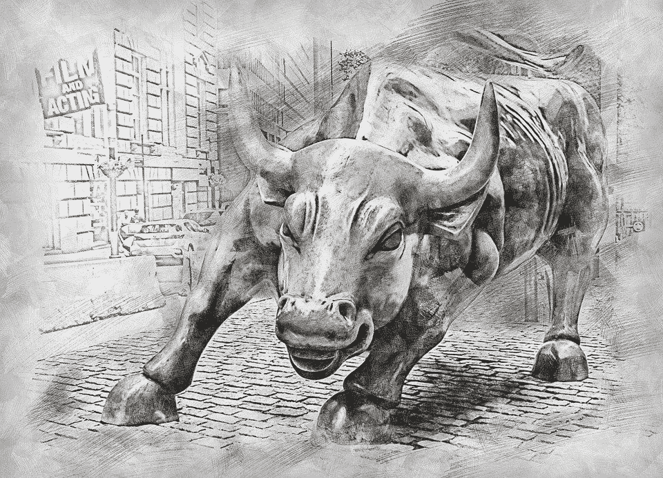

# 投资股票的 5 条绝佳建议

> 原文：<https://medium.datadriveninvestor.com/the-5-extremely-helpful-advice-on-investing-in-stocks-47d4a2e9ca0f?source=collection_archive---------15----------------------->

## 说到股票，有主见的超过没主见的。以下是一些值得你关注的想法。

Image by [ArtTower](https://pixabay.com/users/ArtTower-5337/?utm_source=link-attribution&utm_medium=referral&utm_campaign=image&utm_content=3112617) from [Pixabay](https://pixabay.com/?utm_source=link-attribution&utm_medium=referral&utm_campaign=image&utm_content=3112617)

投资专家迈克尔·伯里是少数几个预测到 2008 年抵押贷款危机和金融崩溃的人之一。那天，很多人都认为房地产市场是一项稳定的投资，会永远保持增长。正如许多股市故事一样，大多数人又一次错了！

当谈到股票市场时，每个人都知道应该选择哪些股票，哪些资产将在未来几年表现最好，每个人都知道一个隐藏的宝石，但还没有人发现。让我们首先从在做出投资决定时不发出任何声音开始。

因为你不应该从一个有卡通头像的匿名推特用户那里获得健康建议，所以在寻求财务建议时咨询专业人士是最明智的。特别是，避免社交媒体或你的社交圈中的所有噪音。

此外，我以前也说过，现在仍然支持这样的观点，即你不应该从金融专业人士那里获得交易建议。除非他们负责管理你的投资组合，否则他们的议程可能不透明。你可以在这里检查一下。

 [## 终极投资建议:不要接受亿万富翁的交易建议

### 他们都是靠自己独特的想法成为亿万富翁的，而不是靠电视上的提示！

medium.com](https://medium.com/@furkansaatcioglu/the-ultimate-investment-advice-dont-take-trading-tips-from-billionaires-4cf656e93bb8) 

你应该寻求的是学习这些专业人士的想法和哲学，接受他们的工作方式，理解他们的战略，并冷静地执行。

因此，我想与你分享一些在我制定自己的战略时对我帮助最大的想法。我希望它们也能激励你。

# 1.JL·科林斯——通往财富的简单道路

> 当市场上涨时，每个人都赚钱。但决定它会让你变得富有还是让你在路边流血的是你在它崩溃期间的所作所为(Collins，2016)。

回顾股票市场的历史，特别是在美国，很容易认识到长期以来一直在上升的趋势。然而，在类似于 1929 年华尔街崩盘、1987 年黑色星期一、[2000 年互联网泡沫](https://en.wikipedia.org/wiki/Dot-com_bubble)、[2007 年至 2008 年金融危机](https://en.wikipedia.org/wiki/Financial_crisis_of_2007%E2%80%9308)和[2020 年新冠肺炎股市崩盘](https://en.wikipedia.org/wiki/2020_stock_market_crash)的时期，人们会损失一大笔净资产，有些人会失去勇气，甚至会导致抑郁和自杀。

 [## 这么说一家大型风投基金正在投资你的初创公司？4 实际考虑|数据驱动的投资者

### 首先，恭喜你。融资总是需要努力的，一个大的风险投资基金当然是一个大的…

www.datadriveninvestor.com](https://www.datadriveninvestor.com/2020/08/09/so-a-big-vc-fund-is-investing-in-your-startup-4-practical-considerations/) 

在这种时候，保持冷静并做好准备是非常重要的。如果你已经知道在这种情况下你的策略是什么，那就更容易受到打击。当然，没有什么能让你承受失去一半价值的痛苦，但至少它可以帮助你更加坚强地走出这种痛苦。

等待这种情况发生的一定数量的现金会帮助你以更低的价格收购公司。如果他们在崩盘后没有失去任何基本价值，他们会等着你买入，只是在恐慌结束后迅速恢复。

我上面列出的所有危机都在某个时候结束了，股市也找到了回到历史新高的路。只要你设法活下来，隧道的尽头总会有光明。

# 2.本杰明·格拉哈姆——福布斯采访

> “问问你自己:如果这些股票没有市场，我会愿意以这些条件投资这家公司吗？”(《福布斯》，1972 年)

不断重估股票价值的股票市场导致价格在它通常应该在的地方波动，但永远不会停留在那里，因此投机者可以从波动中赚钱。

如果你持有一家非上市公司的股票，那么情况就完全不同了。只有当股票以特定价格出售时，私有股票价格才会改变其价值。所以，长时间静止不动，一直跟踪日份额值很麻烦。

根据格雷厄姆的说法，你应该从短期价格波动中解放出来，评估一只没有市场的上市股票，看看在不知道其每日股价的情况下，你是否仍然愿意拥有它。

# 3.纳西姆·尼古拉斯·塔勒布——被随机性愚弄了

> 假设你拥有一幅花 2 万美元买的画，由于艺术市场的乐观状况，它现在价值 4 万美元。如果你没有画，你还会以现在的价格买下它吗？如果你不愿意，那么你就被认为是和你的职位结婚了。没有理性的理由去保留一幅你不会以当前市场价格购买的画——只是一种情感投资(Taleb，2001)。

这种谬误是投资者最常犯的错误之一。如果他们以低价买进了一只股票，而这只股票上涨了，他们就不会回头去看这只股票是否仍然物有所值。

如果你不愿意以当前的价格购买股票，那么继续持有它就是不理智的。当市场最终自我修正时，这些被高估的股票将是第一批涌入的。

请不要认为你必须卖掉你所有的股份。当你持有的股票被高估时，即使只获得部分利润，至少也能帮助你保住最初的投资。这至少有助于你晚上安心地把头埋在枕头里。

# 4.罗杰·洛温斯坦——当天才失败时

> 在困难时期，市场变得更加紧密地联系在一起，看似不相关的资产会同步上升和下降(Lowenstein，2001)。

通常，公司的价值应该基于其自身的活动。当然，宏观经济因素可能以同样的方式同时影响许多股票价格。然而，如果这种相关性达到极端，特别是如果你观察到不相关资产的绝对和谐，那么警钟必须开始敲响。

当所有股票一起上涨或下跌时，投机者就不太关注公司的基本面。他们更多考虑的是如何通过跟风赚更多的钱。然而，这种趋势可能会拖累许多公司的准确估值，并在市场上制造巨大的泡沫。

没有什么秘密公式可以决定一项资产是否与市场其他部分同步偏离了其真实价值。尽管如此，核心估值工具，如市盈率、市净率等。在这种时候，判断不切实际的估值可能是最有用的。

# 5.约翰·邓普顿-邓普顿计划:通向个人成功和真正幸福的 21 个步骤

> 投资中最危险的四个字是:“这次不一样”(Templeton，2013)。

最后但同样重要的是，我们应该牢记邓普顿的话，以避免对市场的错误偏见。尽管市场相当不可预测，但忽略一些模式是不可能的。

网络泡沫、房地产泡沫、加密货币泡沫只是许多投资者认为这次不同的一些事件。他们发自内心地相信，只有这一次，如果他们继续持有已经被高估的资产，市场不会停止上涨，让他们成为一个触手可及的人。

然而，这种谬论只会导致令人失望的结果。如果你相信自己的分析和策略，即使面对不可预测的事件，你也会知道该怎么做。改变你的计划并认为这次会有所不同只会导致一场灾难。

# 最后的想法

你，但只有你对你的财务前景负责。如果你依赖别人的意见，你很可能会在成为股票投资者的冒险中失败。

我想在这里特别说明，我并不是说你不应该相信你的财务顾问。如果你不想要管理你的资本的麻烦，付钱给一个专业人士为你做这件事是唯一正确的事情。我这里的意思是，不惜一切代价避免投资你从 Twitter、你的邻居或你的出租车司机那里听到的消息。

如果你在管理自己的投资组合，尽可能避免从别人那里获得交易建议。相反，请记住以下来自最优秀的头脑的经验来制定你的策略。

1.  计划一下万一市场崩盘你会怎么做，并在时机成熟时遵循你的策略。
2.  **只有当你不知道一只股票的每日股价却能放心拥有它的时候，才买它。**
3.  **如果你不愿意支付你已经持有的股票的当前价格，是时候获利了结了。**
4.  如果不相关的资产开始一起移动，要更加怀疑股票的估值。
5.  **这次没什么不同！不要陷入虚幻的希望，并据此行动。**

我在这篇文章中引用的人之所以成功，是因为他们有自己的想法和精确的执行。

如果你想自己投资自己的血汗钱，那么你必须学会像他们一样思考，并制定自己的策略，才能在股市中取得成功。

如果你不能，最好的选择是坚持指数基金，永远不要选择自己的股票，就像我在以前的一篇文章中建议的那样。

 [## 投资初学者指南:停止选股开始赚钱

### 再加上所有成功投资者都认同的一条黄金法则。

medium.com](https://medium.com/swlh/a-beginners-guide-to-investing-stop-picking-stocks-to-start-making-money-4e936045c82e) 

[*订阅*](https://furkansaatcioglu.com/bitsandchips/) *我的时事通讯，在你的邮箱里获取未来的文章！*

*免责声明:本文仅用于信息或教育目的，并非任何形式的个性化建议。使用这些信息需要您自担风险。*

# 参考

JL 科林斯。通往财富的简单道路:你通往财务独立和富裕自由生活的路线图。jlcollinsnh.com。Kindle 版，2016。

*福布斯*，1972 年 1 月 1 日，第 90 页。

洛温斯坦，收到。*当天才失败的时候*:长期资本管理的兴衰(第 120 页)。哈珀柯林斯出版社。Kindle 版，2001 年。

被随机性愚弄。企鹅图书有限公司 Kindle 版，2001 年。

约翰·坦普尔顿。*邓普顿计划:通向个人成功和真正幸福的 21 个步骤*。邓普顿基金会出版社，2013 年。

**访问专家视图—** [**订阅 DDI 英特尔**](https://datadriveninvestor.com/ddi-intel)