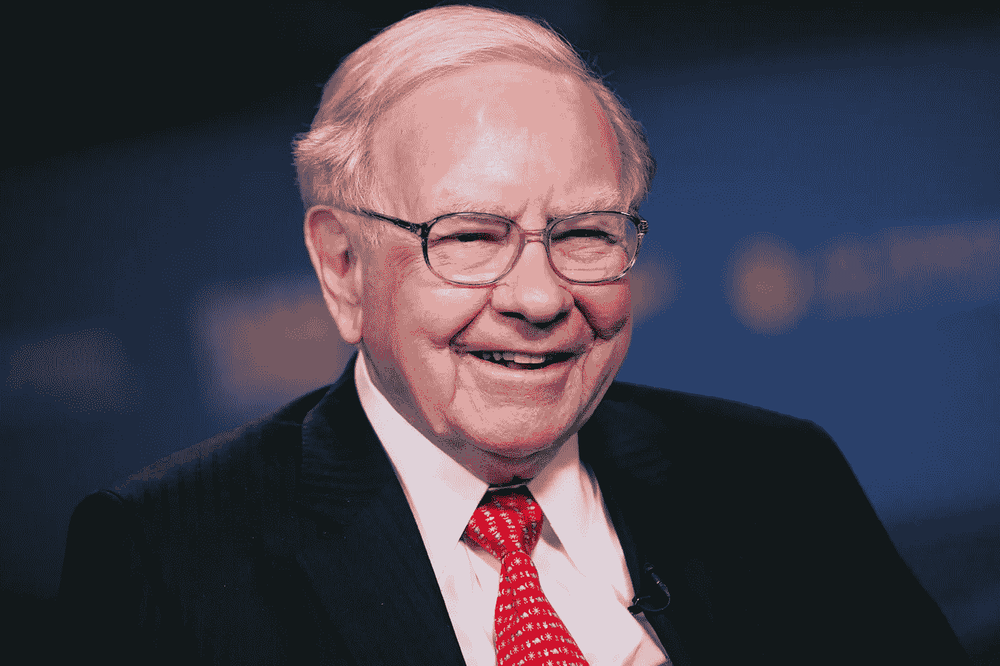

# 驱动沃伦·巴菲特投资的六大因素

> 原文：<https://medium.datadriveninvestor.com/the-6-factors-that-power-warren-buffets-investing-4db45d7822f0?source=collection_archive---------15----------------------->

Photograph of Warren Buffet Copyright of [CNBC Make it.](https://www.cnbc.com/2019/09/04/warren-buffetts-top-career-advice.html)

成功的最有效方法之一就是模仿你所在领域的伟人。

立志成为成功人士通常会让人们凭借自身能力变得伟大。

如果你梦想投资成功，你可能听说过沃伦巴菲特。

在投资行业内外，沃伦·巴菲特备受推崇。他的成功当然也不是炒作或虚张声势。在他的哲学指导下，他有着漫长而杰出的职业生涯。

 [## 投资区块链前要问的三个简单问题(也是一个困难的问题)|数据…

### 现在是了解区块链的最佳时机。不同货币之间的增长率，比如…

www.datadriveninvestor.com](https://www.datadriveninvestor.com/2020/03/12/three-simple-questions-and-one-difficult-one-to-ask-before-investing-in-a-blockchain/) 

这一理念已经在许多场合得到验证，并一次又一次地取得成功。在投资中，数字比生活中的大多数事情更能说明问题。

## 沃伦·巴菲特的记录

自 1985 年以来，美国投资的神话数字产生了 17.1%的年回报率，远远高于美国最大的 500 家公司的平均回报率，这仍然是一个令人尊敬的 10.5%的回报率。

虽然他的总回报率可能不是所有投资者中最高的。他的确做了一些交易，证明他是一个传奇人物。

他对保险公司的无情收购，让他有资本在未来股息贵族出现之前就对其进行早期投资。

其中最精明的是在 1988 年发现可口可乐是一家价格合理的大公司。鉴于沃伦的伯克希尔哈撒韦公司从一家含糖饮料公司获得的回报和股息支付数量，现在这样想似乎很自然。1987 年市场大崩盘后的一年，沃伦投资 10 亿美元购买了该公司 6.82%的股份。

另一个著名的交易是巴菲特对美国银行的交易。他押注美国银行会在 2008 年金融危机后重新崛起。他向美国银行注资 50 亿美元，帮助其处理一起诉讼，他拥有以 7.14 美元的价格购买 7 亿股股票的期权。当你加上他购买的所有额外股票时，他从这笔交易中获得的资本收益约为 190 亿美元。

有了支持他成功的数字，还有一些其他关键的成功指标。在任何领域，关键行业术语完全与一个人相关联的人都不多。价值投资和经济护城河是与沃伦巴菲特联系在一起的两个使用最广泛的词。

你可以在这里阅读更多关于什么是经济护城河的信息:

 [## 什么是经济护城河，为什么它很重要

### 传奇投资家沃伦·巴菲特普及了“经济护城河”这个术语。但这意味着什么呢？你应该在乎吗？

medium.com](https://medium.com/datadriveninvestor/what-an-economic-moat-is-and-why-it-matters-db3f6ac9933f) 

## 学习，然后模仿。

模仿某人的最好方法是看他们做什么。虽然你可能没有 50 亿美元的闲钱来折价收购美国银行，但你可以看看他这些年来做出了哪些决定。我们可以通过观察这些来找出其中的规律。

让我们来看看这六件事，它们在沃伦的职业生涯中反复驱动着他的投资决策。

# 基本因素

一家公司的基本业绩是驱动绝大多数投资决策的因素。这对像沃伦·巴菲特这样的投资者来说没什么不同。

虽然它们只是故事的一半，但它们对于理解他多年来所做决定背后的基本原理至关重要。

如果你想自己对股票进行一些基本面分析，请点击这里的链接。

## 1.收益性

如果公司不赚钱，那么你也不赚钱。

投资者赚钱的主要方式是通过股票价格的上涨和/或股息支付。

如果一家公司赚不到钱或者利润下滑，那么你的投资很可能也是如此。

强劲的基本面前景可能包括强劲且不断增长的收入、稳健的每股收益增长以及安全且不断增加的股息。如果公司在所有市场条件下都能维持其股息，则可获得加分。见第 6 点。

## 2.估价

沃伦喜欢大量交易。他的投资哲学是“买大公司和好价格”。这意味着，当一家公司在市场抛售中下跌时，你会买入一家基本面强劲的公司。本质上，寻找好的交易。

当市场出现恐慌时，股票会被抛售，而不考虑公司是否陷入困境。或者在恐慌结束后，公司是否会反弹得更强。

恐慌可以提供一个买入股票的机会，其价格将产生比以前更大的回报。

这一理念还意味着，如果估值过高，你应该远离市场。很多投资都是耐心等待合适的机会到来。总会有另一个机会到来。这是沃伦·巴菲特在他的职业生涯中一次又一次展示的。

## 3.债务

高负债水平通常是一件坏事。公司经常需要短期借款来支付工资和其他商业成本。他们还借入长期资金，投资于新的资源以改善业务，并建立新的创收资产。

但是这些债务伴随着还款和利息。他们需要按照商定的时间表获得报酬。

现金流对企业的健康发展至关重要。如果资金暂时停止流入，如果公司债务水平很高，这可能会导致巨大的问题。

如果一家公司手头有大量现金和可以很容易转换成现金的资产，那么在企业陷入困境时，这可能是一个帮助。

沃伦通常投资于那些能够轻松偿还债务、且资产负债表上没有太多债务的公司。这样，生意和他的投资就更安全了。

# 业务适合性因素

通常，当沃伦打算投资一家公司时，这三个因素就会发挥作用。

## 4.美国人

沃伦在美国上下了大赌注。这应该不用说。他在伯克希尔的投资组合就像是美国在几个行业的商业主导地位的快照。

沃伦曾公开表示，“你基本上无法阻止美国”。他并不担心未来 30 年或 40 年美国经济的走向。

沃伦对美国市场如此有信心，以至于他表示，他将把自己孩子的遗产投资于一只追踪美国市场的 S&P500 ETF。

这些数字也支持了他的信念。美国股票市场是世界上回报最高的市场。尽管英国、欧盟、日本或中国的股市都有大公司，但它们甚至都无法与之相比。

虽然拥有全球投资组合来降低风险是件好事，但美国可能是回报率最高的地方。沃伦确信，下辈子也将如此。

## 5.全球存在

投资公司不投资你当地的屠夫是有原因的——他们没有足够广泛的受众。

巴菲特通常投资的公司通常是那些在全球都有业务并在世界各地销售的公司。

可口可乐就是一个著名的例子，他们的产品在世界各地都能立即被认出来，人们每天都购买他们的产品。

沃伦对此的解释是，他说平均每天有 1800 万瓶可乐售出。如果这些瓶子的价格仅上涨 0.01 美分，就能带来 1800 万美元的额外收入。

这里的教训是，一个企业的规模和范围可以被用来给你带来更好的投资回报。

## 6.竞争优势

当我在上面谈到行业术语是成功的标志时，我将要解释的这个术语就是我提到的那个。

沃伦·巴菲特推广了“经济护城河”一词，指的是一家公司相对于竞争对手的优势。

这正是他们与众不同的地方，这使得他们的利润受到保护。

无论这意味着通过拥有最广泛的存在、最简化的销售流程或创造行业内最好的产品成为市场领导者，他的投资通常都有优势或保护其利润的“经济护城河”。

## 结论

如果你能在市场上以合理的价格找到具备所有这些品质的股票，那么你就找到了赢家。

正如沃伦·巴菲特以前说过的，你一生中只需要对一只股票做对 4 到 5 次，就能在退休后获得丰厚的回报。

祝你好运。

如果你想及时了解我的写作，并每周收到你的收件箱，可以考虑在这里注册我的邮件列表。