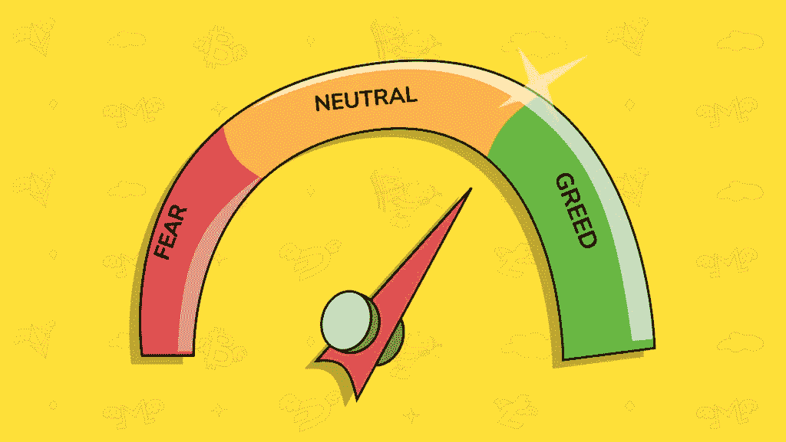

# 你应该了解的恐惧和贪婪指数的 7 个因素

> 原文：<https://medium.datadriveninvestor.com/the-7-factors-of-the-fear-greed-index-that-you-should-understand-a123a7f004fd?source=collection_archive---------1----------------------->

## *了解显示当前市场驱动因素的指数*

Image Courtesy — [TradeSanta](https://tradesanta.com/en)

[恐惧&贪婪指数](https://money.cnn.com/data/fear-and-greed/)是美国有线电视新闻网创造的一个指数，用来衡量股票市场是恐惧还是贪婪。当股价过度下跌时，股票市场被认为是令人恐惧的。当股价持续上涨并达到或超过新高时，就被认为是贪婪。

恐惧和贪婪指数以 0 到 100 为标度，其中 0 表示极度恐惧，100 表示极度贪婪。50 被认为是中性评级。截至 2020 年 11 月 23 日，该指数的评级为 77，这是一个代表极度贪婪的评级。用于建立评级的 7 个因素是:

1.看跌期权和看涨期权

2.股票价格宽度

3.市场势头

4.垃圾债券需求

5.市场波动

6.股价强势

7.避险需求

**1。看跌期权和看涨期权**

芝加哥期权交易所( [CBOE](https://en.wikipedia.org/wiki/Chicago_Board_Options_Exchange) ) 5 日平均看跌/看涨期权比率衡量了这一因素。看跌/看涨比率衡量看涨期权交易量相对于看跌期权交易量。看跌期权的交易量越低，看涨期权的交易量越高，这个因素就越有利于贪婪。看跌期权的交易量越大，看涨期权的交易量越小，这个因素就越容易引发恐惧。

**2。股价幅度**

麦克莱伦总量指数衡量这一因素。该指数衡量纽约证券交易所交易量的上升和下降。这意味着，当股价上涨的股票数量增加时，这一因素会推动贪婪。当股价下跌的股票数量增加时，这一因素会导致恐慌。

**3。市场势头**

标准普尔 500 指数与其 125 天移动平均线的比值衡量了这一因素。如果标准普尔 500 指数的价值大于其 125 天移动平均线，这个因素会推动贪婪。如果标准普尔 500 指数低于其 125 天移动平均线，这一因素会导致恐惧。

 [## 全球思考，本地行动:创业公司拓展新市场的 4 个关键|数据驱动的投资者

### 你是一家初创公司，在你的本土市场上表现出色。恭喜你。你能在新的市场重复它吗？这个…

www.datadriveninvestor.com](https://www.datadriveninvestor.com/2020/08/23/think-global-act-local-4-keys-for-startups-to-expand-into-new-markets/) 

**4。垃圾债券需求**

垃圾债券与投资级债券的收益率差就是衡量这一因素的标准。当垃圾债券和投资级债券之间的息差较低时，这显示了一种对贪婪的推动。当垃圾债券和投资级债券之间的利差更高时，这显示了一种对恐惧的推动。

**5。市场波动**

CBOE 波动指数( [VIX](https://medium.com/datadriveninvestor/3-quick-points-to-simplify-the-volatility-index-vix-576ca954710b) )衡量了这一因素。VIX 是一个实时市场指数，代表市场预期的 30 天前瞻性波动。VIX 越低，越容易变得贪婪。VIX 越高，越容易恐惧。

**6。股价强势**

衡量这一因素的是纽约证券交易所的 52 周新高和新低净值。如果触及 52 周高点的股票数量持续超过触及 52 周低点的股票数量，这一因素会进一步推动贪婪。如果触及 52 周低点的股票数量持续超过触及 52 周高点的股票数量，这一因素将更多地推向恐惧。

**7。避险需求**

20 天的股票和债券回报率之间的差异就是衡量这一因素的标准。如果股票的表现优于债券，那就显示了贪婪的趋势。如果债券的表现优于股票，那就显示了一种对恐惧的推动。

恐惧和贪婪指数并不是一个完美的指数，但它有助于简单了解我们目前所处的市场。对于长期投资者来说，恐惧和贪婪指数的一个主要用途是，当出现恐惧评级时，知道是时候考虑双倍下注，购买更多强 ETF 和公司的股票了。

恐惧和贪婪指数的怀疑者淡化了它，因为他们认为它是市场时机的晴雨表。是的，在市场中的时间比把握市场时机更重要，但是很好的理解什么时候买多或者不买多也很重要。恐惧和贪婪指数不应该单独使用。当与对特定 ETF 和公司的深入研究和尽职调查结合使用时，它为理解当前市场环境增加了额外的价值。

[查看 Tunji 信，保持联系](https://tunji.substack.com/)。

## 访问专家视图— [订阅 DDI 英特尔](https://datadriveninvestor.com/ddi-intel)