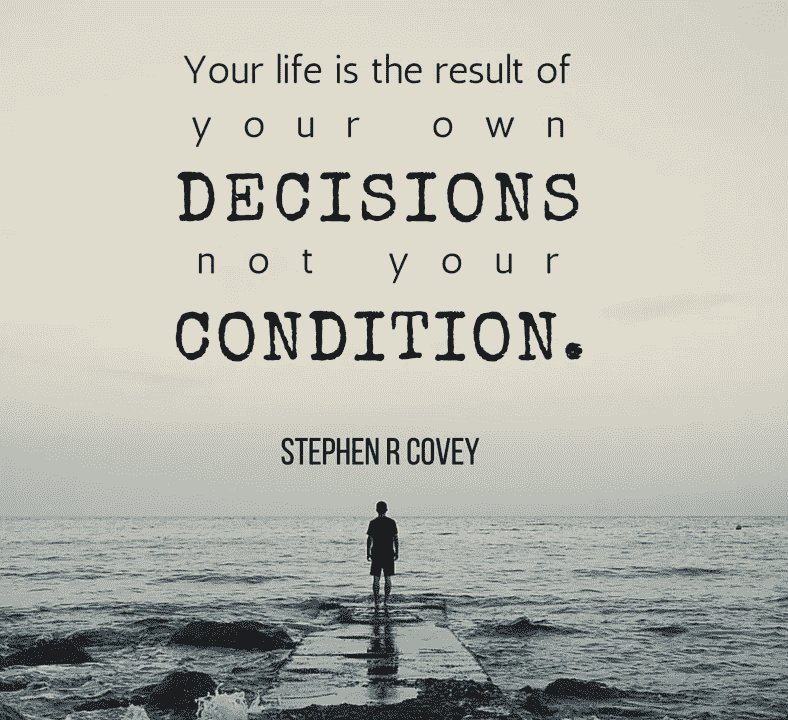
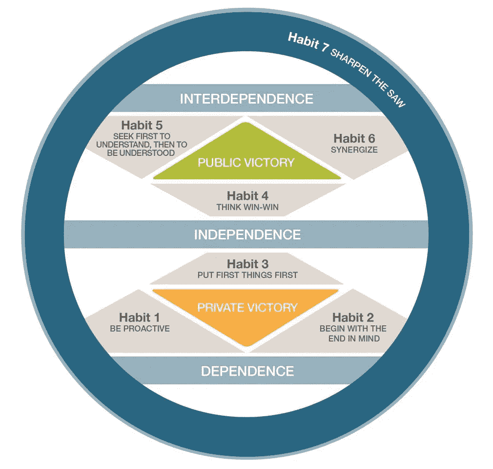
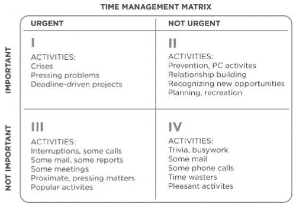

# 高效人士的 7 个习惯:书籍摘要

> 原文：<https://medium.datadriveninvestor.com/the-7-habits-of-highly-effective-people-book-summary-868b41dc9441?source=collection_archive---------5----------------------->

## 我们大多数人在紧急的事情上花了太多时间，而在重要的事情上花的时间不够。~斯蒂芬·柯维

Quotes (Image source and credits: Internet)

我刚刚完成了我的第 467 本书，恰好是“*高效人士的七个习惯”——到目前为止已经卖出了 2500 万册，很高兴我读了这本书。在这篇文章中，我将介绍这本书的概要以及你为什么应该阅读它。*

根据我的理解，**我想把这本书分成 4 个部分—**

第一部分——讲的是 ***是“有效”*** 的真正含义以及我们感知世界的方式。

第 2 部分——是关于*来自内心的胜利，即征服世界之前自己的胜利。*

*第 3 部分—是关于 ***【性格塑造】*** 以及你如何有效地与他人打交道。*

*第 4 部分——是关于 ***“改善”*** 从自我改善的小习惯开始，你可以从第一天开始。*

**

*7 habits of highly effective people (Image source and credits: Pinterest)*

# *私人胜利*

## *习惯 1:积极主动*

> *“刺激和反应之间存在差距，我们成长和幸福的关键在于我们如何利用这个空间。”斯蒂芬·柯维*

*现实生活中的例子—*

*当有人对你大喊大叫的时候，你要么喊回去，要么只是稳住自己，评估是否值得对那个人喊回去？ ***你有权力选择*** 。如果你选择表达你的愤怒，那么永远记住愤怒就像一场“失控的森林大火”或一头“狂暴的大象”,因为愤怒反应和破坏很快；我们经常没有时间去控制它——它倾向于向外破坏性地爆发，它引起仇恨并伤害人们。*

*第一课——你要对自己的生活和行为负责。明智地选择。*

*第二课——积极主动的人会承担责任。积极主动的人和被动的人总是有区别的&反应和回应。*

> *高度积极主动的人认识到这种责任。他们不会因为自己的行为而责怪环境。他们的行为是他们自己有意识选择的产物。斯蒂芬·柯维*

***第 3 课—** 积极主动的人采取主动、行动并带来结果。他们知道什么是他们能控制的，什么是他们应该放弃的，这样他们的生活才能向前发展。*

* [## 大学教育节省 6 位数以上的 5 步法|数据驱动型投资者

### 快讯(讽刺警告):大学教育是昂贵的！即使考虑到通货膨胀，高等教育也有…

www.datadriveninvestor.com](https://www.datadriveninvestor.com/2020/09/09/a-5-step-method-for-saving-6-figures-plus-on-a-college-education/)* 

## *习惯 2:开始时心里想着目的*

> *心中有目标意味着从清楚地了解你的目的地开始。它意味着知道你要去哪里，以便你更好地了解你现在在哪里，以便你采取的步骤总是在正确的方向上。斯蒂芬·柯维*

*这个习惯是关于你可以建立的东西以及为什么要建立。它是关于知道你想在生活中去哪里和为什么。*

*这从你生命的召唤开始。*

***第 1 课—** 确定你想要实现的角色和目标。每个角色中什么是重要的？你希望每一步都达到什么样的结果？每个角色的流程是什么？这会给你所做的一切赋予意义和目标。你会知道要创造什么和预期的结果。*

***第二课—** 身先士卒。首先分析情况，不同的道路和障碍物以及另一边有什么，然后决定走哪条路和什么时候走。*

*第三课——坚持不懈。总有一天，你会质疑自己做的和不做的每一件事。不要怀疑自己。正如人们所说的，当情况变得艰难时，艰难的人会变得更坚强，更努力地迎接挑战。*

## *习惯 3:先做重要的事情*

*这个习惯是关于优先化，现实化，正直，自律，坚持你的协议。为了保持纪律性、完整性和专注，继续朝着我们的目标和预期结果前进，我们需要有意志力去做我们不想做的事情。*

**

*Time management matrix (Image source and credits: facilethings)*

*象限 I——如果我们花时间管理危机和紧迫的问题，它会越来越大，直到耗尽我们。这导致 ***压力、倦怠、沮丧，最终以最没有效率的方式耗尽我们的能量。****

*象限 II——它是有效个人管理的中心和核心。它处理的事情包括建立关系、长期规划、识别新的机会、规划、准备，这些基本上都是我们知道需要做的事情，但不知何故很少抽出时间来实际做这些事情，因为我们觉得它们并不紧迫。*

*象限 III —在这种情况下，紧迫性应该基于优先级和重要性。在这里，我们大部分时间都在对看似紧急的事情做出反应。这会导致干扰、焦虑、注意力不集中、感觉失去控制，以及肤浅或破裂的关系。在这个阶段，我们无处不在，但同时又无处可去。*

*象限 IV——在这个象限中，我们很少知道自己在做什么。 ***这导致了不负责任的生活，浪费了很多宝贵的时间。****

***第一课—** 关键不在于把你日程上的事情优先化，而在于安排好你的**优先事项**。*

***第二课—** 决定你最重要的**优先事项**是什么，并列出待办事项清单。*

*第三课——有时候紧急的事情不一定要排在优先列表的最前面。你的优先事项应该根据它们的重要性和影响来确定。*

# *公众胜利*

## *习惯 4:思考双赢*

> *为了双赢，你不仅要友善，还要有勇气。”——斯蒂芬·科维*

*任何情况都有五种可能的结果(涉及两个人):*

1.  *双赢——理想情况下，你们都赢了，互惠互利。这始于一种 ***富足的心态***——每个人都贡献或增加一些价值，结果是每个人的双赢。*
2.  ***输赢**——只有一个人赢。这从 ***稀缺心态*** 开始——每个人都认为结论一定是零和的，这意味着没有人是赢家。*
3.  ***两败俱伤**——迅速安抚或讨好，容易让步。*
4.  *双输——没有人会赢，这是一个极具破坏性的联盟。*
5.  ***如果你不能对某个情况做出结论或达成一致，那么这个情况就是不成交，这对双方或所有相关方都是互利的。***

*****第 1 课—** 思考即将到来的情景，其中涉及到人们，他们的同意/不同意会改变结果。列出所有你可以提出的需求和提议，确保每个人都赢。***

***第二课— 无论情况或结果如何，都要凭自己的智慧、正直和诚实行事。***

*****第三课—** 坚持不懈地实现你一直以来的梦想。你不可能屈服。正如他们所说的那样——“如果你看不到隧道尽头的光明，那就把它当成一个机会，自己创造一个开口，无论你想去哪里。”“有时候，生活似乎是一条黑暗的隧道，尽头没有光，但如果你继续前进，你会到达一个更好的地方。”***

## ***习惯 5:首先寻求理解***

> ***“沟通是生活中最重要的技能。我们醒着的大部分时间都在交流。但是想想这个:你已经花了很多年学习如何读和写，花了很多年学习如何说。但是听呢？你受过什么样的训练或教育，能让你倾听，从而从另一个人自己的参照系中真正、深刻地理解他？” ~斯蒂芬·科维***

***理解的四个层次:***

*****忽略—** 只是忽略这个人或者没有注意他们想要传达的信息。***

*****假装—** 这叫做假听，意思是你只是假装在听或者被动地听。***

***选择性— 这是一个危险的水平，你只听你想听的，而忽略其余的！***

*****专注倾听—** 这被称为积极倾听，你注意每一个词，并在说出一个词之前试图理解他人在说什么。***

*****第 1 课—** 倾听、评估、询问或探究他人的话语***

*****第二课—** 设身处地地去解读和理解。***

*****第 3 课—** 对他们的问题提出建议或有效的解决方案。积极有效地解决他们的问题。***

## ***习惯 6:协同增效***

> ***“毫无疑问，你必须离开大本营的舒适区，去面对一个全新的、未知的荒野。”斯蒂芬·柯维***

***协同就是尊重、合作，它帮助你—***

***尊重和重视他人行动、观点和意见的差异***

***通过只关注积极的对话或侧面来远离消极的能量。***

***理解对他人的依赖，以及在对话中对他人开诚布公的勇气。***

***建立以原则为中心的伙伴关系，促进、统一和释放我们自己和他人的全部潜力。***

*****第 1 课—** 在差异中发现优势，差异可以是不同的观点、意见或态度。***

*****第二课—** 一起创造“习惯”。激励你的伴侣成为你生活中好习惯的一部分，并成为他们生活中积极的一部分。***

# ***更新***

## ***习惯 7:磨利锯子***

> ***“没有一天我们不能通过无条件的爱来至少服务于另一个人。”斯蒂芬·柯维***

***我们的生活和自然有三个维度——***

1.  ***身体方面——这意味着通过灌输良好的习惯来改善身体状况，如按时吃好、每天锻炼、睡好觉等。***
2.  ***社会情感维度——这旨在创造有意义的关系，从而带来快乐和创造力。因为这种富足的心态是必需的——当一个人赢了，另一个人就得到快乐，反之亦然。***
3.  ***精神层面——这是为了健康的身心。最后，我们应该在精神上得到满足，并在生活中寻求智慧。***
4.  ***精神层面——这是继续用伟大的文学、知识、他人的思想和观点扩展我们的思想。***

*****第 1 课—** 列出所有能帮助你实现上述 4 个生活维度的活动。***

*****第 2 课—** 第 1 课磨快你的锯，第 2 课知道什么时候用锯。身体力行是人生最重要的事情。***

## ***获得专家观点— [订阅 DDI 英特尔](https://datadriveninvestor.com/ddi-intel)***