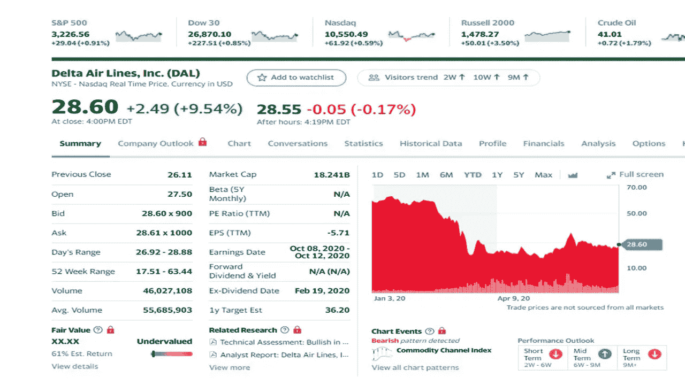

# 千禧一代买入的 7 大罗宾汉股票

> 原文：<https://medium.datadriveninvestor.com/the-7-top-robinhood-stocks-millenials-are-buying-c034ae7175?source=collection_archive---------4----------------------->

## 千禧一代交易员正在买入，但你应该买入吗？

Photo by [Andrea Piacquadio](https://www.pexels.com/@olly?utm_content=attributionCopyText&utm_medium=referral&utm_source=pexels) from [Pexels](https://www.pexels.com/photo/woman-beside-flower-shop-using-smartphone-3772531/?utm_content=attributionCopyText&utm_medium=referral&utm_source=pexels)

随着千禧一代享受直接从智能手机上购买股票的便利，网络经纪人 Robinhood 吸引了很多关注。我强调的这些热门股票并不意味着你可以购买它们，除非你做了尽职调查，而且它们符合你的投资组合。这些股票中的一些将有一个漫长的未来，而另一些可能有风险。

Robinhood 在 2013 年 4 月成为第一个零佣金经纪人。过去几年里，其他经纪公司纷纷效仿，但该平台仍以拥有 1300 万账户的众多追随者而自豪。尽管这个平台取得了一些成功，但也有一些可怕的经历。

 [## 利用股市相关性的最佳方式|数据驱动的投资者

### 当阿尔弗雷德·温斯洛·琼斯开创了世界上第一个“对冲”基金(后来“d”被去掉了)时，他让其他投资者大吃一惊…

www.datadriveninvestor.com](https://www.datadriveninvestor.com/2020/02/02/the-best-way-to-use-stock-market-correlations/) 

排名前七的股票是 Aurora 大麻、微软、苹果、达美航空、华特·迪士尼、美国航空和福特。

股票价格在 2020 年 7 月 15 日收盘时报价。你在这些股票上看到的价格可能不同。

# **奥罗拉大麻(ACB)**

Created on Yahoo Finance

这种大麻库存曾有过好日子，但最近的下跌让一些交易商感到乐观。疲弱的收入和负盈利率已经赶走了一些交易员。ACB 今年已经损失了超过一半的价值。

随着销售、一般和管理费用目标的实现，该公司期望情况会有所改善。此外，ACB 将在未来两个季度关闭五家工厂。分析师 Owen Bennet 认为 ACB 的举措是积极的，但仍给予该股表现不佳的评级和 14 美元的目标价。

大多数分析师比伯奈特更乐观，但他们没有罗宾汉交易者热情。在 14 位分析师中，3 位是买入，11 位是持有。

# **微软(MSFT)**

Created on Yahoo Finance

比尔·盖茨的电脑应用软件微软在罗宾汉股票中排名第 7。微软是云计算、消费电子、软件和个人电脑领域的主要科技股之一。微软也是少数几家市值超过万亿美元的公司之一。

该公司可能会节省一些钱，因为他们宣布将关闭所有零售店，作为他们零售战略的一个重大变化。由于他们的许多产品都在网上销售，这可能会被证明是一个很大的好处，特别是现在电晕病毒限制了户外旅行的买家。

分析师们支持罗宾汉交易者对这只股票的看法，他们给微软的评级是买入、卖出和卖出。微软的目标价是 220 美元。

# **苹果(AAPL)**

Created on Yahoo Finance

另一家科技公司在罗宾汉股票和华尔街排行榜上名列前茅。苹果公司已经准备好了一些升级，这给该公司带来了很多关注。随着 Apple Watch OS7 的更新，该手表支持睡眠跟踪和手表面部。

Apple Pay 将提供更多功能，如无缝功能和更好的数字体验。

苹果电脑也将在其苹果 MAC 产品中使用自己的处理器，而不是英特尔处理器。

该股的目标价为 320 美元，预计目标价将上调，评级将下调。在过去的三个月里，AAPL 收到了 27 笔买入、6 笔卖出和 1 笔卖出。

# **达美航空公司**

Created on Yahoo Finance

航空公司今年遭受重创，但达美航空的表现强于其他航空公司。达美股价下跌了 56%，但受到了股票分析师的高度赞扬。

截至上一季度末，该航空公司拥有约 140 亿美元的流动性，这可能是该航空公司历史上最高的流动性。根据 CARES Act 计划，达美航空必须在 9 月 30 日前决定增加 46 亿美元的现金头寸。

达美航空还能够将其 2020 年 6 月的运营成本降低 50%，但这表明了达美航空与其竞争对手相比的灵活性。

分析师给出了 9 个买入和 3 个持有的强烈买入评级。达美股票的目标价是 47 美元。

# **华特·迪士尼**

Created on Yahoo Finance

随着迪斯尼主题公园的关闭，这种病毒今年对迪斯尼造成了严重的打击。迪士尼经历了充满挑战的一年，因为它的许多业务都涉及到人。本月重新开放的计划已经推迟，电影也处于停滞状态。几年前，华特·迪士尼买下了漫威影业有限责任公司。迪士尼还拥有 ESPN，正如你所看到的，体育项目被推迟，篮球项目有望很快重启。重新开放迪斯尼的计划目前正在讨论中。

总体而言，迪士尼在分析师中的评级为中性，持有 11 个，卖出 2 个，买入 9 个。迪士尼的目标价为 126 美元。

# **美国航空公司(AAL)**

Created on Yahoo Finance

美国航空公司的评分不如达美航空公司，因为分析师对美国航空公司的支持不如达美航空公司。

美国航空公司正在利用当前的金融形势，计划为 3 月份的贷款进行再融资。分析师们认为，美国航空有很深的支付和亏损记录，未来几年前景并不明朗。公司正享受着现金盈余，以帮助他们度过难关。该公司预计今年税前亏损 108 亿美元，未来三年将亏损 77 亿美元。

分析师给出了跑输大盘的评级，AAL 的目标价为 5 美元。AAL 有三个买入评级和七个卖出评级。

# **福特(F)**

Created on Yahoo Finance

Robinhood 的最高股票是福特，当冠状病毒来袭时，它的价格下跌并减少了股息。福特的账面上有 80 亿美元的债务，大部分现金没有用于投资者预期的未来计划。约 10 亿美元用于未来支出。

最近的债务会侵蚀现金流，并从公司带走价值。分析师给予该公司持有评级，目标价 5 美元。

过去三个月，分析师对该公司的评级为六次持有，三次买入，两次卖出。

作者不拥有任何这些股票。

对于其他股票文章，请查看以下内容:

 [## 7 月份投资的最佳股票

### 2020 年五只股票跑赢大盘

medium.com](https://medium.com/datadriveninvestor/the-best-stocks-to-invest-in-july-87bfd16e5b90)  [## 6 月份投资的最佳股票

### 五只股票跑赢市场

medium.com](https://medium.com/datadriveninvestor/the-best-stocks-to-invest-in-june-9eb92961bf6d) 

你持有这些股票吗？

汤姆·汉迪(Tom Handy)是 Medium 的顶级投资和比特币作家，也是两个孩子的父亲。他从军队退役，并在几个非营利委员会任职。汤姆是他所在社区的顶级 Yelper，也是谷歌的顶级向导。他出现在几个社交媒体频道上，你可以在 Twitter [@tomhandy1](http://twitter.com/tomhandy1) 和 Instagram [@tomhandy1](http://twitter.com/tomhandy1) 上找到他。

本文仅供参考。不应将其视为财务或法律建议。并非所有信息都是准确的。在做出任何重大财务决定之前，请咨询财务专家。

**访问专家视图—** [**订阅 DDI 英特尔**](https://datadriveninvestor.com/ddi-intel)