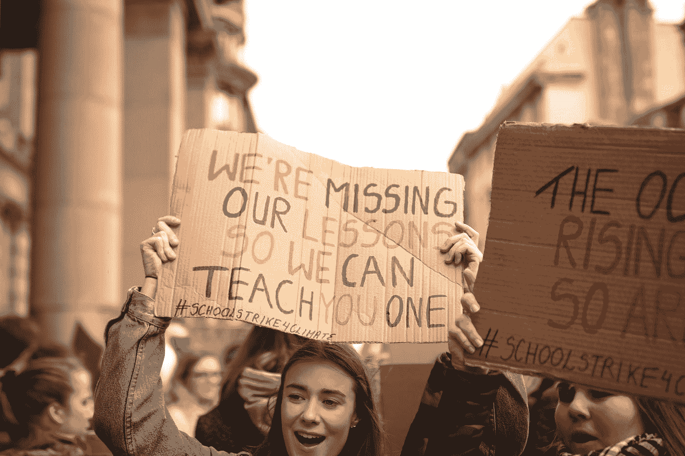
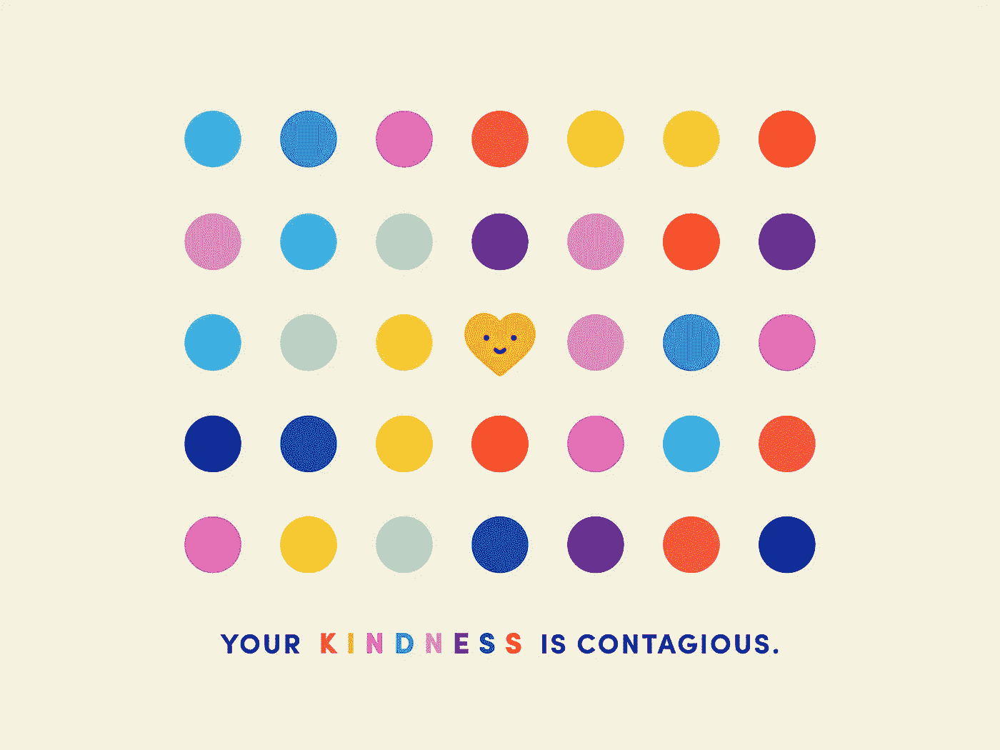
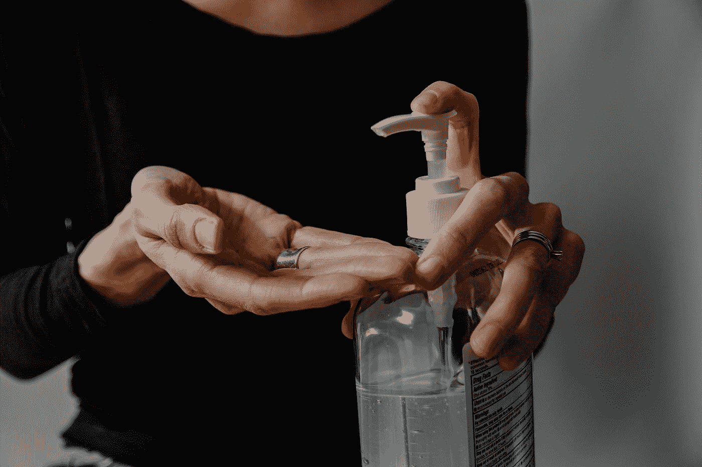
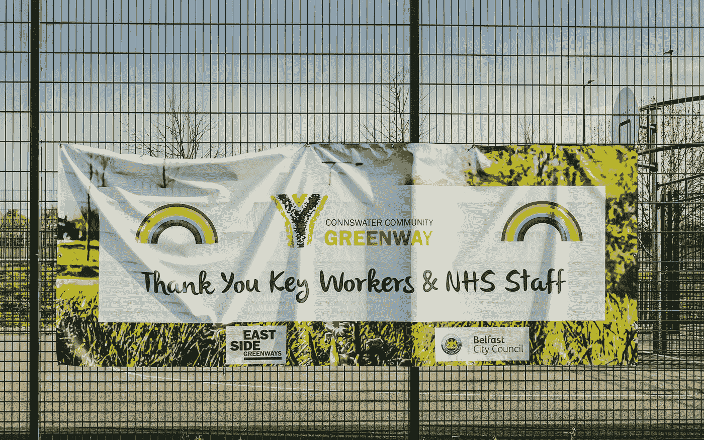

# 从新冠肺炎学到的 8 个教训，但它们不会持久

> 原文：<https://medium.datadriveninvestor.com/the-8-lessons-learned-from-covid-19-but-they-wont-last-87b918ccfd9f?source=collection_archive---------13----------------------->

## 由于新冠肺炎，生活在 2020 年 3 月初几乎一夜之间发生了巨大变化，越来越多的人认为我们正在进入一个“新常态”的时代。

冠状病毒迫使我们突然停止日常活动，采取新的做法，并在日常行动中变得更加谨慎。

Photo by [Callum Shaw](https://unsplash.com/@callumshaw?utm_source=medium&utm_medium=referral) on [Unsplash](https://unsplash.com?utm_source=medium&utm_medium=referral)

像“*、社会距离*、*、自我隔离*这样的词现在已经成为我们词汇中的常规部分。公平地说，在这次疫情中，我们对自己和整个世界有了更多的了解。

我很清楚我们是在找到疫苗的基础上工作的，这可能是也可能不是。不管怎样，世界正以一种新的节奏运转，这将在未来几年影响数十亿人的生活。

> 当该说的都说了，该做的都做了，我们会从遭遇的教训中吸取教训吗？

要回答这个问题，首先要考虑的是吸取了哪些教训。记住这一点，以下是我的 8 条经验:

# **1。** **勇气、智谋和善良至高无上**

我们不可能忽视这个星球上以令人难以置信的规模持续发生的善举。令人欣慰的是，在危机时刻，人类能够团结一致。

无论是每个紧急服务人员、医疗或教学人员在逆境中坚持下去的勇气，通过与他人联系表现出的独创性，还是数百万人向汤姆·摩尔船长等真正的灵感捐款表现出的善意，人类已经团结在一起。

不应该让疫情让我们重新认识什么是可能的——记住团结是我们在未来几十年必须珍惜的东西。

Photo by [United Nations COVID-19 Response](https://unsplash.com/@unitednations?utm_source=medium&utm_medium=referral) on [Unsplash](https://unsplash.com?utm_source=medium&utm_medium=referral)

# **2。** **工作方式永远改变了**

就在不久前,“在家工作”这个词还被认为是一个肮脏的词语——暗示当员工在家工作时，生产力水平很低，怀疑程度很高。

这不再是默认的假设。

许多公司通过以惊人的速度实施远程工作来应对病毒；展示当双手被迫时的可能性。有了这样的行动，任何先入为主的想法都破灭了。即使面临逆境，企业也能继续运营。这不仅是对每个 IT 部门的证明，也是对每个有幸远程工作的员工的证明。

> “人们不是在远程工作，他们是在危机期间呆在家里试图做一些工作。”

从未有人说过如此真实的话。

病毒不在乎你的资历，你的经验，或者你的重要性。我们所有人都面临着缺乏空间、缺乏儿童保育或会议期间门铃响起的挑战。我们都在一起。

我们对“**保持冷静和继续**的信念已经被证明(承认有一些减速带需要克服)，但我们共同到达了那里。向我们所有人致敬。

# **3。** **人们不再认为旅行是必要的**

与工作方式密切相关的是，对“在办公室里”*的期望已经破灭。*

*以前被认为是强制性的，现在变成了可能。虚拟背景和缩放登录取代了往返工作地点或全球旅行的需求。*

*从英国政府简报会到主要代理商安排的特别音乐演出，再到与朋友的虚拟酒吧会议，视频会议(VC)无所不包。*

*毫无疑问，这一转变的赢家是 Zoom。是的，也有其他风投服务，但这是天时地利人和的完美体现。*

*随着我们不断适应这种新的工作方式，我们会像以前一样得到个人的支持还是得到管理层的支持？)旅游限制什么时候放宽？当一切进展顺利或者别无选择时，很容易支持新的计划。*

# ***4。** **个人卫生刚刚成为公众关注的问题***

*过去是私人的事情现在已经公开了。曾经被限制在家里的东西，现在已经进入了公共领域。洗手的行为应该保持普遍，而不仅仅是因为病毒。*

> *个人权利和公共安全之间正在酝酿一场斗争。*

*我们是否准备为了他人的利益而放弃一些个人自由？这就是它将归结为什么。*

*手套、口罩、洗手液、洗手和其他形式的个人防护设备(PPE)不仅决定了行动自由，还决定了其他人的嘲笑或反应。*

*   *如果有人在火车上当着你的面呕吐，你会怎么做？*
*   **有人不洗手然后不戴手套去和你握手会怎么样？**
*   *你会记得在使用前对你的桌子/公共空间的每个部分进行消毒吗？*

*不幸的是，你的个人卫生标准刚刚成为大家关心的问题。*

**

*Photo by [Kelly Sikkema](https://unsplash.com/@kellysikkema?utm_source=medium&utm_medium=referral) on [Unsplash](https://unsplash.com?utm_source=medium&utm_medium=referral)*

# ***5。** **气候变化最肯定是一件事***

*我知道，人们普遍认为气候变化是真实的，尽管一些资深公众人物不相信这是真的。*

*冠状病毒有助于证明这个星球需要被照顾。*

*印度北部开始封锁几周后，由于空气污染减少，喜马拉雅山 30 年来第一次被看到。不可低估的是，减少旅行、减少商业活动和减少日常活动帮助世界复苏。*

*我们不能麻木不仁，因为全球有许多人因这种不可治愈的病毒而失去了生命。但是还有一线希望，地球母亲有惊人的再生能力。*

*我们绝不能忘记通过全世界的一致努力能够取得的成就。*

# ***6。** **事实比以往任何时候都重要***

*在一个变化速度惊人的世界里，我们必须对自己的决策有信心。*

*凭直觉做决定的日子已经一去不复返了——利害攸关的事情太多了。问题是我们倾向于忽视事实告诉我们的东西，直到为时已晚。*

*新冠肺炎是一个典型的例子。*

*至少可以说，公众对最初的封锁反应不一。我和其他人一样，一开始就没有认真对待这件事，对此我感到内疚；当疫情席卷全球时，我飞往加拿大。*

*在这个时代，剑桥分析公司(Cambridge Analytica)和唐纳德·特朗普(Donald Trump)可以用替代事实(*让我们明确一点，我们指的是这里的谎言*)影响数百万人，并逍遥法外，对事实的不信任不足为奇。*

*但是我们必须坚持下去。*

*事实帮助我们学习；它们帮助我们理解事情为什么会这样发生。没有他们，我们就不会知道第二次世界大战期间发生在整个欧洲的恐怖行为、北美令人发指的枪支犯罪行为或印度尼西亚海啸造成的破坏。*

*确保信任被灌输回事实的责任在于媒体。我们必须追究个人的责任，在胡说八道的时候把他们拉起来。*

## *让一位美国总统诽谤和误导数百万人，比因为坚持真理而失去一些读者更危险。*

# ***7。** **敏锐果断的决策是必须的***

**宁可做个糟糕的决定，也不要不做决定，*这是我坚持了很久的一句话。*

*最近读到一位名叫奥尔多·凯恩的前海军陆战队员说了类似的话，这已经成为一个越来越自觉的决定。*

*为什么？*

*因为做了决定，你就掌握了主动权。从这个意义上来说，你是在让事情发生。希望朝着你想要的方向，但是没有什么比坐以待毙，什么都不做，然后说“*我会以不同的方式来做，如果…* ”*

*这是胡说八道。每个政治家都知道这一点。*

## *指责和说你会做一些不同的事情是很容易的，特别是当证明否定是不可能的时候。*

*英国首相很清楚，你总是会让一些人感到不安。区别在于你是在为大多数人的最大利益而行动。*

*如果，或者更确切地说，当下一场危机出现时，我们会记得浪费的时间、争吵或对策略的犹豫不决吗？还是确保吸取教训，像新西兰总理杰辛达·阿德恩那样果断行动？*

**

*Photo by [Brandon Lopez](https://unsplash.com/@itsbrandonlopez?utm_source=medium&utm_medium=referral) on [Unsplash](https://unsplash.com?utm_source=medium&utm_medium=referral)*

# ***8。** **数字访问现在被认为与氧气相同***

*当我说数字访问时，这是互联网的一个广义术语。*

*互联网在应对封锁方面一直是一个巨大的支持者，不仅仅是在传输数据以分析 R-Rate(病毒的繁殖率)方面，而是在连接社会方面。*

*毫不夸张地说，如果没有互联网，汤姆·摩尔船长永远不会筹集到超过 3000 万英镑的资金。*

*互联网就像氧气——我们需要它才能生存。*

*这可能会被认为是一个矫情的声明，但考虑一下。有多少处于弱势且需要帮助的老一代人通过互联网连接获得了支持？*

*这可能是通过一个社区 WhatsApp 小组间接发生的，该小组确定了需要帮助的人，将陌生人联系在一起，并安排将医疗用品或食物送到他们的家门口。*

*我不是说没有互联网就不会发生这种情况，但是，我的话，这将是一个更加痛苦，脱节和缓慢的过程。*

*数字接入意味着我们可以和任何人联系；你的隔壁邻居或世界另一端的人。没关系。重要的是我们可以联系并打招呼。*

*为某人而存在这个简单的行为是巨大的。*

*倾听或者几周以来的第一次谈话意味着有人关心。是的，它与上面提到的人道主义观点有着内在的联系，但数字接入现在是一种必要，无论是连接老年人、提供医疗用品还是筹集资金。*

# ***9。** **冠状病毒的英雄们不穿斗篷***

*试图列出那些在冠状病毒疫情期间将自己的生命置于他人之前的人几乎是虚伪的。不可避免地，我会错过一些人或社会的一部分，这是不公平的。*

*我想说的是，无论是公务员、卫生工作者、教师、面包师、厨师、制造商，还是运送一线员工的公共汽车司机，每一个人都值得深深的感谢。*

*每天都会有数百万人克服困难去帮助他人。*

*生活不能也不会停止。我们必须继续走下去，互相支持，不管是朋友还是陌生人。我们都在一起，但有些人非常感激其他人。*

*你知道他们是谁，我感谢你。他们是真正的英雄。*

**

*Photo by [K. Mitch Hodge](https://unsplash.com/@kmitchhodge?utm_source=medium&utm_medium=referral) on [Unsplash](https://unsplash.com?utm_source=medium&utm_medium=referral)*

*当该说的都说了，该做的都做了，我们走到了另一边(不管有没有找到疫苗)，我们必须记住那些作为国家支柱的社会阶层。那些日复一日不知疲倦地为那些不幸的人、贫困的人或重病患者工作的人。*

*当情况好的时候，人们很容易忘记我们是多么依赖这些人。这是不可能发生的。这将是一场闹剧。*

*但我担心它会发生。*

*退回到我们在新冠肺炎之前形成的心态、工作实践和个人泡沫是非常容易的，但是我们不能让这种情况发生。*

*上周末在伦敦东部，这一点再明显不过了。在那里，大量的团体无视社交距离，仍然处于封锁状态。聚集在相距不到 2 米的人群中，喝着啤酒，吃着比萨饼，你可能会原谅病毒从未到来。*

*当讨论转向“*”刹车的时候，生活会恢复正常的预期出现了&一些公众这样反应。这就是为什么我不相信公众是可信的。**

**过渡教习所是行不通的！封锁或不封锁，这似乎是唯一的选择。如果是这样的话，我们需要为第二波做准备，因为这是不可避免的。**

**在 12-18 个月的时间里，当生活开始变得正常时，我们还会记得这些教训吗？**

*   ***我们会继续支持大型连锁店的本地业务吗，比如精品咖啡屋 vs 星巴克？***
*   **我们会继续更小心地花钱吗？**
*   **我们是继续为下一次全球危机做准备，还是对其视而不见？**
*   ***我们会继续对陌生人和需要帮助的人更加体贴吗？***
*   ***我们会记得在大选中不分政治派别地支持 NHS 吗？***

## **我内心的悲观主义者说，在 2021 年底，我们会忘记上面列出的所有教训&生活会回到 2020 年 3 月前的水平。**

**我真心希望我是错的，但恐怕不是。**

**— — —**

****要加入我的邮件列表请** [**点击这里**](https://wondrous-knitter-2652.ck.page/c218ea64d6) **。****