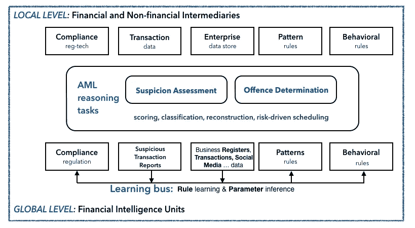
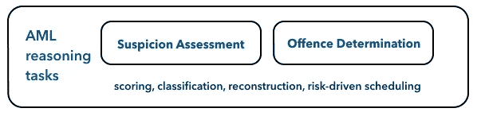
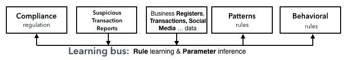

# 反洗钱面临的 9 大金融科技挑战

> 原文：<https://medium.datadriveninvestor.com/the-9-fintech-challenges-for-anti-money-laundering-29ae50dd7ed6?source=collection_archive---------3----------------------->

## 财务与技术

## 是时候让人工智能成功瓦解洗钱了

Some very bad guys — Image by Author.

> 洗钱是对金融系统良好运行的重大威胁。然而，在打击洗钱方面，仍然没有什么明显的进展迹象。

反洗钱立法被证明是所有打击犯罪措施中最无效的。执法部门、决策者和媒体可能会被犯罪行为的直接性分散注意力，以至于很容易忘记这些非法活动的目的不是犯罪本身，而是犯罪收益。在这一点上，反洗钱执法的彻底失败已经指日可待。这一失败产生了巨大的影响[3]。

最近，我们正在协助人工智能研究的扩散，应用于反洗钱(AML)。根据路孚特的说法，在过去的一年里，基于人工智能的金融科技投资增加了 50%以上，以改善对比鲜明的金融犯罪。尽管有大量的技术投资，机器学习、区块链和人工智能是金融科技革命的核心，但我们仍然缺乏有效和可解释的反洗钱解决方案[1]。

我们不能再仅仅依赖于反洗钱立法的不断完善，或者那些在各个机构对比这些犯罪类型的最聪明的金融情报分析师。因此，也许我们想利用人工智能来“跟踪金钱”的想法是正确的。然而，要有效和系统地利用这些新兴技术，仍然面临许多重大挑战。

## 作为 AML-KG 的金融生态系统

Photo by [Emma Gossett](https://unsplash.com/@emmagossett?utm_source=medium&utm_medium=referral) on [Unsplash](https://unsplash.com?utm_source=medium&utm_medium=referral)

为了应对反洗钱行业面临的严峻挑战和可喜机遇，我们必须了解反洗钱生态系统包括私营部门和公共部门，以及采取行动打击恐怖犯罪的众多积极参与者。

正如经常发生的那样，生态系统是开放的、动态的系统，由许多紧密相连的元素组成，它们试图合作，在混沌的边缘创造一种不断进化的稳定性。

同样，在反洗钱生态系统中，金融和非金融中介(如银行、赌场、信托、汇款等。)是管理金融交易的相互关联的实体。当这些中介机构(即报告实体)认为这些交易可疑时，它们会向金融情报机构发送“可疑交易报告”，也称为可疑交易报告。金融情报机构是独立的公共机构，分布在世界上几乎每个国家，对这些交易进行金融情报分析。金融情报机构构建复杂的调查案例，收集大量其他机密和分类信息，试图将洗钱与恶劣的潜在犯罪(从技术上讲是上游犯罪)进行对比，如人口贩运和走私、腐败、儿童性剥削、贩毒、逃税、有组织犯罪等。

因此，有时在这个特殊的生态系统中，很难理解哪些是优势物种，采取了什么策略，谁与谁合作共同生存，以及谁在容易获得的幻觉指导下实施利己主义策略。

> 显而易见的是，金融情报机构在打击洗钱和资助恐怖主义方面发挥着最关键的作用。金融情报机构是该系统的大脑和肌肉。

其次，私营部门被 KYC 和 CDD 的义务搞得喘不过气来，被合规的负担搞得心烦意乱，彼此之间很少合作，也很少串通一气。

反洗钱行业的一个**新愿景**是加强合作:

*   **例如，在私营部门的单个实体之间**，他们可以共享方法并集成数据和系统；
*   不同国家的金融情报机构之间，犯罪没有国界，但政府有；
*   金融情报机构和私营部门之间的**。不仅互相推卸责任，而且利用一种协作来提供反对非法活动的真正意愿。**

**你可以在最近发表于@ [RuleML+RR 2020](http://ceur-ws.org/Vol-2644/paper40.pdf) 的论文中找到对这一愿景的详尽解释。**

**根据这一观点，我们可以在这样一个复杂且往往保守的生态系统中维持一种包容的创新，有意义地利用尖端技术来打击犯罪。**

> **反洗钱知识图谱是一种技术方法，可以维持不同参与者之间最强有力的合作、实现卓越的成果以及汇集信息。**

****

**The AML Knowledge Graph — Image by Author.**

**该图既描述了与洗钱相对的地方层级**和**全球层级**的反洗钱，前者由报告实体组成，主要在合规方面挣扎，后者由所有金融情报机构组成，主要在金融情报方面挣扎。****

****

****反洗钱推理任务**主要是指金融情报机构的工作，当然，金融情报机构是整个生态系统跳动的心脏，然而，其中一些任务也涉及私营部门的初步贡献，并分担部分责任。名称中的“推理”部分不仅仅是因为任务涉及许多复杂的信息，还因为活动是思维，是在一个包含的知识图上进行推理的任务，其中数据和知识领域用一种正式语言表示，允许系统回答复杂的思维(在人工智能中称为知识图上的自动推理)。**

**此 KG 的**扩展部分**，即基础部分，包含所有相关的域对象和互连，包括可疑交易报告(str)、企业数据存储、合规规则、已知的可疑模式、来自社交网络和媒体、报纸的事实，或来自执法机关的后续反馈等。它还可以被扩展和明智地共享，以表示来自企业知识系统的数据和来自私人中介的 KYC 数据。扩展部分(EDB)应该采用一种关系表示，例如，反映属性图模型，将谓词及其术语精确映射到节点、边及其属性。**

**然而，金融情报机构不仅有一个前所未有的、具有独特价值的数据库可供开发和利用，而且有大量的分析师经验中的知名模式可供充分利用，通过使用正确的技术加以利用。**

**KG 的**内涵部分**由称为 IDB 的规则组成，应使用 regtech 方法来表示和实施官方法规，对自定义标准和行为规则进行编码，并包括已知的洗钱模式，如循环电汇、金字塔控制结构等。**

**如果不是被忽略的话，通常被忽略的是，绝大多数洗钱模式、可疑行为和金融业务规则可以用支持完全递归、本体推理、概率推理和机器学习模型的'**知识表示和推理语言'**来有效地描述。最重要的是可以通过这样一种语言来概括，例如，你可以**在 AML-KG 上推理，**捕捉到人类可以独立验证的相同模式中的微小变化。当然不是在合理的时间内，有时完全不可行。在这个反洗钱知识图中，一些推理规则可以由金融分析师和领域工程师设计，而其他规则可以通过统计关系学习方法从数据中学习。**

**在这里，我必须说明反洗钱行业特有的关于**设计或规则学习**的一些东西。在 IDB 部分，精心设计的规则可以包含有价值的领域知识，这些知识不能从数据中归纳出来，例如，从法规遵从性、洗钱模式的内部或复杂的领域规则中归纳出来。此外，金融情报分析师非常了解最普遍的洗钱模式和金融线索混淆策略，以至于从数据中得出结论会降低准确性和可解释性。**

****

**图中的**学习总线**表示混合演绎/归纳方法。现代知识表示和推理语言允许通用和健壮的规则，这意味着高水平的表达能力。当规则嵌入参数化机器学习模型时，这些参数反过来可以从数据中推断出来。另一方面，从数据中学习规则可以敏感地加快普通规则设计过程。**

**除了这个方向设置， **AML 任务**应被建模为 AML-KG 上的推理任务，并用于开发增值服务或 API，以支持中介机构和金融情报机构的各种业务流程。**

**KG-enhanced AML 应用程序的开发主要依赖于可疑评估和可疑犯罪判定的结果，以做出关键决策。例如，中介机构的可疑交易报告工作流程处理工具应查询 AML-KG 进行可疑交易评估，以完成交易，并根据监管或海关标准决定是否向当地金融情报机构提交可疑交易报告。同样，金融情报室在收到中间人的可疑交易报告后，应启动可疑交易评估任务，进行后续评估。当需要追查具体案件时，金融情报机构应使用可疑罪行确定任务，用于自主调查或执法当局发布的实例。此外，派生的子任务也与战略目的相关。例如，他们可以维持决策支持系统，并提供智能分析和定量数据，以确定活动的优先顺序以及全球风险最小化。**

# **立即行动起来**

****

**Photo by [Hans-Peter Gauster](https://unsplash.com/@sloppyperfectionist?utm_source=unsplash&utm_medium=referral&utm_content=creditCopyText) on [Unsplash](https://unsplash.com/s/photos/collaboration?utm_source=unsplash&utm_medium=referral&utm_content=creditCopyText)**

**许多观察人士谈到了金融情报生态系统中的公私合作，但在当前范式下，任何实质性的东西都没有实现。公私关系往往仅限于交流遵守义务的结果，即使这种关系并不敌对。此外，欧盟执行机构表示，在所有成员国之间收集和分发金融情报的“协调和支持机制”将使官员们更容易识别跨国洗钱计划，并快速跨境共享信息。现在正是政府和行业代表合作设计和实施现代化、稳健、高效、有效和接近实时的反洗钱检测系统的时候，该系统整合了必要的隐私保护和监督。因此，让我们定位于这种基于规则的方法，将 AML-KG 作为 AML 生态系统最终愿景的中心。[1,3,4,6]**

****在有效阻止洗钱和将资助恐怖主义与使用以前没有的技术进行对比方面有哪些挑战**？**

# **9 大金融科技挑战**

## **分布式推理**

**端到端反洗钱流程涉及不同金融情报机构和中介机构的合作，因为犯罪本质上是跨国和全球化的。尽管有一些多边和双边的努力，及时有效的**信息交换**仍然是海市蜃楼。**

**也由于法律义务，做出了一些缩短信息交换的尝试[，例如，嵌入欧洲刑警组织的 28 个欧洲金融情报机构有权访问 FIU.net](https://eucrim.eu/news/commission-need-reinforced-fiu-cooperation/)的[。这一基础设施的初衷是好的，它希望提供一个多机构平台来共享金融情报。然而，这个平台为其用户提供了巨大的未实现的潜力。FIU.net 缺乏自动化和互操作性，正如英国国家犯罪署(National Crime Agency)前署长戴维·托马斯所言，“它仍是一种初级工具”。](https://ec.europa.eu/home-affairs/e-library/glossary/fiunet_en)**

**如果它使用了某种形式的 API(FIU.net 是反洗钱/CFT 最先进的跨国 it 工具),这将意味着对应方同意一个通用的通信接口。在这种“裸机”网络中，金融情报机构甚至出现在八十年代的数据交换之前:在安全的物理通道中拖放文件的人工过程。[4,7,9,10,11]**

**相反，**反洗钱流程应设计为分布式推理任务**:在金融情报机构层面，可以根据可疑交易报告和前提罪行得分对反洗钱活动进行整体调度，以便将计算资源仅(或首先)集中在最相关的案件上。金融情报机构和中介机构(从长远来看，还有执法机构)将合作执行任务，从全球和本地的角度达成一致的反洗钱决策。**

**特别是，推理任务应该跨越多个 kg，由不同的参与者部署和维护。推理应该作为协调的子任务来执行，每个子任务都位于各自的数据分片中。例如，中介可以在发布交易之前触发怀疑评估任务；然后，这一过程将依次启动金融情报室方面各自的可疑评估和可疑罪行确定任务，以巩固或不巩固中间结论。**

** [## 首次创业的 4 个资金管理技巧|数据驱动的投资者

### 超过 82%的企业倒闭是由于财务管理不善和现金流问题。开始新的…

www.datadriveninvestor.com](https://www.datadriveninvestor.com/2020/10/23/4-money-management-tips-for-first-time-entrepreneurs/) 

这种技术也可以让欧盟数据保护机构 EDPS 放心。EDPS 最近对欧洲刑警组织拥有和处理根据国家刑法不属于“嫌疑人”的个人数据的法律依据表示关切。[8]** 

## **信任和信息共享**

**分布式推理将保持信任，这要归功于一种具有共享进程的**推理局部性**以及 AML-KG 扩展部分的中间 FIU 级别。例如，这将克服金融情报机构检索和储存来自中间人的交易数据或分享特许情报信息的需要。**

**涉及各自知识部分的任务，AML-KG 的规则部分，将简单地在中间方运行一个推理分支。
另一方面，该方法将鼓励参与者以 AML 标准或模式的形式分享 AML-KG 的知识部分，从而促进检查的**标准化**和**再现性**。**

## **信息集成**

**一个或多个整合的 AML-kg 应该为中介机构和金融情报机构的**整合信息资产**的构建做出贡献，以使合规检查标准化，并对比各种任务的不同实施方式的激增。**

**此外，由于采用了语义明确的形式和简单性，给定了基于逻辑的知识表示和推理语言的紧凑性，该方法将支持进一步的重要属性，例如 IT 独立性、将关键任务与特定编程语言解耦、正确性等。**

## **数据争论**

**数据争论是从各种相关来源(如交易数据、企业商店、商业登记、KYC 档案)构建 AML-KG 的知识部分和规则部分。**

**它包括所涉及的实体的相关属性的选择、数据质量管理(例如缺失数据的处理),并且需要解决非平凡的数据管理问题，例如实体解析、数据融合、用于非结构化源的自然语言处理算法等。**

**此外，这些任务可以以推理规则的形式指定，例如在 Datalog 家族的语言 [Vadalog](http://ceur-ws.org/Vol-1644/paper20.pdf) 中，该语言被证明是数据管理社区中非常有效的数据争论通用语，已经成功用于解决数据争论的基本问题，如数据交换和数据集成。[5]**

## **发现已知的洗钱模式**

**图形数据库技术缺乏足够的表达能力来捕捉许多已知的洗钱模式。例如，基于正则路径查询的语言不处理完全递归，此外，它们不支持本体推理。使用这种技术在 AML 数据中寻找已知模式，在某种意义上，就像使用过度拟合的机器学习模型:模式只能在逐个案例的基础上进行匹配，查询激增，最终导致混乱！**

**相反，AML-KGs 背后的技术代表了一个推广模式和工业化模式检测的非常好的机会，它应该以内涵组件的推理规则的形式建模。如果您想使用逻辑语言，Vadalog 是表示任何模式的好选择，因为它具有很高的表达能力、可伸缩性和完全可解释性。**

## **发现未知的洗钱模式**

**为了跟上金融犯罪不断发展的步伐，我们需要依靠**自适应推理规则**，这种规则强大且能够归纳未知模式。**

**如果您不想错过这个目标，那么您需要一种能够应对推理语言的一些重要需求的语言:对内涵谓词、存在量化的支持，以及更普遍的完全本体推理。特别是，在反洗钱/CFT 中，本体推理使看似不相关的领域能够自动互动，以检测不可预见的非法情况，这非常有帮助，例如，在个人之间的混合金融-个人联系的情况下。你可以在最近一篇关于[走向数据科学](https://towardsdatascience.com/probabilistic-reasoning-on-knowledge-graphs-d510269f5cf0)的文章中找到关于这些特性的更长的论文。此外，**嵌入机器学习模型**非常有用，它允许检测模糊模式并限制特殊情况的扩散。**

**推理还可用于实现可扩展和可解释的聚类
,根据实体的特征或网络中的拓扑角色，对实体或可疑交易进行分组。反之亦然，推理可以在用标准技术计算的集群内进行，以执行细粒度的比较。**

**另一个有前途的未知模式技术是**链接分析**，包括建立实体(个人、交易等)之间的联系。)并用它们来评估可疑性。在这种情况下，可以使用推理来设计平衡可扩展性和准确性的解决方案，例如，使用节点嵌入技术来增加和指导具有领域知识的节点集群。**

**发现未知和已知非法模式的要点是 AML-KG 所用语言概括归纳和演绎推理的能力，同时保持业务人员在交互中的简单性。这给我们带来了下一个挑战！**

## **模型简单性**

**众所周知，成功的基于规则的方法取决于 KRR 语言的可用性及其在以高可用性和有效性水平编码真实世界案例中的性能。**

**同样在这个挑战中，Vadalog 语言是一个很好的选择。除了基本的完整本体推理之外，它还体现了几个期望的特征:**简单性**，因为它基于基本的 Datalog 语法；**简单性**，作为数据，在规则中称为事实，可以看做数据库元组；和**模块化**，因为规则不依赖于任何形式的编译依赖或过程排序。**

**高度基于一阶逻辑的**语义**对于非 IT 领域专家来说也是直观的，递归的使用很容易被理解为一种归纳定义的形式，涉及存在量化和聚合，这在金融和统计领域的特定领域语言中是传统上不存在的。AML 中的实际采用是一种非常紧凑的形式主义，能够编码成几十条规则，几千行程序代码，正如你在最近发表的这篇论文 [@ RuleML+RR](http://ceur-ws.org/Vol-2644/paper40.pdf) 中看到的。尽管复杂案例的开发可能需要工程师的支持，但这种语言激发了用户理解核心业务细节的兴趣，降低了 IT 成本，尤其是非声明性技术。**

## **不确定**

**这个世界是不确定的，原始数据可能是模糊的，犯罪行为很少是未知的，我甚至不知道我的下一个假期是否会在疫情…**

**说真的，我们人类的推理过程从设计上来说是不确定的。因此，AML-KG 上的推理任务需要包括并处理**各种不确定性**。**

**早在 2017 年，这篇发表在 [IJCAI](https://www.ijcai.org/Proceedings/2017/0001.pdf) 上的开创性论文就确定了一个不可错过的功能，即处理知识图中采用的 KRR 语言的不确定性的能力。语言应该适合于结合适当的概率推理方法，系统应该沿着推理过程传播概率或确定性值，也就是说，为导出的数据计算概率或确定性值，并在必要时进行调整。**

**反洗钱推理涉及相互关联的不确定性水平，以确定模式的相似性、交易的可疑程度或上游犯罪的可能性等。反洗钱业务流程中最重要的问题，如“met 模式出现的可能性有多大？”；“met 隐形模式洗钱的可能性有多大？”；对于特定的洗钱模式，交易的可疑程度如何？；在一个特定的可疑案件中，上游犯罪的可能性有多大？，以及其他；是财务分析师日常职责的一部分，需要正确回答。**

## **道德决策**

**像金融情报机构那样从全球角度处理反洗钱问题，会带来不可忽视的道德和法律问题，因为只有在明确怀疑的情况下，才应检查个人的子网络。**

**相比之下，一些技术，如社会网络分析，来自新兴的统计证据，然后专注于特定的主题。这种行为可被视为金融情报机构的侵犯性不当行为，很少在司法后续行动中产生有争议的证据。**

**基于 AML-KGs 推理的 AML 方法通过以查询驱动的方式操作来克服这些困难。AML-KG 的遍历和集中定义的实体的生成由 AML 任务的特定目标驱动，被分析的图表部分是可疑个人/银行/交易邻近区域的最小扩展。**

# **关闭视野**

**反洗钱生态系统包括私营部门和公共部门，以及众多采取行动打击恐怖犯罪的积极参与者。许多观察人士谈到了金融情报生态系统中的公私合作，但在当前范式下，任何实质性的东西都没有实现。在这一点上，反洗钱执法的彻底失败已经指日可待。这一失败产生了巨大的影响。最近，我们正在协助人工智能研究的扩散，应用于反洗钱。尽管有大量的技术投资，机器学习、区块链和人工智能是金融科技革命的核心，但我们仍然缺乏有效和可解释的反洗钱解决方案。**

**为了有效地阻止洗钱，并将恐怖主义融资与使用以前没有的技术进行对比，反洗钱必须应对一些重要的挑战:**分布式推理、信任和信息共享、信息集成、数据争论、发现已知的洗钱模式、发现未知的洗钱模式、模型简单性、不确定性，以及最重要的道德决策。**先进的技术对反洗钱部门来说绰绰有余。然而，反洗钱部门似乎仍然回避使用使能技术来协调可用的流程和技术解决方案。**

**希望现在开始一场小小但必要的革命还不算太晚。**

***如果你想了解更多关于金融智能的推理:***

** [## 多花几美元

### 财务智能的业务是什么，为什么要关注？

medium.com](https://medium.com/discourse/for-a-few-dollars-more-4d25ceba2023)  [## 识破洗钱的艺术

### …以及在没有业务流程的情况下生存。

medium.com](https://medium.com/discourse/the-art-of-spotting-cleaned-dirty-money-632ea6a8e4a)  [## 金融情报推理

### 如何使用人工智能帮助打击有组织犯罪。

towardsdatascience.com](https://towardsdatascience.com/reasoning-on-financial-intelligence-3e40db6c2b5) 

关注我的[媒体](https://eleonora-laurenza.medium.com/)了解更多。

让我们也在 Linkedin 上保持联系吧！

# 参考

[1] L .贝洛马里尼等人；[《金融情报机构基于规则的反洗钱:经验与愿景》](http://ceur-ws.org/Vol-2644/paper40.pdf)(2020)；RuleML+RR。

[2]路孚特:创新与打击金融犯罪。https://www.refinitiv.com/en(2019)[。](https://www.refinitiv.com/en)

[3] J .卡萨拉；“更新反洗钱法律以打击洗钱和恐怖融资(2017 年)国会证词:捍卫民主基金会”；[https://www . judiciary . Senate . gov/IMO/media/doc/Cassara % 20 testimmony . pdf](https://www.judiciary.senate.gov/imo/media/doc/Cassara%20Testimony.pdf)

[4] G .韦德里纳和 K .库韦；"[泄露的欧盟文件概述了欧洲金融情报机构的计划](https://www.moneylaundering.com/news/leaked-eu-document-outlines-plans-for-european-financial-intelligence-unit/?_ga=2.179158253.895538230.1599331192-996047515.1599331192)"(2020)；ACAMS。

[5] T. Furche 等人；"[大数据的数据争论:走向数据争论的通用语。](http://ceur-ws.org/Vol-1644/paper20.pdf)(2016)；AMW。

[6]“欧盟委员会的来文:关于防止洗钱和资助恐怖主义的全面欧盟政策的行动计划”(2020 年)；由政治泄露，[https://www . politico . eu/WP-content/uploads/2020/03/Draft-AML-communication-2 . pdf](https://www.politico.eu/wp-content/uploads/2020/03/Draft-AML-communication-2.pdf)

[7]欧洲刑警组织；“从怀疑到行动——将金融情报转化为更大的运营影响”(2017)。

[8] J .里斯和 s .沃斯；“ [GDPR 冲突使欧洲刑警组织被禁止托管金融犯罪计算机网络](https://www.spglobal.com/marketintelligence/en/news-insights/latest-news-headlines/gdpr-clash-leaves-europol-banned-from-hosting-financial-crime-computer-network-57121862)”(2020)；标准普尔的全球市场情报。

[9]上议院；"[欧洲联盟委员会第十九次报告
洗钱和资助恐怖主义](https://publications.parliament.uk/pa/ld200809/ldselect/ldeucom/132/13202.htm) " (2009 年)。

[10]国际货币基金组织——世界银行集团；"金融情报机构:概述."(2004).

11 欧洲联盟理事会有组织犯罪问题多学科小组；关于 FIU.NET 项目的信息(2002 年发布，2009 年出版)。

## 获得专家视图— [订阅 DDI 英特尔](https://datadriveninvestor.com/ddi-intel)**