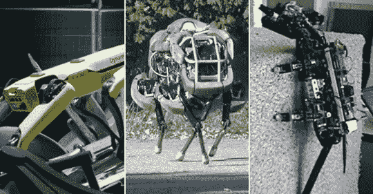

# 人工智能革命继续前进

> 原文：<https://medium.datadriveninvestor.com/the-a-i-revolution-marches-on-418ec88f7724?source=collection_archive---------13----------------------->

像《终结者》系列电影中描绘的机器人起义越来越近了。

丰田最近推出了新的遥控机器人 T-HR3，它的操作员戴着耳机，手臂上有电线。

这种模型被宣传为比以前的模型更平滑、更轻便、更容易使用，可以用于在没有医生的偏远地区“进行手术”。

据美联社报道，这也可能让人们觉得他们在参加他们实际上不能参加的活动。

同一天，瑞士研究人员宣布开发出一种名为 DEAnsect 的轻型快速机器人昆虫，它可以承受苍蝇拍的几次重击，并在被鞋子踩到后存活下来。

该微型机器人设计有介电弹性体致动器(DEAs)、人造肌肉、大脑微控制器和作为眼睛的光电二极管。

这种重量不到一克的虫子可以携带五倍于自身重量的物体，识别黑白图案，并跟随地面上画的线。

洛桑联邦理工学院研究小组成员 Herbert Shea 告诉 [Silicon Republic](https://www.siliconrepublic.com/machines/invincible-robotic-insect) “这项技术为 DEAs 在机器人学中的广泛应用开辟了新的可能性，用于智能机器昆虫群，用于检查或远程维修，甚至用于通过派遣机器人生活在昆虫群落中来更深入地了解昆虫群落。”。

好像成群的机器虫还不够可怕似的——谢伊说，最终，它们将能够与自己对话。“我们目前正与斯坦福大学合作开发一个无束缚的、完全软的版本。从长远来看，我们计划给昆虫安装新的传感器和发射器，这样它们就可以直接相互交流了。”

这里有更多疯狂科学家闭门造车的作品。

# 开门的机器狗

这种四条腿的生物看起来像“黑镜”中的杀人机器狗一样令人不安，是由神秘公司波士顿动力公司开发的，波士顿动力公司是一家私人公司，被谷歌母公司 Alphabet 收购，但在 2017 年出售给了 WeWork 母公司软银集团。

虽然“Spot”最初用于研究，但 Boston Dynamics [在 9 月](https://www.cnn.com/2019/09/25/app-tech-section/robot-dog-sale-intl-hnk-scli/index.html)宣布，它将开始销售这只狗——它可以奔跑、[解锁并开门](https://www.youtube.com/watch?v=wXxrmussq4E)，自己爬起来，在各种天气和具有挑战性的地形中操作，甚至[跳舞](https://youtu.be/kHBcVlqpvZ8)——以“选择早期客户”

所以，有趣的时光就在前方。

# 阿特拉斯:跑酷机器人

这个人形机器人也是波士顿动力公司设计的。

Atlas 可以奔跑、跳跃、后空翻，还能实际表演跑酷特技。正如该公司的 YouTube 帐户所指出的那样，“控制软件使用整个身体，包括腿、胳膊和躯干，来调动能量和力量跳过木头和跳上台阶，而不打破它的步伐。”一些人声称 Atlas 可能在战争中有用，这让人想起了《终结者》中的早期机器人。

# 崛起:攀爬机器人。

波士顿动力公司、斯坦福大学、卡内基梅隆大学、加州大学伯克利分校和刘易斯&克拉克大学合作建造了“[生物启发攀爬机器人](https://kodlab.seas.upenn.edu/past-work/rise/)”，它看起来像一只笨重的蝎子，可以毫无问题地爬上树木、电线杆、灰泥和砖块。

# 野猫

根据该公司的 YouTube 页面[介绍，这个波士顿动力公司的机器人，大约有一匹微型马大小，是“一个正在开发的四足机器人，可以在各种类型的地形上快速奔跑”。](https://www.youtube.com/channel/UC7vVhkEfw4nOGp8TyDk7RcQ)

它在平坦的地面上以大约 19 英里/小时的速度奔跑，使用跳跃和飞奔的步态，”该公司说。

一个更早更小的版本叫做[猎豹](https://www.youtube.com/watch?v=kgcCSA8F6N0)，已经达到了将近 30 英里每小时的速度。

# 幽灵游泳无人机

像大白鲨一样，机器人也在入侵海洋。由美国海军和波士顿工程公司设计的这款[水下无人机](https://auvac.org/configurations/view/268)有长鳍金枪鱼那么大，但看起来像鲨鱼。据《连线》报道，它“可以在 10 英寸深的水中工作，也可以下潜到 300 英尺。它可以通过 500 英尺的系绳远程控制，或者独立游泳。”

# 机器人女士索菲亚

然后是 Hanson Robotics 开发的 Sophia，这是一个人类精心制作的科幻人物，描绘了人工智能和机器人技术的未来，是一个先进的机器人技术和人工智能研究的平台，”该公司表示。

索菲娅接受过《今夜秀》、《今日》和《美国消费者新闻与商业频道》的采访，她是“世界上第一个机器人公民，也是联合国开发计划署的第一位机器人创新大使”。

苏菲亚和她的机器人男友韩喜欢讨论人类的未来。