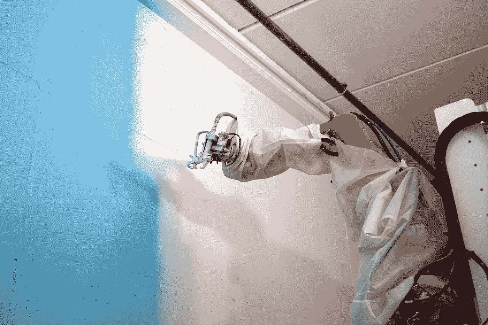

# 亚伯拉罕协议和以色列建筑机器人

> 原文：<https://medium.datadriveninvestor.com/the-abraham-accords-and-israeli-construction-robots-9bba23c4fcbb?source=collection_archive---------22----------------------->

今年较为积极的新闻事件之一是阿拉伯联合酋长国(阿联酋)、巴林和以色列之间的合作协议。在声明发布后的几个小时内，这些国家开始努力开放经济。整个中东地区都感受到了这种兴奋，用我们 Crowd 的 Jon Medved 的话说，“一旦沙幕开始落下，就没有人能阻止它。”声明发布几周后，Medved 的公司与迪拜的 Al Naboodah 商人家族达成了一项 1 亿美元的技术投资协议。

阿联酋最大的产业之一是建筑业。根据大多数报道，目前世界上近四分之一的起重机分布在迪拜各处的工作现场。这座沙漠大都市是世界上最高建筑的所在地，包括令人印象深刻的 160 层迪拜塔。中东首都的大多数建筑工人都是移民工人，他们是被巨额现金支出从自己的祖国吸引过来的。全球建筑行业多年来一直遭受劳动力短缺的困扰，疫情会议之前的报告估计，美国有近 50 万建筑工作岗位仍然空缺。更糟糕的是，工地非常危险，仅在迪拜，过去十年就有近 1000 人死于建造 148 座摩天大楼。这些因素使得房地产开发面临颠覆的时机已经成熟，最有前途的创新集中在用机器增加熟练劳动力上。

*迪拜塔:世界上最高的建筑*

上周，我与自主起重机技术初创公司锡拉丘兹的首席执行官诺姆·罗特姆讨论了以色列机器人专家的机遇。Rotem 根据新协议总结了以色列企业家的机会，“我认为阿联酋的巨大优势不仅仅是起重机的总数，而是密度和他们采用创新技术的普遍意愿。”他跟我分享了特拉维夫和迪拜的相似之处，街道上满是起重机，“以色列很小，大部分人口都集中在一个大都市。这使得建筑工地随处可见，摩天大楼林立，塔吊林立。”他继续说道，“通过观察塔式起重机，我发现它们的运行效率非常低——起重机的运动受到人类绘制复杂轨迹的限制。”这让他彻底反思了设备的运行方式，从根本上构建了一个“能够生成最佳负载轨迹的自主系统，大大减少了负载运输时间，并提高了起重机的效率。”

Rotem 热情地解释了“锡拉丘兹如何将现有的塔式起重机改造成巨型工业机器人。”为了完成这项任务，Syracuse 将其硬件系统直接安装在起重机上，“以持续监控起重机的位置、负载的位置和尺寸以及施工现场的所有障碍物。”然后，地面上的信号人员使用手持设备或 3D 模型将机器移动到精确的位置。“我们的系统实现了第三级自治，让人类操作员成为‘管理者’;以及可用于边缘情况的标准控制。在未来，锡拉丘兹将完全自主地操作起重机，”发明者打趣道。他的技术越来越受欢迎，“在过去的几个月里，我们已经在一个物流中心自动操作了一台商用 Potain 塔式起重机，同时还有人工操作的塔式起重机。这台起重机是由我们的投资者 Skyline 提供的，Skyline 是以色列最大的起重机租赁公司，拥有 200 多台塔式起重机。他进一步概述了其产品的扩展机会，“锡拉丘兹最初专注于塔式起重机和建筑行业，但是，核心技术适用于所有类型起重机的自主操作，未来将部署到移动式起重机、船岸集装箱起重机和工业龙门起重机。"目前，该团队正致力于在整个以色列扩展其商业部署计划. "到 2021 年底，我们将推出我们的第一个商业系统，为人工操作的塔式起重机提供先进的碰撞感知能力，通过提醒操作员即将出现的障碍，在需要时停止或转移起重机来提高安全性。2021 年期间的进一步升级将使我们能够在 2022 年底推出完全自主的 3 级解决方案，”创始人说。

 [## 伦理机器人是程序员天真的幻想？数据驱动的投资者

### 修辞和伦理之间的关系令人不安:语言被扭曲的容易程度令人担忧，而且…

www.datadriveninvestor.com](https://www.datadriveninvestor.com/2020/11/20/ethical-robots-are-a-naive-illusion-for-programmers/) 

将起重机连接到云上正在成为一项大生意。就在上周，另一家以色列初创公司多功能公司获得了 Insight Ventures 的 2000 万美元 A 轮融资。该公司使用计算机视觉提供工作现场和起重机操作的鸟瞰图，提高了安全性和效率。正如通用首席执行官梅拉夫·柳文欢所描述的，“你只能改进你能测量的东西，而在通用，我们只是触及了我们能为用户创造价值的表面，并利用数据将工作场所转变为具有快速反馈循环的受控制造。”她强调，新的资本将投资于增加其采用和人工智能用户界面套件。

为了验证 PropTech 更广泛的机会，我联系了以色列企业家 Guy German。与专注于垂直工作场所的 Rotem 不同，德国的初创公司 [Okibo](https://okibo.com/) 正在实现室内建筑的自动化。我问他对新协议的看法，他兴奋地回答，“阿联酋投资者了解机器人和自动化的价值，并获得了经验。”他进一步强调，近距离是这种关系的真正资产，“通常，以色列初创公司倾向于向欧洲和美国市场提供他们的发展。现在有一个新市场，距离以色列 3 小时路程，对建筑技术解决方案有巨大需求。此外，皇室家族拥有房地产资产，可以作为试点、测试案例和未来客户的基础。”一个德国人制造了他的机器人来建造游泳池，现在他可以用一个移动设备来接管室内空间，只需按一下按钮就可以进行录音、抹灰和绘画。“目前建筑工地上大约 50%的人工作业可以实现自动化(不考虑预制解决方案)。自动化提高了效率、安全性、工作质量、可见性、劳动力可用性、一致性和进度可预测性。建筑行业的工业化是不可避免的，”Okibo 的首席执行官表示。他进一步概述了他的解决方案的易用性，“我们的机器人是完全自主的(扫描/建模/路径规划/执行)——它不需要在机器人或抹灰/绘画方面进行大量培训或理解。操作员(可以是现场的任何人)基本上需要填充材料，确保电池充电，清除机器人路上的障碍物，并在一天结束时清洁无空气喷涂机。虽然可以改变机器人的计划，并将其作为‘半自主电动工具’进行控制，但在大多数情况下，这不是必需的。”German 的创新已经取得了长足的进步，“我们目前正作为一个完全交钥匙分包商与我们的机器人合作。该机器人正在完全自主地执行干墙饰面任务，据我们所知，我们是世界上唯一一家展示了可以完全自主、连续地粉刷整个房间(4 面墙)的机器人的公司(还有其他几个小组在从事这项工作)，没有人工干预，没有事先编程，也没有事先向机器人提供关于这项工作的数据。”他预测，在不到 24 个月的时间里，Okibo“将会有一种产品投放市场，这种产品将永远改变干墙饰面的表现方式。”

我让企业家们思考疫情将如何长期影响建筑业。Rotem 说，“新冠肺炎很像 2008 年的经济衰退，预计会看到许多年长的更有经验的工人退休，年轻的工人转移到其他行业。这一点以及大多数人不愿意在离地面 500 英尺的小驾驶室里呆上 12 个小时或更长时间的事实，意味着建筑行业正在寻找起重机操作员短缺的解决方案。”然而，他承认，“行业尚未准备好用完全自主的操作系统取代人类操作员，但公司正在寻找新技术来提高自动化和效率，并从人类操作员手中接过主动操作职责，最终演变为完全自主。”German 更为乐观:“建筑行业专业劳动力的日益短缺是引入智能自动化的主要驱动力……值得一提的是，我们不认为建筑行业的自动化会取代哪怕一个人的工作。这将有助于填补部分劳动力短缺，提高团队的效率，生产力和工作质量。这将有助于获得更多的项目，以满足他们的时间表，并增加整体市场容量。事实上，我们预计这场革命将为这个行业创造更多的就业机会，并帮助年轻一代进入这个领域。”

**进入专家视角—** [**订阅 DDI 英特尔**](https://datadriveninvestor.com/ddi-intel)