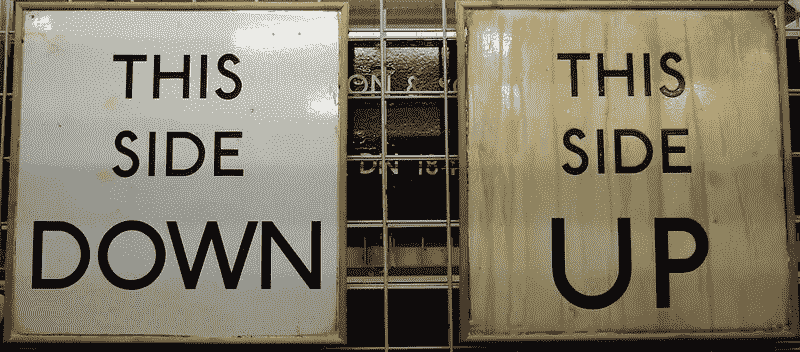

# 道指的荒谬

> 原文：<https://medium.datadriveninvestor.com/the-absurdity-of-the-dow-8e5fa5a9ddc7?source=collection_archive---------9----------------------->

面对新冠肺炎，股市的弹性显示出美联储真正的优先事项在哪里

Image courtesy of [James Cridland](https://www.flickr.com/photos/jamescridland/410034254) under CC 2.0

九个月前，当球落在时代广场时，如果卡森·戴利转向摄像机，预测来自中国肉类市场的 T2 冠状病毒将传播到全世界，关闭商业和学校，迫使数亿人在原地躲避，他会因为喝得太多而被解雇。即使是现在，我们仍会集体醒来，怀疑这是否只是一个噩梦，可以用前一天晚上的过度行为来解释。

过去半年的事件是深不可测的——时而灾难性的，时而荒谬的，我们已经习惯了这种方式:数百万工作岗位的流失导致了有史以来最高的 T4 失业率；今年关闭了学校和儿童保育中心；卫生纸的[囤积](https://marker.medium.com/what-everyones-getting-wrong-about-the-toilet-paper-shortage-c812e1358fe0)；一位美国总统[猜测注射漂白剂](https://www.bbc.com/news/world-us-canada-52407177)；以及那些戴着机枪但不戴面具的人对州首府的袭击。即使生活在一个越来越奇怪的十年里，每年都发现我们热切地期待着下一个，希望它会变得更好(见 2016、2017、2018、2019 等)。)只是持续的失望不能让我们为我们现在面临的情况做好准备。

我们现在的处境肯定有很多难以想象的地方。但坦率地说，新冠肺炎本身的可能性不在其中。很像 9/11 后被扣留的题为“基地组织决心在美国境内发动袭击”的备忘录，事实上，T2 已经为这样一个全球性的疫情准备了应急计划。代号为*的深红色传染病*川普政府进行的规划演习假设了一种高度传播的冠状病毒，其致死率足够严重，以至于极其危险，但不会高到在它能够站稳脚跟之前就耗尽自己的力量。

 [## 全民或跨州的国营保险私人医疗保险:经济学…

### 我们目前生活在一个所有非医疗行业都痴迷于…

www.datadriveninvestor.com](https://www.datadriveninvestor.com/2020/05/21/state-run-insurance-for-all-or-across-the-state-lines-private-healthcare-coverage-economics-politics-social-mix-up/) 

到 2020 年 1 月底，记者和公众对新冠肺炎成为全球疫情的潜力普遍感到担忧和猜测。我在一月下旬写了这篇文章。随着中国事态的发展，很明显，这种后来被称为新冠肺炎的病毒具有高度传染性，在当今相互关联的世界中，它在美国成为问题只是时间问题，而不是是否会成为问题。很明显，需要采购口罩和个人防护设备，而且测试和接触者追踪也是必要的。然而，特朗普政府浪费了几个月时间，除了希望问题会消失之外，几乎什么也没做。特朗普政府既有模拟的优势，又有充足的警告和反应时间，但它仍在行动，仿佛没有看到它的到来。人们广泛指责占星家和灵媒未能预测新冠肺炎，但整个政府和政策机构都这么做了。

更糟糕的是，从市场的反应来看，任何预测“盈利年”的预言家在选股方面可能都比你的经纪人强。还有谁会如此大胆地预见到[股市最终创下 20 年来最好的季度表现](https://www.google.com/amp/s/www.nytimes.com/2020/06/30/business/stock-market-earnings-coronavirus.amp.html)，尽管全球疫情和[失业率高达 14%](https://www.google.com/amp/s/www.pewresearch.org/fact-tank/2020/06/11/unemployment-rose-higher-in-three-months-of-covid-19-than-it-did-in-two-years-of-the-great-recession/%3famp=1) 。

这让我们想到了所有这些事情中最不可思议的一面——尽管发生了现代经济史上最大、最深刻、最突然的经济崩溃，但市场仍然屹立不倒。当然，紧随其后的是自由落体式下跌。人们恐慌地谈论着停止交易，不仅仅是一两天，而是永久暂停一段时间。然而，短短几个月内，它就反弹了，抹去了损失，并公布了收益，就像什么都没发生过一样。

很久以前就很清楚，市场与主街是分离的，但在这一点上，它们甚至不在同一个星球上。认为风险已经在市场中得到合理定价的狂妄自大令人吃惊。但美联储让股市继续上涨的力度也是如此，首先是在大萧条时期，现在是面对新冠肺炎。联邦政府不会插手保护口罩，也不会加强检测或实施限制来控制病毒。但正如我们一次又一次了解到的那样，美联储会尽可能多地印刷钞票，以保持股市的繁荣。对工人的刺激可能会达到 1200 澳元，但正如[许多人已经了解到的](https://medium.com/swlh/fire-millennials-get-wise-to-the-generational-ponzi-scheme-bea0e9743357)美联储支撑股市和膨胀资产的政策是长期的，因此要做出相应的调整。

这让我想起了一句古老的格言:没有人能赢过赌场，所以赌桌上的其他傻瓜。如果不清楚[谁是傻瓜](https://medium.com/concoda/this-is-what-happens-to-markets-when-you-print-trillions-of-dollars-615574dac796)，那可能就是你。

**访问专家视图—** [**订阅 DDI 英特尔**](https://datadriveninvestor.com/ddi-intel)