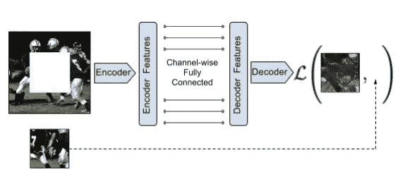

# 自我监督学习的优势

> 原文：<https://medium.datadriveninvestor.com/the-advantage-of-self-supervised-learning-bd6fddc8f345?source=collection_archive---------15----------------------->

**关于为什么自我监督学习会对 AI 产生强烈影响的几点个人想法。从最近的 NLP 到计算机视觉论文**

这不是一个预测，而是一个总结个人的研究和行业的发现和趋势。

首先，我们来讨论一下自监督学习和无监督学习的区别。这两者之间是否真的有区别仍然是一个公开的讨论。
**无监督学习**是在没有任何监督的情况下进行模型学习的想法。聚类算法通常是非监督学习的一个例子。对于聚类是如何形成的，没有任何监督或训练(至少对于简单的方法如 K-Means 来说没有)。
在**自监督学习**中，我们用数据本身作为标签。我们本质上通过利用一种叫做代理任务的东西，将无监督学习转变为有监督学习。代理任务不同于下游或模型任务，因为我们对代理本身不感兴趣。

在 **NLP** 中，Google[BERT，2019](https://arxiv.org/pdf/1810.04805.pdf) 等流行方法使用预训练程序，模型将根据当前句子预测一个句子或下一个句子中的缺失单词。我们可以通过简单地删除一个单词来创造一个缺少单词的句子。现在地面真相信息(我们的标签)是缺失的词。我们可以用自我监督的方式训练模型。

Image from the original BERT paper

在**计算机视觉**中，我们可以应用完全相同的技术来训练一个模型。我们取一张图片，去掉它的一部分(我们实际上是用一种颜色给它上色)。该模型的任务是预测丢失的像素(我们称之为图像修复)。由于我们可以访问原始图像和丢失的像素(地面真相),我们可以在监督下训练模型。论文[上下文编码器:通过修复进行特征学习，CVPR，2016](https://openaccess.thecvf.com/content_cvpr_2016/papers/Pathak_Context_Encoders_Feature_CVPR_2016_paper.pdf) 是这种使用修复的自我监督训练程序的一个例子。不幸的是，计算机视觉中的这种方法并不奏效。

From original paper Context Encoders. The illustration shows how the model has to reconstruct the white area in the image. To fulfill the task it needs to understand the context (needs to learn good representations).

较新的方法使用图像增强。单个图像将两次通过增强管道。我们最终得到原始图像的两个新版本(我们称之为视图)。如果我们对多个图像进行同样的处理，我们可以训练一个模型来找到属于同一原始图像(增强之前)的图像对。我们基本上了解到模型对于我们选择的任何增强都是不变的。

现在，让我们来看看自我监督学习可以给人工智能世界带来的优势。

# 终身学习

当我们谈论人工智能时，我们都会想到一些智能系统随着时间的推移不断学习并自我完善。不幸的是，这相当困难。监督学习系统需要新标签来训练新数据。改进系统需要不断的重新标记和重新培训。然而，通过自我监督，我们不再需要人为的标签。从[阿列克谢·埃夫罗斯实验室](http://people.eecs.berkeley.edu/~efros/)到这个方向已经有了一些伟大的工作，比如下面这篇使用自我监督学习来适应强化学习新环境的论文:[通过自我监督预测的好奇心驱动的探索，ICML，2017](https://arxiv.org/pdf/1705.05363.pdf)

# 数据标记

监督学习需要真实的数据。我们称之为标签或注释，在计算机视觉等领域，它们大多由人类生成。一个标签的价格从几美分到几美元不等。这完全取决于注释任务需要多少时间以及需要多少专业知识。尽管很多人可以在汽车和行人周围画一个边界框，但很少有人能在医学图像上做同样的事情。
自我监督学习有助于减少所需的标记量。一方面，我们可以在未标记的数据上预先训练模型，并在更小的标记集上对其进行微调。一个流行的例子是[视觉表征对比学习的简单框架，ICML 2020](https://arxiv.org/pdf/2002.05709.pdf) 。顺便说一句。这篇论文的最后一位作者不是别人，正是图灵奖得主杰弗里·辛顿(Geoffrey Hinton)。提高标注效率的另一种方法是，我们可以使用从自我监督模型中获得的特征来指导选择要标注的数据的过程。一种方法是简单地挑选不同且不相似的数据样本。我们在[轻松地做这件事](http://lightly.ai/)。

我希望你了解自我监督学习是如何工作的，以及为什么有一个很好的理由对此感到兴奋。如果你对计算机视觉中的自我监督学习感兴趣，别忘了在 GitHub 上查看我们的[开源 Python 框架用于自我监督学习。](https://github.com/lightly-ai/lightly)

Igor 联合创始人
[Lightly.ai](https://lightly.ai/)

你可能会对我的其他帖子感兴趣:

 [## 用 fast.ai 进行少拍学习

### 在少镜头学习中，我们只使用几个带标签的例子来训练模型。了解如何使用…训练您的分类器

towardsdatascience.com](https://towardsdatascience.com/few-shot-learning-with-fast-ai-81c66064e372)  [## 如何跟上 ML 的最新研究和趋势

### 对 ML 的大肆宣传导致该领域的研究和兴趣急剧增加。在这篇文章中，我分享了我的…

towardsdatascience.com](https://towardsdatascience.com/how-to-keep-up-with-the-latest-research-and-trends-in-ml-a45a356b1001)  [## 您不需要的数据:移除多余的样本

### 在 ML 中有这样一句话:垃圾进，垃圾出。但是数据好坏到底意味着什么呢？

towardsdatascience.com](https://towardsdatascience.com/the-data-you-don-t-need-removing-redundant-samples-6bfd07c1516c)