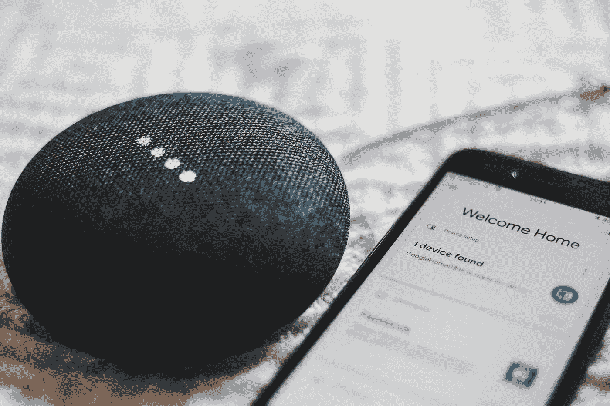
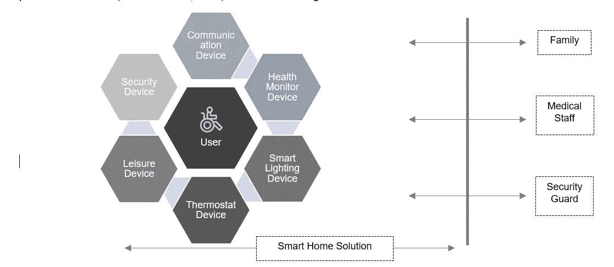
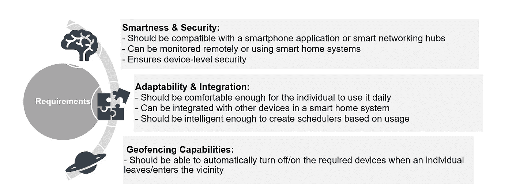
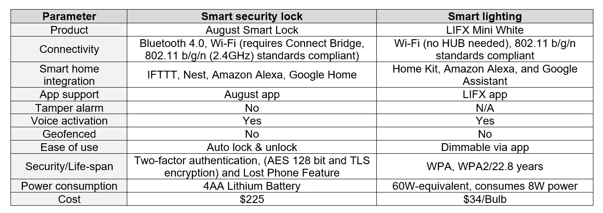
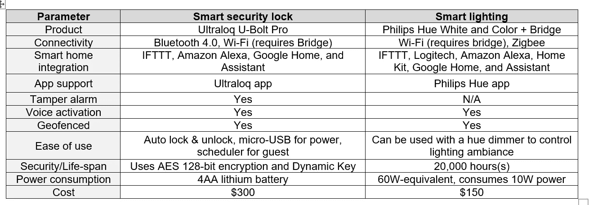
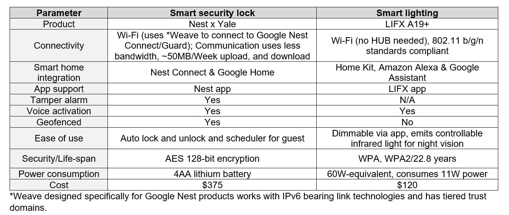
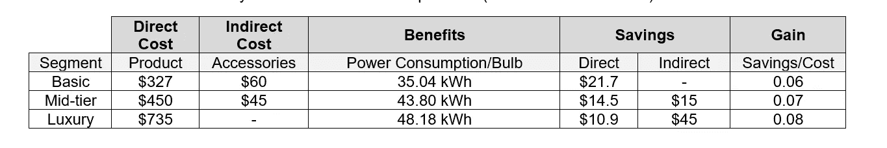
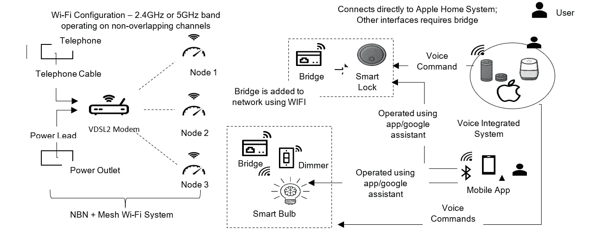

# 智能家居技术的出现

> 原文：<https://medium.datadriveninvestor.com/the-advent-of-smart-home-technology-56557b971851?source=collection_archive---------5----------------------->

## 具有语音激活安全和照明解决方案的智能家居如何改变残疾人的生活

Photo by [BENCE BOROS](https://unsplash.com/@benceboros?utm_source=medium&utm_medium=referral) on [Unsplash](https://unsplash.com?utm_source=medium&utm_medium=referral)

# 行动纲要

智能家居是技术领域的一项进步，它允许老年人和残疾人开始独立生活。功能的多样性和易用性增加了对这些智能设备的需求。市场受到各种品牌的多种智能家居设备的影响，这些设备可以嵌入到家庭环境中。智能技术市场中新产品的饱和导致了用户和构建者的困惑、冲突和担忧。该报告分析了智能家居的关键要素，以及市场上流行的智能照明和门锁解决方案，它们的特点和弱点，它们的投资回报，以及如何集成这些技术的建议解决方案。

# 介绍

澳大利亚有 450 万残疾人，占总人口的 18%。目前的残疾流行指数为 32%,三分之一的残疾人有严重或严重的症状。智能家居技术的出现正在改变行动、视觉和空间意识受限的人们的生活方式。智能住宅包括用户可以使用平板电脑、电话、语音命令甚至手势来控制和操作的技术、设备和自动功能(Stefanov、Bein 和 Bang，2004 年)。

 [## 新的健康技术如何让我们活过 100 岁？数据驱动的投资者

### 不久前，我们都在看一台黑色电视，不得不带着天线跑遍整个公寓，以确保…

www.datadriveninvestor.com](https://www.datadriveninvestor.com/2020/08/12/how-new-health-technology-makes-us-live-past-100-years/) 

市场目前充斥着新产品，导致技术冲突、品牌混乱和建筑商的担忧。本报告的目的是深入探讨智能家居领域的一些当前技术创新，同时考察它们在满足各种需求和生活方式方面的适应性、使用、可负担性和脆弱性。该报告旨在涵盖四个组成部分。

1.智能家居的关键杠杆

2.智能家居技术比较

3.建议解决方案的成本效益分析

4.建议

# 智能家居的关键杠杆

设计智能家居的关键在于它能够满足不同残障人士的需求。对行动受限者的要求不同于听力或空间意识受限者。如下图 1 所示，有必要提出一种设计，提供一些关键杠杆的 360 度图像，以满足所有可能的残疾(Stefanov 等人，2004 年)。

Figure 1\. Key levers of a smart home solution for people with disabilities. These devices are connected to a home network which in return can be monitored by the family, medical staff, and security guard of the individual. Developed by the author using PowerPoint.

# 智能技术的关键要求

所有智能设备都应符合行业标准，并迎合个人需求，以改善用户体验和易用性。下图 2 说明了任何智能技术的一些关键要求(Meensika，Xuanxia，Ponchan & Mahasak，2012)。

Figure 2\. Key specifications of a smart home device. These are some of the basic parameters across which the performance and adaptability of a smart home device can be assessed. Developed by the author using PowerPoint.

# 智能家居技术比较

在决定可以安装并与现有家庭网络集成的设备类别之前，必须评估各种智能家居产品的优势和弱点。由于不同的客户有不同的财务限制和奢侈品需求，同样的成本、可负担性和收益也必须考虑在内(Null，2020)。下面的表 1、表 2 和表 3 考察了智能安全锁(Delaney，2020 年)和智能照明(Colon & Torres，2020 年)的推荐解决方案的一些关键参数，涵盖了不同的需求和生活方式类别。

Table 1\. Recommended products for basic category lifestyle (August Home, 2020), (Null, 2020)

Table 2\. Recommended products for mid-tier category lifestyle (u-tech, 2020), (Null, 2020), (Colon & Torres, 2020)

Table 3\. Recommended products for Luxury Category (Null, 2020), (Delaney, 2020), (Colon & Torres, 2020), (Google, 2020), (LIFX, (n.d.))

# 成本和收益分析

成本/收益分析持续一年。对于智能安全，成本包括产品成本和配件成本，如 Wi-Fi 网桥。智能照明考虑了设备成本，即设备每天工作 12 小时的功耗成本。大多数智能灯在待机时的功耗低于 0.5W，其成本未在下表 4 中考虑。Wi-Fi 和智能家居套件的成本对于所有三个细分市场都是相似的，因为所有设备都具有相似的兼容性，因此在下面的成本效益计算中没有考虑。

*   直接成本=智能锁的成本+(灯泡的成本 x 3)，飞利浦 Hue White 每包 3 个，因此基本款和豪华款的正常成本为 3
*   间接成本包括电桥或调光器的成本
*   澳大利亚维多利亚州的电力零售成本(RC)——27.56 c/kWh
*   功耗/灯泡=(功耗/1000) x 12 小时/天 x 365 天
*   标准 CFL 灯泡一年耗电 61.32 千瓦时(以 14W 为标准)(说 STdP)
*   节约量= (STdP —功耗/灯泡)* RC * 3 个灯泡+最小值(间接成本节约)

Table 4\. Cost and Benefit analysis of the recommended products (all dollar values in AUD)

与新建的有线解决方案相比，再开发的成本优势高达 70%(行业标准)，可额外节省 15%的成本。一个人在细分市场中的位置越高，公用事业节省就越多。

# 建议

## Wi-Fi 和网络设置

表 1、表 2 和表 3 中推荐的智能家居技术需要本地 Wi-Fi 网络和强大的信号强度，才能与其他智能设备保持互联。由于地板、门和墙壁等物理障碍物、建筑物的长度以及来自其他设备的干扰，信号减弱和 Wi-Fi 盲点是路由器的主要问题。范围扩展器在增加覆盖范围方面是有效的，但是会影响网络的性能。建议使用由调制解调器、主路由器和一系列共享相同 SSID 和密码的节点或卫星模块组成的网状 Wi-Fi，以确保全面的 Wi-Fi 覆盖。建议使用 NBN FTTP(光纤到户),它可以提供 2 级或 4 级流量速度(TC2 100/100 或 TC4 1000/400 ),并且可以在 NBN 边缘设备上包括备用电池。集成智能家居系统的设计如下图 3 所示。

Figure 3\. Conceptual diagram of how different smart devices can be integrated. The use of a bridge or dimmer is optional and depends on the product preferred by the user. Developed by the author using Power Point.

# 用户采用

声控系统与地理围栏功能相结合，减少了最终用户的人工劳动，为采用提供了足够的带宽。如今，大多数用户都是技术和基于应用的界面的被动者或推动者，再加上智能地理围栏、时间表创建和技术适应用户需求的能力，提高了效率。

# 结论

智能家居技术是具有强大社会经济动机的重要发展目标。该报告详细说明了智能设备的主要功能、特性和要求。我们试图制定和设计最佳的技术和网络来集成多种设备，同时考虑可用性和经济性。智能家居技术的内容分析表明了采用智能家居技术的潜在好处，以及智能家居技术如何与提高残疾人的生活质量紧密相关。

# 参考

1.科隆和托雷斯(2020 年)。2020 年最佳智能灯泡。检索自
[https://au . pcmag . com/lighting/30286/the-best-smart-light-bulbes](https://au.pcmag.com/lighting/30286/the-best-smart-light-bulbs)

2.德莱尼，J. R. (2020)。2020 年最佳智能锁。从[http://au.pcmag.com/smart-locks/44061/the-best-smart-locks](http://au.pcmag.com/smart-locks/44061/the-best-smart-locks)取回

3.空，C. (2020)。联网家庭的最佳智能灯泡。检索自[https://www . tech hive . com/article/3129887/best-smart-bullets . html](https://www.techhive.com/article/3129887/best-smart-bulbs.html)

4.空，C. (2020)。无钥匙家居的最佳智能锁。检索自[https://www . tech hive . com/article/3212828/best-smart-lock . html](https://www.techhive.com/article/3212828/best-smart-lock.html)

5.Stefanov，D. H .，Bein，z .，& Bang，W.-C. (2004 年)。*老年人和残疾人的智能住宅:结构、技术安排和前景*。神经系统和康复工程汇刊，12(2)，228–250。

6.Meensika，s .，Xuanxia，l .，Ponchan，p .，和 Mahasak，K. (2012 年)。*智能家居技术的研究与思考*。系统和电子工程国际会议(ICSEE'2012)，61–63

7.谷歌。(2020).购买前了解一下 Nest ×耶鲁锁。从 https://support.google.com/googlenest/answer/9251009?hl=en[取回](https://support.google.com/googlenest/answer/9251009?hl=en)

8.优科。(2020).U-Bolt Pro:终极 6 合 1 智能插销。检索自[https://store . u-tec . com/pages/ultraloq-u-bolt-pro-bluetooth-enabled-fingerprint-and-keypad-smart-dead bolt](https://store.u-tec.com/pages/ultraloq-u-bolt-pro-bluetooth-enabled-fingerprint-and-keypad-smart-deadbolt)

9.LIFX。(未注明)。LIFX A19+。检索自[https://www . lifx . com/collections/lamps-and-pendants/products/lifx-plus](https://www.lifx.com/collections/lamps-and-pendants/products/lifx-plus)

10.奥古斯特家。(2020).智能锁+连接。从 https://august.com/products/august-smart-lock-connect[取回](https://august.com/products/august-smart-lock-connect)

*关于作者:高级分析专家和管理顾问，帮助公司通过对组织数据的商业、技术和数学的组合找到各种问题的解决方案。一个数据科学爱好者，在这里分享、学习、贡献；你可以和我在* [*上联系*](https://www.linkedin.com/in/angel-das-9532bb12a/) *和* [*上推特*](https://twitter.com/dasangel07_andy)*；*

**访问专家视图—** [**订阅 DDI 英特尔**](https://datadriveninvestor.com/ddi-intel)