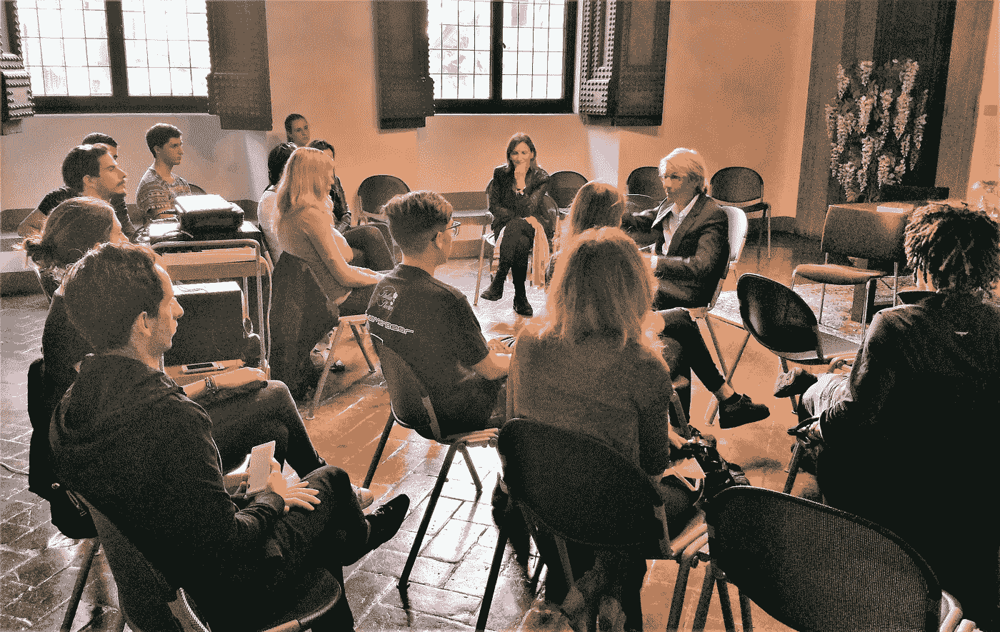

# 幻想资本主义的出现

> 原文：<https://medium.datadriveninvestor.com/the-advent-of-visionary-capitalism-1abefa4fd7e0?source=collection_archive---------9----------------------->

Image captured by the author

# 意识形态的变化

人类历史上的每一个划时代的段落总是以推翻意识形态、心理革命为先导，这种心理革命通过个人传播到大众。日心说推翻了中世纪思想的基石，将人类从宇宙的中心转移到边缘，开启了现代；新教从根本上改变了对工作的看法，从圣经的谴责变成了人类进化的工具，为工业革命和有远见的资本主义的到来创造了条件。

# 存在的世界

今天，我们正面临一场新的革命。这是一场心理学革命，基于这样一种观点，即存在和拥有并不是对立的维度和极性，而是同一现实的两个方面。我们看到和触摸到的一切，我们感知到的一切，金融的摩天大楼，工业的金字塔，科学技术的发现和成就，我们称之为“现实”的一切，只不过是我们感官看不见的世界的投影，一个与我们存在的平面垂直的思想和价值的世界:存在的世界。

# 半个世纪的失败

存在是拥有的原因。这解释了为什么自然资源最丰富的国家往往也是最贫穷的国家，以及为什么一个人的富裕并不是使他摆脱命运的充分条件，如果这不符合他的视野的扩大。事实上，有可能认识到一种体内平衡机制的存在，这种机制不可避免地把拥有带回到存在的层次。一个毫无准备的人，即使暂时受到某一事件或外部环境的青睐，如果他的拥有超过了他的存在水平，他就会被抛回到古老的贫困之中。国家也是如此。经过半个多世纪对第三世界国家不成功的国际援助计划，即使是发展经济学家现在也应该明白了:如果一个国家的思想遗产(伦理、美学、宗教、哲学、科学)和价值体系还没有达到足够的富裕程度，那么从外部帮助它是不可能的。这些国家中的许多只需要重新连接到他们古老的智慧，他们起源的本质，并将 sap 带回最古老的价值体系，以实现他们生活条件的繁荣水平。

# 愈合是由内而外进行的

对“拥有就是存在”的理解根除了人类最古老的偏见之一，彻底改变了人类的概念模式。不是拥有让一个人去做和存在，而是存在让一个人去做然后拥有。克服这种形式的集体催眠意味着离开一个平面的世界，进入一个垂直的思想:现实有多层，存在有无限的层次。“拥有就是存在”是理解最复杂和最重要的问题的关键，这些问题涉及人类和组织系统的生活，各种秩序和复杂性，并解释了它们命运的多样性。如果到目前为止，我们整个文明的主导思想和流行观念一直是:为了能够做事而拥有，那么是时候推翻它了。一个人，一个国家，一个文明，有能力去做和拥有他们只能“梦想”的，包含在他们视野范围内的东西；他们历史上的事件和环境以及他们所遇到的一切，无论是好是坏，都与他们的生活水平、思想广度和价值观深度完全相符。在自然界中，就像在经济学中一样，所有的治疗都是从内在到外在，从无形到有形，从存在到拥有。

欧洲经济学院的格言中蕴含着最伟大的经济真理:Visibilia ex Invisibilibus。有形的物质财富只是一个人、一个公司、一个国家内在繁荣的反映。财富和贫穷都是无形的物质表现:存在。这是一个从内到外的过程。“可见的东西是不可见的东西的投影，它依赖于不可见的东西，就像影子在大小和形状上依赖于投影它的物体一样。

我们所能看到、感觉到、触摸到和听到的一切，物理对象和存在的全部事务，尽管形式多样，却只是一个对我们的感官不可见的世界的投影，与它垂直。

即使在一个人身上，他所能建造的一切都源于他的无形，源于他的“梦想”，并在他的生活质量和接触他的事件的性质中表现出来。

一个人可以意外地建立一个王国，他可以积累金钱、财产和城堡，但他的“梦想”中最轻微的裂缝都会导致他失败。

# 拥有就是存在

拥有和存在是同一个现实，但在不同的存在层面上。就像同一根棍子的两端。拥有就是存在。拥有是在时间和空间中显现的存在。存在是升华了的，可见的东西被超越并带到了更高的层次。这一发现开启了对世界普通认知的巨大革命之门，是能够改变整个文明进程的思想冲击之一。

# 什么是存在？

我们很少意识到我们被无形所包围，我们生活在一个由无形产生的世界里；一个人身上所有重要和真实的东西都是看不见的。

我们所有的想法、感觉、幻想、想象、梦想都是看不见的。我们的希望、抱负、秘密、恐惧、怀疑、困惑、不确定性，以及我们所有的感觉、吸引力、欲望、厌恶、爱和恨，都属于无形的存在世界。

# 科学与意识

每一次有形的征服，每一次人类行动和拥有能力的提高，总是被一次对存在的征服所预见。科学知识和技术进步与人类对自身的认识和所达到的认识水平是密切相关的。科学和意识是齐头并进的。在我们的文明史上，科学进步和处理能源和资源的能力似乎受到同一法则的制约，这一法则在自然界中只给予每个物种它能够控制的武器和力量。同样是这条法则，把致命的颚和爪分配给拥有最好神经系统的动物，而把越来越弱的武器分配给那些在进化上更早控制自己物种内外攻击性的动物。无论是个人、组织、国家还是整个文明，知道、做和拥有的能力取决于该文明、该国家、该组织、该个人所达到的水平。

# "知道、做和拥有依赖于存在."

越是这样，知道的越多；做的越多，拥有的就越多。

观察一个人或一个组织，每个人都能感觉到拥有的维度，很少，做起来更困难。大多数人仍然看不到存在的维度:思想、价值观和“梦想”的深度和广度。事实上，能源、资源和商品的拥有、可获得性和所有权只是一种效果，是能力的投射，是能力的功能。反过来，做和拥有取决于存在，正如影子的大小和形状取决于投射它的物体。

# 时间因素

使我们看不到存在与拥有之间的完美平衡的是时间因素，时间因素就像一个烟幕，把存在与拥有虚幻地分开了。奇妙的是，如果我们能够压缩时间，一个人一生的时间或者一个文明的世纪，我们将会看到存在和拥有之间的完美对应。它们在不同的存在层次上是相同的、完全相同的现实。升华的拥有成为存在，物化的存在本质化成为拥有。

发现拥有和存在之间的同一性也深刻地标志着经济思想，因为如果拥有，因此也是财富的生产，是存在的投影，在人和组织中是无形的，它将有权成为科学研究的合法主题，甚至在经济学领域。连同伦理、信仰体系、道德价值体系，以及最重要的“梦想”。多年来，欧洲经济学院一直在开展一项“颠覆”人类普通视野的工作，这是一场思想革命，承认个人在其梦想中是所有财富的原因，是所有真正变化的起源。

为了挖掘我们面临的问题的真正原因，我们不得不放弃已经标出的轨迹，放弃传统经济理论的意识形态狭隘性，这已被证明是不令人满意的，并敢于制定和验证新的、更广泛和更大胆的假设。

# 迷信的信仰

旧人类最有害、最根深蒂固的习惯之一就是总是谈论进步。共同语言充满了像进化和进步这样的词汇；但是一切都保持原样。几千年来什么都没发生。地球上的问题，从贫穷到犯罪，到冲突和战争，在石器时代和数字时代都是一样的。“改进”是那些想让一切保持原样的人的口号；那些沉溺于过时的思维方式，缺乏活力的人。相信世界可以被改善是人类的迷信信仰，他们没有能力处理其邪恶的根源。需要一场思想革命。逆转。只有个人能做到。

# 经济是由热爱的人创造的。

只要人类仍处于冲突之中，仍被恐惧和焦虑所折磨，贫困就是经济。犯罪是经济。任何发现消除贫困、犯罪和疾病的解药的人都会被挫败，甚至被消灭。地球上的疾病，千百年来:地球上无尽地区的地方性贫困、冲突、犯罪，只要人类的理性保持武装，只要贫穷和财富等对立继续斗争，就将持续和加剧，不是在世界上，而是在每个人的意识中，以及:恶与善、苦与乐、恐惧和爱。

# 需要新的大学

需要特殊学校和新大学。他们的第一个教导必须是存在的革命，在他们每一个兴趣的中心，在他们每一个优先事项的顶端必须是个人。个体的存在就是种子。我们必须从内部开始。像任何治疗一样，我们必须从里到外，一个细胞一个细胞，一个个体一个个体地进行。这是一个由内向外的过程。

历史上每一次革命都失败了，无论是政治还是经济革命。解决人类古老问题的真正变革只能是思想革命的产物。我们必须换一种方式思考。

那些犯罪的人，那些贫困的人，对世界的描述是颠倒的。他相信外面的世界可以让他富有或快乐；它能提升他或者让他安全。但是这个世界，连同它所有的事件，以及存在的全部事务，只不过是存在所投下的效果、结果和阴影。世界是我们思维方式的投影，经济是我们价值观和理念的反映。谁不充实自己，任何好处、任何财富都会失去。

# 个人是唯一的现实。

只有个人才能改造社会，改善社会。革命是个人的，是个人必须理解、协调、平衡他的存在。

ESE 是一所宣布了“个人革命”的大学，它将个人、个人的智力和人类的准备置于一切活动的中心和一切优先事项的首位。ESE 是一个存在的学派，宣告了幻想资本主义的来临。它的使命是培养一种领导能力，这种领导能力消除了自私、冲突、匮乏和对偏见的无知，因此能够吸引和创造财富；实现一个利他的，稳定的，幸福的社会。

大众是一个幽灵，一个受任何事物影响的机制。它没有信仰，没有自己的意志，它不能创造，它不能爱……事实上，它从未创造过任何东西。个人是唯一的现实。它是地球上的盐。

在不久的将来，也就是今天，每个人都希望自己的独特性得到认可，希望自己作为个人的尊严得到认可。

# 教育。前杜科

人类已经准备好了。每个人都有智慧和爱。我在每个学生身上都看到了。我的经验是，我们不需要给学生增加什么，而是要让他们带着他们的原创之美，他们与生俱来的创造力走出来。对于这一点，不需要外在的教导，只需要剥去多年来沉淀下来的层层外衣:拙劣的描述，对世界相互冲突的愿景；负面情绪，破坏性的想法，错误的想法仍然控制着人类。

# 教育的根本是培养。前杜科。

大众大学做不到。它无法触及个人。传统的大学体系不仅过时，而且极其脆弱。所以 ESE 不能接受传统的权威，不能坚持任何一种先存的教育观念。

# 未来的大学

大学面临的挑战，就像萨拉米斯之战，将会被小型舰队所应对。

ESE 创建了一个“分布式”大学，一个单一的大型大学，由学院和校园组成，每个学院和校园每年最多接收 100 名新生。正如希腊城市在演说家的声音所能到达的范围内竖起了城墙，并被包含在这种交流的半径之内，未来的大学也必须有立体的城墙，让他们能够联系所有的学生，了解他们的愿望，他们的“梦想”，展示他们的美丽和独特。未来的大学的任务将是以一种世俗的方式继续犹太教堂、修道院和道场几千年来一直在进行而未完成的工作，成为不负责任者的容器，成为害怕生存的男男女女的避难所。

许多大学将会消失，只有少数几所将被委以培养新领导人的重任:有远见的领导人、务实的梦想家、无懈可击的战士，他们能够通过存在的品质和新感觉的发展来克服我们文明所面临的挑战:直觉、远见和“梦想”。

# 快乐就是经济。

一个具有明显矛盾品质的“平衡”人的教育项目已经有几千年的历史了。一个将精明和天真、理性和直觉、经济实力和爱情融为一体的人。从外部强加的、对每个人都一样的书本知识是对本质的窒息……它是虚假的、虚幻的……真正的知识已经存在于每个人的心中。我们只需要“记住”，在垂直记忆中往回走一趟。解剖梦想，做自己热爱的事。

幸福是经济学。只有快乐的人才能创造一个稳定繁荣的社会。