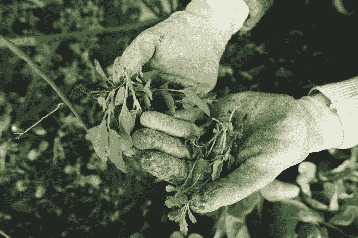
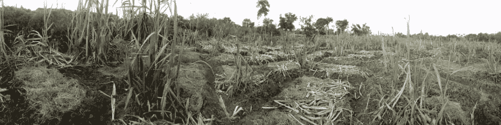

# 第一次农业企业企业家的冒险

> 原文：<https://medium.datadriveninvestor.com/the-adventures-of-a-first-time-agri-business-entrepreneur-a2b5d50107b8?source=collection_archive---------12----------------------->

在过去 11 年左右的时间里，我一直是马拉维的一名科技企业家，现在依然如此。如前一篇文章所述，今年 7 月 1 日，我大胆尝试以副业身份涉足农业综合企业。通过研究和其他人的经验，这似乎是一个赚钱的机会。老实说，让我感到震惊的是，我不得不在 K150 买 1 个西红柿，而当时他们的供应量创下了历史新低。通常，我们花 50 英镑买它们，每个番茄 150 英镑简直是疯了！我在脑子里看到了 kwacha 的标志，所以我去了。我不知道会发生什么。以下是我的一些经历和从中得到的教训。

**研究:**

开始之前，做你的研究。我花了一些时间去了解我想种植的植物。在 7 月之前，我花了一些时间来确定符合我的需求和预算的土地。我知道我不愿意支付什么，并试图保持忠实。最终，当我找到它时，我稍微超出了预算，但事后看来，它实际上是一个非常好的价格。我认为四分之一或半英亩的土地无法给我带来我想要的利润。我也知道，土地越大，我需要准备的农业投入就越多。出于这个原因，经过多次计算和重新计算，我决定，从支付能力的角度来看，1 英亩是我的最佳选择。我还参观了市中心的超市。特别是 Shoprite 和 Chipiku，并询问他们是否愿意购买我未来的产品，他们的价格和其他细节。我惊讶地发现，找到这样的买家是多么容易(仍然是理论上的)。基于上述所有因素，包括生长过程的持续时间、叶菜的叶子数量和番茄植株的果实数量，我最终选择了以下作物进行种植:番茄、油菜籽、芥菜、生菜、西兰花、花椰菜、南瓜、玉米和卷心菜。所有这些都是经过战略选择的，在 30 天内提供利润，番茄是最后一个生产的(也是最能提供利润的——还是在理论上)。

***第一课:利润的多少，取决于作物的种类和你需要种植的作物数量，为了获得利润的多少，你必须决定租或买多大的土地。如果你以前从来没有这样做过，和曾经做过的人谈谈，他们可以告诉你作物间距，每株作物的水果、蔬菜数量，销售价格和所需的投入。***

**准备:**

在着手研究的同时，我进行了计算和研究。最初，我想种植西红柿。一个植物苗圃的主人是我的顾问，现在是农场的主管，他帮我做预算所需的项目、植物生长周期的信息、杀虫剂、肥料等(我也读过这些内容)。

第二课:过度准备比准备不足要聪明得多。不要偷懒。做工作。找一个有经验的人来指导你的决定，但是记住，到最后，责任还是在你身上。承担责任。

**土地:**

我选择的土地富饶肥沃。它的深色让你觉得里面一定已经有很多营养了。它沿着一条小溪，因此有现成的水源。这是我做对的事情之一(前面有很多错误)。

第三课:找一块足够大的土地，有健康的土壤，容易获得水源。

**土地所有者:**

对我来说，在我居住的社区附近的某个地方耕种是有意义的，尽管我的小块土地离我的住处不到一个小时的路程。对我来说，在步行距离内找到农田是有意义的，这样我就可以密切关注正在发生的事情。幸运的是，我住在利隆圭的一个地区，那里土壤肥沃，溪流几乎终年流淌，保证了稳定的供水，肥沃的土壤有望让植物快乐地生长。几年前，我也经历过与另一个农场所有者的一些负面接触，我确保我有一份关于我将租赁的土地的期限和面积的合同。地主曾经说过，如果我觉得这块地太小，不适合我种什么，那么我可以向他租更多的地。他还告诉我，有人租了一小部分我从他那里租的一英亩地。我接受了这一点，并承认这不是一个问题。我不明白的是，土地所有者提供给另一个租户的空间比他出租的要大。后来我们才知道它到底有多大。此外，他还对我的农场主管撒谎说他跟我谈过这件事。因为我不知道这些人能做什么，我决定把它算作我的损失，让它过去，我的农场主管保证剩余的土地将是足够的。

***第四课。和我一样，有详细的合同。如果可以的话，确保你走过了你想租的土地的整个边界，这样就没有含糊不清的余地了。如果可能的话，在合同中加入一个你们双方都同意的网站地图。此外，确保在签署协议的当天有证人在场。我认为，尤其是像我这样来自非正式背景的企业家，我们倾向于达成“君子协定”。没有实际文件，而只是建立在信任基础上的协议。我强烈地感觉到没有几个绅士/女士留在那里。所以，为了保护你的利益，掩盖你的底线:在网上找到一个免费的模板，根据你的需要修改它(也许用当地语言写，以确保你们都能理解)，并让他们在证人面前签字。无论你做什么:确保你消除了任何关于土地、租赁期限和相关事宜的模糊之处。***

**非熟练劳动力:**

迄今为止，对我来说，这一农业企业风险投资中最艰难的部分是找到并留住可靠、勤奋的非熟练劳动力。作为一名马拉维人，我碰巧知道马拉维的失业问题是一个巨大的问题，但对我来说，我似乎陷入了失业的子部分，这是有充分理由的。我知道的一个事实是，在马拉维有许多勤劳的男人和女人，他们根本无法抓住工作机会，如果这种工作在他们想要的工资范围内，他们会很乐意接受。然而，自 7 月 1 日以来，我接连犯了两个招聘错误。第一个人从 7 月 1 日一直工作到 7 月 12 日。在这段时间里，我希望这种经历永远不要重复。第一天，出于善意，我给了他一笔预付款(大约是他每月收入的 29%)。他是因为在工作日“饥饿”才要求的。作为一个人，我的同情心迫使我去做。第二天他没有去上班。第三天，他带着歉意出现了。他说，听听这个:有一场葬礼，他和妻子发生了争执。除了我的怀疑，我决定让他继续警告和理解，如果有任何事情(如葬礼等)，他需要给我们(我或农场主管)一个消息，这样我们就可以为当天的工作做出替代安排。这次谈话之后，在接下来的三四天里(大约第 5 到第 8 天)，他一直要求再次预支薪水。他说他需要钱付房租。作为一个太软弱的人，我可以感同身受。然而，看着农场的工作，我对进展并不满意。我们离主管帮助我制定计划的时间表还差得很远。我还了解到，有时他会在中午左右离开农场，第二天才回来。这位主管还抱怨说，他觉得这个人没有给予他足够的尊重。在奇切瓦语中，那是“kudelela”。我的指示和主管的指示也有冲突。例如，最初，我会声明我希望我的农场材料在工作日每天晚上归还，每天早上取走。我知道这不是最有效的安排。然而，我觉得这可以确保在早期不会丢失任何东西。我告诉自己，当我们看到工人是可以信任的，那么他们就可以留住他们自己。在我解雇这个人的那天，我去检查农场的进展，发现还有很多工作要做。我告诉他这件事，他开始说我忘恩负义，不知感激等等。这句话出自一个在第一天就收到 29%预付款的人之口，他之前从未见过面。简而言之，他被解雇了，然后来了第二个工人，他在没有通知的情况下连续消失了 8 天。他没有费心联系我或他的主管，报告他的缺席。他又开始出现在赛场上了。我和主管早上 10 点在地里发现他的那天，他正在一棵番石榴树下休息，没有给任何作物浇水。那天我解雇了他，并向他支付了他应得的报酬，因为老实说，我不能和那样的人打交道。

 [## 天才企业家有他们超能力的智力来源？数据驱动的投资者

### 看起来确实如此，所以让这些资源为你服务吧...都是成功的企业家——想想谢尔盖·布林和…

www.datadriveninvestor.com](https://www.datadriveninvestor.com/2020/04/08/genius-entrepreneurs-had-their-super-power-sources-of-intelligence/) 

我要补充的是，事后看来，我忽略了他们(都是前雇员)似乎有物质问题(严重酗酒)等。潜意识里，我想相信这并不重要。我知道有些人不管他们在做什么，都能保持高效。现在，我相信这是一个我不应该忽视的信号。

第五课:向尽可能多的你要雇佣的人展示。找到足够多的潜在员工进行面试。第一天，清楚地解释所有的规章制度。我总是关注他们的日常职责。我没有花足够的时间向他们解释我认为是显而易见的一般礼节。现在，我知道解释什么会让他们被解雇，即使对我来说很明显。

然而，我还没有学到的一课是如何区分潜在的好员工和不好的员工。此外，我意识到我有一个理想化的人的问题。当现实来临时，这就成了一个问题。这是我需要努力的地方。有什么评论或者经验想分享？欢迎在下方留言评论。

*想了解更多关于麦克莱恩·姆伯普拉的信息吗？在 Linkedin 或 Medium 上找到她。她的* [*写了 3 本书(一本从草根的角度看创业(《接受挑战》)和两本诗集，在亚马逊*](https://www.amazon.com/author/macleanmbepula) *上可以买到。请随意支持她的工作，成为她在 Patreon* *的顾客之一。*

**访问专家视图—** [**订阅 DDI 英特尔**](https://datadriveninvestor.com/ddi-intel)