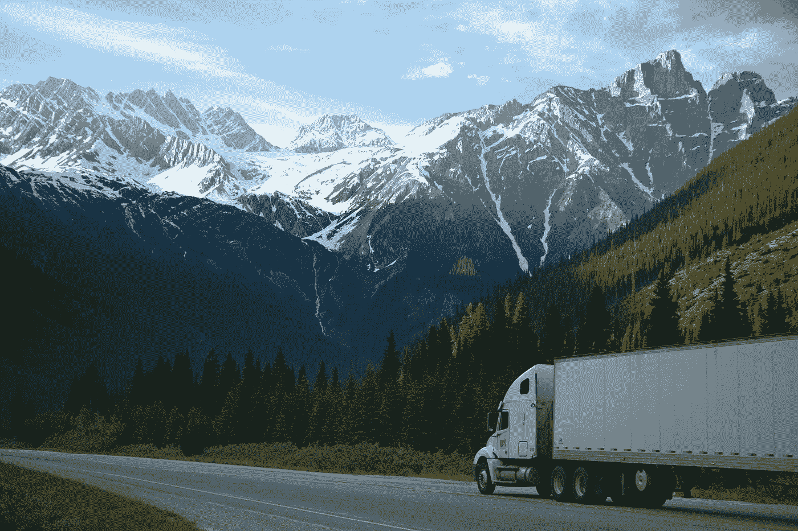

# 人工智能革命将比你想象的更快地开始夺走工作。

> 原文：<https://medium.datadriveninvestor.com/the-ai-revolution-is-going-to-start-taking-jobs-faster-than-you-think-d180e4d884f1?source=collection_archive---------6----------------------->

## 硅谷特别关注一个行业。

在过去的十年里，人工智能算法已经开始进入我们的生活。这些发展大多不太引人注目。Instagram 提供与你最近看过的东西相关的广告；亚马逊根据之前的购买情况推荐产品；YouTube 不断提供你感兴趣的视频。它还提供了一些小的便利，比如 Siri 和 Alexa 可以跟随简单的语音命令。在幕后，人工智能使优步和 Lyft 等公司能够高效和有效地部署新服务。

尽管有人声称人工智能将夺走我们所有的工作，但这些变化都没有特别具有破坏性。但这一切都将改变。人工技术的发展速度正在急剧加快，每三个月可能性的范围就在扩大。

 [## 未来会比过去发生得更快。

### 摩尔定律刚刚服用了类固醇。

medium.com](https://medium.com/@mattboutte/the-future-is-going-to-happen-a-lot-faster-than-the-past-did-8bc7295f63ef) 

因此，我们离具有不可思议的破坏性的人工智能发展已经不远了。可想而知，未来几年内，仅一个行业就有几十万，甚至几百万人会因为 AI 而失业。这一发展本身显然会对那些失去工作的人产生重大影响，但其后果也会在美国和世界其他地方的整个社会产生反响。

卡车运输在美国是一个庞大的行业。这是 29 个州最常见的就业形式。从某些方面来看，它是美国最大的就业形式，[雇佣了超过 350 万美国人](https://www.census.gov/library/stories/2019/06/america-keeps-on-trucking.html)——[近 6%的劳动力](https://markets.businessinsider.com/news/stocks/trucking-industry-facts-us-truckers-2019-5-1028248577#)。它支付的工资高于蓝领工人的平均工资，雇佣的大学学历以上的人比其他任何工作都多。

如果你在读这篇文章，很有可能你一个卡车司机都不认识。因此，你可能会怀疑这样一个事实，即更多的美国人受雇为卡车司机，而不是其他任何工作。但是想想你现在拥有的或者身边的每一件物品。几乎所有这些物品都是用卡车运输的——可能不止一辆卡车。生产该产品的原材料也是用卡车运输的。

 [## 一名大学生使用语言生成人工智能工具创建了一个病毒式博客帖子|数据驱动…

### 作为作家，我们喜欢告诉自己，我们处在一个无法自动化的职业中，至少短期内不会。但是…

www.datadriveninvestor.com](https://www.datadriveninvestor.com/2020/09/15/a-college-student-used-a-language-generating-ai-tool-to-create-a-viral-blog-post/) 

完全可以想象，在未来几年内，大量的工作岗位将不复存在。几乎可以肯定的是，它们将在未来十年内几乎全部消失。

因为卡车运输业的年收入约为 8000 亿美元，硅谷一直在努力破坏这 350 万个工作岗位。自动卡车可以开得更远、更久、更便宜，所以有利润可赚。

> 相比之下，[苹果的全球年收入](https://en.wikipedia.org/wiki/Apple_Inc.)大约是这个数字的三分之一。

他们已经取得进展有一段时间了。2016 年，优步和安海斯-布希因首次无人驾驶卡车送货而成为头条新闻:[啤酒横跨科罗拉多州运输 120 英里](https://www.cnbc.com/2016/10/25/driverless-beer-run-bud-makes-shipment-with-self-driving-truck.html)。2019 年，[一家创业公司](https://plus.ai)把[黄油一路送到了全国](https://www.popularmechanics.com/technology/infrastructure/a30196644/self-driving-truck-cross-country/)。

今年有一系列的活动。[谷歌的 Waymo 进入游戏](https://waymo.com/waymo-via/)。[许多鲜为人知的初创公司已经进入这个领域](https://www.vox.com/recode/2020/7/1/21308539/self-driving-autonomous-trucks-ups-freight-network)和[其中一家](https://www.tusimple.com)已经在建立一个完整的自主货运网络。他们计划在 2021 年让真正的卡车在没有司机的情况下运送货物。他们计划在 2023 年之前在美国所有的州开展业务。

即使这些干扰明年不会出现，或者随着时间的推移慢慢出现，它们也会出现。结果将是我们购买的几乎所有东西的价格都会略有下降，因为运输成本会下降。我们的道路可能会更安全。希望这些变化会使航运业对环境更有利。新的商业机会将会出现，生产力将会提高。那些有幸投资股票市场的人可能会获得可观的利润。

但是美国的 350 万卡车司机将会失业。对此，典型的经济反应是，没什么好担心的，因为技术创新创造的就业机会总是比它破坏的多。即使假设这是真的(在人工智能时代，有充分的理由怀疑它的有效性)，仍然存在深刻的问题。美国典型的卡车司机在地理或教育上不太可能利用自动化卡车运输可能创造的新工作。此外，卡车司机在人口中偏向老年人，这进一步降低了他们利用未来技术带来的新工作的可能性。

十有八九，这些美国人中的绝大多数将在未来十年失去工作，并突然经历经济前景的实质性恶化。这些变化将通过他们的家庭和社区产生反响。一些拥有大量卡车司机的城镇可能会经历经济紧缩，因为就业机会枯竭，没有新的机会出现。除了卡车司机，他们曾经光顾的企业也将感受到痛苦。

与此同时，硅谷将造就一批新的百万富翁。华尔街将收取 IPO 费用。沃尔玛和亚马逊将从更低的运输成本中榨取更多利润。当然，这一切都将加剧收入和财富的不平等，破坏我们社会中经济机会的平等。

不需要一个特别敏锐的政治观察家就能看出重大负面政治影响的潜在可能性。[这只是众多成熟的人工智能重大颠覆行业中的一个。我们需要认真考虑和测试政策，尽量减少人工智能创新的一些负面影响，并努力更均匀地分配经济机会和财富。禁止创新不是一个可行的政策选择，所以我们必须变得更有创造性。](https://www.nytimes.com/2016/12/21/upshot/the-long-term-jobs-killer-is-not-china-its-automation.html)

## 获得专家观点— [订阅 DDI 英特尔](https://datadriveninvestor.com/ddi-intel)