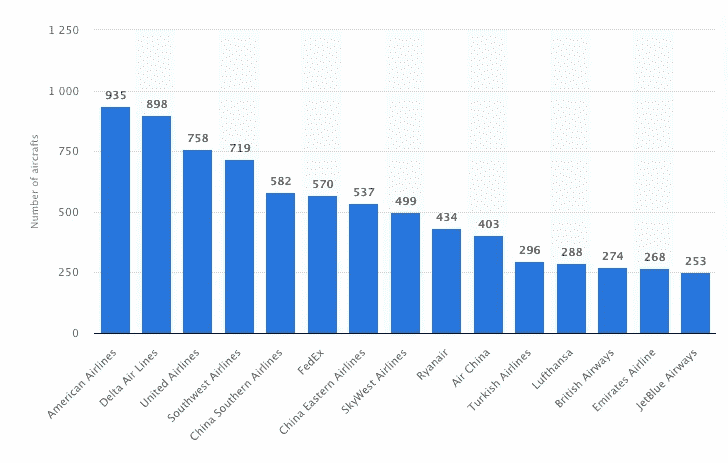
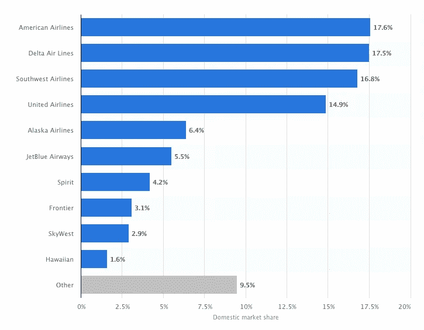
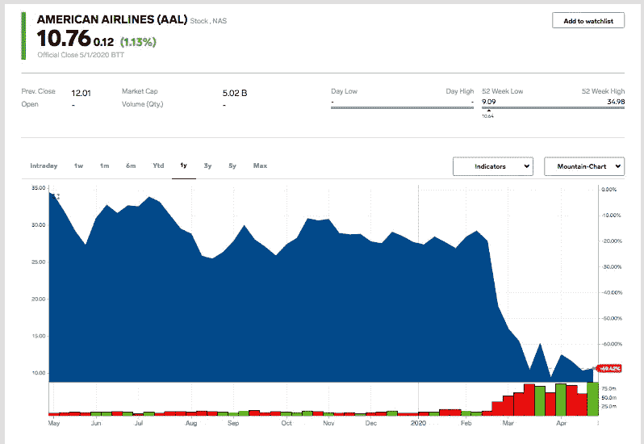
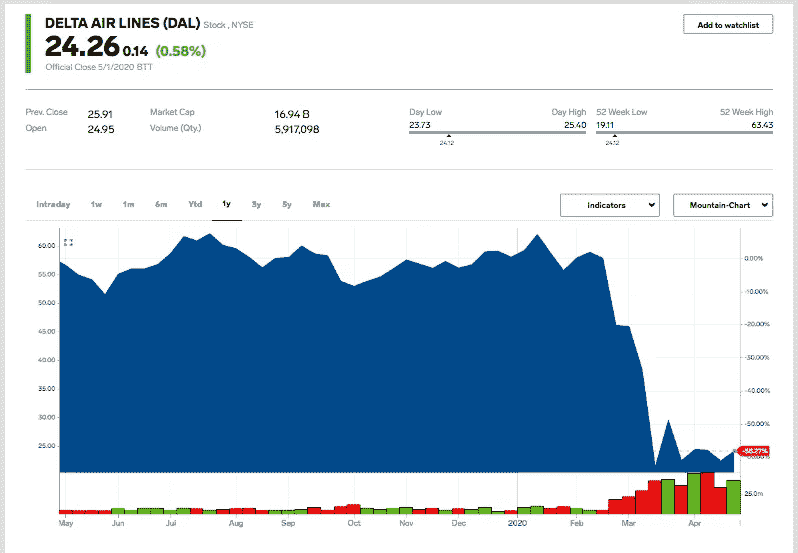
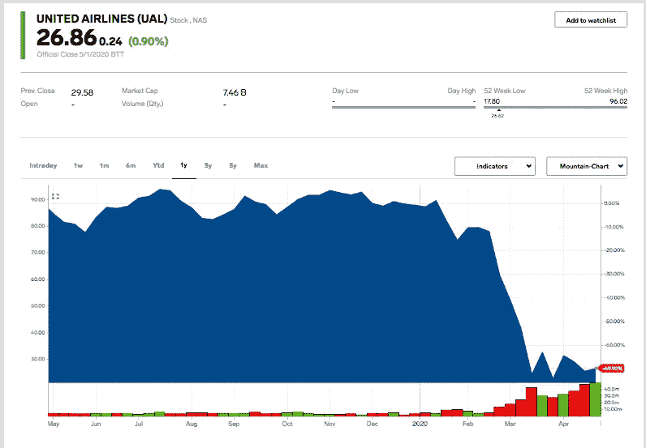
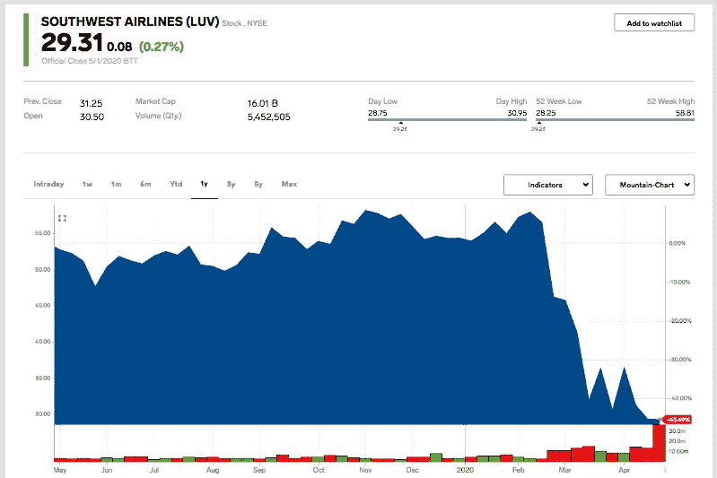

# 后冠状病毒时代的航空业:它能恢复吗？

> 原文：<https://medium.datadriveninvestor.com/the-airline-industry-post-coronavirus-can-it-recover-e0bf76fd3782?source=collection_archive---------9----------------------->

沃伦·巴菲特这样的权威人士已经向美国最大的航空公司认输了。我们在新冠肺炎之前所知道的空中旅行还有未来吗？

Photo by [JC Gellidon](https://unsplash.com/@jcgellidon?utm_source=medium&utm_medium=referral) on [Unsplash](https://unsplash.com?utm_source=medium&utm_medium=referral)

> “对于航空公司来说，世界已经变了…”
> 
> - [沃伦·巴菲特，2020 年 5 月](https://finance.yahoo.com/brklivestream)

# 介绍

回顾几个月前日历从 2019 年转向 2020 年的时候，美国航空业似乎拥有一切。在航空业的背后有如此多的顺风，顾客不再抱怨为似乎所有的东西付费。没有免费的午餐，没有免费的托运行李，如果你不想要可怕的中间座位，那么，你要付出代价！航空公司在几乎总是满员的情况下以创纪录的效率运行——即使在飞机被重新设计以在腿部空间和舒适度更小的飞机上放置更多座位的时候。随着国内和国际游客数量的创纪录增长，收入也在增长。随着燃油价格的下降——这是任何航空公司最关键和最大的成本因素，航空公司在行业历史上为数不多的几次看到了持续的盈利。一切似乎都进行得很顺利——太顺利了！

然后，疫情击中了！冠状病毒对航空业的影响极为严重。事实上，可以说没有一个经济部门像航空业一样受到负面影响。在短短几个月的时间里，美国主要航空公司不仅陷入了短期运营危机，还陷入了不亚于生存危机的危机。现在，就连权威人士沃伦·巴菲特也看到了这个行业的未来——而且情况不妙！

**Source:** [https://twitter.com/davidshepardson/status/1256722541630144514](https://twitter.com/davidshepardson/status/1256722541630144514)

# 航空业和病毒

无论你用什么标准来衡量——而且有各种各样的标准——无论暴发户航空公司如 [Spirit](https://www.spirit.com/) 、 [Allegiant](https://www.allegiantair.com/) 和 [Frontier](https://www.flyfrontier.com/) 抢占了多少头条，美国的航空业都被四大航空公司的“快乐寡头垄断”所控制: [American](https://www.aa.com/homePage.do) 、 [United](https://www.united.com/en/us) 、 [Delta](https://www.delta.com/) 和 [Southwest](https://www.delta.com/) 。无论是以航空公司飞行的飞机数量来衡量(见图 1) …

**图 1:按机队规模排名的 2019 年全球顶级航空公司**

**Source:** [Statista](https://www.statista.com/) ([https://www.statista.com/statistics/1013159/airlines-worldwide-fleet-size/](https://www.statista.com/statistics/1013159/airlines-worldwide-fleet-size/))

…或者说他们可以实际出售和填补的预定座位数(见表 1)，美国航空公司是当今世界上最大的航空公司。

**表 1:2019 年世界航空公司年度预定座位数排名**

1.  美国航空公司:265043191
2.  达美航空 243，372，169
3.  西南航空 210，911，808
4.  联合航空公司
5.  瑞安航空公司
6.  南航 141，365，190
7.  东航 134，200，810
8.  易捷航空 105786369
9.  国航 93，627，708
10.  土耳其航空公司

**来源数据:** [OAG](https://www.oag.com/) ，*十年喜事:十年航空发展——2019 年 12 月*([https://www . OAG . com/blog/Decade-heels-十年航空发展](https://www.oag.com/blog/decade-delights-ten-years-of-aviation-development))

据一位行业分析师称，虽然机队规模是一个更明显的衡量标准，但预定座位数实际上是一个更有用的活动衡量标准。这是因为，与飞国内和国际长途航线的航空公司所使用的同一架飞机相比，主要飞国内短途航线的折扣航空公司每天在给定的飞机上会有更多的可用座位。

**图 2:2019 年 2 月至 2020 年 1 月美国领先航空公司的国内市场份额***

**Source:** [Statista](https://www.statista.com/) ([https://www.statista.com/statistics/250577/domestic-market-share-of-leading-us-airlines/](https://www.statista.com/statistics/250577/domestic-market-share-of-leading-us-airlines/))

因此，随着四大航空公司以大约三分之二的客运流量(见图 2)和大约 80%的可用客运里程统治美国市场，美国航空公司、达美航空公司、联合航空公司和西南航空公司进入 2020 年，有望继续平稳向前发展。当然，极端的动荡以冠状病毒的形式袭击了航空业。首先，国际旅行受到限制，最终几乎陷于停顿。然后，随着疫情在美国的恶化，国内对航空旅行的需求急剧下降。

当整个 T2 旅游业在国内和世界范围内遭受新冠肺炎疫情的打击时，美国航空业受到的打击尤为严重。随着乘客数量急剧下降，面对冠状病毒，航空公司[争相缩减运营](https://www.marketwatch.com/story/buffett-dumps-entire-airline-stake-saying-the-world-changed-for-airlines-2020-05-02)，但似乎不管他们做什么，人们就是不愿意乘坐飞机——这意味着收入很少。四家美国航空公司中最大的航空公司在疫情高峰期的客流量下降了近 90%，因此，他们在 2020 年 4 月停飞了近一半的飞机。这对四大航空公司来说意味着惊人的财务损失，投资者纷纷逃离他们在这些公司的头寸。

从下面的四个图表中可以看出，自 2 月中旬新冠肺炎疫情在国内可能有多严重的第一次感觉开始震动整个市场以来，美国四大航空公司的股价都受到了冲击。下面是美国航空公司(*图 3* )、达美航空公司(*图 4* )、联合航空公司(*图 5* )和西南航空公司(*图 6* )的股票走势图，每个都显示了该航空公司股票从 2019 年 5 月 1 日至 2020 年 5 月 1 日的一年表现。

**图 3:美国航空(AAL)一年的股票表现(截止 2020 年 5 月 1 日)**

**Source:** [https://markets.businessinsider.com/stocks/aal-stock](https://markets.businessinsider.com/stocks/aal-stock)

**图 4:达美航空(DAL)一年的股票表现(截至 2020 年 5 月 1 日)**

**Source:** [https://markets.businessinsider.com/stocks/dal-stock](https://markets.businessinsider.com/stocks/dal-stock)

**图 5:联合航空(UAL)一年的股票表现(截止到 2020 年 5 月 1 日)**

**Source:** [https://markets.businessinsider.com/stocks/ual-stock](https://markets.businessinsider.com/stocks/ual-stock)

**图 6:西南航空公司(LUV)一年的股票表现(截至 2020 年 5 月 1 日)**

**Source:** [https://markets.businessinsider.com/stocks/luv-stock](https://markets.businessinsider.com/stocks/luv-stock)

# 这位“奥马哈先知”取消了他进入航空业的航班

尽管 2020 年对航空业来说很糟糕，但最糟糕的消息可能刚刚宣布。在与伯克希尔·哈撒韦公司股东的年度会议上(当然，由于冠状病毒，这一次[实际上是在](https://finance.yahoo.com/brklivestream)举行的)，沃伦·巴菲特宣布他的公司已经出售了所有的航空公司股份。

在伯克希尔·哈撒韦公司这些年惊人增长的大部分时间里，巴菲特，这位“[奥马哈](https://www.thebalance.com/warren-buffett-timeline-356439)的先知”，很好地避开了航空业，就像牌匾一样(这个表达方式*可能现在应该退休*，但在这种情况下很合适)。为什么？在 2007 年致股东的信中，巴菲特指出:

> “最糟糕的企业是那种快速增长、需要大量资本才能实现增长、然后赚不到钱或赚不到钱的企业。想想航空公司。从莱特兄弟的时代开始，持久的竞争优势就被证明是难以捉摸的。事实上，如果一个有远见的资本家出现在小鹰号上，他会把奥维尔打下来，帮他的继任者一个大忙。”
> 
> -沃伦·巴菲特(2007 年)

然而，尽管有这样的声明，并且几十年来一直避免投资航空业，巴菲特[终于在 2016 年](https://www.theglobeandmail.com/business/international-business/article-berkshire-sells-entire-stakes-in-us-airlines-world-has-changed/)投资了。巴菲特改变对航空业看法的背后原因是什么？据那些分析巴菲特行动的人说，当时的感觉是，他看到:“这似乎表明航空业已经成熟；航空公司没有以牺牲利润为代价争夺市场份额，而是专注于为投资者创造丰厚的回报。”正如伯克希尔·哈撒韦公司的方式一样，巴菲特不仅成为了这些公司的投资者，还是主要投资者。事实上，伯克希尔·哈撒韦在美国四大航空公司都占据了重要位置。事实上，[根据公开资料](https://www.flightglobal.com/airlines/warren-buffetts-investment-firm-sells-out-of-four-major-us-carriers/138197.article)显示，2019 年底，伯克希尔·哈撒韦持有以下职位:

*   达美航空公司的 11%,
*   10%的美国航空公司，
*   西南航空公司 10%的股份，以及
*   美国联合航空公司的 9%。

尽管伯克希尔·哈撒韦公司的举动对航空业来说是个坏消息，但巴菲特对这件事的解释可能会更加打击其他投资者的信心。他指出:

> “我们从航空业务的角度做出了(清算航空公司股份的)决定。我们基本上是在亏损的情况下从业务中赚钱的。我们不会为一家公司提供资金……如果我们认为这家公司未来会把钱吃掉的话。”
> 
> ——沃伦·巴菲特(2020)

为什么航空公司会在一段时间内持续亏损或者“吞掉”钱。在巴菲特看来，主要原因是因为他根本看不到在大流行后的世界里有多少人会再次坐飞机——这是个大新闻！

**Source:** [https://twitter.com/YahooFinance/status/1256716510225145862](https://twitter.com/YahooFinance/status/1256716510225145862)

根据巴菲特的说法，当时的核心问题是，随着需求的不确定性，美国主要航空公司的定位很糟糕，因为它们对于未来可能的旅行需求来说太大了，也就是说“太多的飞机”，当然，还有所有的人员和管理费用以及随之而来的成本结构。

**Source:** [https://twitter.com/BeckyQuick/status/1256713172939145223](https://twitter.com/BeckyQuick/status/1256713172939145223)

# 分析

现在，虽然有行业分析师看到了行业反弹和当前低迷股价的价值，但这位分析师认为，不仅这四家航空公司，而且整个行业都将面临同样的乌云。航空旅行在一段时间内不会回到 2019 年的水平——也许永远不会。

 [## 投资区块链前要问的三个简单问题(也是一个困难的问题)|数据…

### 现在是了解区块链的最佳时机。不同货币之间的增长率，比如…

www.datadriveninvestor.com](https://www.datadriveninvestor.com/2020/03/12/three-simple-questions-and-one-difficult-one-to-ask-before-investing-in-a-blockchain/) 

正如巴菲特[在宣布他的决定时所说的](https://www.cnbc.com/2020/05/02/warren-buffett-says-berkshire-sold-its-entire-position-in-airlines-because-of-the-coronavirus.html)“对于航空公司来说，世界已经改变了”，自从冠状病毒开始在美国的许多业务中展示其全部力量以来，我[一直坚持](https://medium.com/datadriveninvestor/the-post-covid-19-business-world-part-1-overview-84e2a85d448e)同样的观点。因为疫情，我们作为消费者已经改变了。因为疫情，我们改变了旅行者的身份。现在，随着我们改变了工作方式、交换信息的方式，甚至我们与家人社交和聚会的方式，许多旅行的需求*已经消失了*——或者至少显著减少了。由于在现代客机上不可能真正跨越社交距离，空中旅行不仅会被认为不那么必要，而且在未来一段时间内可能会被许多人视为风险太大。正如我们在一个又一个行业和我们自己的个人生活中看到的那样，一旦我们建立了新的互动模式，这些模式很快就变成了简单的做事方式，从心理学的角度来看，很难回头。对于整个旅游业，尤其是航空业来说，这也很有可能是真的——所有航空公司都将迎来一个非常动荡的未来。

# **和我一起在媒体上写作**

想开始自己的写作之旅吗？想通过发布自己创作的文章来更好地建立个人品牌？考虑今天和我一起在 Medium 上写作，并使用这个链接:[https://davidwyld.medium.com/membership](https://davidwyld.medium.com/membership)。这样做，你将帮助支持我的写作，因为我收到你的媒介会员费的一部分。

 [## 通过我的推荐链接加入媒体-大卫·怀尔德

### 作为一个媒体会员，你的会员费的一部分会给你阅读的作家，你可以完全接触到每一个故事…

davidwyld.medium.com](https://davidwyld.medium.com/membership) 

大卫·c·怀尔德是新奥尔良郊外东南路易斯安那大学的管理学教授。他是一位著名的商业顾问和当代管理问题的演讲者/作家。

# David Wyld 关于冠状病毒/新冠肺炎和商业的其他文章:

 [## 为什么不试试呢？:冠状病毒爆发后的实验季节

### 随着各种规模的公司应对……的现实，我们看到了前所未有的创造力和独创性的迸发

medium.com](https://medium.com/swlh/why-not-try-it-a-season-of-experimentation-in-the-wake-of-the-coronavirus-e27fb6b060a0)  [## 目的地不明:今天的旅游业似乎被冠状病毒摧毁了

### 对于旅行者或任何参与旅游相关业务的人来说，在……之后真的没有什么好消息

medium.com](https://medium.com/@davidwyld/destination-unknown-todays-travel-industry-seems-decimated-by-the-coronavirus-4e5e6579fa16)  [## 向前缩放:疫情期间缩放的爆炸式增长

### 冠状病毒爆发的赢家很少，但 Zoom 和在线会议/视频会议总的来说…

medium.com](https://medium.com/swlh/zooming-ahead-the-explosive-growth-of-zoom-during-the-pandemic-34f55b1f13e8)  [## 一种新型病毒需要新的商业理念

### 领先的管理咨询公司提供的太多专家“建议”都是老生常谈，公式化的

medium.com](https://medium.com/swlh/a-novel-virus-needs-novel-ideas-for-business-43da4aebb09d)  [## 后新冠肺炎时代的商业世界——第一部分:概述

### 调查流行病学黑天鹅事件后环境的变化

medium.com](https://medium.com/datadriveninvestor/the-post-covid-19-business-world-part-1-overview-84e2a85d448e)  [## 后新冠肺炎时代的商业世界——第二部分:餐馆

### 注意:在本系列的第一篇文章(后新冠肺炎商业世界——第一部分:概述)中，我们勾画了…

medium.com](https://medium.com/datadriveninvestor/the-post-covid-19-business-world-part-2-restaurants-ede436e370f7)  [## 新冠肺炎之后零售业的“科斯莫·克莱默法则”:为什么零售商需要快速标准化他们的…

### 随着冠状病毒的出现，每个零售商，无论规模大小，都在努力解决如何正确保护这两者…

medium.com](https://medium.com/swlh/the-cosmo-kramer-rule-for-retail-after-covid-19-why-retailers-need-to-quickly-standardize-their-53c14c2a9237)  [## 没有粉丝的运动:空旷体育场比赛的商业现实

### 在冠状病毒疫情之后，体育联盟、电视网、广告商，是的，政治家们都在呼吁…

medium.com](https://medium.com/sportsraid/sports-without-fans-the-business-realities-of-empty-stadium-games-bf6c75d21cc8)  [## 被冠状病毒切碎

### 随着冠状病毒的出现，全国各地的餐馆都感觉自己受到了不公平的待遇…

medium.com](https://medium.com/swlh/chopped-by-the-coronavirus-ec6315d9b766)  [## 在疫情期间，我们想在网上看到什么，这说明了我们什么

### 对美国人网上活动的分析揭示了很多关于美国人如何生活、工作、观看…

medium.com](https://medium.com/datadriveninvestor/what-we-want-online-during-the-pandemic-and-what-that-says-about-us-31d2cd23f1e2)