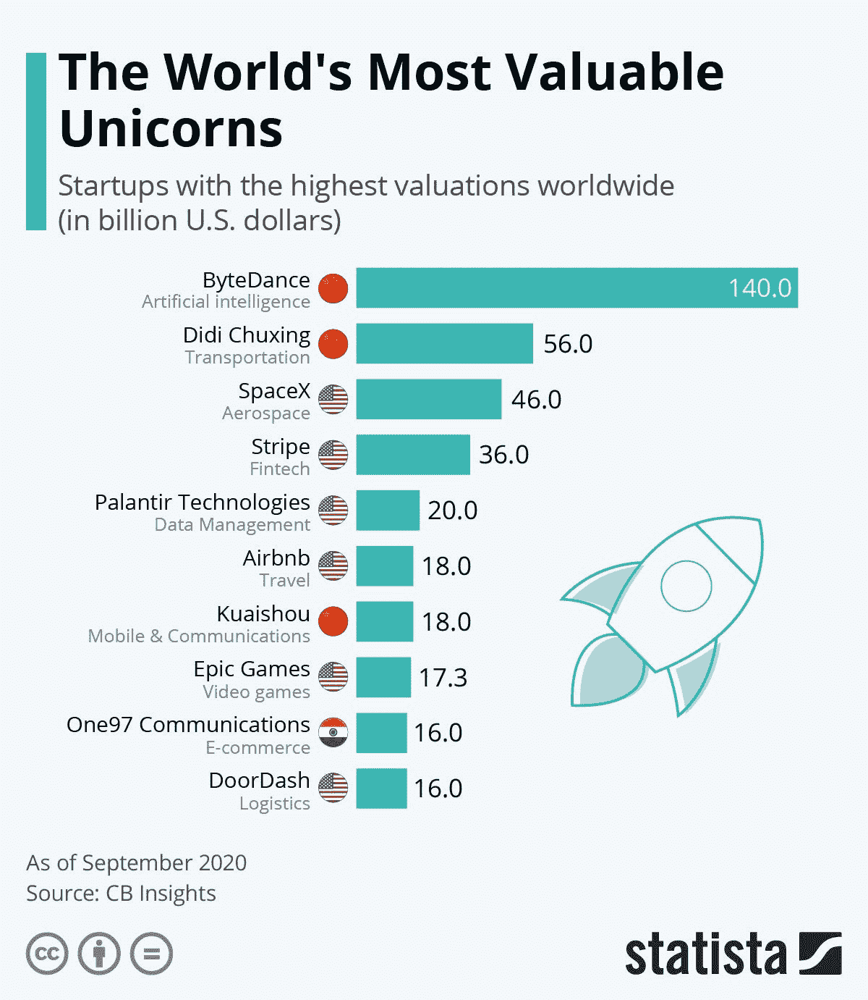
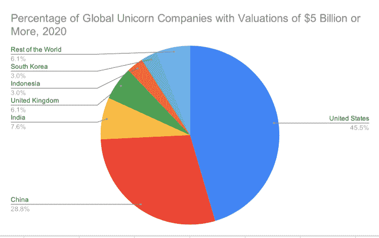

# 美国独角兽缺口

> 原文：<https://medium.datadriveninvestor.com/the-american-unicorn-gap-5f292121ed3e?source=collection_archive---------13----------------------->

## 创业公司的全球化对美国意味着什么

## 根据最新的研究，美国现在有少数价值超过 50 亿美元的创业公司。创业公司的国际化如何改变全球商业和风险投资的规则。

Photo by [Morning Brew](https://unsplash.com/@morningbrew?utm_source=medium&utm_medium=referral) on [Unsplash](https://unsplash.com?utm_source=medium&utm_medium=referral)

# 概观

当我们想到当今商界最伟大的创新者时，你会想到谁？如果你被问到这个问题，无论是在大学教室还是在酒吧，大多数人通常会列出一些“通常的嫌疑人”这通常包括一些非常美国化的人，比如埃隆·马斯克、T2、杰夫·贝索斯、T4、沃伦·巴菲特、比尔·盖茨。虽然作为一名管理学教授，当我问这个问题时，偶尔会有 Jay Z 出现在名单上，但名单上绝大多数是美国人、白人和男性。是的，仅仅是为了更好的衡量，史蒂夫·乔布斯，他理所当然地属于任何一个“名人堂”级别的名单，但现在已经死了大半年了(*哇！*)。你听说过卡洛斯·斯利姆这个名字吗？机会渺茫？在美国，不太可能有人会用马云或其他全球商业偶像这样的名字来回应？

我们都知道这个世界在很多方面都在变得扁平——在商业和其他领域。然而，看到今天大多数高价值的创业公司都不是美国人，可能还是会令人惊讶。是的，根据最近的研究，美国仍然是全球创业社区的代表。然而，对于每一个如今在美国家喻户晓的高调创业公司，如 [SpaceX](https://www.spacex.com/) 和 [Airbnb](https://www.airbnb.com/) ，都有一整个世界的公司在竞争资本，为当今的全球经济提供动力。对美国人来说，作为投资者、学生和公民，是时候认识到商业世界的力量平衡正在发生变化，我们需要意识到这种变化对我们所有前进的人意味着什么。

Photo by [🇨🇭 Claudio Schwarz | @purzlbaum](https://unsplash.com/@purzlbaum?utm_source=medium&utm_medium=referral) on [Unsplash](https://unsplash.com?utm_source=medium&utm_medium=referral)

# 世界独角兽

总部位于纽约的科技分析公司 [CB Insights](https://www.cbinsights.com/) 追踪独角兽。不，不是*那些*独角兽！相反，他们跟踪被称为“独角兽公司”的估值。根据 [Investopedia](https://www.investopedia.com/) ，“独角兽[是风险投资行业用来描述价值超过 10 亿美元的私人控股创业公司的术语。”尽管想象中的独角兽和商业类型的独角兽都很罕见，但 CB Insights 还追踪了另外两种“玉米”。他们给这些公司贴上标签，一个是价值超过 100 亿美元的私人创业公司，一个是代表价值超过 1000 亿美元的公司。](https://www.investopedia.com/terms/u/unicorn.asp)

CB Insights 最近发布了最新(2020 年 9 月)的全球独角兽公司排名。分析师称之为全球独角兽俱乐部，这个俱乐部目前由近 500 家(准确地说是 493 家)公司组成，总价值超过 1.5 万亿美元(T21)。根据数据分析公司 [Statista](https://www.statista.com/) 编制的 CB Insights 排名，图 1 ( *世界上最有价值的 10 家初创公司*)显示了估值最高的 10 家公司。

**图 1:世界上最有价值的 10 家创业公司**

**Source:** [Statista](https://www.statista.com/), [https://www.statista.com/chart/19317/highest-valued-startup-companies-in-the-world/](https://www.statista.com/chart/19317/highest-valued-startup-companies-in-the-world/); Used with permission.

正如你所看到的，虽然相当知名的美国公司在前十名中占据了六个位置，但中国公司占据了前两个位置，并且占据了前十名中的三个位置。虽然 [Bytedance](https://www.bytedance.com/) 的名字可能不为你所熟悉，它是排名第一的中国公司，估值 1400 亿美元，是当今世界上唯一的*Hector corn 创业公司，但它是[抖音](https://www.tiktok.com/en/)的背后公司，移动视频平台已经在世界各地起飞，美国政府正在考虑禁止。然而，Bytedance 也提供了一系列其他移动平台，包括 [Toutiao](https://www.toutiao.com/) ，它使用机器学习为每个用户定制独特的新闻订阅。[滴滴出行](https://www.didiglobal.com/)，全球排名第二，估值 560 亿美元，是另一家中国公司，提供超过 5 亿人使用的拼车应用，并且正在全球扩张——只是目前还没有到美国。*

 [## 美国人永远不该学的一课|数据驱动的投资者

### 美国人永远不应该吸取安妮·劳里在她的文章《美国人的教训》中所提倡的教训

www.datadriveninvestor.com](https://www.datadriveninvestor.com/2020/09/03/the-lesson-americans-should-never-learn/) 

**表 1:2020 年估值达到或超过 100 亿美元的全球独角兽公司**

**对公司/国家/估值(以十亿计)/行业进行排名**

1.  [字节跳动](https://www.bytedance.com/)(中国)，1400 亿美元，人工智能
2.  [滴滴出行](https://www.didiglobal.com/)(中国)，560 亿美元，汽车&运输
3.  [SpaceX](https://www.spacex.com/) (美国)，460 亿美元，太空运输
4.  [Stripe](https://stripe.com/) (美国)，360 亿美元，Fintech
5.  [Palantir 科技](https://www.palantir.com/)(美国)，200 亿美元，数据管理&分析
6.  Airbnb (美国)，180 亿美元，旅游
7.  [快手](https://www.kuaishou.com/)(中国)，180 亿美元，移动&电信
8.  [史诗游戏](https://epicgames.com/)(美国)，173 亿美元，视频游戏
9.  [One97 Communications](https://www.one97.com/) (印度)，160 亿美元，金融科技
10.  [DoorDash](https://www.doordash.com/) (美国)，160 亿美元，供应链，物流，&交付
11.  [DJI 创新](https://www.dji.com/)(中国)，150 亿美元，硬件
12.  [SHEIN](https://us.shein.com/) (中国)，150 亿美元，电子商务&直接面向消费者
13.  [抢](https://www.grab.com/sg/)(新加坡)，143 亿美元，汽车&运输
14.  [Instacart](https://www.instacart.com/) (美国)，138 亿美元，供应链，物流，&交付
15.  [雪花计算](https://www.snowflake.com/)(美国)，124 亿美元，数据管理&分析
16.  [JUUL Labs](https://www.juul.com/) (美国)，120 亿美元，消费者&零售
17.  比特大陆科技公司(中国)，120 亿美元，硬件
18.  美国，120 亿美元，健康
19.  [祝愿](https://www.wish.com/)(美国)，112 亿美元，电子商务&直接面向消费者
20.  罗宾汉(美国)，112 亿美元，金融科技
21.  [全球交换机](https://www.globalswitch.com/)(英国)，111 亿美元，硬件
22.  BYJU 的(印度)，108 亿美元，Edtech
23.  [UiPath](https://www.uipath.com/) (美国)，102 亿美元，人工智能
24.  [Go-Jek](https://www.gojek.com/) (印度尼西亚)，100 亿美元，供应链，物流，&交付
25.  Nubank(巴西)，100 亿美元，金融科技
26.  [Oyo 客房](https://www.oyorooms.com/)(印度)，100 亿美元，旅游
27.  [涟漪](https://ripple.com/)(美国)，100 亿美元，Fintech

**来源数据:** [CB Insights](https://www.cbinsights.com/) ，[全球独角兽俱乐部](https://www.cbinsights.com/research-unicorn-companies)，2020 年 9 月。

当人们更深入地挖掘全球独角兽公司的完整名单时，就会看到全球创新的真正多样性和分散性。目前，全球有 66 家初创公司的估值达到或超过 50 亿美元。从下面的图 2 ( *估值在 50 亿美元或以上的全球独角兽公司的百分比，2020 年*)可以看出，美国公司在这组精选的初创公司中占 45.5%，中国公司占总数的 28.8%。因此，在这些达到这一估值水平的独角兽公司中，几乎有四分之三是来自全球的美国或中国企业。总体而言，在全球 493 家估值超过 10 亿美元的独角兽公司中，美国公司占了 238 家(或 48.28%)，而符合独角兽定义的中国初创公司总共占了 153 家(或 31.03%)。这意味着来自世界其他地方的 102 家创业公司占了今天市场上独角兽的 20.69%。

**图 2:2020 年估值达到或超过 50 亿美元的全球独角兽公司的百分比**

**来源数据:** [CB Insights](https://www.cbinsights.com/) ，[全球独角兽俱乐部](https://www.cbinsights.com/research-unicorn-companies)，2020 年 9 月。

# 分析

当人们回顾独角兽公司的完整名单时，想想过去十年左右创新力量的平衡发生了多大的变化是很有启发性的。今天，我们正面临一个关键时刻，美国公司在推动技术、金融、消费品等领域的创新方面不再占据主导地位。是的，我们已经进化到一个更加两极的世界，在这个世界中，美国和中国的初创公司正在推动所有领域的全球进步。然而，我们可以看到，随着越来越多的创业公司来自全球各地，从南韩到印尼到英国和其他许多国家，我们很可能真正看到一个世界，下一个苹果，下一个抖音，下一个大事件很可能来自*也不是*美国或中国。

Photo by [NASA](https://unsplash.com/@nasa?utm_source=medium&utm_medium=referral) on [Unsplash](https://unsplash.com?utm_source=medium&utm_medium=referral)

因此，当我们看到美国从其历史性的全球自由贸易地位退缩，对中国发起贸易战，T2 退出国际协定，当人们考虑到世界变化的速度有多快，以及 T4 继续变化的速度有多快时，这些行动的影响变得更加明显。越来越多，真正的成长型公司和创意将不仅来自中国，而是来自世界各国。随着这种增长，许多人确实会寻求扩展到这个星球上仍然是最有利可图和先进的消费和商业市场，美国。正如我们在过去几十年中所看到的，当日本人、中国人、欧洲人等。公司寻求在美国市场获得立足点，无论是在分销方面还是在许多情况下在制造方面，这给美国人带来了工作和机会。因此，在增长最快的公司大多不在美国的时候，试图建立一个“美国堡垒”，这种严重限制和/或阻止外国公司接触美国消费者和企业的贸易政策往好里说是误导，往坏里说是自我毁灭。

类似地，全球独角兽企业的名单不仅显示了现在有多少创新和创新公司分散在全球各地，也显示了当今风险资本市场的全球化程度。如果你回顾 CB Insights 的 493 家独角兽公司的完整名单，你可以看到风险资本家——来自美国和海外——今天将如何去任何地方为有前途的企业提供资金。因此，在这样一份有前途的初创公司名单上，我们不再看到硅谷公司的主导地位。随着创业公司在世界各地蓬勃发展，中国的创新中心也是如此，因为风险资本今天真正在全球流动，寻找“下一件大事”。

最后，在这样一份全球增长最快、最有价值的初创公司名单中，美国没有占据主导地位，这在哲学和实践上对我们意味着什么？作为一名管理学教授和顾问，我要说的是，从思维角度来看，今天所有美国人——从决策者到投资者，到是的，考虑下一个就业机会可能来自哪里的个人——都需要将我们的思维从寻找下一个伟大的美国公司转移到寻找下一个伟大的公司——无论这家公司可能来自地球上的哪个地方。在这样做的时候，我们不会错过一个可能被证明是至关重要的机会。

然而，我也相信，这比我们认识到的更重要，是的，我们在美国确实有一个“独角兽缺口”。因此，我们应该尽我们所能尝试和培养企业家精神和创新思维——从我们的监管和税收政策一直到我们的教育系统——以确保我们继续培养个人——像埃隆·马斯克、比尔·盖茨，是的，还有史蒂夫·乔布斯——不仅仅是思考下一个伟大的想法，而且拥有将这些想法推向市场的能力、工具和支持。历史向我们展示了独角兽可以创造多少财富和多少就业机会——无论它们可能诞生在哪里。然而，拥有本土的美国独角兽是确保未来美国经济充满活力增长的一种方式，这确实是一个对我们所有人都至关重要的问题。

**和我一起在媒体上写作**

想开始自己的写作之旅吗？想通过发布自己创作的文章来更好地建立个人品牌？考虑今天和我一起在媒体上写作，并使用这个链接:【https://davidwyld.medium.com/membership[。这样做，你将帮助支持我的写作，因为我收到你的媒介会员费的一部分。](https://davidwyld.medium.com/membership)

 [## 通过我的推荐链接加入媒体-大卫·怀尔德

### 作为一个媒体会员，你的会员费的一部分会给你阅读的作家，你可以完全接触到每一个故事…

davidwyld.medium.com](https://davidwyld.medium.com/membership) 

# 关于大卫·怀尔德

大卫·怀尔德([dwyld@selu.edu](http://dwyld@selu.edu/))是路易斯安那州哈蒙德市东南路易斯安那大学的战略管理教授。他是管理顾问、研究员/作家、出版商、执行教育家和经验丰富的专家证人。

**大卫·怀尔德的社交媒体链接:**

*   上[脸书](https://www.facebook.com/david.wyld)
*   上 [LinkedIn](https://www.linkedin.com/in/david-wyld-4923707/)
*   在[推特上](https://twitter.com/GoodAdvicePub)

**获取专家观点—** [**订阅 DDI 英特尔**](https://datadriveninvestor.com/ddi-intel)