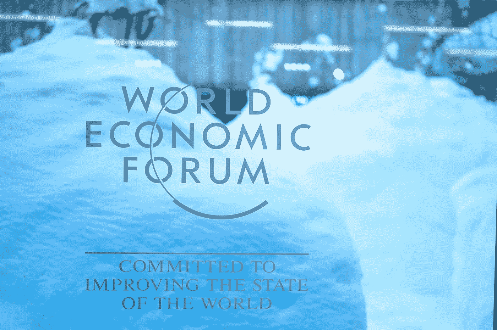
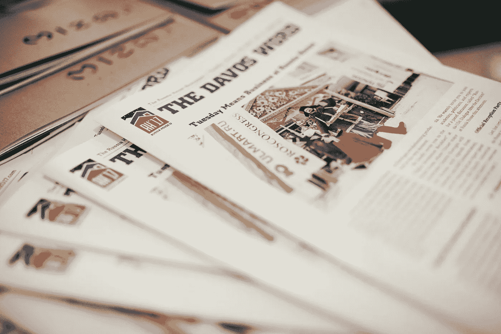

# 将俄罗斯带回达沃斯经济会议的美国人

> 原文：<https://medium.datadriveninvestor.com/the-american-who-brought-russia-back-to-the-davos-economic-meeting-d352125fd92b?source=collection_archive---------24----------------------->

## 长廊上著名的咖啡馆被改造成了俄罗斯之家

Photo by [Evangeline Shaw](https://unsplash.com/@evangelineshaw?utm_source=unsplash&utm_medium=referral&utm_content=creditCopyText) on [Unsplash](https://unsplash.com/s/photos/wef?utm_source=unsplash&utm_medium=referral&utm_content=creditCopyText)

在过去的几年里，Kaffeeklatsch 是典型的充满魅力的瑞士机构之一，同时为任何饥饿、口渴甚至孤独的灵魂提供避难所。在瑞士达沃斯举行的世界经济论坛年会上，弥漫着新鲜出炉的蛋糕、煮咖啡的味道，以及某种难以形容的宁静，Kaffeeklatsch 成为了一个独特的宁静之岛。

我的第一次旅行是在 2015 年，去了瑞士格里森州一个远离人迹罕至的小村庄。我的公司是俄罗斯电子商务的领导者，年销售额接近 20 亿美元，我和我的公司所有者在年会期间来到镇上，评估如何最好地利用论坛的平台作为公关和营销工具。我们正在为该公司的首次公开募股做准备，参加世界经济论坛似乎是创造一种*默认尽职调查*的可靠方式。

2014 年，我的投资关系团队和公司董事长一起，成功地拜访了世界上每一个主要的金融市场，与投资者和金融市场的其他主要参与者举行了 300 多次会议。目标是创造一个关于该公司的可控叙事，以便为 2015 年或 2016 年的 IPO 准备一批聪明的投资者。作为一个领导俄罗斯公司的美国人，我总是意识到俄罗斯的公关问题。坏名声总是让我的工作变得困难，有时甚至是不可能的。

作为各种大型俄罗斯公司的营销、投资者关系、公关和传播部门的负责人，向外国人解释俄罗斯相当困难。关于俄国的很多事情都是与直觉相悖的，金融人士并不热衷于试图理解*的性格怪癖。消除困扰该国几十年的常见陈规定型观念也是当务之急。*

然而，我工作中最困难的部分是，让俄罗斯人自己相信公共关系问题的存在是多么复杂。很多时候，成功的俄罗斯企业主认为文化问题只不过是俄罗斯古老的抱怨*世界不喜欢我们，无论我们做什么，他们都会反对我们。虽然这大部分是胡说八道，但当然，所有阶层的大多数俄罗斯人确实相信这个大阴谋论。这是一个自制的障碍，很难说服他们不这样做——尽管我已经在俄罗斯生活了 20 多年。*

董事长，也是我的老板，是个聪明人，在瑞士和法国都有房子。他知道他的同胞使用的国家公司是一个无力的借口，并注定许多公司要避免与外国人直接竞争——如果作弊，你无论如何都会输。然而，实际情况是，俄罗斯公司避开了外部市场的竞争，并在俄罗斯较弱的竞争中获利颇丰。由于这种与生俱来的对竞争的恐惧，俄罗斯公司几乎从未在国际环境中取得成功(俄罗斯天然气工业股份公司显然不算)。

上路并从聪明的分析师那里获得反馈是一个很好的练习，可以帮助任何公司发现商业模式中的弱点。大约开了 30 次会，我们才真正确信我们的推销达到了最佳状态。该公司是可行的，是一个强有力的投资目标。

然而，我们着手解决的最大问题是在 2014 年注射类固醇，这几乎造成了一场可能完全吞没我们的叙述的大火。俄罗斯入侵乌克兰。在与投资者会面的前一天，我们在电话中被告知*我准备投资 5000 万美元。*然后一夜之间，俄罗斯军队出现在克里米亚和*现在我不能投资任何东西——没有人信任俄罗斯。*

老实说，无论你有什么样的投资平台，在你的公司所在的政府入侵一个主权国家——然后又加上荷兰皇家航空公司(KLM)客机在乌克兰上空被击落——之后，你很难说些什么来安抚投资者。不管有多少证据表明你的公司与俄罗斯政府无关，实际上很少有投资者相信你。

对许多投资者来说，很难将俄罗斯政府的行为与俄罗斯“私营”公司区分开来。不过，这里有一个小道理，公司越大，政府官员和官僚就越感兴趣。这些成功的公司越有可能成为伪政府接管的受害者。

## 没有政府的俄罗斯之家

RH17 Newspaper (PRNewsFoto/Ulmart)

对于我们的 IPO 计划来说，2015 年是艰难的一年。在连续第二年的旅途中，俄罗斯-乌克兰冲突以及对俄罗斯制裁加深导致的卢布暴跌造成了损失。机构投资者既需要证明潜在股价的合理性，也需要增加上市后的需求，他们清楚地表明，风险太高了；而且，作为一家受消费者需求波动影响很大的公司，一家大到足以成为政府接管目标的公司，人们决定需要采取一些激进的措施。我们需要证明我们独立于政府，并且我们有一个国际通用的商业模式。

决定将我们的首次公开募股推迟到 2016 年春天，我降低投资我们公司的风险的任务开始加速。作为这一战略的一部分，2015 年 5 月，我前往非常安静、空旷的达沃斯，寻找一个“总部”，我们可以在年会期间为该公司创建一个展示室。在 2016 年 1 月的会议期间，我走进一家又一家商店询问是否有空，饥饿感袭来，我去了著名的 Kaffeeklatsch——希拉里·克林顿最喜欢的地方，也是许多领导人举行非正式会议的地方。

Kaffeeklatsch 分布在两层，有一个可以俯瞰瑞士阿尔卑斯山的可爱的后阳台。充满了许多小角落和凹穴，有一种空间被分割成几个更小的独立房间的感觉。

我对午餐很满意，意识到从设计角度来看，将舒适的瑞士小屋改造成传统的俄罗斯别墅很容易，于是我询问了租赁场地的事宜。我被告知这是不可能的——永远不可能。心烦意乱的我意识到最完美的位置永远也找不到了，于是我去了俄罗斯，没有任何出租的可能。

从 5 月到 11 月，我又去了达沃斯两次，每次都向咖啡馆的老板推销。最后，当我在最近一次拒绝租房后吃完午餐时，房东走过来说他对我的毅力印象深刻。我相信你会像尊重自己的公司一样尊重它。几天后，我通过电子邮件收到了一份租赁合同。

在 2016 年达沃斯论坛之前，普京总统表示，俄罗斯人应该抵制达沃斯经济论坛——大多数俄罗斯公司听取了他的建议。俄罗斯政府官方代表团也不会出席，官方的“俄罗斯之家”也不会开放。

正是他的决定让我们软弱的手变成了胜利的手，向世界传达了我的公司独立于俄罗斯政府的信息。毫无疑问，从俄罗斯形象中去除政府高压手段的最佳方式是开放一个私人持有的俄罗斯之家，摆脱俄罗斯入侵乌克兰的包袱。

2016 年 1 月 19 日，我开设了“[ul mart 俄罗斯创新之家](https://www.prnewswire.com/in/news-releases/ulmart-russia-house-20-serves-as-a-central-discussion-platform-at-davos-2017-611671605.html)”——我公司的名字叫 ul mart——我和我的团队在 5 天内接待了 6000 多人。有两次商务早餐，几次午餐，来自 14 个国家的政府官员到访；九位亿万富翁和四位非常著名的计算机/技术人士。纳斯达克、纽约证交所、伦敦证交所和莫斯科证交所的总裁都来参加会议，或派出高级代表团。在年会的四天正式会议期间，我们公司已经完全脱离了我们是伪政府公司的暗示。

2016 年的成功意味着 2017 年所有的目光都聚焦在我们位于 Kaffeeklatsch 的俄罗斯馆。特朗普就职后的第一次达沃斯年会，许多人认为会签署一些新的条约来结束制裁。美国有线电视新闻网(CNN)做了一个简短的特别报道，讲述了深受俄罗斯人喜爱的 Kaffeeklatsch 是如何被俄罗斯人赢得的，现在是 Ulmart 俄罗斯创新之家的所在地！

厚颜无耻地夺取了达沃斯的纪念碑，并把它变成了一个私人创新之家，引发了人们对该公司的兴趣。仍然对制裁感到不满的普京再次没有派出官方代表团参加达沃斯论坛，但我们的空间成为了非官方的“俄罗斯官方之家”，吸引了 6 名俄罗斯部长，他们以私营企业和创新的名义与外国同行举行了高层会议。

## 领先的俄罗斯私营公司

由于我们的努力，我的主席被邀请在 17 年达沃斯关于俄罗斯经济的最重要的讨论上发言。在全球直播中，他有将近一分钟的时间告诉每一位聆听的投资者，为什么他和我们的公司是俄罗斯商界和私营企业中最重要的四个声音之一。站在俄罗斯总理身旁讲话的这位最大投资基金的负责人和俄罗斯央行的主要人物之一，在 45 分钟的广播中相当于一年的公关。会议主持人的开场白总结了这一切:“私人企业”的声音。

俄罗斯之家 2017 如此成功，以至于到 2019 年，俄罗斯政府已经依赖于我在 Kaffeeklatsch 创造的更加开放和商业友好的形式。“俄罗斯之家 2018”是我的公司和名为 [RosCongress](https://roscongress.org/en/events/russkiy-dom-v-davose-2017/) 的官方组织的共同努力，该组织为俄罗斯和世界各地的政府组织此类经济活动。我们一起在长廊上找到了俄罗斯之家在 2019 年、2020 年和 2022 年的位置——这座建筑在 20 世纪 70 年代之前一直是巧克力工厂。

虽然政府的许多重担又回到了现在的俄罗斯议会，但我可以很高兴地说，讨论更多地支持私营企业；组织者更愿意利用这个空间作为公关工具来推动对私营公司的投资，而不仅仅是告诉世界执政领导人有多了不起——这是俄罗斯面临的另一个大问题，但这是另一篇文章的主题。

2021 年达沃斯已经被取消，一个较小的版本将于 5 月在新加坡举行。