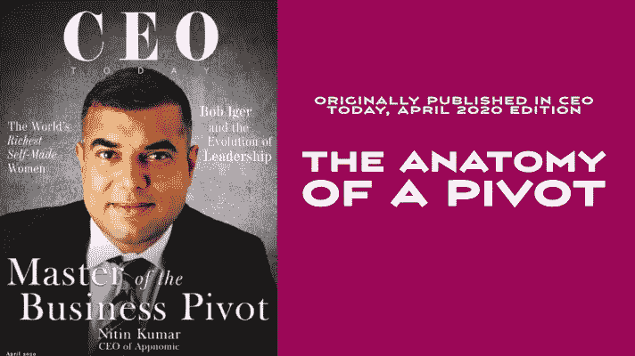
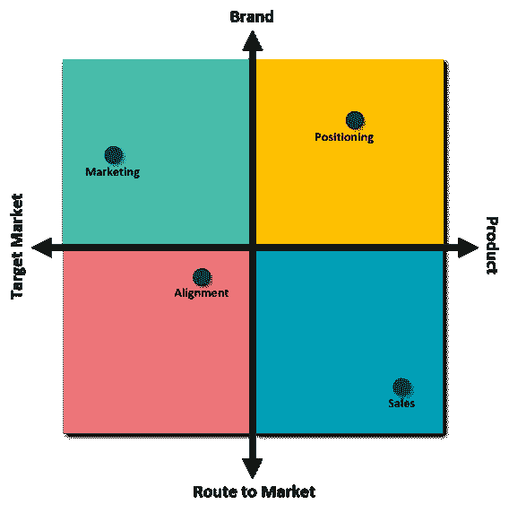

# 枢轴的解剖

> 原文：<https://medium.datadriveninvestor.com/the-anatomy-of-a-pivot-b9acda5915ca?source=collection_archive---------9----------------------->

Image created by author

硅谷首席执行官的至理名言

在硅谷，一个“支点”是很平常，指的是商业轨迹的改变。通常支点有助于释放指数增长，强调现有的商业模式，并创造一个速度或产品位置的变化。这是一个由首席执行官启动的替代计划，在地平线上创造中度到剧烈的变化。支点并不总是在虚弱的状态下构思和执行的；许多公司即使有稳定的收入、销售速度和良好的业务 KPI，也会进行调整。它可以被视为重新配置核心资产与资本、人才、产品、渠道、客户或品牌之间的关系。

几乎所有的初创企业都在发展的某个阶段发生了转变，只有少数企业取得了成功。行业中一个常见的神话是改变产品或其定位将使业务转向；仅仅关注产品将会限制自由度和约束执行。

# 决定何时转向

虽然这部分是艺术，部分是科学，但有一些关键问题需要考虑，以告知这一关键决定。评估的第一个标准是吸引力，即目标市场、该市场对产品的反应、进入该市场的能力以及以资本和资源优化的速度。如果两个以上的答案都是次优的，那么公司就有可能需要考虑一个支点。简而言之，这意味着您的产品可能没有解决正确的问题，或者没有接触到面临预期问题的正确人员，或者接触到这些特定人员的路径没有正确配置。陷入停滞、迎头赶上或失去市场份额是业务重心的正确业务姿态的后果。

此外，在一家公司开始转向之前，还有一些额外的指标需要分析。

# 市场拥挤:

最初的产品想法在某个特定的时间点可能是有意义的，但很快就会被其他人复制。更大的公司可能会在同一个想法上投入更多的资本、资源和执行能力，或者许多不同的初创企业涌入市场，并以非常相似的信息到达同一个目标市场。这种情况会导致你重新思考如何通过做一些不同的事情来区分自己。

# 资产绩效:

另一个迹象是，如果您的一些组织资产比业务的其他部分表现得好得多，例如，一些产品或产品的功能在特定的市场和客户中聚集了动力，那么可能是时候通过提高对这些方面的关注来集中精力加速动力了。有时，一个单一的功能可能成为整个产品的焦点，而在其他时候，最初构思的产品可能被定位为一个高级功能，因为该产品扩展到解决更广泛的问题。

 [## 女性领导给你的企业带来的五大优势|数据驱动型投资者

### 从通用汽车和好时到 Ulta Beauty 和百思买，世界各地的大型企业都在证明…

www.datadriveninvestor.com](https://www.datadriveninvestor.com/2020/11/20/five-advantages-female-leadership-brings-to-your-business/) 

# 客户反应:

根据我的经验，客户往往对 beta 测试、产品演示甚至免费增值模式反应良好，这造成了误导性的势头。他们甚至说，他们热衷于该产品，并愿意为此付费。但是，当涉及到为贴有价格标签的产品投入资金时，他们会拖延决策，甚至打退堂鼓。这是自省和评估形势的时候；要么是产品在现实生活中不够刺激，要么是产品定位可能有缺陷。该公司还可能意识到，产品测试得到了部分确认，解决了正确的问题，但针对的是与最初预期不同的经济买家。支点是不消耗资本或人力资源的正确答案。

# 新见解:

支点不一定只由产品、市场、渠道和品牌驱动。有时，首席执行官通过与专家、客户和其他企业家交谈，学习新的观点、见解和远见。这也为评估规模和机会的方式提供了新的智慧。支点可能植根于新的理解，并专注于释放以前不可见的机会。

# 经济逻辑:

公司通过改变其商业模式的基本经济逻辑，实现了一种不同的或更简单的产品货币化方式。例如，从低销量/高利润转向低利润/高销量，或者将重点从产品转移到平台或其他方面。这种转向也可以是为了优化估值而不是现金流，例如，从许可软件转向基于订阅的 SaaS。

# 执行枢轴的框架:

品牌、目标市场、市场路线(渠道)和产品是设计一个好支点的四个主要定位点。在任何给定点，所有这些杠杆必须保持对齐。例如，如果一家公司选择产品作为支点，那么品牌、目标市场和渠道战略和执行必须非常迅速地与产品的新价值主张保持一致。

一个好的支点也有一些次要的杠杆，如人力资本(获得正确的技能和人员)和财务(适当水平的资本化和融资)。第二级杠杆的对准对于确保枢轴转动成功至关重要。

Image created by the author

> 好的支点通常有四个支点，其中一个被选为主要杠杆，其他三个在它后面很快对齐。资本化和人才是执行成功的商业支点的关键杠杆。

# 成功支点的最佳实践:

**1。** **资本化**:没有足够的资金和资本化，规划支点是徒劳的。方向的转变需要工作、流程、角色、KPI、人员和资产的转变；所有这些都需要经过优先排序、分配和排序的财政资源。没有足够的资金，一个支点可能会以不完整或不成功而告终。

**2。** **专注于解决问题**:不要围绕产品建立一个问题，分析要解决的问题然后用正确的特性建立正确的产品。只有当专注于“你解决什么”而不是“你卖什么”时，支点才是成功的。

**3。** **了解变革的特殊性和规模**:变革工作必须非常具体，在计划中有明确的成功标准、措施和期望。变化是不确定的——不要只是说我们在变化，要深入了解具体是什么在变化，在哪里变化(销售流程、技术、报告关系、定价等)。).

**4。** **快速测试**:采用“失败得快，失败得好，失败得便宜”的策略，与客户和合作伙伴一起创建一些测试运行；他们最大化了组织的成功机会。

**5。** **整体执行支点**:大多数支点之所以失败，是因为没有考虑到编织成一个连贯计划的支点的所有维度(商业、财务、运营、技术和人才)。部分承担的支点很少成功。

也有一些时候，你不应该转向，很多公司为了转向而转向，过早地采用一种非常偏离现实的轨迹。突然的、无计划的和凭直觉的决策会导致失败，失去客户，并以更快的速度烧钱，直至无法挽回。过早和无计划的转向并不总是能带来规模，反而会延长盈利之路。我的建议是始终评估需求，查看所有锚，调整正确的锚，并以充分知情的方式拉动正确的杠杆。

## 获得专家观点— [订阅 DDI 英特尔](https://datadriveninvestor.com/ddi-intel)