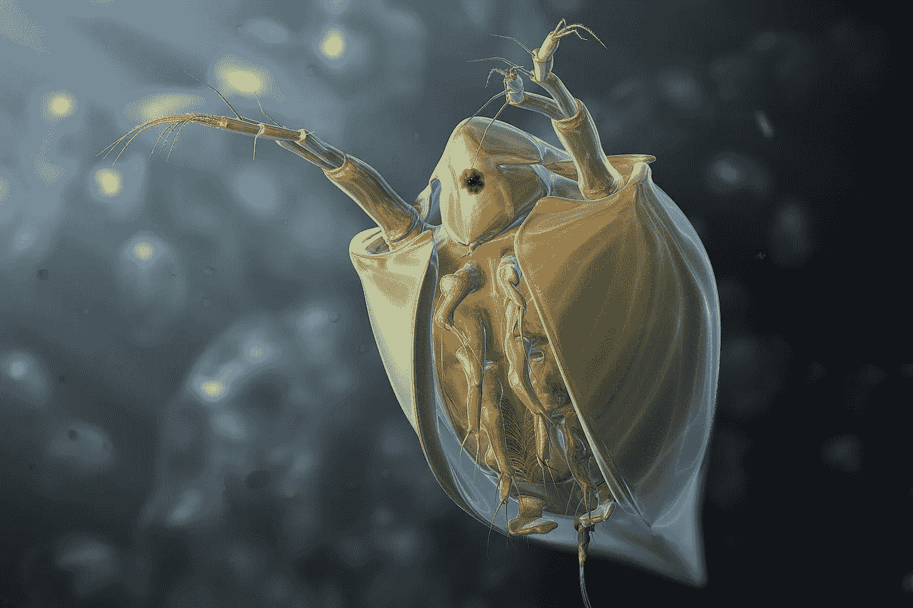

# 吸血跳蚤的祖先原来是邪恶的

> 原文：<https://medium.datadriveninvestor.com/the-ancestor-of-the-blood-sucking-fleas-turned-out-to-be-evil-dbce10826928?source=collection_archive---------20----------------------->

## 跳蚤是臭名昭著的寄生昆虫。它们的身体很小，通常只有 1 到 3 毫米长。它们以哺乳动物的血液为生，包括人类和鸟类

Image by [TeGy](https://pixabay.com/users/tegy-3785262/?utm_source=link-attribution&utm_medium=referral&utm_campaign=image&utm_content=1832201) from [Pixabay](https://pixabay.com/?utm_source=link-attribution&utm_medium=referral&utm_campaign=image&utm_content=1832201)

T 他大瘟疫，跳蚤曾经因为[黑死病](https://en.wikipedia.org/wiki/Black_Death)的传播而引发了一场巨大的疫情，造成了欧洲的大量死亡，改变了人类的发展进程。

[蚤目](https://en.wikipedia.org/wiki/Siphonaptera)作为昆虫[进化树](https://en.wikipedia.org/wiki/Phylogenetics)的一个独立分支，由一些相似的昆虫形态特征(如扁平的身体、无翅、刺吸式口器，以及梳子等适应性结构)和生活习性支撑。

**那么，跳蚤是从哪种昆虫进化而来的呢？**

# **跳蚤的起源成谜**

早在 19 世纪，就有学者根据外部形态认为跳蚤是鞘翅目昆虫([俗称甲虫](https://en.wikipedia.org/wiki/Beetle))的近亲。到了 20 世纪中后期，分支系统学的创始人威利·亨宁(Willi Hennig)发现了跳蚤和 Physaloptera(蝎子草蛉)，以及[双翅目](https://en.wikipedia.org/wiki/Fly)(苍蝇、蚊蚋等。)关系密切，三者共同构成吻部( [Antliophora](https://en.wikipedia.org/wiki/Panorpida) )。

(A living flea. Credit: NIGPAS)

**21 世纪以来，**基于海量[转录组](https://en.wikipedia.org/wiki/Transcriptome)数据的系统发育分析表明，[蚤目](https://en.wikipedia.org/wiki/Flea)与 [Physaloptera](https://en.wikipedia.org/wiki/Physaloptera) 形成姐妹群；然而，基于几个基因串联的系统分析发现，跳蚤位于 [Physaloptera](https://en.wikipedia.org/wiki/Physaloptera) 内部，与雪有关。

 [## 人类大迁徙

### 不管人们怎么看，人类在发源地非洲的进化过程以及扩张和迁徙…

medium.com](https://medium.com/datadriveninvestor/the-great-human-migration-3e3ac0d3aff6) 

跳蚤化石具有长的刺吸式口器，与中生代的长喙异翅蝎蛉科([异翅蝎蛉科](https://en.wikipedia.org/wiki/Aneuretopsychidae)，裸子植物可能的传粉者)有相似之处，这表明异翅蝎蛉起源于长喙长翅，它与雪蝎蛉有很长的关系。

> 然而，基于新的化石研究，这一观点最近受到了挑战。

2020 年初，南京古生物研究所的王波研究团队在《科学进展》杂志上报道了在[白垩纪](https://en.wikipedia.org/wiki/Cretaceous) [缅甸琥珀](https://en.wikipedia.org/wiki/Burmese_amber)中发现了一个长喙蝎蛉化石。38 个化石类群的 54 个形态特征的系统发育分析表明，翼翅目是一个多系统类群，与[蚤目](https://en.wikipedia.org/wiki/Flea)和[双翅目](https://en.wikipedia.org/wiki/Fly)构成姐妹类群。也有人认为蝎蛉科的口器不同于蚤类的口器。[翼龙](https://www.thefreedictionary.com/-pteran)不是跳蚤的姐妹群。

Photo by [USGS](https://unsplash.com/@usgs?utm_source=unsplash&utm_medium=referral&utm_content=creditCopyText) on [Unsplash](https://unsplash.com/s/photos/fly-fiction?utm_source=unsplash&utm_medium=referral&utm_content=creditCopyText)

# **DNA 绘制跳蚤进化树**

2020 年底，南京古生物研究所副研究员蔡晨阳等人，通过对开源[转录组](https://en.wikipedia.org/wiki/Transcriptome)数据的挖掘，结合系统发育分析，最终的研究成果题为《跳蚤是寄生蝎蛉》，发表在官方的《国际古昆虫学杂志》上。该研究证实了蚤类的系统发育关系，并首次提出蚤类实际上是蝎蛉科(Phaeoptera)的一个特化类型，并将蚤类归入 Phaeoptera 的一个亚目。

> **研究小组选取了 26 种有代表性的现存口鼻类，包括** [**长翅目**](https://en.wikipedia.org/wiki/Mecoptera)**[**蚤目**](https://en.wikipedia.org/wiki/Flea)**[**双翅目**](https://en.wikipedia.org/wiki/Fly) **的所有亚目。******

****根据 1KITE 团队测得的[转录组](https://en.wikipedia.org/wiki/Transcriptome)数据，使用 1478 个直向同源的单拷贝蛋白质编码核基因构建了一个超大分子矩阵。氨基酸序列矩阵经过序列比对、串联分析等分子系统分析后，重点进行**【去噪】**处理，对测序、组装、或序列比对过程中形成的噪声位点进行清理，构建了三个新的。****

**** [## 价格敏感度:这里是你需要知道的一切

### 价格应该是经济中最敏感的变量。尽管在…的影响下经济发生了迅速的变化

medium.com](https://medium.com/datadriveninvestor/price-sensitivity-heres-everything-you-need-to-know-5c42a82c7049) 

*分子数据矩阵是无噪声矩阵、保守位点矩阵和超保守位点矩阵。*

**研究人员随后使用了三种不同的氨基酸进化模型，分别使用 PhyloBayes 软件、CAT-GTR+G4 模型，以及最大似然分析(IQ-Tree 软件、C20+R4 和 LG4X+R)对三个矩阵模型构建系统发育树。**

研究结果都证明了口器的单系性，证明了蚤类位于翼手目的内部，与现存的[微齿蚤科](https://en.wikipedia.org/wiki/Nannochoristidae)形成姐妹群关系(下图)。进一步，对系统发育树的近乎无偏的检验也有力地支持了“蚤是蝎科的姐妹群”的观点，否定了蚤与蝎科或双翅目的姐妹群关系。

The tree of life of a snout insect showing the systematic location of fleas (Credits: Phys.org)

# **修改教材只是时间问题**

除了 DNA 证据，跳蚤和活蝎子是近亲，事实上还有形态学证据支持。

**比如**它们的口器特征和细泵相似。蔡晨阳团队的论文发表后不久，一个由德国人领导的国际团队也在预印本网站上发表了他们的最新研究成果，这些成果尚未经过评审。结果与蔡晨阳团队的结论完全一致。

而且值得一提的是，这个国际团队曾经在 2014 年的美国《科学》杂志上发表过一篇文章，**声称跳蚤是翼手目的整个姐妹群。**

通过蔡晨阳等人的研究，首次证明跳蚤是从以植物花蜜和其他植物分泌物为食的[长翅目祖先](https://en.wikipedia.org/wiki/Mecoptera)进化而来，最终成为以[脊椎动物](https://en.wikipedia.org/wiki/Vertebrate)血液为食的寄生虫。

基于[疫霉](https://en.wikipedia.org/wiki/Phytophthora)中跳蚤的系统发育关系，研究人员正式提出将该目降级至亚目，现有的完全变态昆虫数量将从 11 目减少至 10 目。这一结果将改写现行《昆虫分类学》或《普通昆虫学》教科书中有关蚤类分类和起源的内容。****