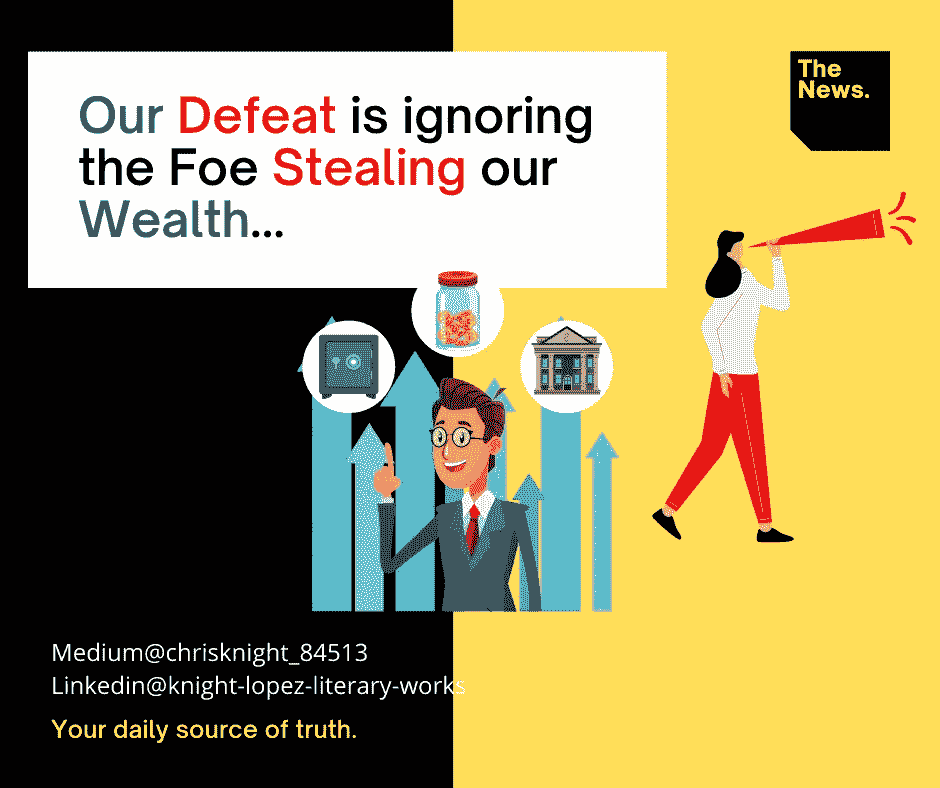

# 央行的古老杀手

> 原文：<https://medium.datadriveninvestor.com/the-ancient-slayer-of-central-banks-27551651c2c?source=collection_archive---------7----------------------->

## 他们的死玷污了我的剑。每次他们胆敢进入我的队伍，我都会杀了他们。然而我却坐在这里听另一只金丝雀唱它的死亡之歌。

Source: Self Created Image with [Canva](http://www.canva.com).

**探索者**

“我们必须寻找复仇者！他在山口尽头等着呢！”

一名中年男子大声喊道。他坐在一头强壮的野兽身上。他的胸部被一层盔甲保护着，随着他的呼吸而移动。他的呼吸有点沉重。他已经骑了一段时间了。一个年轻人坐在一个关口的底部。他刚刚转过拐角。

“他会回应我们的召唤吗？”

一个瘦长的男人是陪同的骑手。他披着一件深红色斗篷，在夕阳下闪闪发光。他的头发在空气中飘散，就像棕色的带子拒绝卷回它们的弹簧。

“贾斯珀。我不知道。”

探索者是一个中年人。他担心得皮肤都裂开了。他右眼上有一个战斗留下的伤疤。罢工几乎夺去了他的视力。他仍然有影像，但没有完整的视力。有人说他应该戴上眼罩。他不在乎隐藏伤口。

事情不公开就会恶化。

“我们必须搬家！”

**按下**

中年人开始调转马头。他开始小跑。贾斯珀继续推动他的战马前进，直到他分享等级。

贾斯珀在中年人的右侧飞奔。很难辨认出他的脸。

“骑士先生。我必须知道我们是否会被看到！我把龙带来了！”

两人继续向前推进。骑士先生把马驮过一个裂缝。当石头继续向前压时，它们被压得嘎吱作响。

"贾斯帕，你在我右边的时候我看不见你！"

骑士先生的脸讲述了许多重播的故事。贾斯珀知道他听得太多了。他的脸上露出了明显的表情。他减速绕到骑士爵士身后。他稍稍抬起马，加快了速度。

“更好！?"

爵士贾斯珀吐出恼火。

“不行！”

贾斯珀爵士看起来很惊讶。

“你从左边看和从右边看一样丑。”

奈特爵士脸上浮现出一丝坏笑。贾斯珀的惊讶变成了笑声。

“你这条老狗。”

两个人都笑了。

“复仇者会看到我们的贾斯珀！他过去已经杀了两个骗子。他鄙视他们。”

贾斯帕推着他的战马。他战马的黑色皮肤使他深红色的斗篷更加醒目。

“你确定？”

骑士爵士点头道。

“每人带领一支军队。每支军队都使用一种叫做[的储备纸币](https://www.uscurrency.gov/denominations/bank-note-identifiers)。某种形式的支付，但什么也没有。出于这样或那样的原因，这个术语被使用了。如果你的意图是杀死它，你叫它什么并不重要。”

当骑士爵士结束他的陈述时，他的眼睛看到了他们道路的尽头。两人都在山坡上飞奔。他们到达目的地已经过了漫长的时间。这是一次长途旅行。两个人都已经 5 天没洗澡了。食物一直很匮乏。水快用完了。

现在他们的旅行终于要结束了。

他们的山顶与另一个山顶的分离映入眼帘。

两个山顶由一座细长的石桥连接起来。这座桥看起来曾经是两座山顶的一部分。现在它下面被炸了一个大洞。

骑士爵士勒住了他的马。贾斯帕爵士紧随其后。两人都站在大石桥前，石桥的尽头有扇大门。大门通向天堂。它们都是白色的，镶嵌着黄金。它们被锻造成一座两边都是裂缝的山。一条狭窄的小路矗立在虚无的深渊之上。

“我们会进去的，但在我们进去之前，我会向你解释复仇者。”

**复仇者联盟的历史**

贾斯珀爵士担心地看着奈特爵士。他吞下的东西看起来像是一团难以下咽的东西。

[托马斯·戈达德在 1791-1811 年率领美国第一军。复仇者杀死了他的线的最后一个，由于复仇者的知识，它包含投机，操纵和腐败。复仇者的意图是用笔记来毁灭宣传虚假价值的军队。”](https://conservancy.umn.edu/bitstream/handle/11299/178032/una-dissertation-0006.pdf?sequence=1)

“所以，复仇者杀死并消灭了我们今天面对的军队？”贾斯珀爵士困惑地说。

骑士爵士来回点头，既不是肯定也不是否定。

“嗯某种。[第二军于 1816 年成立，一直延续到 1836 年](https://www.ushistory.org/tour/second-bank.htm)，复仇者联盟与一位正式的将军安德鲁·杰克森一起组建了第二军

“军队又浮出水面了？一个人要召集多少次军队才能让他们全军覆没？”贾斯珀爵士惊讶地看着。

“嗯显然是三次。从 1837 年到 1862 年，我们迎来了一个自由的非国家常备军时代。只有我们的州保留了军队。那时它被认为是一个自由的国家。1907 年，在我们国家发生了一场恐慌，纽约的一个有影响力的人雅各布·希夫鼓励这支军队再次崛起。”

贾斯珀不安地转移，“为什么我们继续战斗，我们打败了吗？”

骑士爵士在一旁看着，“这么长时间过去了。许多人忘记了这支军队给人民带来的罪恶。[我国最大的贫富差距，一直发生在这些军队的统治下](https://www.pewsocialtrends.org/2020/01/09/trends-in-income-and-wealth-inequality/)。他们强迫我们使用毫无价值的纸币，榨干我们国家的血汗。然后，这些笔记会传回军队。总是有一部分给它的官员。士兵们很少受益。公民永远不会受益。”

情感是明确的。贾斯珀代表恐惧、愤怒和沮丧。他做正确事情的愿望在寒风中燃烧。这就好像一团火焰在没有氧气的情况下燃烧。贾斯帕的火是可以感觉到的。

贾斯帕看着复仇者的大门。风嚎叫着，震耳欲聋地呼唤着碧玉散发出的火焰。

 [## 当前社会经济系统的严重失败|数据驱动的投资者

### 我一点也不在乎任何现行的社会经济制度，不管是资本主义、社会主义、共产主义还是…

www.datadriveninvestor.com](https://www.datadriveninvestor.com/2020/12/11/the-serious-failures-of-current-socio-economic-systems/) 

**龙音**

“你看看。”贾斯帕爵士看了过来。

“我看到了。”骑士先生凝视着。

“你觉得复仇者最终会觉醒吗？”贾斯帕看着奈特爵士。

骑士先生的注意力转移到了石桥上。他的眼睛质疑的立足点。他的耳朵倾听其基础的不确定性。他的鼻子嗅到了恐惧的期待，但他的皮肤感受到了贾斯珀爵士燃烧的欲望。

“自 1836 年以来，复仇者不再是我们的冠军。他已经将近 200 年没有醒来了。我不知道。现在的军队很狡猾。[他们打算利用新技术让一切变得抽象。这是其存在时间超过前军队寿命的原因。"](https://www.federalreserve.gov/econres/notes/feds-notes/central-bank-digital-currency-a-literature-review-20201109.htm)

贾斯珀爵士点点头。

“我同意。当人们变得如此习惯于视而不见时，就很容易欺骗他们。”

骑士爵士将目光从桥上移开。他把目光投向贾斯珀爵士。

“但是人们现在看到了。鸣龙！”

贾斯珀爵士拿出一只金角。它用红宝石装饰着。号角被做成龙的形状。它的壮观是美丽的。这只角是唯一与灰色和黑色环境形成对比的东西。贾斯珀爵士的欲望之火注入红宝石，让它们发出明亮的红光。

“吹！”骑士先生来电。

HHHH-uuuuuuuuuuuu—-RRRRRRRRRR—-NNNNNNNN！！！！！

声音在山口呼啸而过。群山似乎在颤抖。

然后沉默。

两人看起来都不确定。

然后…

大门开始慢慢打开。看来复仇者终于醒了！你会意识到你的经济状况吗？在此之前，有两个央行被摧毁是有原因的。复仇者是我们…人民。贾斯帕是你……读者。我们应该看到事物的本来面目。

祝你知识成功！

***

关于 Christopher:Christopher Knight Lopez 是一名职业骗子，在他的职业生涯中，他与职业企业家进行了广泛的合作。在他 14 年的职业生涯中，Christopher 已经开了超过 7 家公司。克里斯托弗的目的是利用各种市场驱动的机会。Christopher 是注册项目经理(MPM)和认证财务分析师(AFA)。Christopher 之前通过了 65 系列证券执照考试。克里斯托弗也有他的总路线——人寿、意外、健康和健康维护组织。Christopher 已经管理了总计 2 . 86 亿美元的报告管理资产和建议资产。Christopher 在 29 个国家有工作经验，为各种业务筹集了超过 5000 万美元，在他的个人职业生涯中总收入超过 1300 万美元。Christopher 曾在高科技行业工作:生物技术、金融、证券、制造、房地产和住房抵押贷款。克里斯托弗是一名美国空军老兵。克里斯托弗热爱家庭、竞技体育、钓鱼、武术，并倡导企业家精神。克里斯托弗为崭露头角的企业家提供自助课程。克里斯托弗对导师的热情来自于企业家和骗子需要指导的信念。这个世界充满了关于企业家身份的相互矛盾的信息。在[www.christopherklopez.com 看更多。](http://www.christopherklopez.com.)

免责声明:这些信息并不意味着是一种投资建议或财务建议。不要把这种情况应用到你自己的个人环境中。各种风险包括:商业风险、投资风险、政治风险和其他风险。此信息仅用于信息和教育目的。请不要向作者寻求任何投资策略或哲学。针对自己的情况，请咨询自己的理财顾问或法律顾问。不是任何形式的推荐或认可。

## 获得专家视图— [订阅 DDI 英特尔](https://datadriveninvestor.com/ddi-intel)