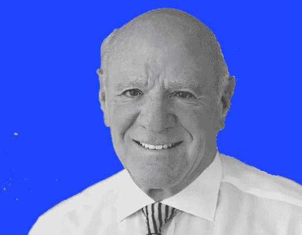

# 反企业集团:Barry Diller & IAC 如何将 2.5 亿美元变成 600 亿美元

> 原文：<https://medium.datadriveninvestor.com/the-anti-conglomerate-how-barry-diller-iac-turned-250-million-into-60-billion-1a24a572aa8d?source=collection_archive---------7----------------------->

artwork by author

1995 年，巴里·迪勒接任银王通信公司董事长兼首席执行官时，这家电视台控股公司价值约 2.5 亿美元。

四分之一世纪后，这家小公司——现在被称为 IAC/interactive corp——已经创造了 600 亿美元的股权价值，分布在 10 家上市的媒体和互联网公司中。

IAC 的策略在投资界是独一无二的。尽管该公司创造了这么多价值，但 IAC 的市值仅为 114 亿美元。迪勒称之为“反联合企业”方法。IAC 不是收购和发展企业并永久持有，而是作为一种工具，在将公司剥离给股东之前收购/建立公司。

曾经属于 IAC 的公司包括 Tinder、Expedia、猫途鹰、Ticketmaster 和 Lending Tree。如今，IAC 控制着 Care.com 和 Vimeo，以及 ANGI 家庭服务、米高梅度假村、汽车共享服务 Turo 和许多其他媒体和技术资产的股份。

 [## 低迷时期投资初学者指南|数据驱动型投资者

### 要不要低买高卖？让我告诉你一个秘密。这正是成千上万的交易者…

www.datadriveninvestor.com](https://www.datadriveninvestor.com/2020/05/01/a-beginners-guide-to-investing-in-a-downturn/) 

# 计算股东回报

IAC 为个人股东创造了多少价值？

答案并不简单。在过去的 25 年里，IAC 经历了无数次股票拆分、反向拆分和分拆。其中一些后来被其他公司收购，或者创建了自己的子公司。

从 1995 年迪勒接管公司开始，我根据以下时间表计算了股东总回报:

1995 年:迪勒被任命为银王通信公司的董事长兼首席执行官。他被任命的消息传出后，该公司股价飙升 50%，至 39 美元。

**1998:** 二合一股票分割

**2000 年:**二合一股票分割

2005 年:Expedia 的分拆

2008 年: IAC 拆分为五家公司:IAC、家庭购物网(HSN)、Interval Leisure (ILG)、Ticketmaster (TKTM)和 Lending Tree (TREE)

2009 年: Live Nation (LYV)与 Ticketmaster 合并。

2011 年: Expedia 推出猫途鹰之旅。

**2017:** QVC 与 HSN 合并。

**2018:** 万豪度假收购 ILG。

**2020:** 赛区分组赛

假设一位投资者在 1995 年以每股 39 美元的价格购买了 10 股 IAC(当时被称为银王)股票。根据我的计算，假设没有出售任何资产，该股东现在将拥有以下资产:

*   10 股 IAC 股票，每股 134 美元
*   10 股 Expedia 股票，每股 119 美元
*   4 股 QVC 股票，每股 25 美元
*   5.5 股 64 美元的 Live Nation 股票
*   0.6 股 Lending Tree，每股 312 美元
*   21.5 股 Match Group 股票，每股 133 美元
*   10 股猫途鹰股票，每股 25 美元
*   6.6 股 126 美元的万豪度假股票
*   59 美元现金，作为 ILG 收购的一部分

初始投资 390 美元，加起来总资产价值达到惊人的 7170 美元。

自 1995 年以来，这意味着超过 12%的复合年增长率。将同期巴菲特旗下伯克希尔哈撒韦公司(Berkshire Hathaway)和标准普尔 500 指数(Berkshire Hathaway)的年回报率进行比较。

作为资本配置者，Diller 和 IAC 已经彻底击垮了它。

# IAC 的秘制酱

显然，反企业集团战略奏效了。与此同时，当大型企业集团变得难以管理时，它们就会失败。如今已经倒下的通用电气涉足了如此多的不同业务，以至于公司内外都没有人真正知道这家公司的价值。

IAC 的方法是让公司自由地追求自己的增长道路，同时让市场更好地了解它们的价值。对于经营不尽如人意的子公司，IAC 将其出售给其他人，并将现金投资于其他地方。

在迪勒任职期间，IAC 也吸引了很多有才华的经理。它的几位高管(被称为“黑仔·迪勒”)已经在技术和媒体领域走上了辉煌的职业生涯，包括迈克尔·埃斯纳(迪士尼首席执行官)、达拉·科斯罗萨西(优步首席执行官)和杰弗瑞·卡森伯格(梦工厂的联合创始人)。

IAC 还帮助启动了孵化实验室，这是一个创业孵化器，几名员工在这里开发了后来成为该公司有史以来最大的热门产品——Tinder。

自 2010 年迪勒卸任首席执行官以来，IAC 一直保持着繁荣。随着 IAC 的 Match Group 在约会应用市场取得主导地位，该股在过去十年中上涨了近 1000%。现任首席执行官乔伊·莱文领导了几项新的重大投资，包括收购 Care.com 和最近收购的米高梅度假村股份。

无论 IAC 的文化内部发生了什么，它似乎正在取得成功。

**访问专家视图—** [**订阅 DDI 英特尔**](https://datadriveninvestor.com/ddi-intel)