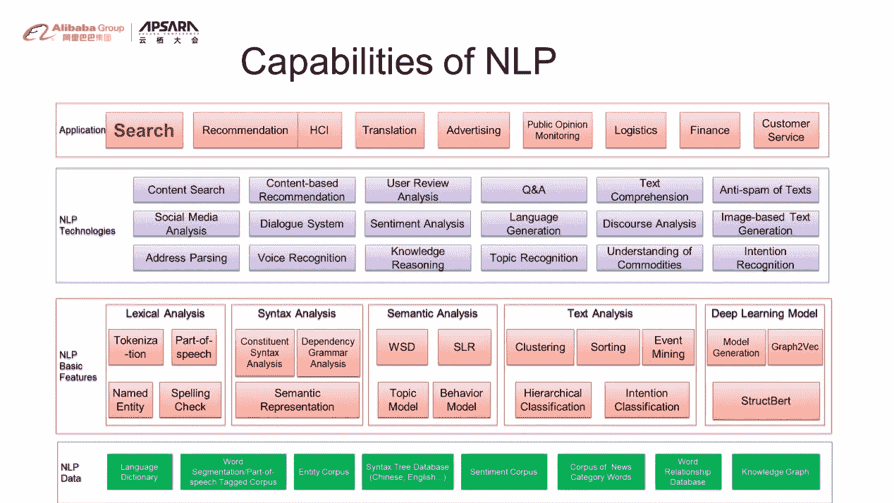
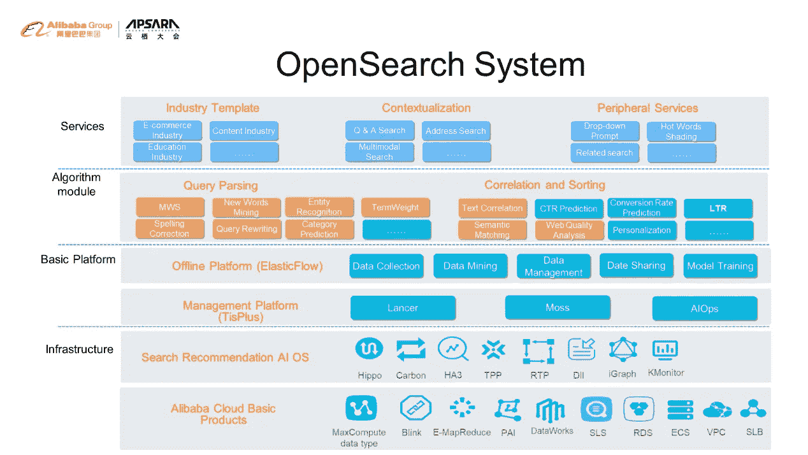
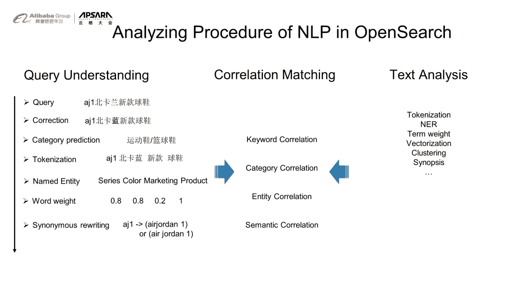
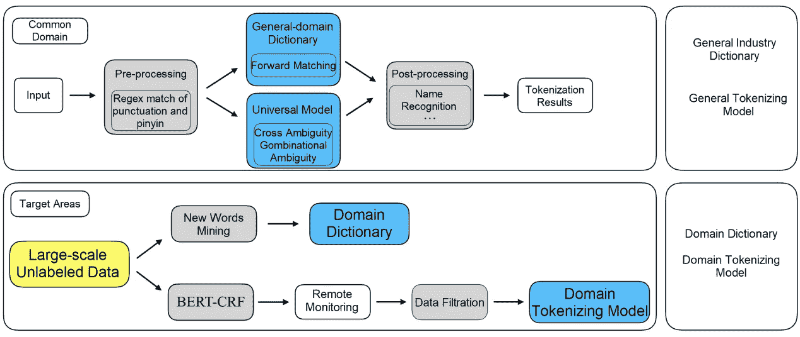
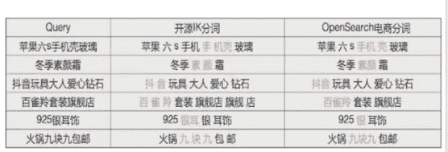
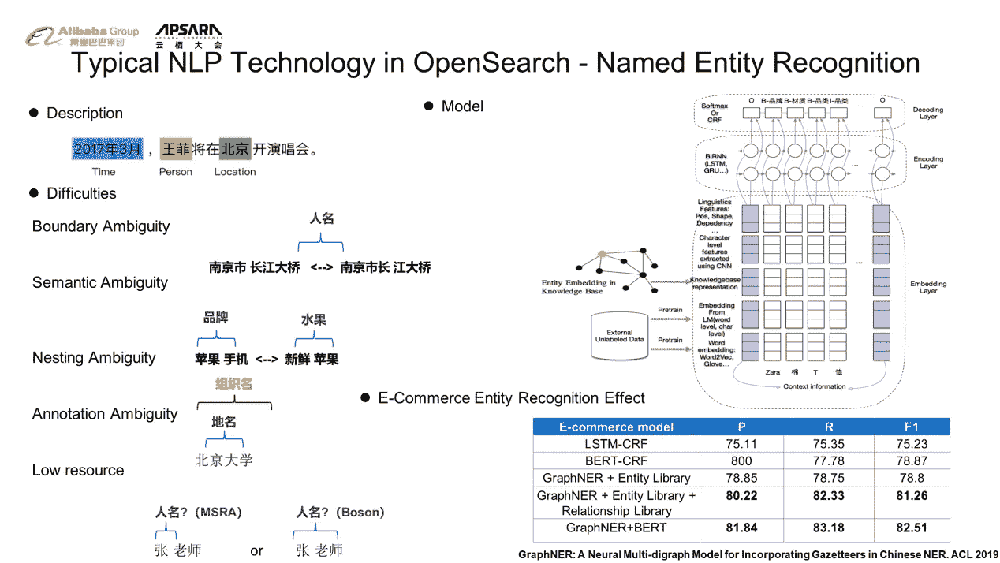
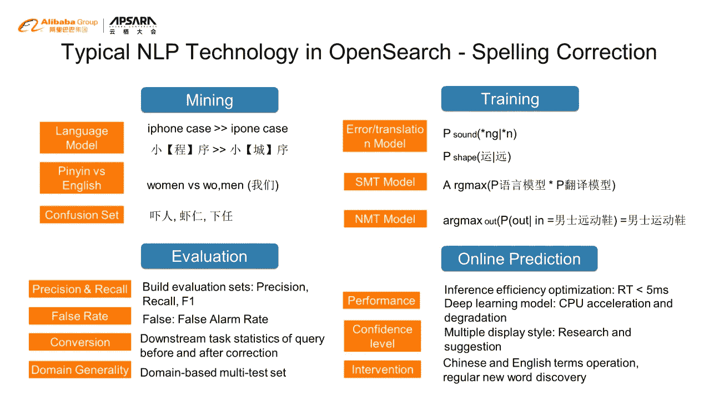
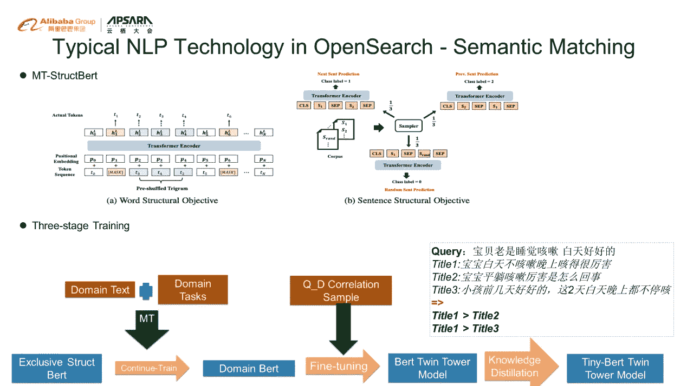
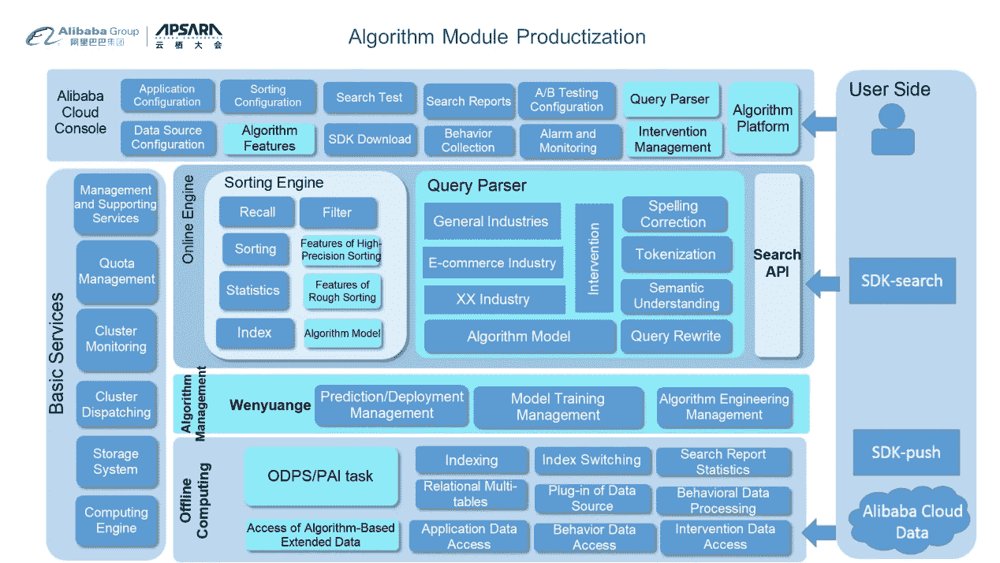

# 自然语言处理在 OpenSearch 中的应用

> 原文：<https://medium.datadriveninvestor.com/the-application-of-natural-language-processing-in-opensearch-7b91a899d9bb?source=collection_archive---------9----------------------->

*在* [*赶 2020 Apsara 大会重播此链接*](https://www.alibabacloud.com/apsara-conference-2020/live-streaming) *！*

*由* [*麋鹿极客*](https://community.alibabacloud.com/users/5170386418630976) *主讲，特邀嘉宾，阿里云 AI 高级算法专家谢()主讲*

简介:在构建搜索引擎时，会出现效果优化问题，其中很多问题都与自然语言处理(NLP)有关。本文结合 OpenSearch 中 NLP 的技术要点对这些问题进行解读和分析。

# 自然语言处理

自然语言处理的研究旨在通过语言实现人与计算机之间的有效交流。它是一门综合了语言学、心理学、计算机科学、数学和统计学的科学。它涉及许多主题，如分析、提取、理解、转换以及自然语言和符号语言的生成。

# 人工智能的各个阶段

*   **计算智能:**指依靠计算能力和海量数据存储能力，在某些领域超越人类的能力。一个有代表性的例子是谷歌的“Alphago”。凭借谷歌 TPU 的强大计算能力和算法的结合，像蒙特卡罗树搜索(MCTS)和强化学习，Alphago 可以通过处理关于围棋的海量信息来做出好的决策。因此，在计算能力方面，它可以超越人类。
*   **智能感知:**指从非结构化数据中识别重要元素的能力。例如，它可以分析查询来识别信息，如人名、地点和机构。
*   **Cognitive Intelligence:** Based on intellisense, cognitive intelligence can understand the meaning of elements and make some inferences. For example, in Chinese, sentences like “谢霆锋是谁的儿子” and “谁是谢霆锋的儿子” both contain the same characters, but the semantics of them are different. This is what cognitive intelligence aims to solve.
*   **创造智能:**它指的是计算机基于对语义的理解，创造符合常识、语义和逻辑的句子的能力。比如计算机可以自动写小说，创作音乐，可以自然地和人聊天。

自然语言处理的研究涵盖了以上所有的主题。NLP 是实现全面人工智能所必需的。

# 自然语言处理的发展趋势

1.  深度语言模型的突破将导致重要自然语言技术的进步。
2.  公有云上的 NLP 服务将从一般功能向定制服务演进。
3.  自然语言技术将逐步与行业和场景紧密结合，创造更大的价值。

# 阿里巴巴集团 NLP 平台的能力

NLP 平台的能力自下而上分为 NLP 数据、NLP 基础能力、NLP 应用技术、高层应用。

NLP 数据是许多算法的基础，包括语言词典、实质性知识词典、句法词典和情感分析词典。基本的自然语言处理技术包括词法分析、句法分析、文本分析和深度模型。在基本的 NLP 技术之上，还有 NLP 的垂直技术，包括问答和对话技术、反垃圾邮件技术和地址解析。这些技术的结合支持许多应用。其中 OpenSearch 是一款具有密集 NLP 能力的应用。

# OpenSearch 中的应用及典型自然语言处理技术

*   OpenSearch 的基础设施包括阿里云的基础产品和基于阿里云生态系统搜索场景的专属搜索系统，如 HA3、RTP、Dii 等。
*   基础管理平台确保离线数据的收集、管理和培训。
*   算法模块分为两部分。一个与查询解析相关，包括多粒度分词(MWS)、实体识别、纠错和重写。另一个是相关和排序，包括文本相关，点击率(CTR)和转化率(CVR)的预测，以及学习排名(LTR)。

*橙色背景的零件与 NLP 相关*

OpenSearch 的目标是创建一体化和开箱即用的智能搜索服务。阿里云会把这些算法以行业模板、场景、周边服务的形式开放给用户。

# OpenSearch 中自然语言处理的分析过程

A search starts with a keyword. For example, when a user searches “aj1 北卡兰新款球鞋” in Chinese, the analyzing procedure works like this:

# 跨领域分词

阿里云已经在 OpenSearch 中提供了一系列跨领域分词的开放模型。

## 分词挑战

1.  各种领域中附加的未识别词或所谓的“新词”使分词的效果大打折扣。
2.  从数据标注到数据训练的过程中，为新用户定制分词模型的成本很高。

## 解决办法

1.  用于形成术语的模型可以通过组合统计特征来构建，例如交互信息以及左偏和右偏对数变换。通过这样做，可以基于用户数据快速构建领域字典。
2.  通过将来自源领域的分词模型与来自目标领域的词典相结合，可以基于远程监督技术在目标领域中快速构建分词器。

*The figure above shows the automatic cross-domain word segmentation framework.*

用户需要提供一些来自其业务的语料库数据，阿里云可以自动构建定制的分词模型。这种方法大大提高了效率，快速满足了客户的需求。

 [## 机器学习和人工智能如何改变电子商务的面貌？|数据驱动…

### 电子商务开发公司，现在，整合先进的客户体验到一个新的水平…

www.datadriveninvestor.com](https://www.datadriveninvestor.com/2020/11/19/how-machine-learning-and-artificial-intelligence-changing-the-face-of-ecommerce/) 

与各种领域的开源通用分词模型相比，这项技术提供了更好的结果。

# 命名实体识别(NER)

NER 可以认识到重要的元素。例如，NER 可以在查询中识别和提取人名、地点和时间。

## 挑战和困难

在自然语言处理领域，NER 面临着大量的研究和挑战。NER 面临着一些困难，如边界歧义、语义歧义和嵌套歧义，尤其是在中文中，因为缺乏本地单词分隔符。

## 解决办法

*   OpenSearch 中 NER 模型的架构如下图右上角所示。
*   在 OpenSearch 中，很多用户积累了大量的词典对象库。为了充分利用这些库，阿里云基于 BERT 模型构建了一个有机整合知识的 GraphNER 框架。如右下角的表格所示，ner 的最佳效果可以用中文来实现。

# 拼写纠正

OpenSearch 的纠错步骤包括挖掘、训练、评估和在线预测。

拼写校正的主要模型基于统计翻译模型和神经网络翻译模型。此外，该模型在性能、显示风格和干预方面有一整套方法。

# 语义匹配

深入语言模型的出现极大地改善了许多 NLP 任务，尤其是对于语义匹配。

阿里巴巴 DAMO 研究院也在 BERT 的基础上提出了很多创新，开发了专属的 StructBERT 模型。StructBERT 的主要创新在于，在深度语言模型的训练中，增加了更多的单词和词序的目标函数。还增加了更加多样的句子结构预测目标函数，进行多任务学习。然而，通用 StructBERT 模型不能提供给不同领域的不同客户。阿里云需要让 StructBERT 适应不同的领域。因此，语义匹配的三阶段范式被提出来创建用于为客户快速产生定制语义模型的语义匹配模型。

*流程详情如下图所示:*

# 基于自然语言处理算法的服务

基于算法的服务的系统架构包括离线计算、在线引擎和产品控制台。

如图，浅蓝色区域显示的是 OpenSearch 中 NLP 提供的算法相关功能。用户可以直接在控制台中体验和使用这些功能。

# 原始来源:

 [## 自然语言处理在 OpenSearch 中的应用

### 阿里巴巴 Clouder 年 10 月 23 日 185 点击此链接观看 2020 年 Apsara 大会重播！由麋鹿怪胎，与…

www.alibabacloud.com](https://www.alibabacloud.com/blog/the-application-of-natural-language-processing-in-opensearch_596791) 

**进入专家视角—** [**订阅 DDI 英特尔**](https://datadriveninvestor.com/ddi-intel)