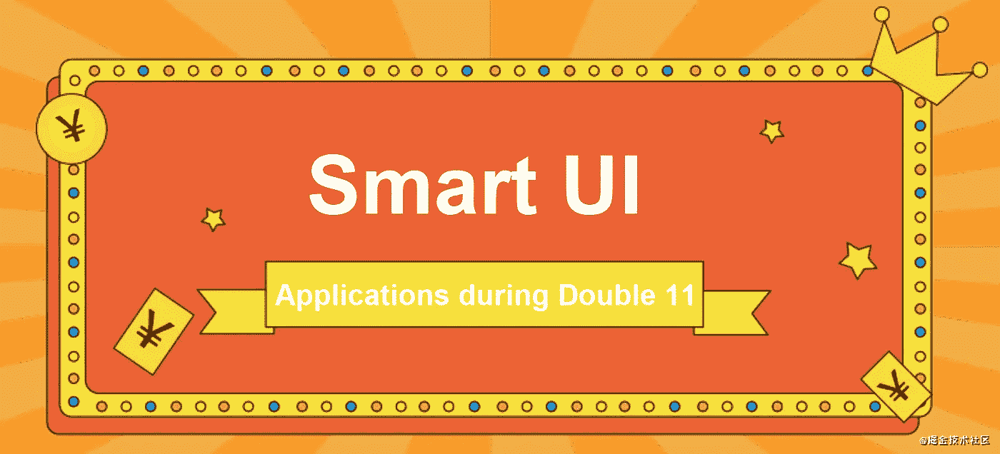
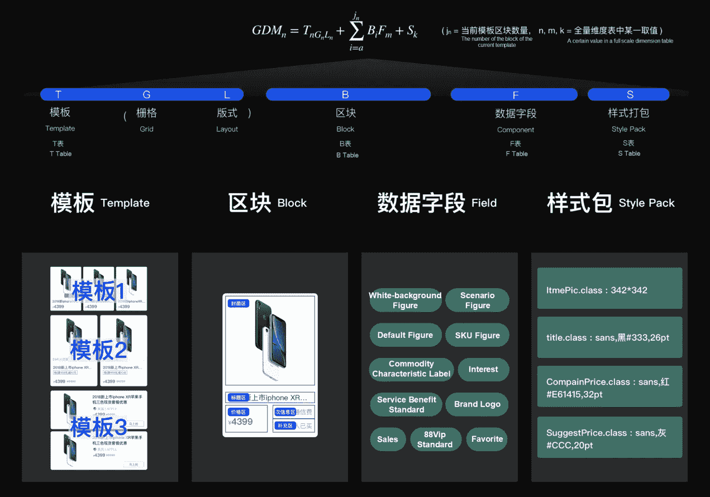
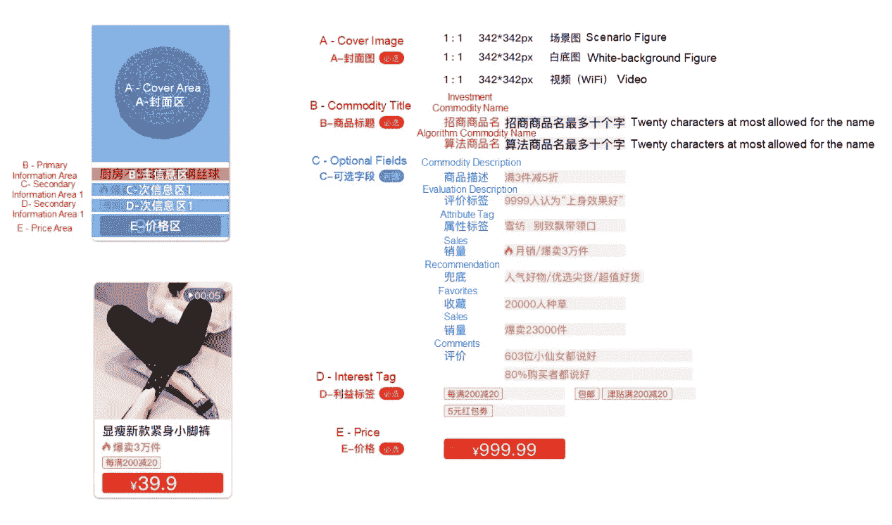
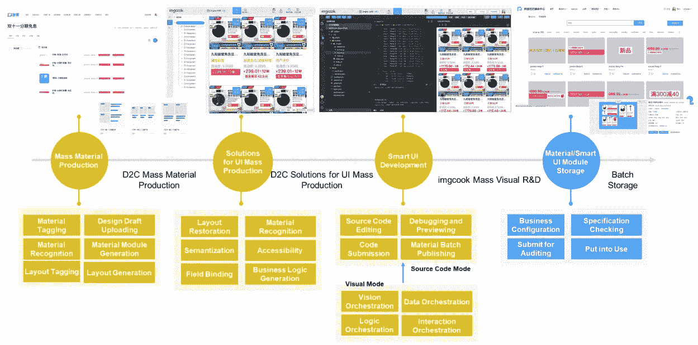
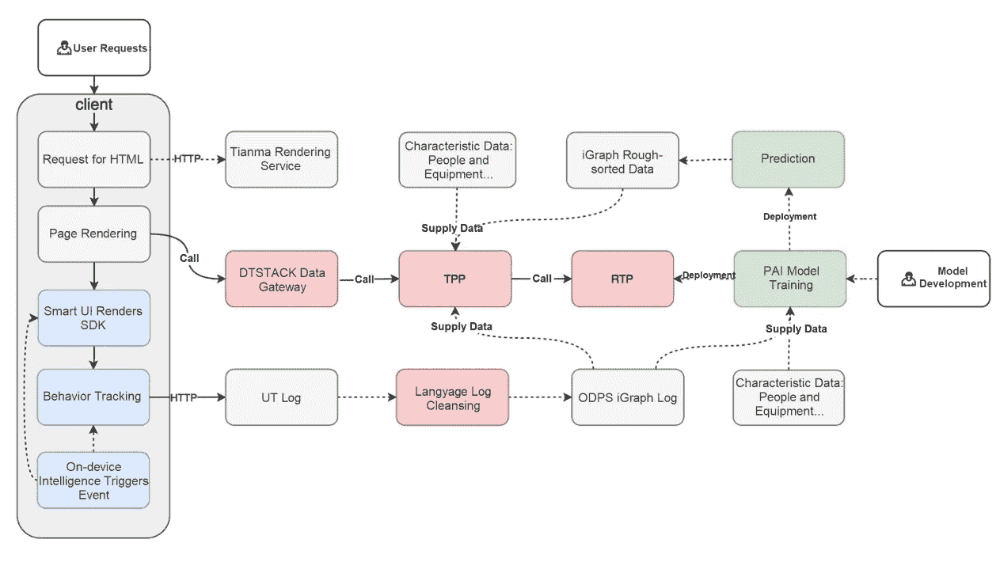
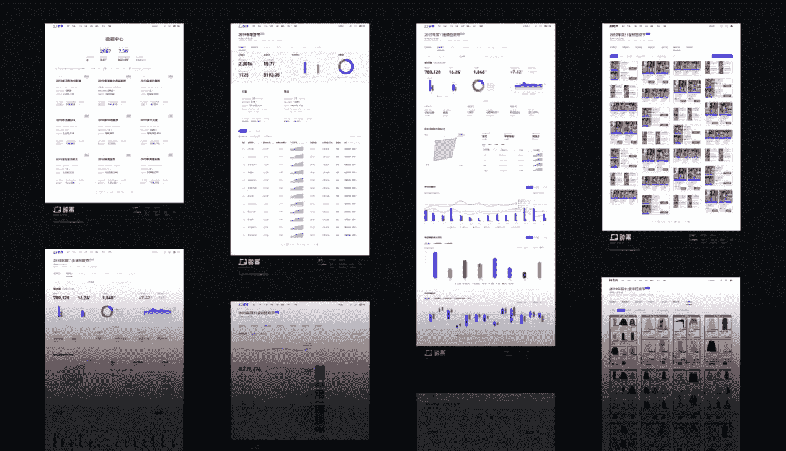
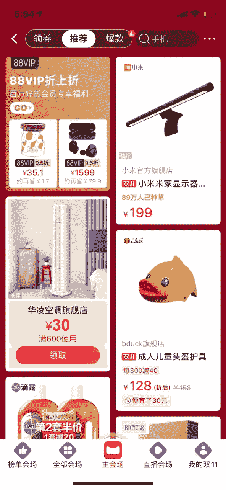
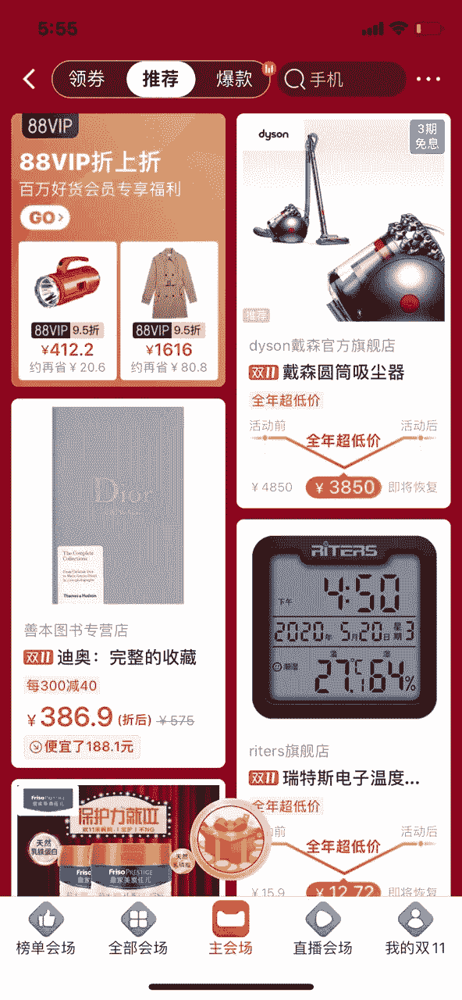
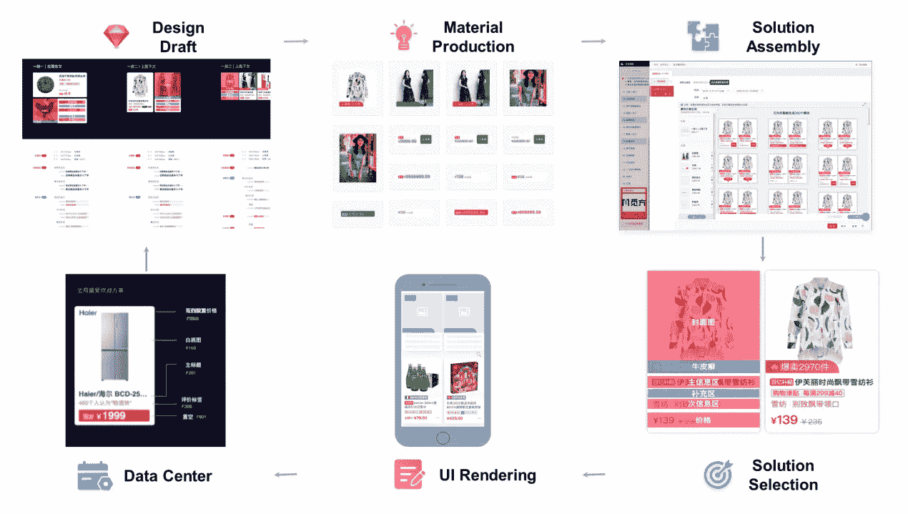
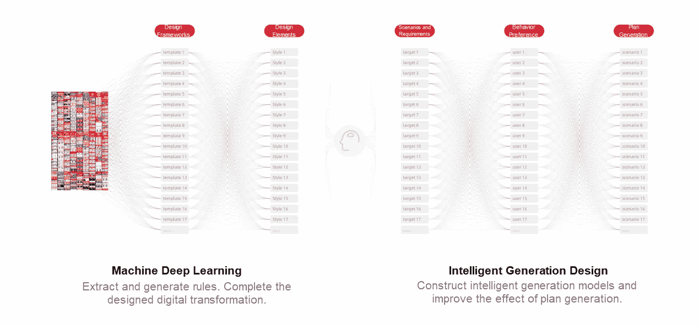

# 智能 UI 在双 11 期间的应用

> 原文：<https://medium.datadriveninvestor.com/the-application-of-smart-ui-during-double-11-73de2093c963?source=collection_archive---------35----------------------->


*由新宇，由*[阿里巴巴 F(x)团队](https://community.alibabacloud.com/users/5285991169880843)



# 背景

如果以电商平台淘宝为例，移动互联网和推荐系统的发展，人和商品的精准匹配提高了商业效率。但当流量增长出现瓶颈时，依靠流量的快速增长是无法推动业务快速发展的。更多细粒度的方法逐渐应用于个性化推荐，如基于场景的推荐和人群定向投放技术。除此之外，商品信息比以往任何时候都更加丰富。有各种买手秀，品牌代言，放心购买服务。用户的手机屏幕也越来越大，有更多的空间来展示信息。如此丰富的信息和巨大的屏幕给信息呈现带来了新的挑战。在特定的场景中可以获得很多信息。有时候很难找到用户需要的信息并提供合理的 UI 解决方案。本文描述了如何在双 11 期间利用算法为用户提供更友好的 UI。并重点阐述了如何通过智能 UI 激发用户兴趣，提高流量分发效率。


# 什么是智能 UI？

智能 UI 是一个通用概念，涉及 UI 智能生成、UI 定制、UI 智能适配和许多其他功能。如果一个 UI 是智能的和可管理的，那么它可以被称为智能 UI。目前，淘宝场馆中应用的智能 UI 是指使用人工智能提供个性化 UI 解决方案的解决方案。在项目的最早期，通过 A/B 测试实现了直接的定量测试，也展示了不同解决方案的数据效果中的值。得出的结论是，相同的 UI 解决方案在不同的场景中会有差异，不同的 UI 解决方案在相同的场景中也会有差异。换句话说，对不同的场景使用不同的解决方案是有意义的。基于 A/B 测试的结论，我们首次尝试在天猫场馆应用智能 UI。为天猫“热销”模块提供了两种 UI 解决方案。通过系统对页面跟踪日志的分析，分析每个解决方案的人群偏好。通过这样做，系统根据决策信息替换模块，并在用户进入会场时实现 UI 个性化呈现。

# 双 11 期间的应用

智能 UI 这两年一直是淘宝的一部分，以技术为导向，没有一个标准化的流程。现在，我们想在双 11 期间大规模应用智能 UI。为了实现这一目标，需要解决无法预见的问题。首先，应该提高智能 UI 的供应能力，以通过提高生产效率来实现更高的投入产出比。智能 UI 模块需要多种 UI 样式，这会增加前端模块的 R&D 成本。第二，智能用户界面带来的商业效果应该得到改善。在降低成本和提高效率方面，采取了几项措施:

1.  统一 UI 数字化协议，降低各种角色的沟通和协作成本，包括前端、设计师、算法和后端。
2.  采用多物料统一 R&D，提高 UI 解决方案的供应能力。大量的 UI 解决方案可以充分发挥推荐算法的作用。
3.  加快 UI 推荐算法建设。充分利用服务器算法和客户端行为特征进行联合决策。
4.  确保 UI 解决方案的数据可视化，完成数据中心建设。

## 用户界面数字化协议

一般来说，很难将设计数据应用到现实世界的场景中，因为它很难被结构化。而网购习惯使得很多常用模块在电商场景下逐渐结构化成为可能。因此，这些模块的功能目的、形式和表现形式都有事实标准。通过对在线页面的大量研究，智能 UI 设计团队提出了描述电子商务模块设计解决方案的 GDM 模型。GDM 包括界面的网格信息、布局信息和样式信息。具体定义如下图所示:



GDM 用于构建电子商务模块的设计数据。有了 GDM，数据可以贯穿生产和消费的整个过程，并最终被积累、归因和分析。当应用于真实世界场景时，GDM 被分成几个部分进行单独描述。让我们以方块部分为例。下图显示了智能 UI 产品模块的可视草稿，它分为封面、标题、卖点、营销和价格块。每个块都有一个唯一的代码，内部包含多个材料元素。(下图的最大解数是五块中物质元素数的乘积；3 *2* 8 *3* 1 = 144。)前端开发时，根据算法接口返回的唯一代码，将相应的素材渲染到相应的块上。



```
//Descriptions of blocks
[
{"name":"Cover","code":"A","children":["1","2","3"]},
{"name":"Title","code":"B","children":["1","2"]},
{"name":"Selling Points ","code":"C","children":["1","2","3","4","5","6","7","8"]},
{"name":"Marketing","code":"D","children":["1","2","3"]},
{"name":"Price","code":"E","children":["1"]}
]
```

## 多材料统一开发

基于模块中区域元素的分解，前端开发时产生粒度较小的素材。然后，渲染 SDK 将这些材料组装起来，实现一个前端模块。材料被分解成足够小的东西，因此只有 UI 样式和简单的业务逻辑需要处理。这样简单的材料非常适合用 imgcook 批量生产。今年双 11 期间，我们升级了智能 UI 的 R&D 程序，使用 imgcook 可视化 R&D 来应对智能 UI 的量产。设计师上传视觉稿后，imgcook 从视觉稿中分析 UI 素材。所有 UI 素材的开发和编辑都在同一个画布上。然后，大量出版这些材料。借助统一的物料 R&D 程序，前端生产流程的效率大大提高。



*The Imgcook Visual R&D Process of Smart UI*

## 自建算法(云+设备)

为了提升推荐效果，我们决定在今年双 11 期间，搭建一个解决方案推荐的推荐算法。以往在与搜索推荐算法团队合作的过程中，算法模型根据实时点击量对 UI 解决方案进行排序和评分。这种算法模型本质上是一种基于实时数据预测解决方案未来点击率的模型。算法不理解不同 UI 之间的差异，无法进行属性分析。此外，在低交通流量期间，可能会触发该效应的剧烈波动。当我们从前端开发者的角度重新思考智能 UI 推荐算法的想法时，我们的目的是让算法理解 UI。因此，最初开发该算法是为了增强算法对 UI 和用户行为的理解，以推荐相应的解决方案。自建推荐算法与普通推荐算法有两方面的不同。首先，将设备上的行为数据添加到模型中。(用户实时行为包括点击时间、浏览深度、滑动频率、停留时长等等。)这些数据用于根据用户在应用程序上的实时行为对用户进行分类。之后基于云算法数据综合分析后显示 UI。二是增加了材质的 UI 属性输入。通过输入 UI 属性，算法模型可以建立不同素材之间的联系。这使得算法能够理解不同材料之间的差异和关联，并在低流量场景下推荐相对高质量的解决方案。



*UI Personalized Recommendation Algorithm*

## 数据中心建设

智能 UI 产生两种类型的数据:生产要素数据和解决方案性能数据。前者是组装生产解决方案时生成的，后者是业务上线时通过收集分析页面状态得到的。这两种数据非常重要，对于不同的角色有不同的含义。它们的结合可以形成一个从设计稿到页面操作的小型数据闭环。需要完成业务接入、方案制作、方案选择、数据恢复的设计，才能完成数据中心建设。现在，我们已经完成了数据中心解决方案性能数据的部分构建。您可以在数据中心创建一个应用程序来检查智能 UI 的状态。然后，可以选择页面集，并设置开始时间和结束时间。最后，可以收集和分析数据。DataWorks 将定期从日志中清除选定的数据以供显示。



*Partial Screenshots of a Data Center*

# 实施结果

在 2020 年双 11 全球购物节期间，采用了智能 UI 解决方案来实现多个前端模块，包括热销模块、商品模块和商店模块。这些模块涵盖了双 11 的预售期和正式发售期。该算法程序经受住了高峰流量，带来了业务增长的稳定性。在其覆盖的 300 多个场馆中，最高 PV 点击率增长了 10%以上。智能 UI 已经成为流量精细化运营不可或缺的新功能。



*Partial Screenshots of the Hot Sales Module*

# 前景

## 推荐算法

提高推荐算法准确度的本质是帮助消费者找到信息更准确、布局更美观的 UI。目前，智能 UI 推荐算法基于模块块中的元素执行个性化推荐。当前端模块块保持不变时，如果仅改变了样式，则算法不能感知 UI 的改变。换句话说，算法对 UI 的理解还不够深入。因此，为了实现算法对 UI 信息更准确的感知，我们尝试通过图像识别技术提取前端 UI 特征。这些特征被输入到算法中以增加对 UI 的理解。当算法模型理解了 UI，下一步就是理解面对 UI 的人。在未来，推荐算法构建的几个方面将被优先考虑:数字 UI 积累、用户注意力分析、有效信息表达、用户 UI 偏好层次。这样做，算法可以理解 UI 和用户偏好，推荐效果可以提高更多。

## 智能一代

智能 UI 在线应用时，会产生大量有价值的跟踪数据，从中可以获得 UI 解决方案的曝光和点击信息。目前，这些数据用于推荐算法模型的训练。它们也可以用于设计稿的归属和迭代，我们还在探索中。未来，智能 UI 系统有望形成一个闭环。首先，设计师根据智能 UI 推荐的行业趋势制作视觉稿。第二，视觉稿自动还原成页面素材。第三，操作者选择材料来组装大规模解决方案。第四，算法推荐合适的解决方案。然后前端渲染 SDK 根据解决方案渲染并返回数据。接下来，数据中心积累设计元素的点击数据。最后，设计师根据返回的数据修改视觉草图，并再次进行材料的制作和投放。



有了智能 UI 这个完整的数据闭环，我们将和设计团队一起探索智能生成的实现。这旨在将人工智能等新技术引入设计行业。通过机器学习，我们旨在对 UI 设计素材进行排序和组合，比如预置的 UI 组件和 UI 模板。基于设计规则、表现逻辑、用户数据和算法模型，可以进行材料分类和组合，用于 UI 解决方案的大规模生产。这些 UI 解决方案可以满足业务需求和美学要求。通过这样做，我们可以为用户提供个性化的用户界面。设计和表达的智能生成有两个重要方面。第一个是智能生成规则的提取。设计效果需要抽象成机器能理解的规则。从而可以通过深度学习实现设计数字化。设计效果包括页面结构、产品材料、描述字段和样式。第二个是建立智能生成模型，以及生成规则、用户行为、场景需求和数据结果之间的映射关系。这需要建立具有上述方面的数据模型。该模型为每个用户、内容和 UI 表达式评分。然后，模型根据用户点击、停留时间、浏览转化、下单情况，评估用户对推荐内容和界面的满意度。最后，还有机器学习训练，为每个用户提供专属的个性化浏览界面。



# 原始来源:

[](https://www.alibabacloud.com/blog/the-application-of-smart-ui-during-double-11_597086) [## 智能 UI 在双 11 期间的应用

### 阿里巴巴 Clouder 年 12 月 31 日 230 作者新宇，来自阿里巴巴 F(x)团队如果我们把电商平台淘宝想象成…

www.alibabacloud.com](https://www.alibabacloud.com/blog/the-application-of-smart-ui-during-double-11_597086)