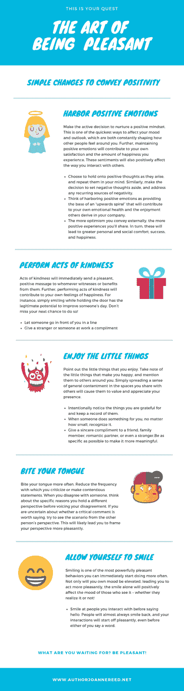

# 令人愉快的艺术

> 原文：<https://medium.datadriveninvestor.com/the-art-of-being-pleasant-c7037785bc2c?source=collection_archive---------5----------------------->

贾吉·瓦苏德夫(生于 1957 年 9 月 3 日)通常被称为萨德古鲁，是一名印度瑜伽士、神秘主义者和作家。他的传记作者阿伦达蒂·苏布拉马年在她的书《不仅仅是一生》中把他描述为一个多面性的人，一个个性张扬、精力充沛、富有同情心、热情、友好、风趣的人，但也可能是一个冷漠、神秘、挑衅和不可预测的人。萨德古鲁过着非凡而不设防的生活，让每个人都能看到这种人格的方方面面——从狂野的摩托车骑士到神秘主义者、瑜伽士和古鲁。他睿智的话语，这里是关于愉快和教导，已经帮助和激励了世界上许多人。

# 如何令人愉快

愉快是一门需要培养的艺术。在这篇文章中，我将带你在萨德古鲁的智慧之言的指引下，踏上*宜人之城*的旅程。

所有人类的经验都来自内心。你人生的使命之一，应该是变得像山一样稳；因为只有当一个人有一个非常稳定的基础时，许多事情才能发生。只有当你的生活绝对稳定时，生命的繁荣才有可能；否则，繁荣会导致疯狂。

第一件事是让你自己保持平衡，这样你就能感受到生活的魔力。平衡是让生活变得美好的必要条件。人类的情感是人类非常重要的一个方面。情感是一种强大的东西，它是一个人生活中最强大、最强烈的一面。问题是:当你有情绪的时候，你更喜欢愉快的情绪还是不愉快的情绪？这是一个显而易见的选择，我敢打赌，如果有选择的话，你们所有人都更喜欢体验愉快的情绪；但事实上，很多人在很多时候都保持着痛苦的情绪。所以你要问自己的问题是:你想变得愉快还是不愉快？

# Sadhguru 愉快的报价

*如果你的身体变得愉快，我们称之为健康。如果你的身体变得非常愉悦，我们称之为愉悦。*

如果你的心变得愉快，我们称之为平静。如果它变得非常愉快，我们称之为快乐。

如果你的情感变得愉快，我们称之为爱。如果变得非常愉快，我们称之为同情。

如果你的生命能量变得愉快，我们称之为极乐。如果它变得非常愉快，我们称之为狂喜。

如果你的环境变得令人愉快，我们称之为成功。

人们问自己:我应该去爱吗？你不需要去爱。只要对自己愉快，对你的思想愉快，对你的情绪愉快，对你的精力愉快。如果你能日复一日地做到这一点，你将成为一个了不起的人，作为回报，你将能够与你周围的人分享所有的快乐。

# 如何成为愉快的小贴士

令人愉快的人通常都更快乐，更乐于和他们在一起。与他人愉快的互动带来的快乐是人们评估自身幸福的最大因素之一，更不用说他们对生活的总体满意度了。

为了帮助你学习愉快的艺术，这里有一些简单的建议。

# 1.怀有积极的情绪

做出积极的决定，培养积极的心态。这是影响你的情绪和观点的最快方式之一，这两者都在不断地塑造着你周围其他人的感受。此外，保持积极的情绪将有助于你自己的满足感和你所体验的快乐程度。这些情绪也会积极影响你与他人互动的方式。

*   当积极的想法出现时，选择抓住它们，并在头脑中重复它们。同样，下定决心把消极的想法放在一边，解决任何反复出现的消极来源。
*   把拥有积极的情绪看作是提供一个"*向上螺旋*"的基础，这将有助于你自己的情绪健康和他人从你的公司获得的快乐。
*   你对外传达的乐观越多，你分享的积极经验就越多。反过来，这些将导致更大的个人和社会的舒适，成功和幸福。

# 2.做善事

善意的行为会立即向任何见证或受益于它们的人发出愉快、积极的信息。此外，做好事会让你感到快乐。例如，扶着门时简单的微笑有可能改善某人的一天。不要错过你下次这样做的机会！

*   让别人排在你前面
*   赞美陌生人或同事

# 3.享受小事情

指出你喜欢的小事。记下那些让你开心的小事，并向你周围的人提及。简单地在你与他人分享的空间中传播一种普遍的满足感，会让他们重视和欣赏你的存在。

*   有意注意你感激的事情，并记录下来。
*   当有人为你做了一些事，不管多小，都要认可。
*   真诚地赞美你的朋友、家人、爱人，甚至是一个陌生人。尽可能具体，让它更有意义。

# 4.忍住不说

多咬舌头。减少你批评或发表有争议言论的频率。当你不同意某人的观点时，在表达你的不同意见之前，想想你持有不同观点的具体原因。如果你不确定一个批评性的评论是否值得说，试着从别人的角度来看这个场景。这可能会让你更愉快地构建你的观点。

# 5.允许自己微笑

微笑是你可以立即开始经常做的最令人愉快的行为之一。不仅你自己的情绪会提升，让你表现得更愉快，微笑本身也会积极地影响看到它的人的情绪——不管他们是否意识到这一点！

在打招呼之前，对你交往的人微笑。人们几乎总是会报以微笑，你们的互动会愉快地开始，甚至在你们任何一个人说一句话之前。

我希望你开始采取措施提高你的快乐感，这将提高你的社交质量，并成为你自己和他人生活中快乐的源泉。

我亲爱的同伴，这就是你的追求！

Joanne Reed — www.authorjoannereed.net
Author of “This Is Your Quest”. You can’t buy happiness but you can buy books. Your mission, should you wish to accept it is to experience happiness