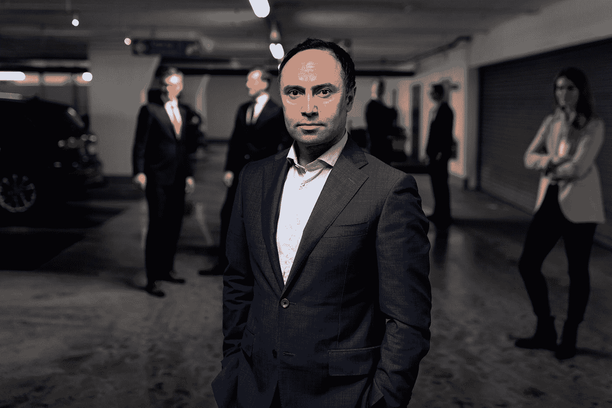

# 重塑自我的艺术

> 原文：<https://medium.datadriveninvestor.com/the-art-of-making-yourself-5ef10ffd8a14?source=collection_archive---------24----------------------->

## 重塑自我，让梦想的生活成为现实。

Photo by [Roland Samuel](https://unsplash.com/@rosam2020?utm_source=medium&utm_medium=referral) on [Unsplash](https://unsplash.com?utm_source=medium&utm_medium=referral)

我最近和我的一个好朋友聊天，他们是 10 多年前在我第一次工作的公司认识的——第一次也是最后一次，自从我开始工作以来，我再也没有在任何公司工作过——谈论我们是如何以不同的方式发展的，以及各自是如何走上自己的路的。他继续为那家公司工作，尽管这对他来说并不坏，但他总是向我强调他是多么“羡慕”(以一种非常健康的方式)我选择的道路。

在那次谈话中，我们并不孤单，他的另外两个同事对我目前在做的事情很好奇。

有趣的是，我发现这种类型的谈话通常会以一连串的问题结束，以进一步调查我的工作和个人生活。我想遇到一个“古怪”的人会引起一定的好奇心，他选择与谁交往很好，他不看电视，有时与他见面是不可能的任务，或者他喜欢读一本好书而不是看电影。

关键是，我总是看到自己试图总结我认为标志着我职业生涯的要点是什么，以及从我承诺成就自己的第一天起我是如何努力的。

这些原则如下:

# 你需要一个导师来指导你

想必你也曾有过这样的感觉:尝试着转圈前进，而不是直线前进。

即使是在职业和商业层面，你也会在需要有经验的人的建议来避免停滞的情况下受阻。

在这一点上，拥有一位导师是任何企业家或小企业主职业发展的关键。

导师是在他之前已经经历过的过程中牵着你的手的人，从而避免犯许多错误，并就你必须做出的决定提供建议。它鼓励并推动你实现目标。非常重要的是，它要求你有结果，控制你的努力，它要求你有所交代，这样你就不会躺在功劳簿上。

投资导师是我做过的最好的决定之一。归根结底，这是关于拍一张比你更大的照片，并努力赚回你浪费在闲逛上的所有时间。

 [## 取代你的风投？企业家的 5 条原则|数据驱动的投资者

### 在 Tau Ventures，我们建议所有企业家将融资过程中的勤奋过程视为双向的…

www.datadriveninvestor.com](https://www.datadriveninvestor.com/2020/11/29/replacing-your-vc-5-principles-for-entrepreneurs/) 

# 你必须很好地选择你的朋友

另一个关键点，和前一个一样重要。选择好与我交往的人，让我的头脑中很少会有那些很少理解我的人的意见。

如果你与和你想法不同的人交往，与你没有相似的志向，与你的人生抱负相去甚远，那就是你在冒险中感到孤独的时候。

你不能和任何人谈“你的”，多半是因为没人能理解你。

被那些只告诉你坏消息而从不告诉你好消息的人，那些只知道抱怨的人，那些不相信过上更好的生活是可能的人，那些追求简单和快捷的人包围着……你必须从你的生活中清除那些有毒的人。有时他们是朋友，有时是家人，有时是同事；越远越好。

这就是为什么找到另一种类型的友谊是至关重要的，那种你可以敞开心扉，分享你的抱负和担忧的群体。一群拉你起来不推你下来的人。最重要的是，你可以从中学习。成为这样一个团体的一员必须成为你的首要任务。

为了全力以赴，你需要一个积极和胜利的心态。

# 投资自己，训练自己

你每月有投资自己的预算吗？无论是面授课程、在线课程、书籍、咨询……无论如何，你都需要把你每月收入的一部分用于培训。同理，如果你有一个企业，如果你不投资它，它永远不会成长。

**自从我开始工作以来，我就没有停止过对自己的投资**，认为自己已经知道所有的事情或者认为自己不需要学习是很多人犯的一个大错误。

在这方面，钱不能成为借口。如果你想在职业上进化和成长，你将不得不掏你的口袋。没有别的了。

列出你的优先事项，并意识到你在哪里投资。你能每个月去看电影吗？你偶尔在这儿出去吃饭吗？你定期购买 break 吗？当然，你完全有权利，我也是，但是也许你可以减少那份费用清单，每月为你的训练分配一小笔费用。最终，没有人会放弃任何东西，任何想要东西的人都要付出代价。

这些是我认为最重要的几点，也许你也有你的观点。

**访问专家视图—** [**订阅 DDI 英特尔**](https://datadriveninvestor.com/ddi-intel)