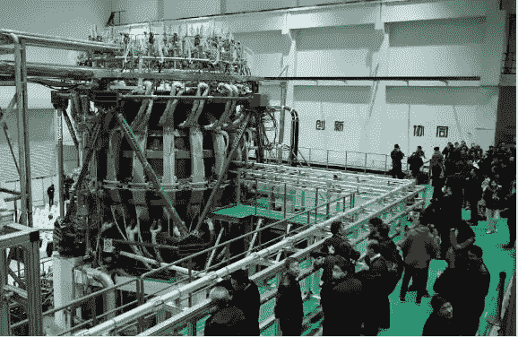

# “人造太阳”可能是解决世界日益增长的能源需求的答案

> 原文：<https://medium.datadriveninvestor.com/the-artificial-sun-is-might-be-the-answer-to-the-world-s-growing-energy-demands-7e0a049adfc8?source=collection_archive---------11----------------------->

## 随着能源消耗的快速增长和能源短缺，世界准备好接受一种现代、能源充足、清洁但昂贵的能源形式了吗？

An illustration of a Nuclear Fusion reaction inside a Tokamak device.

人造太阳是一个核聚变反应堆，可以在未来几年推动世界的能源雄心。该反应堆通过向一个封闭的热等离子体回路施加强大的磁场来发电，该回路的温度可达到 1.5 亿摄氏度，比太阳核心的温度高 10 倍，但磁体和过冷技术使其保持封闭，一个名为[托卡马克](https://www.iter.org/mach/Tokamak)的设备使用强大的磁场将热等离子体限制在圆环的形状。

[PHOTO](https://www.wionews.com/world/china-turns-on-its-nuclear-powered-artificial-sun-347548)

让我说清楚:我们产生的所有能量都来自基本的化学和物理过程。[裂变和聚变](https://www.energy.gov/ne/articles/fission-and-fusion-what-difference)是从原子中产生大量能量的两种物理过程。

## 当一个较大的原子分裂成两个或更小的原子时，就会发生裂变——这通常用于生产核动力武器，并且正在一个高度危险的核动力工厂中生产。

## 然而，当两个原子结合在一起，从较轻的原子形成一个较大的原子时，就会发生聚变。因此，它不会产生高放射性裂变产物或任何盗窃原子材料的威胁。

核聚变在自然界中是丰富的，其无穷无尽的资源可以从海水中提取，海水可以变成氘，而氚可以从聚变反应本身产生。它不仅将解决世界的战略能源需求，还将为可持续发展和全球经济做出重大贡献。

让我们以[韩国的人造太阳](https://www.express.co.uk/news/science/1376946/south-korea-artificial-sun-kstar-world-record-tokamak-nuclear-fusion-evg)为例，[韩国核聚变研究所](https://www.kfe.re.kr/eng/index)最近在今年 12 月宣布，他们的核聚变装置创造了一项新的世界纪录，保持 1 亿摄氏度的等离子体流 20 秒，尽管这不是聚变反应堆第一次达到 1 亿摄氏度，但这是第一次运行超过 10 秒——并且打破了纪录。在这种情况下，聚变反应堆将使我们能够利用地球上的太阳能，并有可能解决世界的能源需求。

韩国的聚变装置使用氢的同位素来产生灼热的等离子流——这是物质的四个基本要素之一，在这里单个离子和电子被分离。

在完全彻底的聚变反应中，从一升海水中提取的氘将释放相当于 300 升汽油的能量。它也被认为是清洁能源，因为它不产生温室气体，但几乎没有核废料。

位于法国的全球最大核聚变研究项目国际热核聚变实验堆预计于 2025 年完工。一个始于 1987 年的项目涉及来自 35 个国家的科学家，旨在将新能源用于商业用途。

以解决世界能源需求为目标，考虑到高达 225 亿美元的天文成本，实现这两种聚变无疑是困难的。

**访问专家视图—** [**订阅 DDI 英特尔**](https://datadriveninvestor.com/ddi-intel)