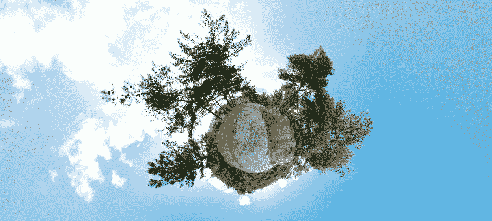
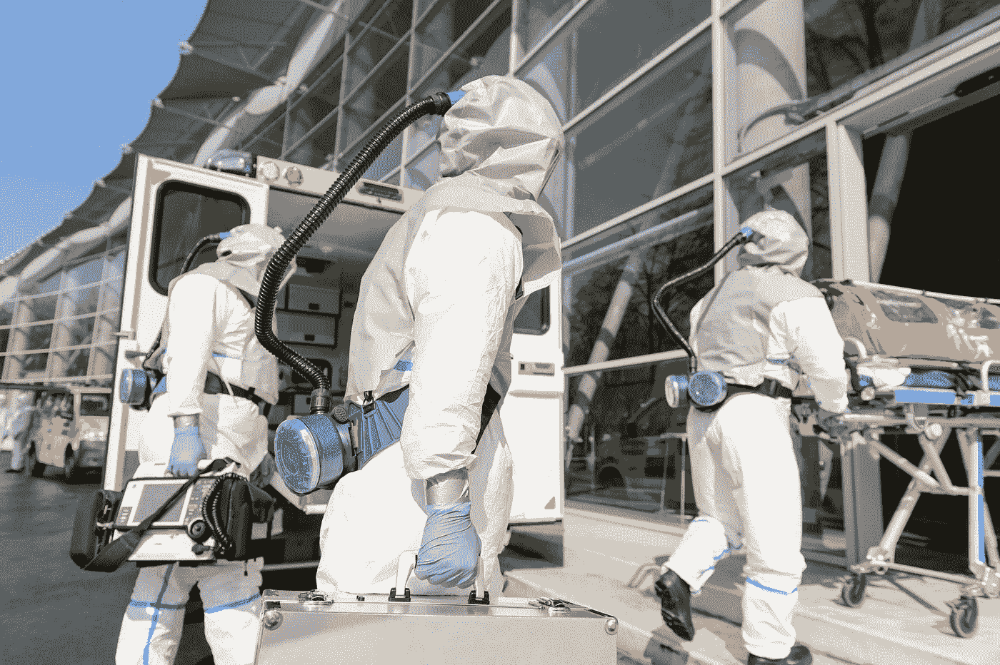

# 2020 年破坏你注意力和生产力的坏习惯，以及让你感觉更好的好习惯。

> 原文：<https://medium.datadriveninvestor.com/the-bad-habits-destroying-your-focus-and-productivity-in-2020-and-the-good-ones-that-will-make-you-3bf75c0a5574?source=collection_archive---------16----------------------->

2020 年终于要结束了……我们比以前拥有更多的信息、相互竞争的优先事项和对未来合理的恐惧。从你跳下床的那一刻起，一直持续到你入睡的那一刻。希望不需要数羊就能做到。技术使我们生活中的噪音数量和音量大大增加，经常接触噪音会对我们的身体和心理健康产生各种后果。

你可能以完成重要事情的计划开始每一天**，但很快发现自己变得分心，专注于不需要太多思考的任务，即使你整天呆在室内也要洗 15 次手，用热茶烫喉咙，滚动手机，或者简单地说，拖延。**

**全球化的疫情解释了这种绝望，并让你更容易为自己的行为辩护。所有这些**恐惧**:它将如何影响我的工作？经济？家人？你一遍又一遍地滚动新闻，发现没有答案，只有不同的假设和最坏情况的建议。事实是，我们无法确切知道未来会发生什么，但是让这些嘈杂的想法充斥我们的大脑是没有帮助的。我们每个人都需要一个度过难关的计划。**

****

**我们需要找到**焦点**并且我们需要**富有成效**因为今天的形势要求我们在如何度过我们的时间以及在哪里投入我们的精力方面变得更加深思熟虑。**

**因此，有意识地关注一些可能从困境中走出来的好事，将有助于抑制我们的恐惧，帮助我们保持乐观。**

**当然，我们有理由责怪影响我们注意力的外部因素，但是我们对进入我们生活、大脑和身体的刺激有某种控制。**

**如果你想更专注、更有效率，你必须改变你的习惯，因为你每天做出的选择会让你更专注——或者让你分心。**

**简单明了— **人类是习惯的动物**。我们所有的习惯决定了我们在生活中能有多有效或多无用。**

**戒掉我们所有的坏习惯并不容易，因为有些坏习惯是自动运行的，绕过了思考过程。**

**然而，就像生活中的每件事一样，当你在习惯中加入更多好的东西时，坏的东西就会自动消失。**

**我们只有这一刻，一次只能走一步 …这是肯定的事“只要相信自己，你会意识到，即使是那些朝着正确方向迈出的小步，也能产生伟大的结果。”**

## **让我们从 5 个简单的习惯开始，它们将有助于提高你的耐力和心理健康。**

*****1。喝足够的水。*****

**你需要水来消化食物和清除废物。脱水导致低能量、头痛、荷尔蒙失衡和疲劳，因此我们的注意力非常挣扎。不存在每个人每天都需要喝的神奇水量。你需要的量取决于你的年龄、体型、健康和活动水平，加上天气(温度和湿度水平)。**

*****2。睡眠充足。*****

**睡眠是每个人整体健康和幸福的重要组成部分，也是经常被忽视的部分。获得足够的休息也有助于防止体重过度增加、心脏病和疾病持续时间延长。没有适当的大脑恢复时间，我们将无法长时间保持注意力。国家睡眠基金会指南建议健康的成年人每晚需要 7 到 9 小时的睡眠。对于一些情况特殊的人来说，在“可接受的”睡眠量范围的任何一边都有一些回旋的余地。**

*****3。减少一些糖和碳水化合物。*****

**糖有几个问题。最大的问题是没有营养价值。含糖食物不能提供你从其他更健康的食物中获得的饱腹感，所以当人们吃含糖更多的食物时，他们往往会摄入更多的热量。此外，糖会升高血压，增加慢性炎症……我们的大脑对含糖和加工食品上瘾，产生大量内啡肽，让我们暂时感觉良好，然后我们就陷入了由糖引起的高潮和低谷的过山车。因此，我们有时会停下手头的工作，去寻找更多的糖。纯粹是浪费我们的时间…**

*****4。限制社交媒体。*****

**无论你今天在电脑或手机上做了什么，很可能都与社交媒体有关——在脸书上与朋友相聚，在 Instagram 上发布照片，浏览推特……旨在拉近我们距离的平台怎么会对我们的心理健康有害呢？这就像社交网络使用的算法一样复杂——有些事情是清楚的，更多的将在以后被发现。显而易见的是——你使用平台越多，你就越多地参与到社会比较中，有时是出于你的选择，但更多时候是无意识的……已经有几项研究将社交媒体的使用与抑郁、焦虑、睡眠质量差、自卑、注意力不集中联系起来，这样的例子不胜枚举。**

**社交媒体戒毒和戒毒项目不时在不同的地方出现，但它们需要钱……所以，也许，在参加一个项目之前，你可以通过简单地减少你参与社交活动的时间来帮助自己。**

*****5。尽量避免一心多用。*****

**有时候，在简历中写上“一心多用没有问题”是绝对必要的。如果你现在就做，人力资源部门可能会认为你是个骗子，因为很久以前就证明了多任务处理在生物学上是不可能的。尽管如此，我们仍在努力。也许，只是一个坏习惯…**

**认知带宽或“心理空间”是我们可用于完成任务的认知资源的数量，或者简单地说，是我们在给定时间内在大脑中可以容纳的思想和记忆的数量。这也是我们集中注意力、做出好的决定、坚持计划和抵制诱惑的能力。**

**因此，当你试图同时处理不同的任务时，你的大脑真的需要额外努力才能在多种想法之间切换。**

**也许，下次试着设置一个 10 分钟的计时器，并致力于一项任务。然后给自己一点分散注意力的时间，花一些额外的时间回到任务上。很快你就会看到“无多任务方法”的好处，更多的事情会被完成。**

**做得好，如果你正试图应用 5 个简单的习惯来提高你的耐力和精神健康。但是万一你做了并且还在疑惑——为什么我的生活如此糟糕。记住，**这不一定是你的生活，你可以改变它**。你可以让自己变得更好。为此，还有更多的智力练习**

*****1。不要拿自己和别人比较。*****

**如果你在检查别人在做什么或他们对你的看法，你就不可能专注于自己的成长。如果你拿别人的长处和你的短处比较，你永远不会赢…这就是我们通常做的。所以，不要偷走你生活的快乐——成长，但不要攀比。**

*****2。光想着做一件事是不够的，你必须去做。*****

**“没有执行力的愿景……只是幻觉。”所以，写下或大声说出你想要达到的目标，然后开始工作。你不需要在你做的事情上做得很好，你只需要养成做事情的习惯。**

****

*****3。创建一个计划。*****

**伟大的执行始于计划。该计划设定了“为什么”,然后列出了“什么”,然后是“如何”,或者需要你和那些想在路上帮助你的人执行的步骤和行动。不要忘记完成行动的时间表或“时间”。这个计划必须尽可能清晰和全面。**

*****4。做得太多带来的太少。*****

**目标的最佳水平不是太多，也不是太少，而是一个刚刚好的数量。如果你正朝着八个不同的里程碑努力，你将会花费八倍的时间。所以，尝试选择优先事项并专注于它们是值得的…对一些人来说，这将是少数，对某些人来说。**

*****5。专注于你能控制的事情。*****

**我们可以控制我们的输入，但我们不能控制结果。**

**我们可以控制自己在人际关系中的行为，但我们无法控制别人对我们的看法。我们可以控制我们生成的工作的质量，但有时人们更喜欢以不同的方式完成事情…**

**无论如何，专注于我们无法控制的事情会让我们效率降低，并可能导致我们最害怕的结果。我们在我们无法控制的事情上花费的时间和精力越多，我们在找出我们可以有所作为的方法上花费的时间就越少。**

**可以肯定的是，持续的高价值产出必然会产生积极的结果。**

**如果我们没有朝某个更好的方向前进，那么我们就只能停留在这个时刻，没有特定的方向。**我们应该一直努力追求更好的生活吗？****

**当然不是，如果你在生活中有某种不前进的清晰和舒适，那么毫不犹豫地使用它。玩笑归玩笑。**

**但是，如果你发现自己对自己在生活中的位置感到不舒服，那么也许你可以允许自己继续努力让自己变得更好。**

**视频:**

**作者海伦娜·马克舍姆，lenkamaxem@gmail.com**