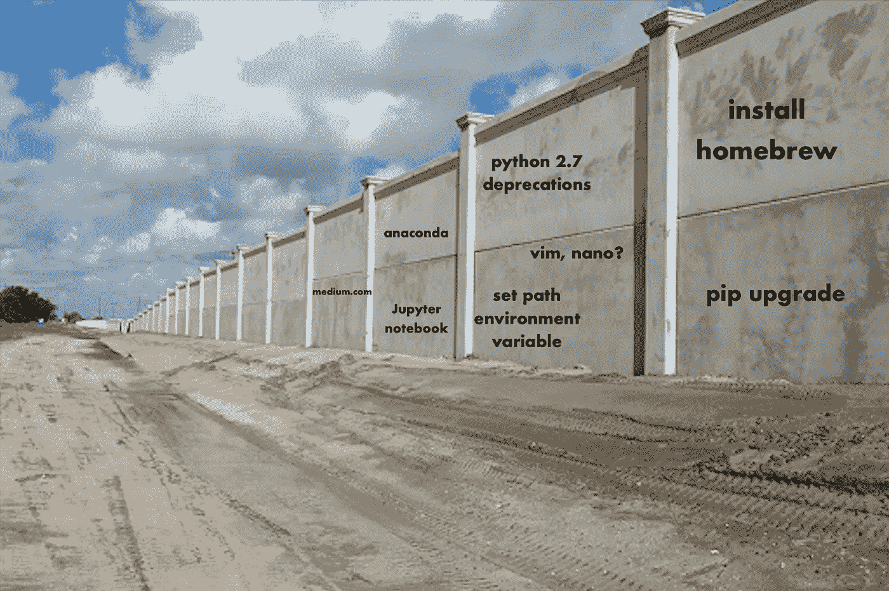

# 数据科学的入门壁垒

> 原文：<https://medium.datadriveninvestor.com/the-barrier-to-entry-in-data-science-ec875077e467?source=collection_archive---------5----------------------->

对疲惫的有抱负的数据科学家来说是一盏安慰的明灯

Just for starters. Stack Overflow comes later.

开始从事数据科学或任何子技术领域的工作都非常令人沮丧。进入壁垒本身通常就足以作为守门人，我所说的*进入壁垒*是指:

*   能够使用速度和功率都足够高的计算机进行有效的学习
*   对诸如*终端、bash、unix、IDE、ipython 笔记本、内核、依赖项、库、框架、包、导入、脚本、编辑器、外壳、虚拟环境、Docker 容器、*之类的东西没有概念上的了解，这仅仅触及了技术的**一般抽象**的晦涩词汇的表面
*   商业知识，或对生态系统意图的预先认识，如 UX 和使用 JavaScript、HTML 和 CSS 的网络开发；或者 Python 和 Jupyter 笔记本或者数据科学的 R；或者 Java 和 C++天知道是什么
*   围绕科技文化的巨大范围和令人生畏的神秘感，我通常指的是傲慢和传统教学或移情教学法的极度缺乏

描述科技学习经历的最常见的半开玩笑是:

> “L *学会如何谷歌*。”匿名，带着得意的假笑

虽然这种描述是正确的，因为它从一个拥有丰富技术经验的人的角度捕捉到了学习的感觉，但它没有反映出初学者实际上是如何学习的。虽然有些人对研究和谷歌搜索有偏好，但他们可能对通过搜索来学习的过程感到舒服，我发现大多数情况下谷歌搜索**比看起来更难。**

每当我听到这个建议，“谷歌一下就好了”，每当面对一个 bug 或问题，我都会因为 95%的时间里伴随着它的沾沾自喜而产生轻微的存在主义愤怒，因为这样的建议没有承认**理解一个问题以便谷歌它的必要性，并且理解任何问题，无论是在 JavaScript 还是 Python 的上下文中，都是为了已经有一个确定潜在解决方案的框架。**

这是一个非常微妙的概念。

# 为什么这是一个非常微妙的概念

([source](https://www.mirror.co.uk/news/uk-news/falls-faster---bowling-ball-4574413))

理解学习者的*概念环境*是一个好老师的标志。为了理解学习者的概念环境，教师必须记住或模拟学习的感觉，就像初学者一样**不知道他们不知道的东西**。

硬科学尽管复杂，但具有教学优势，因为它们的研究对象已经通过人类基于物理属性将对象视为独立的并推断它们之间相关抽象的倾向而预先定义。

*   一个生物体不同于另一个生物体，因为它们在空间上是分离的，被不同的、可见的包含器官的皮肤束所包围(生物学)
*   至少在 DNA 被发现之前，两个物种在外表(表现型)上的某些差异是不同的，DNA 提供了通过基因型(遗传学)进行区分的新的无形属性
*   运动定律是从观察石头落下和箭飞以及痴迷于圆和神圣的以太(亚里士多德物理学)中推断出来的，直到通过望远镜目睹的开普勒椭圆暗示了引力，导致了牛顿物理学的出现[一场经典的科学革命](https://en.wikipedia.org/wiki/Paradigm_shift)(物理学)
*   一堆四个苹果比一堆六个苹果少两个苹果。一个孩子通过观察(感官)学习这些被称为*数字*的抽象概念，再加上人类天生的语言(数学)抽象倾向

技术领域正在发生什么？

有一种趋势认为技术和“计算机科学”是一门科学。这可能与“科学”一词包含在短语“计算机科学”中的事实有关。因此，STEM 的保护光环使环境和科技从业者受益匪浅。

但是根据我的经验，学习编程语言更像是学习比较文学。

# 为什么学习编程语言更像是学习比较文学

([source](https://www.theirishroadtrip.com/the-long-room-photos/))

首先，看看维基百科上的[依赖地狱](https://en.wikipedia.org/wiki/Dependency_hell)。

> **依赖地狱**是一个[的口语术语](https://en.wikipedia.org/wiki/Colloquialism)，是对一些安装了[软件包](https://en.wikipedia.org/wiki/Package_manager)的软件用户的挫败感，这些软件包对其他软件包的特定[版本](https://en.wikipedia.org/wiki/Software_versioning)有[依赖](https://en.wikipedia.org/wiki/Coupling_(computer_programming))。[【1】](https://en.wikipedia.org/wiki/Dependency_hell#cite_note-Dependency_Hell-1)

太神奇了。软件有它自己命名的问题，即由人类设计的系统的复杂性，而不是为人类设计的。

另外，让我们来看看“编程语言”这个短语。

它被称为编程语言。理解科技世界的恰当隐喻是探究，这种隐喻一直潜伏在人们的视线中，但 STEM 的高预言保护它不与任何与语言学、语言和文学有本质区别的事物*表层*联系在一起。

当我们透过一个第一次遇到罗塞塔石碑的古代探险家的镜头来看待有抱负的数据科学家的挫折时，事情终于开始变得更有意义了，一个既不会说也不会读古希腊语或古埃及语的探险家，所以**T5 显然不能谷歌他无法理解的东西，特别是如果他试图解决的独立问题是用希腊语、埃及语或 Python 等语言。**

许多教程显然是围绕教授这些基础知识而设计的，然而也许 20 个教程中有 1 个*没有以免责声明开始*如果你不熟悉[X 语言、框架、包、库等],你将会有一段糟糕的时间。]**

围绕技术和数据科学教学的文化不是任何人的错，而是编程本身残酷混乱的历史的反映，除此之外，计算机不是人类探索的直观对象。它们是累积的低级语言的怪异混乱:编译、转换、废弃、再次编译、升级、丢失、调试、调试，然后就在一切看起来不错的时候被废弃。

这篇文章的最终目的不是建议不切实际的改变，因为它不会发生。它只是提供一点温暖，在冰冷的学习沙漠中提供一盏欢迎的小灯笼，并提醒任何在无休止的媒体教程的单调中看到这篇文章的学习者，*这不是你的错*，*它只是荒谬地复杂，并不是为人们设计的，希望这篇小文章足以作为一个喘息，以新的鼓励推动你进入下一个。你最终会到达那里，也许我也会。*

Onward!

感谢你的阅读。