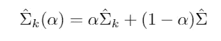

# 分类的基本方法

> 原文：<https://medium.datadriveninvestor.com/the-basic-methods-for-classification-9c10a961b0ee?source=collection_archive---------13----------------------->

Photo by [Tim Trad](https://unsplash.com/@timtrad?utm_source=medium&utm_medium=referral) on [Unsplash](https://unsplash.com?utm_source=medium&utm_medium=referral)

## 机器学习理论

## 线性分类方法

当我们尝试将我们的数据分类到不同的组中时，我们的预测器 **G(x)** 在离散集合 **ζ** 中取值，我们可以将输入空间划分为根据分类标记的区域集合。对于线性方法，我们的意思是预测类之间的决策边界是线性的。

# 指标矩阵的线性回归

所有响应类别都有一个指示变量。这样如果 **ζ** 有 **K** 类，就会有 **K** 这样的指标 **Yk: k = 1，…，k** 与 **Yk=1** if **G=K** ，else **0** ，这些就叫做哑变量。所有这些变量一起收集在一个向量 **Y = (Y1，Y2，…，Yk)** 中，并形成一个 **NxK** 矩阵，其中 **N** 是训练实例的数量。

然后，我们同时对所有 Y 列进行线性回归拟合:

Fitted vector, self-generated.

一个新的观察结果分类如下:

*   使用拟合的线性回归计算输出向量
*   确定最大的组成部分，并相应地进行分类。

The largest component, self-generated.

使用这个我们为每个类构造一个目标 ***tk*** ，其中 ***tk*** 是 ***KxK*** 单位矩阵的 ***kth*** 列。所以我们必须重现每一次观察的目标。我们可以使用最小二乘法求解:

Linear model and closes the target classification function, self-generated.

正如你可能注意到的，最小化问题与我们用于多重响应线性回归的问题完全相同。

这里我们发现一个问题，当 K>2 时，模型的刚性暗示着类很容易被别人屏蔽，而且随着 K 的增长它变大。为了解决这个问题，我们可以尝试对我们的输入变量进行多项式变换，但这有时会奏效，并非总是如此。这个模型会变得非常复杂。

# 线性判别分析(LDA)

假设 **f *k* (x)** 是类 ***中 **X** *的类条件密度**G = K*******，设* ***πk*** 是类**的先验概率 ***K*** 贝叶斯定理的一个简单应用给出:**

Applying Bayes theorem, self-generated.

所以，拥有 **fk(x)** 几乎等同于拥有 **Pr(G=k|X=x)** 。许多技术都基于类密度:

*   线性和二次判别分析使用高斯密度。
*   高斯混合模型允许非线性决策边界。
*   朴素贝叶斯假设每个类密度都是边际密度的乘积，每个类中的输入都是条件独立的。

如果我们将每个类密度建模为多元高斯:

Class density as multivariate Gaussian density, self-generated.

线性判别分析(LDA)假设类别具有共同的协方差矩阵 ***∑k = ∑∀k*** 。在比较两个类别 ***k*** 和 ***l*** 时，查看对数比就足够了，并且:

LDA log-ratio, self-generated.

相等的协方差矩阵使得归一化因子以及指数中的二次部分相消。该线性对数优势函数意味着两个类别之间的判定边界在 ***x*** 中在 ***p*** 维度上是线性的。所有类别之间都是如此，因此所有决策边界都是线性的。

线性判别函数

LDA functions, self-generated

等同于具有***G(x)= arg max _ kδ_ k(x)***的决策规则，在实践中我们将需要使用我们的训练数据来估计高斯分布:

Estimating gaussian distribution from data, self-generated.

在 2 个类的情况下，由于通过最小二乘法的 LDA 方向的推导没有对特征使用高斯假设，所以它可以扩展到高斯数据之外，但是截距仍然需要该假设。对于两个以上的类别，LDA 不同于类别指示矩阵的线性回归，并且避免了掩蔽问题。

如果不假设 ***∑k*** 相等，那么我们用来简化 ***fk*** 的抵消就不会发生，我们得到二次判别分析(QDA):

Quadratic discriminant analysis, self-generated.

然后，类之间的决策边界变成二次的 ***{x:δ_k(x)=δ_l(x)}。***

## 正则判别分析

该技术提出了 LDA 和 QDA 的组合，允许像 LDA 中那样将 QDA 的单独系数向公共协方差收缩。正则化的协方差矩阵如下所示:

Regularized covariance matrices, self-generated.

其中估计的 ***∑*** 是 LDA 中的汇集协方差矩阵，并且***α∈【0，1】***允许 LDA 和 QDA 之间的所有模型。

另一个选项是允许 ***∑*** 估计值向标量协方差收缩:

Regularized shrunk covariance matrices, self-generated.

其中 ***γ∈[0，1]。*** 用***【∑^(γ】***替换估计的 ***∑*** 导致更一般的协方差***【∑^(α,γ】***由协方差对索引。这导致更好的一般化，并允许更容易地解释系数。

## 降秩 LDA

该限制将允许我们查看数据的信息性低维投影。 ***k*** 质心 un***P***-维输入空间位于一个维数≤ ***K-1*** 的附属子空间中，如果 P 远大于 ***k*** ，这将是一个相当大的维数下降。此外，在定位最近的质心时，我们可以忽略与该子空间正交的距离，因为它们对每个类的贡献是相等的。这样，我们将维度投影 ***X**** 降低到子空间***【H _(k-1)***中，在这里进行距离比较。

*   如果 ***k = 3*** ，我们可以在一个 ***二维*** 表示中查看数据，添加颜色或尺寸的第三维。
*   在 ***k > 3*** 的情况下，我们要求一个 ***L < k-1*** 维空间***h _ l******⊆k _(k-1)***最优 LDA。最优定义为尽可能分散质心的 ***H_L*** 。

维度是有序的，因此我们可以按顺序计算额外的维度。寻找 LDA 的最佳子空间序列包括:

*   计算类质心的 ***K x p*** 矩阵 ***M*** 和公共协方差矩阵 ***W*** 。
*   使用*的本征分解计算 ***M* = MW^(1/2)****
*   *计算 ***B**** ， ***M**** 的协方差矩阵及其本征分解***b * = v*d_bv*^t.******ve *****【v ****的列从第一个到最后一个顺序定义最优子空间的坐标。***

*第 1 个判别变量由下式给出:*

**

*lth discriminant variable, self-generated.*

*The between-class variance is the variance of the class means of ***Z***, and the within-class variance is the pooled variance about the means.*

*Although we separate the most variance variables, our data will still overlap. By taking the covariance into account, a direction with minimum overlap is found.*

*The between-class variance of ***Z*** is ***a^TBa***, and the within-class variance ***a^TWa*** where ***W*** is defined earlier and ***B*** is the covariance matrix of the centroid matrix ***M***. ***B+W=T***, where ***T*** is the total covariance matrix of ***X***, ignoring class information.*

*Then the problem amounts to maximizing the Rayleigh quotient,*

**

*Rayleigh quotient maximization, self-generated.*

*This is a generalized eigenvalue problem, with a given by the largest eigenvalue of ***W^(-1)B***. Then the first direction ***a1*** is identical to ***v1*** and ***a2*** is the orthogonal direction to ***a1*** such that ***a2^(T)Ba2/a2^(T)Wa2*** is maximized.*

*Instead of being created for data variable reduction, this technique works well in classification problems. It’s performed by limiting the distance to centroids. The centroids of a gaussian classification can be shown to lie in an L-dimensional subspace ***R^p.*** Fitting this by maximum likelihood and then constructing the posterior probabilities using Bayes theorem rounds it.*

*Gaussian classification dictates the ***log*** ***π_k*** correction in distance calculation, that is because the misclassification rate is based on the area of centroids that overlap and if ***π_k*** are equal, both classes will receive the same amount of errors. If not, we can end up with misclassification errors caused by getting class centroids near the cut points.*

# *Logistic Regression*

*The objective of logistic regression is to model the posterior probabilities of K classes via linear functions in x, while at the same time ensuring that they sum to one and remain in [0,1].*

**

*Logistic regression, self-generated.*

*Here K-1 is the number of logit transformations(log-odds). The last class is used as the denominator in the log-odds ratio. We can obtain ***Pr(G=k|X=x)*** using exponents*

**

*Obtaining ***Pr(G=k|X=x),*** *self-generated.**

*为了简化符号，我们将使用θ作为整个参数集θ=*，从而表示概率***pr(g = k | x = x)= PK(x:***θ***)。*****

** [## 机器学习和人工智能如何改变电子商务的面貌？|数据驱动…

### 电子商务开发公司，现在，整合先进的客户体验到一个新的水平…

www.datadriveninvestor.com](https://www.datadriveninvestor.com/2020/11/19/how-machine-learning-and-artificial-intelligence-changing-the-face-of-ecommerce/) 

## 拟合逻辑回归模型

逻辑模型通常由最大似然拟合，使用 G 给定 X 的条件似然。由于 P(G|X)指定了条件分布，因此多项式分布是合适的。N 次观察的对数似然为:

Log-likelihood for N observations, self-generated.

其中***Pk(Xi:***θ***)= Pr(G = k | X = Xi，***θ***)。***

在两个类的情况下，算法很简单，通过一个 ***0，1*** 响应 ***yi*** 来编码两个类 ***gi = {1，2}*** 其中:

*   ***yi = 1***if***gi = 1***
*   ***yi = 0***if***gi = 2***

设***P1(x:***θ***)= p(x:***θ***)***和***p2(x:***θ***)= 1-p(x:***θ***)。*** 对数似然可以写成

Log-likelihood for N observations, self-generated.

这里 ***β = {β_01，β_1}，*** 并且我们假设输入向量*包含常数项 **1** 以容纳截距。为了最大化对数似然，我们将导数设为 **0** 。*

**

*The first derivative, self-generated.*

*这些是在 ***β中非线性的 p+1 个方程。*** 求解他们的方程组，我们可以使用牛顿-拉夫森算法，这种算法需要二阶导数或者海森矩阵。*

**

*The second derivative, self-generated.*

*从**开始*β旧*开始**，单次牛顿更新是:*

**

****βold*** *Newton update, self-generated****.****

*其中导数在 ***βold 处评估。*** 在矩阵符号中，我们可以把它写成:*

**

*Derivatives in matrix notation, self-generated*

*然后，牛顿步骤看起来像这样:*

**

*Newton steps in matrix notation, self-generated.*

*z 称为调整后的响应。该模型是一个迭代的加权最小二乘(IRLS ),因为在每次迭代中，它解决了加权最小二乘问题:*

**

*IRLS maximization problem, self-generated.*

*通常 ***β=0*** 是迭代过程的良好起点。*

## *二次近似和推理*

*最大似然参数估计值 ***、β^*** 满足自洽关系，它们是加权最小二乘拟合的系数，其中响应为:*

**

*The weighted least-squares response, self-generated.*

*权重分别是 ***wi = pi^(1-pi^)*** ，两者都取决于*本身。与最小二乘法的联系为我们提供了很多:**

*   **加权残差平方和是我们熟悉的皮尔逊卡方统计量。**
*   **渐近似然理论说，如果模型是正确的， ***β*** 是一致的，所以收敛到真的 ***β* 。****
*   **中心极限定理表明， ***β^*** 的分布收敛于 ***N(β,(X^TWX)^(-1)).*****

**由于需要迭代，逻辑回归模型的建模成本可能很高，因此存在一些流行的捷径来避免迭代，其中一些是 Rao 分数检验到 Wald 检验，它们基于当前模型的最大似然拟合。**

## **L1 正则化逻辑回归**

**L1 罚函数可用于任何线性回归模型。对于逻辑回归，我们可以将其添加为:**

****

**L1-regularization for logistic regression, self-generated.**

**我们可以用 IRLS 通过二次近似来解决这个问题。非零系数变量的得分方程具有以下形式:**

****

**Non-zero coefficient variables, self-generated.**

**它推广了 LAR。lasso 的 LAR 路径算法更困难，因为系数是逐段平滑的，而不是线性的。然而，可以用二次近似法来估计进展。**

# **逻辑回归与线性判别分析**

**这两个模型似乎是相同的，它们具有完全相同的形式，但是逻辑回归更通用，因为它做出的假设更少。**

**逻辑回归采用密度函数 ***Pr(x)*** ，并通过最大化条件似然来拟合 ***P(G|X)*** 的参数。同时，LDA 在先验密度的基础上，通过最大化全对数似然来确定参数。**

**通过依赖更多的假设，逻辑回归有更多关于参数的信息，并且可以获得更低的估计方差。**

**远离决策边界的观测值对于协方差矩阵估计是重要的，这使得 LDA 对显著异常值不具有鲁棒性。**

**如果一个平面上的数据可以用一条线分开，那么 logistic 回归就不会收敛到最优解，否则 LDA 就会做到。**

# **结论**

**逻辑回归和线性判别分析都是执行简单分类的好方法。逻辑回归是一个更稳健的模型，因为它的假设更少，但在实践中，这两个模型表现相似。**** 

**这是我的第 37 篇文章，我将在 GitHub、Twitter 和 Medium ( [Adrià Serra](https://medium.com/u/48c8d3ce491d?source=post_page-----7053db93ba6----------------------) )上发布这个挑战的进展。**

**https://twitter.com/CrunchyML**

****访问专家视图—** [**订阅 DDI 英特尔**](https://datadriveninvestor.com/ddi-intel)**