# 决策树的基础

> 原文：<https://medium.datadriveninvestor.com/the-basics-of-decision-trees-e5837cc2aba7?source=collection_archive---------0----------------------->

决策树算法-第 1 部分

## **1。简介**

决策树是非参数监督学习方法，可以应用于回归和分类问题。按照树的类比，决策树实现了一个连续的决策过程。从根节点开始，评估一个特征并选择两个节点(分支)中的一个，树中的每个节点基本上是一个决策规则。重复这个过程，直到到达最后一片叶子，这通常代表目标。如果我们关心可解释性，决策树也是有吸引力的模型。

## **2。各种决策树算法**

创建决策树的算法有:

*   [**ID3**](https://en.wikipedia.org/wiki/ID3_algorithm) **(迭代二分法 3)** 由罗斯·昆兰于 1986 年开发。该算法创建一个多路树，为每个节点(即，以贪婪的方式)寻找将为分类目标产生最大信息增益的分类特征。树生长到最大尺寸，然后通常应用修剪步骤来提高树概括看不见的数据的能力[【1】](https://scikit-learn.org/stable/modules/tree.html#tree-algorithms-id3-c4-5-c5-0-and-cart)。
*   **C4.5** 由 Ross Quinlan 于 1993 年开发，是 ID3 的后续版本，通过动态定义一个离散属性(基于数值变量)将连续属性值划分为一组离散区间，取消了要素必须分类的限制。C4.5 将经过训练的树(即 ID3 算法的输出)转换成 if-then 规则集。然后，评估每个规则的准确性，以确定应用它们的顺序。如果在没有规则的前提条件的情况下规则的准确性提高了，则通过移除规则的前提条件来进行修剪[【1】](https://scikit-learn.org/stable/modules/tree.html#tree-algorithms-id3-c4-5-c5-0-and-cart)。
*   **C5.0** 是昆兰在专有许可下发布的最新版本。与 C4.5 相比，它使用更少的内存，构建更小的规则集，同时更加准确[【1】](https://scikit-learn.org/stable/modules/tree.html#tree-algorithms-id3-c4-5-c5-0-and-cart)。
*   **CART(分类和回归树)**与 C4.5 非常相似，但不同之处在于它支持数值目标变量(回归)，不计算规则集。CART 使用在每个节点产生最大信息增益的特征和阈值构建二叉树[【1】](https://scikit-learn.org/stable/modules/tree.html#tree-algorithms-id3-c4-5-c5-0-and-cart)。

**scikit-learn** 使用优化版本的 **CART 算法**

## **3。决策树术语**

为了与树的类比保持一致，该术语采用了树的术语[【2】](https://gdcoder.com/decision-tree-regressor-explained-in-depth/)。

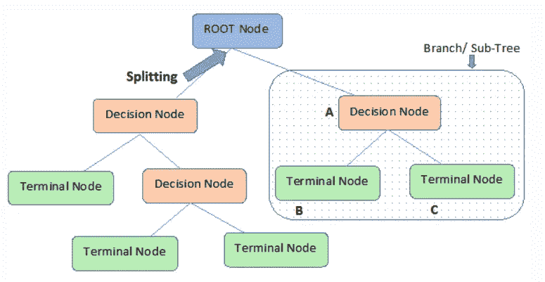

*   **根节点**:决策树的第一个节点
*   **分割**:从根节点开始，将节点分割成两个或两个以上子节点的过程
*   **节点**:将根节点的结果拆分成子节点，并将子节点拆分成子节点
*   **叶节点或终端节点**:节点的末端，因为节点不能再分割
*   **剪枝**:是一种通过删除决策树的子节点来减少决策树大小的技术。目标是降低复杂性，以提高预测准确性，并避免过度拟合
*   **分支/子树**:整个树的一个子部分称为分支或子树。
*   **父节点和子节点**:被划分为子节点的节点称为子节点的父节点，子节点是父节点的子节点。

## **4。决策树直觉**

让我们考虑下面的例子，其中决策树对决策树预测棒球运动员的工资情况:

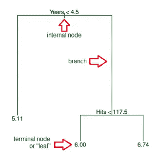

我们使用 Hitters 数据集，根据年数(他在大联盟中打球的年数)和击球数(他在上一年击球的次数)来预测棒球运动员的工资(平均对数工资)。

基于这些特征，决策树模型从树的顶部(根节点)开始学习一系列分裂规则。

1.  被分割成子节点根节点被分配给右分支，观察规则具有年份<4.5 to the left branch, which means the players in dataset with Years<4.5 having mean log salary is 5.107 and we make a prediction of e5.107 thousands of dollars, i.e. $165,174 for these players
2.  Players with Years> =4.5，然后该组被进一步细分
3.  在这种情况下，可以看到决策树将一个片段分成三个区域，其中该区域确定棒球运动员的工资，并且可以说该区域是决策边界[ [3](http://faculty.marshall.usc.edu/gareth-james/ISL/) ]。

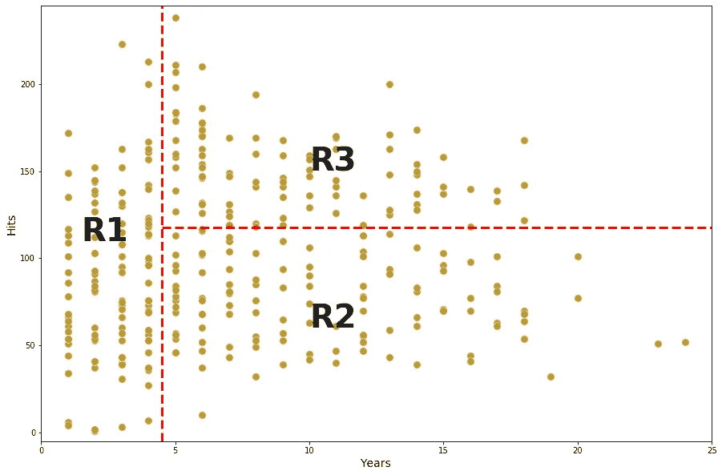

这三个区域可以写成

**R1** ={X |年< 4.5 }

*   **R2** ={X |年> =4.5，点击量< 117.5 }
*   **R3** ={X |年> =4.5，命中数> =117.5 }。
*   从这种直觉有一个过程，决策树如何分裂特征形成一个区域，可以预测棒球运动员的工资。这个过程将在下一篇文章(决策树算法-第 2 部分)中详细解释。

**5。决策树中的分裂**

## 为了使用决策算法在信息最丰富的特征处分割节点，我们从树根开始，并在导致最大信息增益(IG)的特征上分割数据。这里，目标函数是最大化每次分裂的信息增益(IG ),我们定义如下:

*f* 是执行拆分的特征， *Dp* 和 *Dj* 是父节点的数据集， *j* 第个子节点， *I* 是我们的杂质度量， *Np* 是父节点的样本总数， *Nj* 是第 *j* 子节点的样本数。

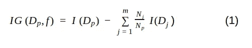

我们可以看到，信息增益就是父节点杂质和子节点杂质之和的差——子节点杂质越低，信息增益越大。然而，为了简化和减少组合搜索空间，大多数库(包括 scikit-learn)都实现了二叉决策树。这意味着每个父节点被分成两个子节点， *D-left* 和 *D-right。*

杂质测量实现二元决策树，二元决策树中常用的三种杂质测量或分裂标准是*基尼杂质(IG)* 、*熵(IH)和误分类误差(IE)*【4】

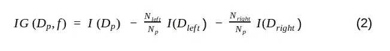

**5.1 基尼杂质**

## 根据[维基百科](https://en.wikipedia.org/wiki/Decision_tree_learning#Gini_impurity)【5】，

*由 CART(分类和回归树)算法用于分类树*， *Gini 杂质是根据标签在子集中的分布随机标记的集合中随机选择的元素被错误标记的频率的度量。*

数学上，我们可以把基尼系数写成如下

其中 *j* 是节点中存在的类的数量，而 *p* 是节点中类的分布。

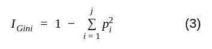

用有 303 行和 13 个属性的[心脏病数据集](https://archive.ics.uci.edu/ml/datasets/Heart+Disease)进行简单模拟。目标包括 138 个值 0 和 165 个值 1

为了从数据集构建决策树并确定哪种分离是最好的，我们需要一种方法来测量和比较每个属性中的基尼系数杂质。第一次迭代中最低的 Gini 杂质值将是根节点。我们可以将等式 3 写成:

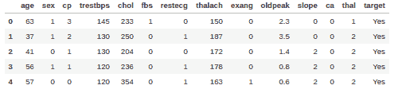

在此模拟中，仅使用性别、fbs(空腹血糖)、exang(运动诱发的心绞痛)和目标属性。

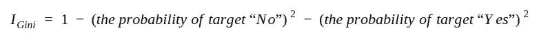

**如何测量性别属性中的基尼杂质**

Gini 杂质—左侧节点

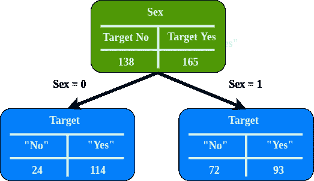

吉尼杂质—右节点

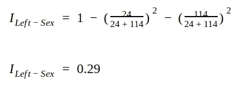

既然我们已经测量了两个叶节点的基尼系数。我们可以用加权平均来计算总基尼系数。左侧节点代表 138 名患者，而右侧节点代表 165 名患者

总基尼系数杂质—叶节点

**如何测量 Fbs(空腹血糖)中的基尼杂质** **属性**

Gini 杂质—左侧节点

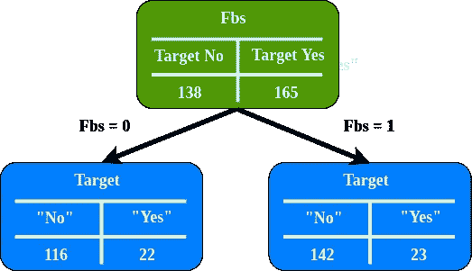

吉尼杂质—右节点

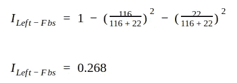

总基尼系数杂质—叶节点

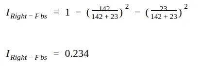

**如何测量 Exang(运动诱发心绞痛)属性中的 Gini 杂质**

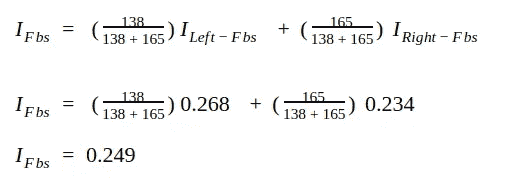

Gini 杂质—左侧节点

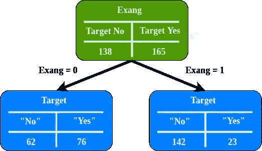

吉尼杂质—右节点

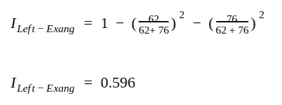

总基尼系数杂质—叶节点

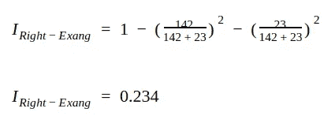

**Fbs(空腹血糖)的基尼杂质最低，所以我们要在根节点使用它**

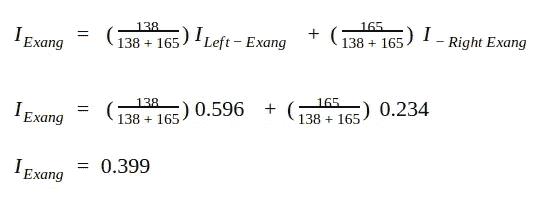

**5.2 熵**

## 由 ID3、C4.5 和 C5.0 树生成算法使用。信息增益基于熵的概念，熵的度量被定义为[ [5](https://en.wikipedia.org/wiki/Decision_tree_learning#Gini_impurity) ]:

其中 *j* 是节点中存在的类的数量，而 *p* 是节点中类的分布。

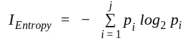

在同一个案例和同一个[数据集](https://archive.ics.uci.edu/ml/datasets/Heart+Disease)中，我们需要一种方法来度量和比较每个属性中的熵。第一次迭代的最高熵值将是根节点。

我们首先需要计算目标属性的熵

**如何测量性别属性中的熵**

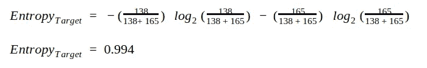

熵—性别= 0

熵—性别= 1

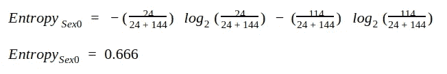

既然我们已经测量了两个叶节点的熵。我们再次取加权平均值来计算总熵值。

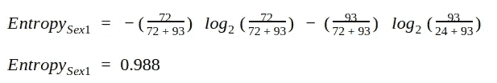

熵——性

**如何测量 Fbs 属性中的熵**

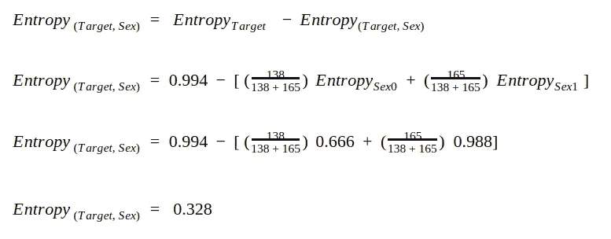

熵— Fbs = 0

熵— Fbs = 1

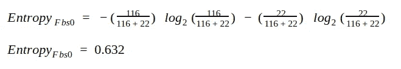

熵— Fbs

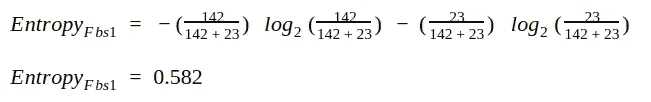

**如何度量 Exang 属性中的熵**

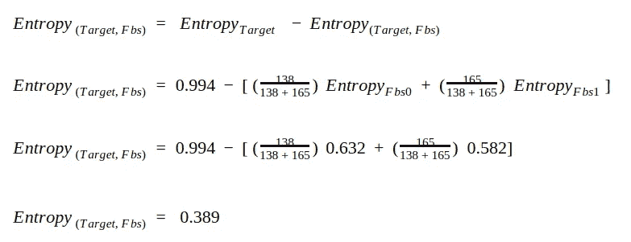

熵— Exang = 0

熵— Exang = 1

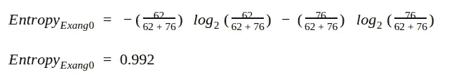

熵— Exang

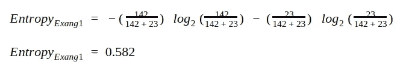

**Fbs(空腹血糖)具有最高的基尼系数，因此我们将在根节点使用它，与我们从基尼系数得到的结果完全相同。**

**5.3 误分类杂质**

## 另一个杂质测量是错误分类杂质，数学上，我们可以写错误分类杂质如下

就质量性能而言，该指数不是最佳选择，因为它对不同的概率分布并不特别敏感(这可以很容易地使用基尼系数或熵将选择驱动到细分)[6]。

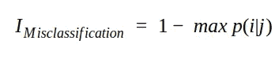

6.树木的优点和缺点

## **优势**

树很容易向人们解释。事实上，它们甚至比线性回归更容易解释！

1.  一些人认为决策树比之前章节中看到的回归和分类方法更能反映人类的决策。
2.  树可以用图形显示，即使非专家也很容易理解(特别是如果它们很小的话)。
3.  树可以轻松处理定性预测，而不需要
    创建虚拟变量【3】。
4.  **缺点**

不幸的是，树通常不具有与其他回归和分类方法相同的预测准确性水平[3]。

1.  继续学习— **决策树中的分裂过程**

## [决策树中的分类——一步一步的 CART(分类和回归树)——第二部分)](https://medium.com/@arifromadhan19/classification-in-decision-tree-a-step-by-step-cart-classification-and-regression-tree-8e5f5228b11e)

1.  [决策树中的回归——一步一步的 CART(分类和回归树)——第三部分)](https://medium.com/@arifromadhan19/regrssion-in-decision-tree-a-step-by-step-cart-classification-and-regression-tree-196c6ac9711e)
2.  * sci kit-learn 包将 CART 实现为其默认决策树。

**关于我**

## 我是一名数据科学家，专注于机器学习和深度学习。你可以通过[媒体](https://medium.com/@arifromadhan19)和 [Linkedin](https://www.linkedin.com/in/arif-romadhan-292116138/) 联系我

**我的网站:**[**https://komuternak.com/**](https://komuternak.com/)

**参考**

## [Sklearn -决策树](https://scikit-learn.org/stable/modules/tree.html)

1.  [https://gdcoder . com/decision-tree-regressor-explained-in-deep/](https://gdcoder.com/decision-tree-regressor-explained-in-depth/)
2.  [统计学习简介](http://faculty.marshall.usc.edu/gareth-james/ISL/)
3.  拉什卡，塞巴斯蒂安。Python 机器学习
4.  https://en.wikipedia.org/wiki/Decision_tree_learning
5.  博纳科索朱塞佩。机器学习算法
6.  Bonaccorso, Giuseppe. Machine Learning Algorithm