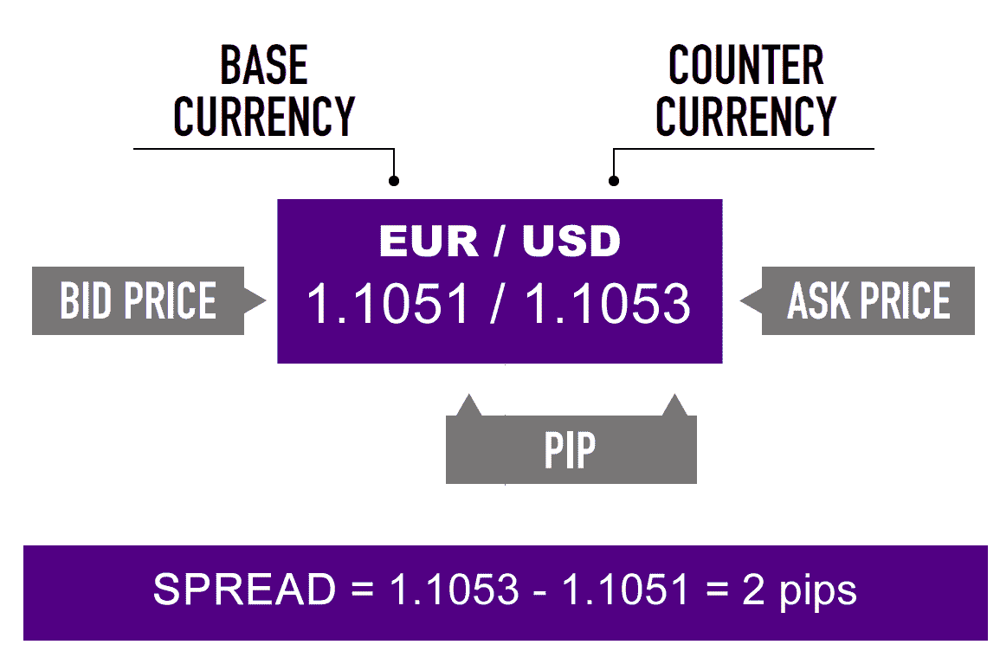

# 外汇基础

> 原文：<https://medium.datadriveninvestor.com/the-basics-of-forex-5475ee6ccae4?source=collection_archive---------10----------------------->

## 交易和利用世界上最大的市场

Photo by [Christine Roy](https://unsplash.com/@agent_illustrateur?utm_source=medium&utm_medium=referral) on [Unsplash](https://unsplash.com?utm_source=medium&utm_medium=referral)

目前全球对冠状病毒的担忧导致市场低迷。

有些人可能会认为做空市场是个好主意——但在如此波动的情况下，没有人知道市场何时会反弹。

考虑到这一点，可能有一种比普通股更容易利用波动性的方法。

随着许多不同的国家采取不同的行动，外汇市场可能是一个有利可图的领域。

对于那些对外汇感兴趣的人，我将介绍一下它是如何工作的。

进入利基交易领域时，做大量的研究总是一个好主意。人们一生都在学习商品以及某些因素如何影响他们的期货或期权交易。

## 什么是外汇市场？

[外汇市场](https://www.investopedia.com/terms/forex/f/foreign-exchange-markets.asp)，简称 forex，是一个全球性的市场，决定着世界各地不同货币的汇率。

它是世界上最大的金融市场，提供了一个购买、出售、交换、投机和兑换外汇的场所。其每日交易量为 5.1 万亿美元，而股票交易量为 840 亿美元。

这是一个场外交易市场，这意味着没有像纽约证券交易所那样的集中的实体市场。相反，人们必须从经纪人那里购买，以投机或购买不同的货币。

外汇市场由银行、交易商、商业公司、中央银行、投资管理公司、对冲基金、零售交易商和投资者组成。

外汇市场很重要，因为它允许不同国家之间的全球化贸易，并以这种方式为世界经济提供结构。

许多公司利用市场来**对冲**——降低资产价格不利变动的风险。

它也可以用来根据世界、国内和自然事件对货币进行投机。

个人交易者只占这个市场的一小部分，通常参与投机和日内交易。

## 货币是如何估值的？

货币总是参照其他货币来估价。换句话说，你将一种货币兑换成另一种货币的价格。

这被称为 T4 汇率。

例如，USD/JPY 代表美元和日元的汇率。斜线左边的货币被称为基础货币——你正在购买的货币。斜线右边的货币是报价货币，也就是您正在销售的货币。

它是日元对美元的价值——或者多少美元等于一日元。

相反，日元/美元用日元表示美元的价值——购买一美元需要多少日元。

当一种货币相对于另一种货币升值时，这种货币就会升值。当日元/美元汇率上升时，美元升值，因为那时需要更多的日元来购买美元，因此，美元更有价值。

当一种货币相对于另一种货币贬值时，这种货币就会贬值。当日元/美元汇率下跌时，美元贬值，因为现在购买一美元需要更少的日元，使美元贬值。

## 央行如何影响外汇？

通常控制国家政府的中央银行使用外汇进行**公开市场操作**。

中央银行通常负责控制一个国家的利率。

他们通过买卖美国国债——为支出提供资金的政府债务工具——来实现这一目标。

当一家央行出售美国国债时，它从总体市场上抽走了流动性，并减少了货币供应。由于现在经济中的可用资金减少，借贷成本——利率上升。这是有道理的，因为如果钱少了，借钱的成本应该会更高。

抛售美国国债是紧缩政策的结果。如果经济发展过快，这样做是为了减缓经济增长。

在经济衰退期间，人们持有他们的钱，不想消费。央行的回应是扩张性政策。这包括银行从金融机构购买国债，从而向经济和银行注入更多资金。这增加了货币供应量，降低了借款利息。

当我谈到利率时，我主要指的是联邦基金利率。这是因为这个利率决定了经济中的其他利率。其他大部分费率都是以此为基础的。联邦基金利率是银行间相互借贷的利息。

美国美联储的联邦公开市场委员会(FOMC)是一个组织，他们聚集在一起设定利率，并决定他们需要什么政策来实现它。

主要国家受到一国央行决定的影响。

例如，如果美国美联储决定扩大货币供应并降低利率，美元将对所有其他货币贬值。这是因为现在市场上有更多的美元，导致美元贬值，结果是美元对日元贬值。

因此，货币不仅是由一个国家决定的，而是由许多国家的相互作用决定的。

## 如何参与

外汇如此受欢迎是因为它不需要很多钱进入。市场是高度杠杆化的，这意味着你可以用借来的资金做很多交易。杠杆率可以高达 100:1，这意味着如果你有 1000 美元，你可以拥有价值 100，000 美元的头寸！

这是一件好事，也是一件坏事。好的，因为你不需要很多钱来开始交易，坏的，因为有了借来的资金，赢和输的可能性被放大了。

一个好的经验法则是每次交易不要承担超过 1%的风险。例如，如果你有 5000 美元，每笔交易应该值 50 美元。

此外，了解自己的胜率也很重要。这代表了你所有交易中获利的交易数量。只要这个比例在 50%以上，你就有机会赚钱。

如前所述，许多因素影响汇率。外汇交易者的目标是利用和预期这些变化。

让我们说，你预计美国将颁布扩张性政策，并开始向经济注入更多资金。你听说日本刚刚发布了一份新闻声明，称他们不会推行扩张性政策。由于美国正在向市场注入更多美元，美元将会走软。

假设现在日元是 104.86 日元/美元。我们可以期待日元升值，这样我们就可以用更少的日元购买更多的美元。我们有 10，000 美元，我们想在外汇交易中获利。所以我们要做的是，我们把这 10，000 美元换成日元——10，000 美元 x 104.86 日元/美元= 1，048，600 日元。几天后，当美国颁布其扩张政策时，让我们假设日元升值，现在是 98.95 日元/美元。我们现在可以把我们的 1，048，600 日元兑换回美元——1，048，600 日元 x 1 美元/98.95 日元= 10，597.27 美元。你在这笔交易中赚了 597.27 英镑。

兑换货币是要收费的，但为了简单起见，这一点被忽略了。

此外，就像股票一样，你可以做多也可以做空。上面的例子很长——你希望你的货币升值。

做空是指你希望一种货币贬值，这样你就可以卖出它，然后以更低的价格买回。

## 了解外汇行情

在外汇交易中，有一个[买卖价格](https://www.babypips.com/learn/forex/make-money-trading-forex)。

**买入价**是经纪人愿意购买你的基础货币以换取你想要的报价货币的价格。

**要价**价格是经纪人将报价货币的基础货币卖给你的价格。

Image from babypips.com

卖出价通常高于买入价，两者之差被称为**价差**。要价更高是因为交易商希望从交易中获利，他们绝不会以高于卖出的价格买入。

**总之**

极其谨慎地对待任何活跃的交易。在尝试这些之前做更全面的研究。

话虽如此，如果你足够关注政治和世界各地央行的政策，可能会有一些利润。随着某些政府试图避免衰退，他们将不可避免地向银行注入资金以提供流动性。这将提供一个在外汇交易中赚取大量利润的大好机会。