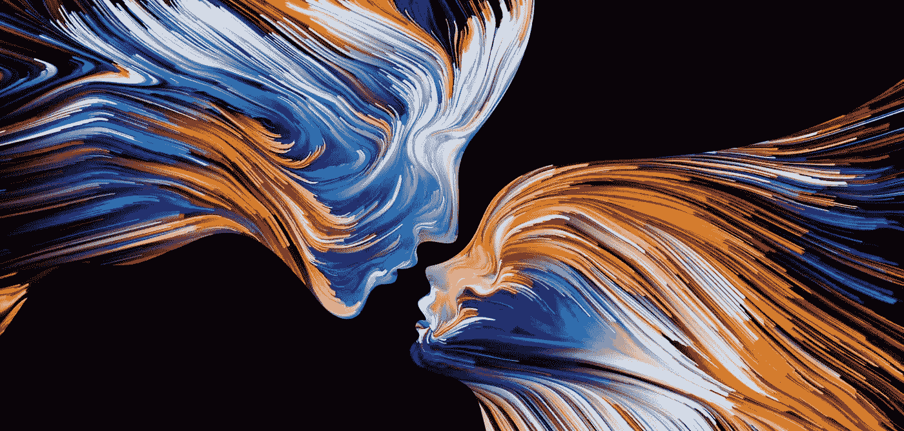
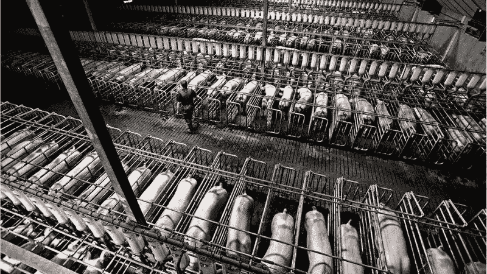
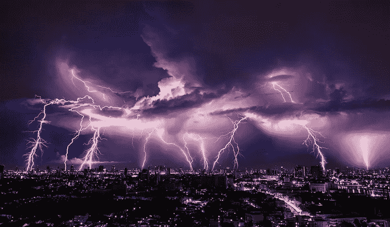
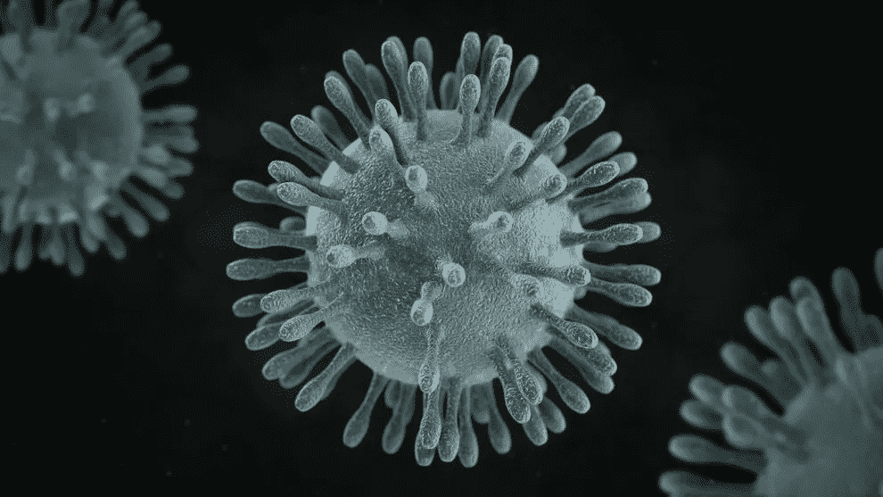
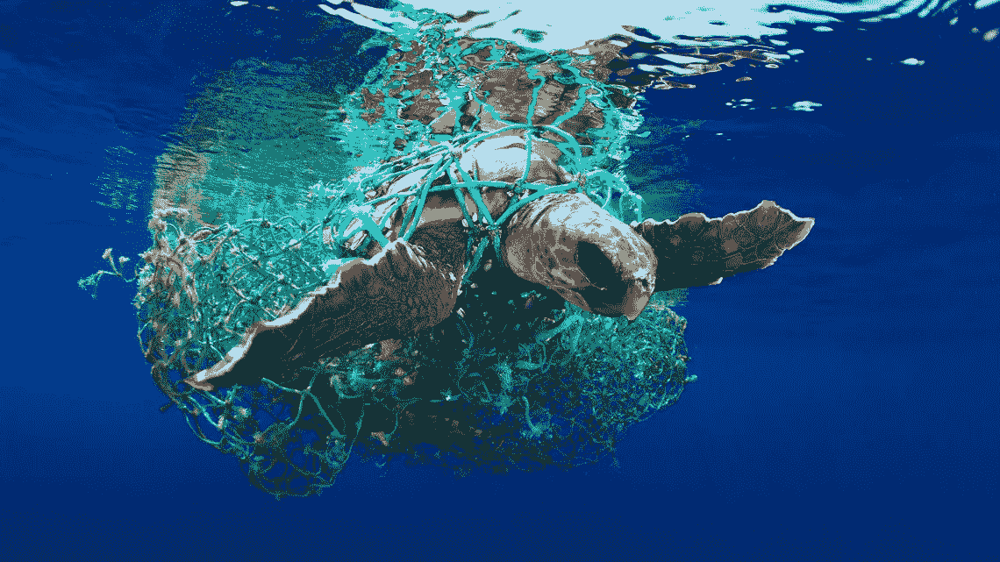

# 疫情的答案就在你有力的舌头里

> 原文：<https://medium.datadriveninvestor.com/the-battle-is-not-with-coronavirus-its-with-our-tongue-4ebcf7ccf768?source=collection_archive---------1----------------------->

## 你需要知道你看不到什么

*这场战斗不是与冠状病毒；是用我们的舌头。这是一个揭示和令人信服的肯定生活饮食的例子。*

(Image © [The Brain Blog](http://philosophyofbrains.com/))

如果研究表明，我们所知的宇宙运行在量子规则上，生命的每个方面都是由微小的、不可分割的纯能量单位或量子组成的；

如果我们通过神经科学、精神病学和已故伟大的[大卫·霍金斯(David Hawkins)，医学博士，哲学博士](https://veritaspub.com/)的开创性工作证明情绪具有可测量的能量，并且是“运动中的能量”；

如果从化学热力学第一定律理解[“能量不能被消灭，只能从一种形式转移或改变为另一种形式”](https://en.wikipedia.org/wiki/First_law_of_thermodynamics)；

最后，如果超过 2500 项从动物行为学到认知科学的多学科研究已经用充分、详细和实证的事实证明[动物是有感知能力的生物，它们感受痛苦并体验情感](https://www.psychologytoday.com/us/blog/animal-emotions/201306/universal-declaration-animal-sentience-no-pretending)；

# 然后…

**当我们折磨、杀戮、** [**一天吞掉 2 亿多只动物的肉** **来养活自己**](https://sentientmedia.org/how-many-animals-are-killed-for-food-every-day/) **时会发生什么？**

当它们在痛苦中煎熬——脖子被切开，肌腱被割断，喙被撕裂，被强行喂食，肝脏破裂，身体被泰瑟枪电击，棍子撞下脊柱，被剥皮，被活活煮熟，**这些动物在被释放到这个世界时会有什么感觉？**

 [## 医疗保健的未来正在被一场大型技术入侵所塑造|数据驱动型投资者

### 过去十年，全球经济的所有部门都经历了大规模的数字颠覆，而卫生部门现在…

www.datadriveninvestor.com](https://www.datadriveninvestor.com/2018/11/02/the-future-of-healthcare-is-being-shaped-by-a-big-tech-invasion/) 

在屠宰场、板条箱和笼子里出现的极度恐惧、绝望、愤怒、仇恨和恐怖中，如果这些“运动中的能量”不能被摧毁，只能被转移，那么它们去了哪里？

A factory farm in Australia (Image © [Change.org](https://www.change.org/))

如果戴维·霍金斯(David Hawkins)医学博士的[临床应用运动学测试](https://www.goodreads.com/book/show/19795.Power_vs_Force)的结果已经证实这些情绪是“破坏性频率”；

如果神经生物学家，如以研究情绪和大脑的开创性工作而闻名的 Richard J. Davidson 博士，以及著名的机构，如 T2、哥伦比亚和约翰·霍普斯金，向我们展示了我们有独立的大脑回路，致力于同情和慷慨；

如果生来就会关心他人的人类，会仅仅因为无关的偏见和哲学差异而残忍地折磨和蓄意毁灭整个种族；

# 然后…

我们能想象这些动物在被折磨致死的哭喊中会向故意杀害它们的凶手表达什么?——这些破坏性频率的表现是什么？

Thunderstorm in Melbourn, Australia (Image: © Vasin Lee | [LiveScience](https://www.livescience.com/56970-thunderstorm-asthma-australia.html) )

随着冠状病毒死亡人数飙升，**发现风水轮流转，现在是人类** [**被关在“笼子”里的是谁**](https://edition.cnn.com/2020/02/07/asia/us-coronavirus-victim-cruise-ship-intl-hnk/index.html) **？；**

对于那些曾经被人类关在笼子里的动物和野生动物来说，这种报应是我们集体业力的一种形式，是他们胜利的庆祝吗？

在过去几十年里，无数万亿具尸体释放出的累积破坏性频率的背景下，**我们的杀戮率与我们正在经历的越来越多的流行病**如科罗纳、非典、伊波拉、中东呼吸综合征等之间可能有丝毫关联吗？？

78,966 COVID-19 cases and 2,468 deaths as of 02/23/2020 (Image © [Sciencesource.com](https://www.sciencesource.com/CS.aspx?VP3=SearchResult&VBID=2OPESQQT6D32T&SMLS=1&RW=1642&RH=916#/SearchResult&VBID=2OPESQQT6D32T&SMLS=1&RW=1642&RH=916&POPUPPN=7&POPUPIID=2OPEBMUCLACM))

# 还有…

如果生物地球化学、生态学和宇宙学领域的 1000 名科学家签署了阿姆斯特丹宣言，声明[盖亚是生命和环境之间有意识的共生关系，它们作为一个单一的自我调节系统共同进化，维持地球上生命的条件](https://courses.seas.harvard.edu/climate/eli/Courses/EPS281r/Sources/Gaia/Gaia-hypothesis-wikipedia.pdf)；

如果世界自然基金会(WWF)包括来自全球的 59 名科学家报告说[“自 1970 年以来，人类已经灭绝了 60%的动物种群”，并开始了宇宙史上的“第六次大灭绝”](https://www.theguardian.com/environment/2018/oct/30/humanity-wiped-out-animals-since-1970-major-report-finds)；

如果皮尤工业农场动物生产委员会和农业经济学家得出结论认为，今天的动物养殖实践和系统[“对公共健康、环境和动物本身的福利构成不可接受的风险”](https://www.pewtrusts.org/en/about/news-room/press-releases-and-statements/2008/04/29/pew-commission-says-industrial-scale-farm-animal-production-poses-unacceptable-risks-to-public-health-environment)；

如果生物学家和公共卫生研究人员已经证明，来自畜牧业的二氧化碳、甲烷和一氧化二氮正在通过酸性缺氧死区杀死我们的海洋；

如果世界上最负盛名的咨询巨头之一麦肯锡(McKinsey)介入气候风险研究，表明到 2030 年，[“超过 1.6 亿和 2 亿”我们的人类家庭将暴露于“致命热浪”，其百分比越来越多，“超过健康人的生存阈值”](https://www.mckinsey.com/business-functions/sustainability/our-insights/climate-risk-and-response-physical-hazards-and-socioeconomic-impacts)；

# 然后…

在理解了所有的生命形式都有助于我们的幸福，以及我们的鲁莽和冷漠的行为导致了当前的天启之后，**为什么我们还没有清醒？**

随着超过 460 万英亩的亚马逊雨林被烧毁，[“世界上超过 80%的海洋鱼类资源被充分开发、过度开发或枯竭”，](https://time.com/collection/davos-2019/5502588/oceans-in-peril/) **几年后，当我们破坏了海洋和森林，它们是我们唯一家园的肺和动脉，那会是什么样子？**

(Image © Eduardo Acevedo/UPY 2019)

# 如果…

[医师委员会组织](https://www.youtube.com/watch?v=R38lohsfna4)和著名机构如康奈尔大学、哈佛大学和加州大学都在宣传[植物性饮食拯救生命的健康益处](https://osher.ucsf.edu/patient-care/integrative-medicine-resources/cancer-and-nutrition/faq/cancer-and-fasting-calorie-restriction)和[反驳不准确的营养信念，研究概述了它如何能防止每年 20%的成人死亡](https://www.thelancet.com/journals/lancet/article/PIIS0140-6736(17)32366-8/fulltext)；

我们过去最伟大的哲学家和圣贤，如柏拉图、尼采、毕达哥拉斯、爱因斯坦、孔子和泰斯拉，都鼓励“素食主义是对既定的野蛮习惯的一种值得称赞的背离”；

尽管所有的知识唾手可得，但我们无法听从那些明智而见多识广的人的建议，也无法依靠让我们表现得更好的植物性饮食生存。

知道 NASA，凭借其杰出的科学家和杰出的卫星工具，已经警告我们未来的[【洪水和干旱的频率和强度的极端】](https://www.nasa.gov/feature/goddard/2019/earth-s-freshwater-future-extremes-of-flood-and-drought)，这将使我们没有庄稼或水储备；

Miami Beach in 2050: sea-level rise will push average annual coastal floods higher than land now home to 300 million people ([via Forbes.com](https://www.forbes.com/sites/jimdobson/2019/10/30/shocking-new-maps-show-how-sea-level-rise-will-destroy-coastal-cities-by-2050/#24f9db01456c))

# 然后…

*   当土地贫瘠，我们没有食物挨饿时，对我们获得了多少铁、蛋白质或营养的无根据的担忧会成为优先考虑的问题吗？
*   当这个世界不再适合居住时，我们会考虑肉的味道有多美味吗？
*   当我们在人为灾难和不可治愈的流行病中挣扎求生时，我们还会相信自己是这个星球的国王吗？
*   如果我们不能为自己做出最明智的选择，我们有多聪明或者我们能获得多少知识又有什么关系呢？
*   你觉得可爱的大猩猩科科给我们的信息有道理吗？他说得对吗-我们傻吗？

This video was made with footage of Koko reacting after she has been informed about what is at stake at COP21\. After being familiarized with the issues, she was allowed to improvise. ([The Gorilla Foundation](http://www.koko.org/blog/video/2015-12-01))

不吃肉意味着尊重生命——正是生命让你得以生存。认识到我们今天面临的麻烦和疾病来自我们吃的东西，尤其是动物，这是一种智慧。

然而，因为我们喜欢特定的口味或特定的质地，我们吃了世界上所有的动物，而事实上，我们应该保护和珍惜生命。三岁的路易斯·安东尼奥提醒我们这个简单的事实。

吃仅仅是食物进入口腔时我们的一种感觉。一旦被吞下，它就会变成一种污染物质，在我们的胃里翻腾。有这么多的风险，值得吗？

**我们是否被对品味的渴望所控制，以至于掩盖了我们人类精神的内在美？**

我们的理性主义是否剥夺了我们认知和体验智慧的能力？

我们的自我思维是否剥夺了我们感受所有生命——有知觉的和无知觉的——的深度、神圣和光明的能力？

> 所有的生物都和我们一样。他们寻求生存，害怕死亡；他们都是血肉之躯。虽然他们的外貌可能不同，但他们的生命和我们的一样珍贵- [释证严法师](http://content.time.com/time/specials/packages/article/0,28804,2066367_2066369_2066393,00.html)

如果我们运用我们与生俱来的智慧，我们会意识到我们吃东西只是为了维持生命。如果我们停止杀害动物，坚持以植物为基础的饮食，我们不仅不会挨饿，我们还可以每天向地球母亲及其所有的孩子表达我们的爱。我们表现出的这种爱产生了一种连锁反应，这种连锁反应可以被整个人类感受到，而 T2 可以以积极和持久的方式改变世界。

如果事情保持不变，终有一天——在此生——我们将不得不回答为什么我们会发现自己目睹了地球生命的彻底[不稳定](https://www.newyorker.com/magazine/2019/05/20/climate-change-and-the-new-age-of-extinction)。在那一刻，当我们的生存岌岌可危时，我希望我们的原因之一不是因为我们无法抗拒对味道的渴望。因为如果是这样的话，具有讽刺意味的是，我们将作为最聪明的物种被一个不超过 10 厘米的物体打败而载入史册:舌头。