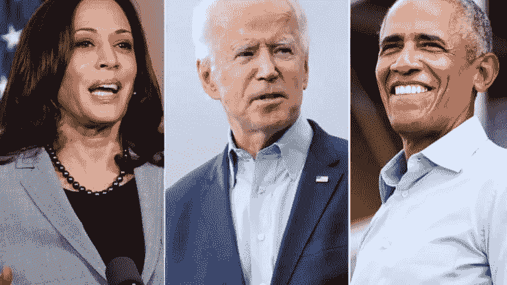

# 精英之战

> 原文：<https://medium.datadriveninvestor.com/the-battle-of-the-elites-5454a80ae976?source=collection_archive---------14----------------------->

## 失去的机会

巴拉克·奥巴马本有机会阻止这一切。他的当选让根深蒂固的精英阶层大吃一惊。他是与传统精英不同的一代人。他本可以安排大量新人，用新的精英来取代旧的精英，这将减少目前正在进行的精英间斗争的机会——或者至少是激烈程度。相反，他选择了他们中最根深蒂固的精英之一——乔·拜登——作为他的副总统，从那时起，像希拉里·克林顿这样的人被选入他的内阁并没有真正改善多少。

这为川普的当选做好了准备。没错，特朗普是与奥巴马选举旨在推翻的一代精英。没错，特朗普是一个与共和党，尤其是民主党都有关系的精英(特朗普夫妇与克林顿夫妇非常亲近，尽管我们 4 年前看到的政治舞台让我们都错误地认为不是这样)。但是，就拥有直接政治权力而言，特朗普是局外人。由于富有，他可以影响那些有权力的人，但最终他认识到影响那些有权力的人和拥有那种权力之间有着巨大的差异。因为他是一个政治局外人，民众认为他是对当权派挑战的一部分。当然，他真的不是，但是这个人知道如何玩这个游戏。

现在我们选出了最终的内部人士，最终的根深蒂固的精英担任总统。除了能想象到的最老、最根深蒂固的内部精英，他什么也没让他的内阁填满。这绝不是解决我国精英间战争问题的良方。典型的冷战中的精英之战将在未来几年内急剧升温。

50 年前，新一代人渴望获得政治权力。婴儿潮一代试图推翻他们周围的制度，并为从二战一代手中夺取政治权力做好准备。最终，他们做到了，在 1992 年接管美国最具象征意义的权力形象——总统——之前，他们就对我们的机构进行了改革。但老实说，他们在那之前就接管了其他一切。

今天，我们有不止一代人在行使权力和控制我们的机构时感到被剥夺了权利。婴儿潮一代用鳄鱼嘴抓住了一切。从 X 一代到千禧一代，没有哪一代人能够接管科技公司之外的主要机构。部分原因是婴儿潮一代不会退休，不会放弃权力，不会放弃对我们机构的统治。这造成了一个越来越危险的局面，因为现在不仅仅是一代人认为他们应该掌权，而是三代人都相信这一点。这三代人不仅在与婴儿潮一代斗争，还在相互斗争。

COVID 疫情加剧了这些问题。或者更准确地说，揭露我们许多机构中的腐败。

我们的公立学校系统腐败不堪，不堪重负，充斥着考试和官僚主义，学生们几乎什么也学不到。对于许多家长来说，这几乎是完全未知的——但有了虚拟学习，教室里发生的事情现在完全暴露在家长面前。我有三个学龄儿童，我遇到过一些老师，他们根本不理解自己布置的课堂作业，也无法向学生解释该做什么。我见过的数学作业比必要的多了 20 步，而且毫无必要地令人困惑。我看到布鲁姆的分类法被误用、滥用和扭曲得面目全非，以至于创造出完全不适合小学生的作业。其他人也一样。这将会有长期的后果，因为直到现在很少有家长真正了解教室里发生了什么。

我们看到越来越多的大学倒闭，尽管越来越多的学生上网。问题的一部分是，大学被设计成人们可以进行科学研究和从事学术研究的地方，学生应该来充当教授的学徒。然而现在，大学已经变成了就业培训中心——他们在这方面做得不好，因为这不是他们的初衷。来大学接受职业培训的人越多，学术工作就越难做。然而，学者们正确地坚持他们在学术界的相关性，结果创造了“必修”课，这些课实际上对那些绝对不想去那里的人几乎没教什么。一个恰当的例子是写作课，这是为这种情况而设立的——因为越来越少的大学生能够写出一个连贯的句子——而且仍然无法教写作，因为你无法教那些不阅读也不想学习如何写作的人写作。

在我们的大学里发生的这种疏远是这种脱节的结果，这种脱节是由婴儿潮一代传播的信念造成的，即每个人都应该上大学，因为大学是任何人都可以做的唯一有价值的事情。结果不仅仅是精英过剩(尤其是律师，他们都是潜在的政治家，但也包括非常富有和受过良好教育的人——那些有研究生学位的人),而是对那些不管出于什么原因没有大学学位或从事不需要大学学位的工作的人的更广泛的蔑视。

现在，想象一下这样一种情况，那些被轻蔑地告知从事不需要大学学位的工作的人被拥有大学学位的人所占有，因为没有足够的工作需要大学学位。这就是我们的处境。你大概可以想象为什么处于这种情况下的人对社会和经济形势不太感兴趣。更糟糕的是，在大学里，他们被告知资本主义是罪魁祸首，一个更强大的政府将解决所有问题。很可能这些人中的一些人——受教育过度和就业不足的人——是如此厌恶，如此怨恨，以至于他们只想看到整个系统被烧毁。

在许多方面，我们看到了一场反对婴儿潮一代的革命，以及他们在上一次革命期间(60 年代末至 1980 年，1970 年达到顶峰)所做的制度变革。左翼的新马克思主义婴儿潮一代接管了大学和我们的许多机构，从政府到媒体到艺术甚至商业，并在改造它们的同时顽强地抓住它们不放。

问题是，他们改造的我们的学校创造了越来越差的教育结果，同时疏远学生，迫使他们接受越来越严厉的测试制度——同时大幅增加支出，结果是学校官僚主义。结果是教师和学生超负荷工作，教师越来越多地使用心理药物，学生越来越多地使用药物和自杀，教师被指责为系统和官僚问题。

婴儿潮一代也继续传播各种“危机”,作为他们夺取越来越多权力的借口。在 20 世纪 70 年代，是“人口炸弹”和全球饥荒的威胁——这不仅从未成为现实，而且显然走向了相反的方向。现在，是全球变暖——这一次至少有一些关于其存在的经验证据，但这不可能证明太多左翼人士提出的严厉措施是正确的。

婴儿潮一代也在事物上制造了各种“战争”。向贫困开战——这造成了更多的贫困。毒品战争——导致了更多的毒品被出售和使用，并导致了更多的其他类型的犯罪。然后是反恐战争——这制造了更多的恐怖主义。这些不同的“战争”产生了如此明显的相反结果，以至于现在有人开玩笑说，如果我们想让孩子真正学习，政府应该向教育宣战。但说真的，这种战争心态才是问题所在。这种战争心态导致了将一切都视为危机——为联邦政府的巨额赤字开支辩护——以及警察的军事化。所有这一切都是因为社会主义者在一战和二战期间意识到，处于战争状态——使国家处于危机之中——将使他们能够证明任何数量的社会主义运动是正当的，人民会接受这些运动。这些“战争”中有许多是由保守派创造的(第一次“战争”，对贫困的战争，是一个明显的例外)，这并不重要，因为左翼也使用并延续了它们。众所周知，拜登是一名狂热的缉毒战士，而卡玛拉·哈里斯的职业生涯是支持警方，让无辜的人入狱。

民主党选择拜登及其随后的当选是对过去每一次失败的双重打击——也是婴儿潮一代对我们其他人的明显蔑视。他们不会温柔地走进那个美好的夜晚——不，他们不会这么轻易放弃他们的权力。人们开始意识到这一点。事情最终不会对我们的社会有好的结果。他们可能会对他们的光的消亡感到愤怒，但这种拒绝将会让世界燃烧。