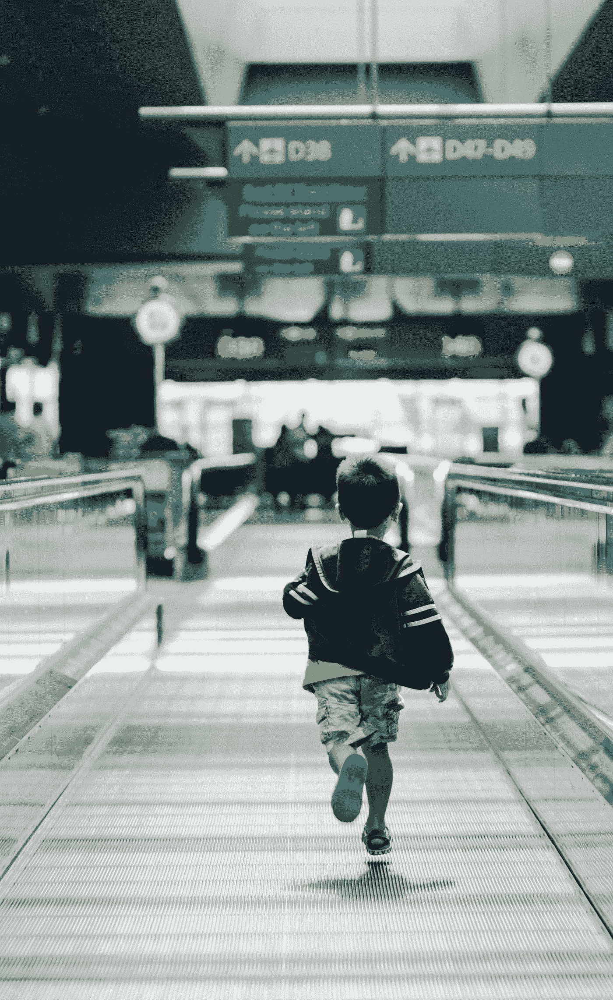

# 关于带孩子无屏幕旅行的美丽而可怕的事实

> 原文：<https://medium.datadriveninvestor.com/the-beautiful-terrible-truth-about-screen-free-travel-with-kids-87d5836fb154?source=collection_archive---------10----------------------->

好到不行。

Photo by [Hanson Lu](https://unsplash.com/@hansonluu?utm_source=medium&utm_medium=referral) on [Unsplash](https://unsplash.com?utm_source=medium&utm_medium=referral)

“留下你的鞋子，但是把你的 iPads 放在箱子里，”运输安全管理局的代理人对我的孩子们吼道。

没有人喜欢在机场通过安检，但如果你是一个没有 iPad 的孩子，你被告知要把 iPad 放在垃圾桶里，那就更糟糕了。

当我像蛇一样解下腰带时，我八岁的女儿和三岁的儿子朝我皱起了眉头，我丈夫解释说，除了手机，我们没有任何电子设备。

“祝你好运，”代理人喃喃自语，挥手让我们继续前进。

机场混乱、肮脏、嘈杂，挤满了疲惫的旅客，他们坐在长椅上、植物旁边、充电站旁边和酒吧凳子上。当人们从一个城市旅行到另一个城市时，他们处于不稳定状态，停滞不前。每个人都脾气暴躁，垃圾桶总是满满的。买杯咖啡的队伍从拥挤的人群中蜿蜒而出，经过价格昂贵的电子信息亭。但是你得在某个地方等，所以你还不如在那里等。

 [## 幸福的算法？数据驱动的投资者

### 从一开始，我们就认为技术正在使我们的生活变得更好、更快、更容易和更实用。社交媒体…

www.datadriveninvestor.com](https://www.datadriveninvestor.com/2019/03/08/an-algorithm-for-happiness/) 

但是机场也充满了令人兴奋的东西。有大窗户可以看到停机坪，高尔夫球车、加油车、行李车、消防车、拖车、传送带、水管、人、鸟、标志和闪光灯一起组成了一场令人惊叹的视觉芭蕾。在机场内，有骑赛格威的警察，炸弹嗅探犬，电梯修理工，艺术雕塑的奇怪尝试，以及持续不断的蜂鸣器、铃声和大声广播。

当你带着孩子旅行时，机场的可怕和令人敬畏被放大了。尤其是当你和没有 iPads 的孩子一起旅行的时候。

我们刚度假回来，我们的孩子是机场里表现最差的孩子。这并不是说我们的孩子很糟糕，只是我们在机场看到的几乎所有其他孩子都一动不动地坐在座位上，眼睛盯着屏幕。我不知道他们是在看 Elmo 还是在检查他们的股票，但他们看这些孩子坐着的样子，弯腰驼背，下巴松弛，他们看起来像训练有素的迷你成年人。

与此同时，我和丈夫轮流带着孩子在候机楼里跑上跑下，尽量让他们远离快走者，尽量让他们忙于猜谜游戏，尽量不要在进出礼品店时在零食、书籍和游戏上浪费钱。

我们解释了到达和离开的区别。我们解释了为什么有些人戴着口罩。我们解释了地图、时钟、轮椅、航空公司、托运行李、手提行李以及为什么北阿拉巴马篮球队都穿着相配的紫色运动衫。

第一个小时，我们是模范父母。我和儿子看着一个人做着感觉像是永远做不完的电工工作，我尽我所能猜测每种颜色的电线是干什么用的，每种工具能做什么。我丈夫和我女儿一起做了友谊手镯。

我们相视一笑。我们粉碎了它。我想跑回运输安全管理局吹嘘一番。谁需要 iPads。

但是一个小时变成了两个小时，我失去了耐心。厌倦了电工，我们去看一辆崭新的黄色克尔维特，用天鹅绒绳子围了起来。我儿子钻到绳子下面，踢了踢轮胎，在轮胎表面留下了一个六英寸的新百伦运动鞋印。

我抓住他的胳膊，把他拉开，寻找另一个分心。他又哭又踢，不顾一切地回到车里。

我把他紧紧地拉到胸前，在他耳边轻声说:“我包里有个惊喜给你。”

我们绕了一段路回到我们的包里，我大谈这个惊喜。我让他猜是什么。然后我解释了我是从哪里得到它的，为什么要挑它。我答应我们会找一个“特别秘密的地方”打开它。

当他看到那是一个涂色活动包，里面有蜡笔和贴纸时，他把它扔到了地上，哭出了真正的眼泪。

我看着我的丈夫，看到他在看着我们的女儿练习街舞时退缩了，把她的伤害和腿危险地靠近六个满脸沮丧疲惫的旅行者的行李、午餐和大腿。

越过他的肩膀，我看到了另一个家庭。父母一起看杂志。孩子们坐在他们对面，每个人都开心地看着屏幕上的东西。他们的行李整齐有序地排列在一起，耐心地等待登机。

“我想要一个更好的惊喜，”我的儿子哭着跳上跳下，挥舞着他的拳头强调。我女儿转过身，用她长长的金色马尾辫的尖端抽打着一位坐在轮椅上的女士。

也许我们应该带些 iPads 来。