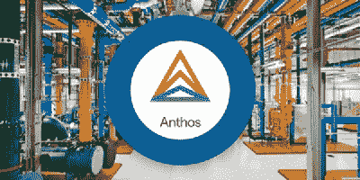

# Anthos 的好处

> 原文：<https://medium.datadriveninvestor.com/the-benefits-of-anthos-3e828aef74a8?source=collection_archive---------6----------------------->

*原载于* [*CloudOps 的博客*](https://www.cloudops.com/blog/) *。*

Anthos 是一个开放的混合和多云应用平台，由 Google 首创。它基于开源技术，包括 Kubernetes、 [Istio](https://www.cloudops.com/2018/02/mesh-your-services-with-istio-solving-complexity-at-the-network-layer/) 和 Knative。它是 GKE 本地的逻辑扩展，因为它通过一套开源解决方案增强了谷歌进入企业数据中心的第一个入口，这些解决方案涵盖了网络、存储、注册表、日志和监控等领域。Anthos 将多种服务结合在一起，以促进可伸缩性、互操作性、容器化、数据主权和安全性。

Anthos 旨在解决当今许多企业面临的复杂问题；如何在管理现有资源和利用超大规模云提供商的功能之间找到平衡。它非常适合拥有庞大、杂乱的基础架构的企业，这些基础架构涉及不同的工作流、实践和工具。Anthos 可以帮助这些企业实现统一的容器策略，并使他们的信息技术基础设施现代化。

# 1.混合云和多云的可扩展性和互操作性

Anthos 采用开源技术标准，让您可以在任何地方构建、管理、运行和移动应用程序。它支持内部和公共云环境之间的一致性，提供了一种在第三方云之间移动工作负载的灵活方式。虽然 Anthos 目前只能部署在内部或 GCP，但谷歌已经宣布支持其他公共云，作为其长期路线图的一部分。通过实现混合云和多云互操作性，Anthos 正在为日益发展的[多云未来做准备，在这种未来中，组织必须跨不同的基础架构一致地扩展其应用程序](https://www.cloudops.com/2018/11/why-cloud-native-cloud-agnostic-platforms-and-automation-driving-business-value/)。

# 2.集装箱化和云迁移

容器被设计为可以轻松快速地跨多个操作系统和硬件平台进行扩展、部署和运行，同时比传统的基于 VM 的环境需要更少的系统资源。通过配置变量，如运行时、环境和设置脚本本身，容器使组织能够灵活地在提供者之间迁移工作负载，同时保持性能的一致性。当伴随云迁移时，容器提供的增加的弹性和效率得到增强。Anthos 提供了自动化功能来促进本地工作负载的容器化和云迁移。 [Migrate for Anthos](https://cloud.google.com/migrate/anthos/) 致力于将 GCP 和本地环境中的虚拟机自动迁移到 GKE 的容器中。Velostrata 用于执行虚拟机到容器的就地升级，并为自动化 Docker 管道提供 CI/CD 集成。Anthos 中的 GCP 集群还可以自动升级到最新的 Google 认证版本。Anthos 旨在促进传统基础设施的持续现代化，扩展 GCP 内部部署，以提供集装箱化和云迁移功能。

# 3.安全性

容器技术发展如此之快，以至于它们的安全性经常跟不上。事实上，[超过 60%使用容器进行开发和测试的企业认为安全性是在生产中采用容器的主要障碍](https://www.csoonline.com/article/2984543/as-containers-take-off-so-do-security-concerns.html)。Anthos 为其容器化和云迁移特性提供了内置的安全性。Anthos 在跨集群配置管理方面表现出色，它提供了单一的真实控制和管理源，并允许跨多个集群扩展原生 Kubernetes 名称空间、标签和注释。Istio L7 功能允许更细粒度的网络策略和入口规则，只允许需要运行的服务。这最大限度地降低了影子操作的风险，当 Kubernetes 集群由于手动更改而失去同步时，就会发生影子操作。单一管理界面强制实施统一的安全策略，包括传输中的加密、相互身份验证和访问控制。Anthos 还提供统一的基于角色的访问控制(RBAC)和单点登录(SSO)管理来限制网络访问。Anthos 支持通过 ADFS 和 OpenID Connect (OIDC)与 SSO 的企业目录服务集成。Anthos 的特点有助于[大规模固定集装箱](https://www.cloudops.com/2019/01/a-brief-guide-to-securing-containers-at-scale/)。

# 4.管辖权和数据主权

由于存储在 GCP 的加拿大数据可能通过美国联网，因此可能会受制于美国法律，并失去其在加拿大时享有的法律和宪法项目。即使数据留在加拿大，也可能受到美国法律和监管的影响，因为 GCP 是一个美国实体。虽然 GCP 确实在加拿大提供了一个选址，但依赖一个选址是有风险的。对于要求加拿大数据主权的加拿大组织来说，依靠 GCP 的加拿大地理位置和内部解决方案可能是一个解决方案，但这些组织可能不想花费自己管理基础架构所需的精力、时间和资金。

支持 antos 的区域性云，如 cloud.ca，可以帮助组织从 antos 丰富的功能套件中受益，而不会失去他们在 GCP 会失去的数据主权，也不必维护他们自己的基础设施。 [cloud.ca](https://cloud.ca/) 的内部云基础设施允许组织在加拿大存储数据，利用 Anthos 和其他服务，无需投资运营自己的基础设施。对于愿意进行这种投资的组织来说，cloud.ca 可以在客户基础设施的“边缘”运行。

Anthos 旨在帮助拥有庞大传统应用程序的企业利用集装箱化应用程序在多云环境中提供的弹性、效率和速度。它提供了开源技术标准，以实现混合云和多云的可扩展性和互操作性。它提供了一些功能来促进遗留工作负载的容器化和云迁移。它还提供了一种方法来帮助不在美国的企业解决可能由这种多云环境引起的安全问题，并保留数据主权。Anthos 帮助拥有大型传统基础设施的企业利用谷歌构建的开源解决方案，同时保持其混合云或多云战略。

*本帖最初发表于***日* [*CloudOps 的博客*](https://www.cloudops.com/blog/) *。**

*[**订阅 CloudOps 的月度时事通讯，了解最新的 DevOps 和云本地开发。**](https://www.cloudops.com/newsletter-signup/)*