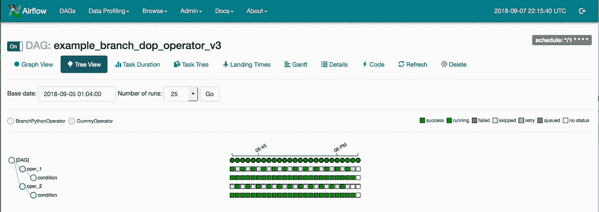
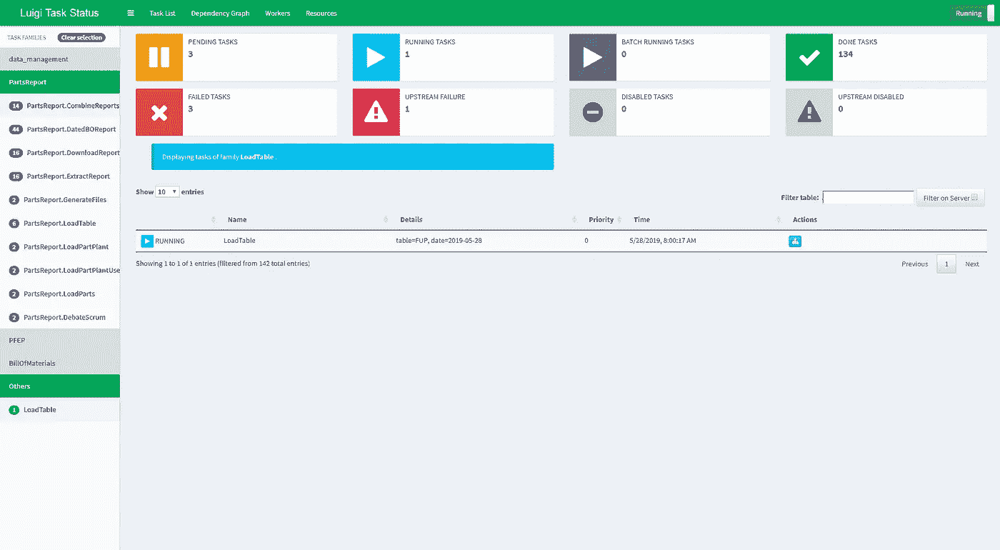

# 最好的自动化/工作流管理工具？Airbnb Airflow vs Spotify Luigi

> 原文：<https://medium.datadriveninvestor.com/the-best-automation-workflow-management-tool-airbnb-airflow-vs-spotify-luigi-5f4c9832e9fd?source=collection_archive---------4----------------------->


Airbnb Airflow and Spotify Luigi

# 什么是工作流自动化？

工作流自动化是指基于某些工作流规则和标准的流程的设计、执行和自动化。这项技术已经使用了很长时间，更早的时候是使用 Cron 实现的。Cron 是由美国电话电报公司·贝尔实验室开发的，该组织在上个世纪对计算机科学做出了巨大贡献。然而，最近出现了大量的其他工作流自动化框架/库。在这篇博客中，我将介绍两个令人惊叹的工作流程系统。

# 为什么我应该使用工作流自动化？

在一家公司的基础设施和管道中，有成吨的组件需要以顺序/并行的方式运行，以实现预期的结果。由于各种原因，引入了工作流自动化概念，这些原因如下:

效率和准确性:一个完整的自动化系统在很大程度上消除了流程中的人为因素。因为人类容易犯错误，比如忘记运行管道或者运行管道晚了一点，那么就应该运行管道。为了克服这样的问题，调度器使用工作流自动化来设置任务/作业，工作流自动化在分配的时间运行任务/流水线而不犯任何错误。

**高性价比:**使用这样的自动化系统有助于大幅降低运营公司的成本。以前，你必须指派特定的人，他们的工作只是在特定的时间运行这些任务，并寻找异常。如果系统是自动化的，应该手动运行这些过程的开发人员可以被用于公司的其他项目。

**责任:**当一个人手动运行管道时，如果出了问题，他要对此负责，但通常情况下，这可能根本不是他的错，因为在一个公司中，许多团队同时在项目上工作，如果有人对管道中的底层服务进行了一些更改，而这些更改与管道中的其他服务不完全同步，那么在运行管道时可能会出现一些错误。显然，这种场景倾向于从基本的**单元测试**开始的系统和**集成测试**，但是许多工作流自动化工具都内置了惊人的错误处理功能，可以准确地告诉你你的管道在哪一点出现了故障，你可以为它设置一个松弛通知或其他什么。否则，如果您手动运行管道，您将不得不自己创建它们的错误处理程序，与高度使用和测试的开源工具相比，这不是一个好主意。

工作满意度:长期负责管理和监督某些特定管道的人往往会有点失去动力，厌倦一遍又一遍地做同样的事情。作为开发人员，长时间运行和维护某些管道是一项单调乏味的任务，并且经常导致人们因工作满意度低而离职。

# 哪些团队可以从工作流自动化中受益？


受益于工作流自动化的不仅仅是公司的开发团队。工作流自动化可以在一个公司的许多团队中使用，以使事情变得顺利、高效和不那么乏味。工作流自动化在组织内部任务和工具中的使用案例数不胜数。

[](https://www.datadriveninvestor.com/2020/02/27/how-to-use-automation-to-get-more-out-of-your-data/) [## 如何使用自动化从您的数据中获得更多价值？数据驱动的投资者

### 去年的新闻故事不停地谈论机器学习变得多么先进。电脑现在…

www.datadriveninvestor.com](https://www.datadriveninvestor.com/2020/02/27/how-to-use-automation-to-get-more-out-of-your-data/) 

开发团队之外的团队使用工作流自动化的一些例子有:

## 营销

工作流自动化在市场营销中非常有用的一些领域包括:

*   品牌管理
*   活动批准/管理

## 销售

工作流自动化在销售中有用的一些领域包括:

*   运行降价策略
*   销售活动处理
*   报价审批

## 人力资源

工作流自动化可以在人力资源中发挥作用的一些领域包括:

*   员工入职。
*   员工离岗。
*   假期处理

## 金融

工作流自动化在金融领域的一些应用领域包括:

*   工资/奖金处理
*   费用审批

## 采购

工作流自动化可能有用的一些领域包括:

*   下大宗订单
*   定期订购某些商品

# 简要介绍市场上最著名的工作流自动化工具

## Airbnb 的气流:



Apache Airflow 是一个开源的工作流管理平台。它始于 2014 年 10 月的 Airbnb，作为管理公司日益复杂的工作流程的解决方案。以编程方式创作、调度和监控数据管道的平台。它将工作流生成为任务的有向无环图(Dag)。Airflow scheduler 在遵循指定依赖关系的同时，对一组工作线程执行您的任务。丰富的用户界面使得可视化生产中运行的管道、监控进度以及在需要时解决问题变得容易。它还附带了用于管理平台的大量 CLI 实用程序。

## Spotify 的 Luigi:



Luigi 是一个 ETL 和数据流管理库。它是一个 Python 包/库，可以帮助您构建批处理作业的复杂管道。它处理依赖关系解析、工作流管理、可视化、处理故障、命令行集成等等。

# 气流 vs 路易吉:工作和差异？

# 气流

气流 DAGS，使用 DAG id 创建，失败的任务基于用户定义的重试次数重新运行。Airflow 使用 DAG 定义或使用 Jinja 模板动态生成任务。我通常更喜欢 Jinja 模板，因为它为任务生成提供了更健壮的方法，并支持定制。Jinja 模板中更好的生成器是 Bash 操作符和 Python 操作符。

**使用气流的优点:**

*   **调度程序支持:** Airflow 自带内置调度程序支持，也就是说你再也不用依赖玉米了。
*   **Web 界面/平台 UI:** Airflow 提供了丰富的 Web 界面。Airflow 的 web 界面是市场上所有工作流自动化工具中最好的界面之一。
*   **集中式工作者:** Airflow 具有集中式工作者，即任务被分配给集中式工作者池。这提供了极大的资源利用率。它只需要几个节点——调度程序、web 服务器、工作程序和一个数据库。

**使用气流的缺点:**

*   **可扩展性:**当必须扩展到数千 DAGS 时，Airflow 不如 Luigi。可扩展性在气流中不太可靠，并且经常容易出现问题。
*   **容错(数据恢复):** Airflow 不具备良好的数据恢复功能和容错能力。恢复数据的唯一方法是删除状态数据库，然后从头开始重新运行任务。这种方法非常耗时，效率非常低，并且是一个故障点。
*   **容错(重新运行管道):**气流按照用户定义的重试次数重新运行管道，这不是一个好方法，因为它依赖于您手动设置的常量。

## 使用气流的公司有 **:**

Airbnb、Slack、9GAG、Urban Clap 等

## 集成:

Hadoop，Cassandra，DynamoDB，Spark，德鲁伊，Hive 等。

# 路易吉

通过设置任务名称和传递一些参数，可以在 Luigi 中定义各种任务。Luigi 生成基于状态的任务，一个任务根据其状态指向另一个任务。任务竞争由一个监听器/监控器检查，该监听器/监控器不断检查输入和输出。失败的任务基于提供的输入和获得的输出重新运行。如果获得的输出与期望的输出不同，将启动重新运行，因为这表明在执行任务时出现了问题。

**使用 Luigi 的好处是:**

*   **可扩展性:**大规模部署时，Luigi 的性能优于 Airflow。它提供了广泛的企业级可伸缩性支持。大规模部署时比气流更可靠。
*   **容错:** Luigi 提供了出色的容错和恢复功能。如果有数据丢失，**回填**启动，将自动重新生成丢失的数据。这是通过使用输入和输出状态之间的比较和关系来实现的。
*   **容错(重新运行管道):**与 Airflow 的静态用户定义重试次数相比，Luigi 在重新运行管道方面表现更好。Luigi 根据提供的输入和输出重新运行任务，如果没有获得所需的输出，则重新运行任务。

使用 Luigi 的缺点是:

*   **分散工人:** Luigi 工人遵循一个 **1 任务— n 独占工人**策略。这些工作线程是在 python 脚本运行时生成的，并且仅用于该特定任务的竞争，这些工作线程不会执行任何其他任务。因此，与气流相比，它倾向于消耗更多的资源。
*   **web 界面/平台 UI:** Luigi 的 Web 界面不太详细，提供的功能也不如 Airflow 的 Web 界面多。
*   **调度器支持:** Luigi 依赖 CRON 来调度作业，没有内置的调度器。

## 使用 Luigi 的公司有:

Spotify，Asana，Deloitte，Weebly，Stripe，FourSquare，500px 等。

## 集成:

Python、Hadoop、亚马逊 S3 等。通过 [Hubot](https://github.com/houzz/hubot-luigi) 集成 Slack 和 Hipchat。

# 我应该使用哪一个？

这两种方法的使用高度依赖于您的使用情况，我将解释在哪些情况下哪种方法更受欢迎:

## 什么时候使用气流？

如果你是一家早期创业公司，并且不希望花费大量时间来创建你的自动化系统，企业级**可伸缩性不是你最初的需求，想要易于**使用/可视化系统**，并且想要与其他第三方工具/框架的巨大**内置集成**，那么应该使用 Airflow。在这种情况下，气流是你应该选择的，它会让你的生活轻松很多。**

## 什么时候用 Luigi？

当你不介意弄脏自己的手，准备好自己编写大段代码，并且最重要的是你需要企业级可伸缩性和容错支持时，应该使用 Luigi。如果您的工作流程自动化系统将由成千上万的 DAGS 组成，那么 Luigi 无疑是您的不二之选。

> 注意:我是这两家公司的超级粉丝，已经使用他们的开源框架/库很长时间了。Airflow 中的可扩展性和容错问题目前仍然存在，但我相信 Airbnb 最终会解决这些问题，使平台更加可靠。

```
Thank You !
My LinkedIn : [Visit Me on LinkedIn](https://www.linkedin.com/in/arneesh-aima-49b516116/)
```