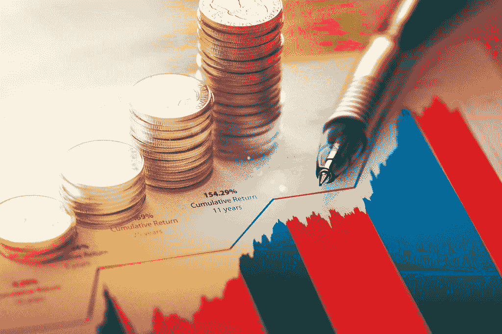

# 启动你的算法交易之旅的最佳书籍

> 原文：<https://medium.datadriveninvestor.com/the-best-book-to-kickstart-your-algotrading-journey-9a8e7105a1c4?source=collection_archive---------10----------------------->

## 以及我推荐它的原因。

[“Stock market returns”](https://www.flickr.com/photos/158288589@N02/40390413880) by [QuoteInspector.com](https://www.flickr.com/photos/158288589@N02) is licensed under [CC BY-ND 2.0](https://creativecommons.org/licenses/by-nd/2.0/?ref=ccsearch&atype=rich)

算法交易是一个有风险的游戏。

有些人破解了密码，比如比尔·本特，他用算法在赛马上下注，赢了数十亿美元。这不是侥幸，其他算法交易者几十年来一直都赢，比如 RenTech 的 Medallion 基金，从 1994 年到 2014 年年中，平均年回报率为 71.8%。

如果你在 1994 年向该基金投资 10，000 美元，并在每个月底再投资 1，000 美元，那么在 2014 年，你将拥有【2014 亿美元。

与此同时，其他人失败得很惨，比如骑士资本，他们的算法在短短 45 分钟内损失了[4 . 4 亿美元](https://www.theregister.com/2012/08/03/bad_algorithm_lost_440_million_dollars/)(这比他们 1998 年首次公开募股筹集的金额*多三倍*)。

# 安全学习

从上面可以看出，你不应该把你的钱投入市场，希望你是一个租赁者，而不是骑士资本。

相反，你应该从“纸上交易”开始，或者使用基于假钱的股市模拟器。这样，你就不会拿真正的资本冒险。这很方便，因为通常很难看出一个算法在现实世界中的表现，即使你已经对它进行了广泛的回溯测试，因为它可能会过度拟合，或者可能会有制度变化或其他未计算的未来变量。

也就是说，这是开始你的算法交易之旅的绝佳资源。

*声明:我与以下作者没有任何关联，我只是喜欢他的书。*

# 用于算法交易的 Python

我很幸运地看到了一篇 Twitter 帖子，发布了《Python 用于算法交易》一书，该书在发布前有 20 页的样本。

读过 Yves Hilpisch 的 2018 年著作《Python for Finance:掌握数据驱动的金融》(Python for Finance:Mastering Data-Driven Finance)后，我很期待这一新版本，因为该行业正在飞速发展，你不希望在算法交易中使用过时的工具和技术。

这篇文章的目录显然是经过深思熟虑和精心组织的，它将带你经历算法交易的所有步骤，包括:

*   基础设施
*   财务数据
*   策略代码
*   回溯测试代码
*   连接代码
*   交易代码
*   自动化

 [## 首次创业的 4 个资金管理技巧|数据驱动的投资者

### 超过 82%的企业倒闭是由于财务管理不善和现金流问题。开始新的…

www.datadriveninvestor.com](https://www.datadriveninvestor.com/2020/10/23/4-money-management-tips-for-first-time-entrepreneurs/) 

# 实用技能

我推荐的主要原因是，这本书显然非常实用和实用。很难推荐一本关于算法交易的理论书，很多都是。

相反，你将学习实用技能，如设置 Docker 容器、处理金融时间序列、矢量化、TF 和 Sklearn、套接字编程、风险分析等。所有这些的代码都可以在 [GitHub](https://github.com/yhilpisch/py4at) 上找到。

即使你最终不会用自己的资本进行算法交易，这也是进入这个行业的一个很好的切入点。

# 气质

也许最重要的是，作者知道他在说什么。

希尔皮施是[的 Python Quants](http://tpq.io) 和[的 AI 机器](https://aimachine.io)的首席执行官，也是几本书的作者，包括[金融中的人工智能](https://home.tpq.io/books/aiif)、[金融中的 Python](http://home.tpq.io/books/py4fi)、[用 Python 进行衍生品分析](https://home.tpq.io/books/dawp)和[上市波动率和方差衍生品](https://home.tpq.io/books/lvvd)。

他也是第一个用 Python 进行算法交易和计算金融的大学认证项目的负责人。

这就是我对进入算法交易行业的建议！你会推荐什么书？

## 访问专家视图— [订阅 DDI 英特尔](https://datadriveninvestor.com/ddi-intel)