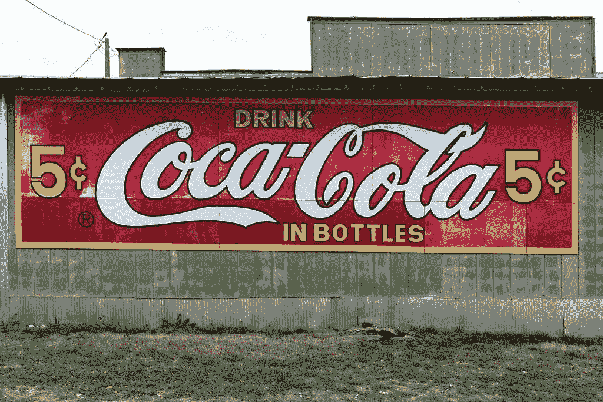
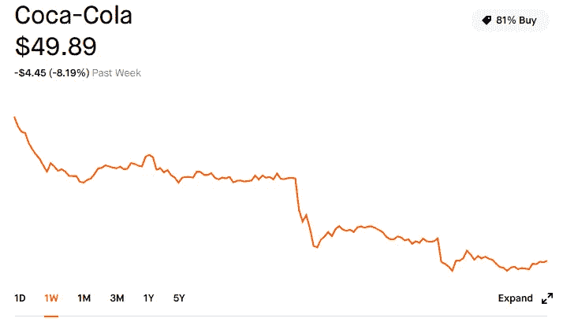
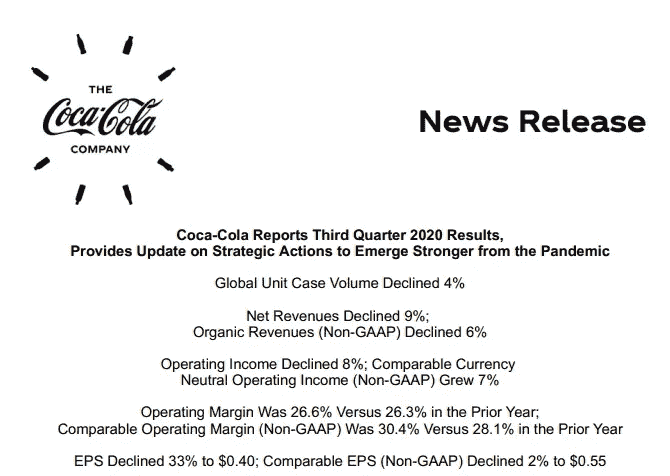
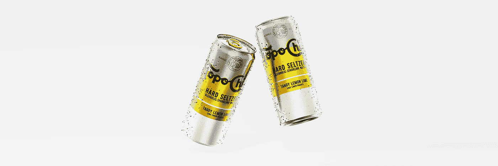

# 我在 2021 年 1 月买入的股息收入最好的股票

> 原文：<https://medium.datadriveninvestor.com/the-best-dividend-income-stock-im-buying-in-january-2021-86bfa83e14b9?source=collection_archive---------14----------------------->

## 这只股票不能抓住机会开始新的一年，但这意味着从长远来看，更多的增长和收入潜力。

Coca Cola sign on an old building. CC0 Licensed image.

每个月，当我投资那些有助于我的股息增长投资组合的股票时，我都会寻找好的机会和及时的选股机会。作为一名长期投资的年轻专业人士，我寻找高股息增长型公司进行长期持有，同时利用产生的股息收入购买更多增长型股票，这些股票通常具有更高的风险和不确定性。

随着所有主要指数在过去两个月中的出色表现，寻找伟大的皮卡越来越困难，但这里是我很高兴在 2021 年 1 月挖掘的及时股票。

# 纽约证券交易所:可口可乐

Coca-Cola stock performance from 12/31/20.

**当前价格(2021 年 1 月 7 日):**:49.89 美元

**当前股息率(2021 年 1 月 7 日):** 3.29%

**当前市盈率(2021 年 1 月 7 日):** 25.84

自今年年初以来，可口可乐(Coca-Cola)连续四天下跌，知名金融分析师对这家饮料巨头的估值表示担忧，多次下调其评级。加拿大皇家银行资本市场(RBC Capital Markets)董事总经理尼克莫迪(Nik Modi)将可口可乐的股票评级从优于大盘下调至板块表现，目标价为 55 美元，较本文发表时的当前价格有 10.24%的溢价。

在莫迪对估值感到担忧之前，有消息称，可口可乐和波音公司在 1 月 4 日道琼斯工业指数中跌幅最大，导致该指数[下跌近 350 点](https://www.marketwatch.com/story/dow-drops-nearly-350-points-on-losses-for-boeing-coca-cola-shares-2021-01-04)。

1/7/21，摩根大通分析师 Andrea Telxelra 将她的评级从增持下调至中性。随着几天内三次降级，与竞争对手相比，该股的价值不成比例地下跌。

作为一个持续的估值问题，可口可乐确实面临美国国税局关于 2007 年至 2009 年期间使用的应税收入方法的问题，这可能最终使公司花费高达 34 亿美元。在过去，美国国税局和大公司经常以少得多的价格收场。然而，如果公司上诉失败，潜在的税款可能会严重影响企业的自由现金流，这取决于已制定的付款计划。

> 尽管分析师三次下调评级，可口可乐的股价仍远低于该公司股票的大多数 2021 年目标价格。

## 新冠肺炎的影响

著名的沃伦巴菲特股票历史上一直依赖于探索世界的人，其销售收入的一半以上来自离家销售。新冠肺炎降低了这些数字，但该品牌继续受益于美国以外外国市场不断增长的市场份额，因为它支撑住了对其行业造成严重打击的大流行相关的下滑。

疫情的挑战对其业务和收入流造成了沉重的压力。可口可乐公司通过增加其国内销售渠道来抵消国外收入的损失，但疫情的不确定性导致管理层削减和收紧供应。

可口可乐在 Q1 的表现略好于其悲观的每股收益(EPS)——本财年第三季度，预计将于 1 月 28 日开市前发布 2010 财年第四季度的财务报告。即使疫情下跌，可口可乐也产生了自由现金流，以支持其股息支付以及对其品牌和产品的持续投资。

第三季度财务报告的亮点显示，2010 财年第三季度的总收入仍比 2019 年同期下降 33%。该业务今年迄今的自由现金流(非 GAAP)总计 55 亿美元，较上年下降 17%。

Q3 FY20 Coca-Cola Financial Highlights.

## 新的楔形产品和不断增长的股息

多年来，可口可乐一直依靠其“生活饮料”的雄心来优化其目录，以实现尽可能高的增长潜力。从疫情出来后，该公司计划削减大约 50%的主品牌雨伞，这意味着大约 200 个品牌的终结。

即使在产品目录细化的情况下，可口可乐仍继续向提供增长机会的新细分市场进军，例如成人饮料销售，其 [Topo Chico Hard Seltzer 系列](https://www.coca-colacompany.com/news/topo-chico-hard-seltzer-rolls-out-in-latin-america)。新的 Topo Chico Hard Seltzer 系列已在拉丁美洲上市，在与 Molson Coors Beverage Company 签署协议后，将于 2021 年上半年在美国上市。

Topo Chico Hard Seltzer. Image Source: Coca-Cola.

可口可乐继续围绕年复一年表现良好的获奖品牌构建其产品，公司的这种增长思维帮助它保持和保护了其作为股息大王的地位(该公司连续 50 多年增加了向股东支付的股息)。)，将其季度股息分配从 2019 年增加 2.5%，至 2020 年的 0.40 美元/股。

可口可乐目前的股息率为 3.29%(超过了标准普尔 500 2.5%的平均水平)，是一只及时打折的股票，在新冠肺炎时代以外还有很大的扩张空间。作为长期持有，当品牌再次获得其历史主要收入流的大部分时，它将提供大量的当前收入和未来增长的跑道。

## 底线

假设该股票是以今天的价格购买的，可口可乐确实在短期内达到了莫迪的 55 美元的目标，并保持股息一致，其成本基础上的有效股息收益率将为 3.63%，而基本收益率为 3.29%。

> 与百事可乐(NASDAQ:PEP)28.12 的市盈率和 2.88%的股息率相比，可口可乐的价格更适合疫情未来的增长。

随着本月额外购买$KO，可口可乐占我整个非 401K 投资组合的 3.12%，占我在该投资组合中产生股息的总持股的 6.24%。

***

以上内容仅代表一种观点，仅供参考。是 ***而不是*** *的投资建议。找一个有正式执照的专业人士寻求投资建议。*

*声明:我在上述股票中做多，并且无意在文章发表后的 72 小时内出售任何相关股票。*

**访问专家视图—** [**订阅 DDI 英特尔**](https://datadriveninvestor.com/ddi-intel)