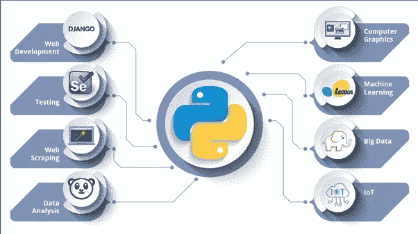
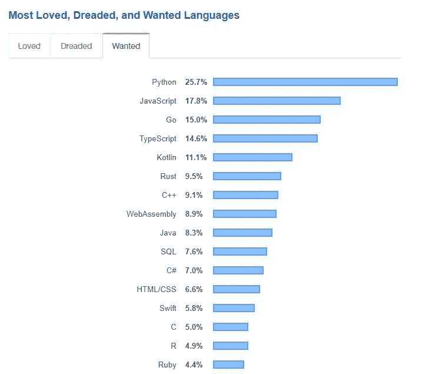
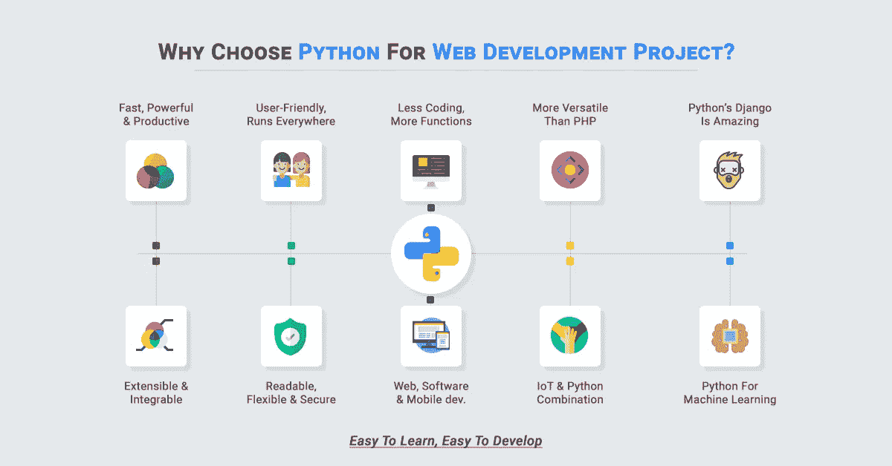
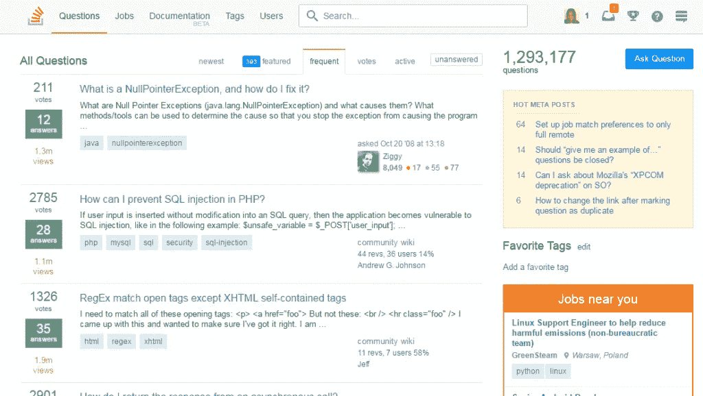
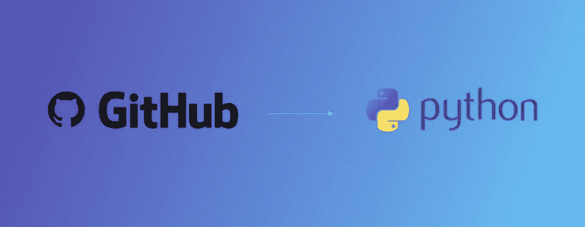
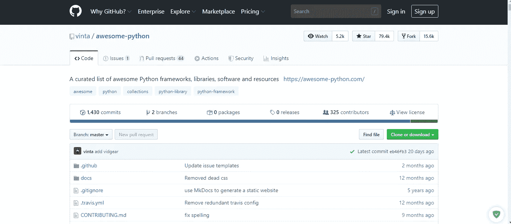

# 学习 python 2020 的最佳免费资源|学习机器学习和数据科学的 python

> 原文：<https://medium.datadriveninvestor.com/the-best-free-resources-to-learn-python-2020-learn-python-for-machine-learning-and-data-science-d22314303e36?source=collection_archive---------9----------------------->

想要学好 Python，仅仅看 Python 相关书籍是不够的！在互联网时代，我们必须充分利用网络上的免费资源，否则如何才能成为一名优秀的蟒蛇？

The best free resources to learn python 2020

**Python 可以用来做什么？**

在我看来，认为 Python 无所不能基本是不负责任的。无论是从入门级玩家到专业玩家的爬虫，还是 web 程序开发、桌面程序开发、科学计算、图像处理，Python 都能胜任。

 [## 数据科学和软件工程哪个更有前途？数据驱动的投资者

### 大约一个月前，当我坐在咖啡馆里为一个客户开发网站时，我发现了这个女人…

www.datadriveninvestor.com](https://www.datadriveninvestor.com/2019/01/23/which-is-more-promising-data-science-or-software-engineering/) 

也许是因为这种普遍属性，周围更多的朋友开始学习 Python。Python 现在有多火？我觉得可以看下面两组数据。

**第一:Python 跻身前五**

由于 Python 在许多领域越来越受欢迎，Python 已经进入了 2020 年最热门编程语言排行榜的前 5 名。

**第二:越来越多的公司用 Python 制作网站**

除了大家熟悉的知乎和豆瓣，越来越多的公司开始使用 Python 快速搭建网站产品。相应的，越来越多的公司在 Python Web 上开仓。

Why to Choose Python for Web Development Project

**那么，想要赶上 Python 热潮，该如何学习呢？**

**一、长期必须。**

1.StackOverflow 是故障排除和消除 bug 的必备站点。请到这个网站查找任何编程问题。

 [## 堆栈溢出-开发者学习、分享和建立职业生涯的地方

### 少搜。多建。使用 Stack Overflow 让团队在工作中与同事分享知识。免费 30 天…

stackoverflow.com](https://stackoverflow.com/) 

2.GitHub 是源代码学习和版本控制不可或缺的网站。如果是找源码，第一次请到这个网站，分叉后自己维护。

 [## 一起打造更好的软件

### GitHub 汇集了世界上最大的开发人员社区来发现、共享和构建更好的软件。来自…

github.com](https://github.com/) 

3.牛逼 python 最全的 Python 资源，没有之一，绝对不容错过。

 [## vinta/awesome-python

### 令人敬畏的 Python 框架、库、软件和资源的精选列表

github.com](https://github.com/vinta/awesome-python) 

对于有兴趣学习 Python 的开发者来说，吸引 Python 的不仅仅是一个优秀的社区，还有大量优秀的免费资源可用

**4。优秀的 Python 书籍**

《艰难地学习 Python》一书的作者免费将该书的内容制作成了一个 web 教程，其中包括许多值得花时间完成的练习。只有多写代码，才能从菜鸟变成雄鹰。

**5。Python 教学视频**

如果你习惯了视频学习，可以考虑选择 Udacity 的免费 Python 进行 Web 课程。通过学习本课程，您将对 web 数据的流动有更深入的了解。

**6。Github 上的 Python 资源库**

Github 上有很多好的 Python 资源库，比如这个。

**阿纳康达和 iPython 笔记本**

Anaconda 和 iPython Notebook 可以认为是 Python 的“Excel”。Python 代码通常很难在 HTML 等 web 格式中共享，尤其是显示涉及不同脚本中图表的结构化流程。Anaconda 和 iPython Notebook 可以以直观和可视化的方式组织和关联不同的 Python 软件模块，轻松地在 nbviewer 中显示结果，还可以生成 HTML 版本的笔记本文件，以便在 Github 上共享。

**7。用熊猫处理大数据**

熊猫的开发是基于前面提到的 iPython 笔记本。Python 只能帮助你处理加载到内存中的数据。Pandas 允许您有效地读取大规模数据，如海量 CSV 文件，执行数据清理，并用于数据透视或可视化。

**用 Flask 开发小程序**

Flask 是一个微型框架，可以用来开发一些小型 web 项目。Flask 包括一些在交互式网站项目中常用的可重用数据通信模块。只需几行代码，您就可以生成一个交互式函数。

**8。与 Django 一起开发大型项目**

如果你想开发一个完整的 web 框架，那么试试 Django。很多像 Pinterests 和 Instagram 这样非常大的网站都是用 Django 开发的。

**在 Python 中使用 API**

API 是网络经济的支柱之一。下面是 Python 的最佳第三方 API 列表。你可以用 Python 调用酷数据，让你的应用与众不同。

**9。Python 的机器学习资源库**

Github 上的这个 Python 机器学习库提供了很多优秀的资源，可以让你快速入门。

**10。Plotly 用数据帮你讲故事**

柴静的雾霾言论为什么火了？因为她用数据来讲故事。只需几行代码，就可以使用 Plot.ly 生成各种常见的数据图表。

**11。测试你的 Python 水平**

当你觉得自己快完成了，开始膨胀的时候，可以考虑去 HackerRank 测试一下自己的“水平”。高层次的可能值得获得工作机会。