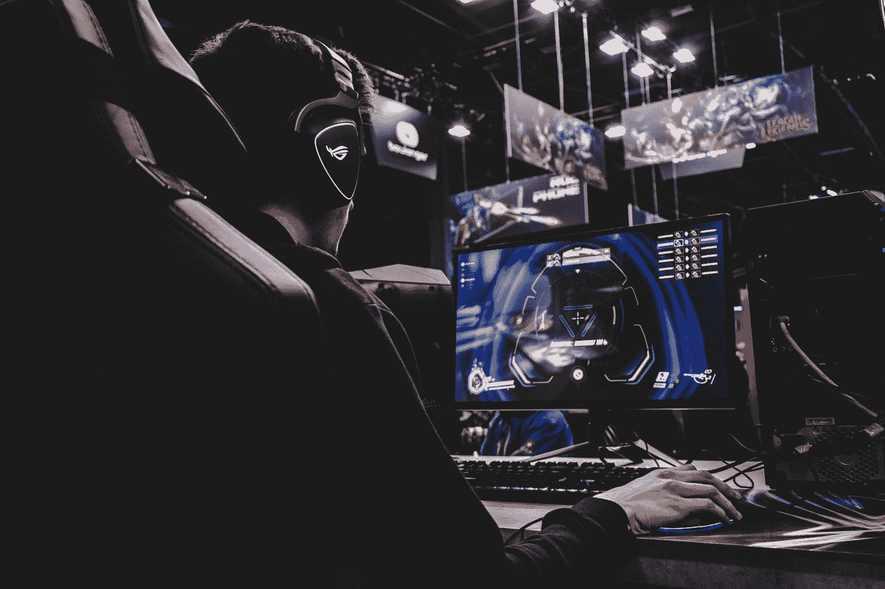

# 最好的免费游戏

> 原文：<https://medium.datadriveninvestor.com/the-best-free-to-play-games-out-there-92a9d956b54d?source=collection_archive---------31----------------------->

你能找到的一些最好的游戏是免费的，让每个人都可以玩。在这里，我们将谈论最好的免费游戏，你可以在读完这篇文章后立即下载。

Photo by [Florian Olivo](https://unsplash.com/@florianolv?utm_source=medium&utm_medium=referral) on [Unsplash](https://unsplash.com?utm_source=medium&utm_medium=referral)

这些游戏免费玩，并不意味着所有东西对所有人都是免费的。你仍然可以购买化妆品或季票；这些是开发者用来赚钱的方法，而不是让人们预先为游戏付费。

## 根申冲击

这份名单上最近的一款游戏是几周前发布的，它已经风靡全球。你可以在 PC、PS4 和移动设备上下载这款游戏。这款游戏也经过了极大的优化，所以你可以在很多低端设备和硬件上运行它。作为一个开放世界的游戏，这是你可以免费玩的最好的游戏之一，因为你总能在这个游戏中找到事情做。目前，这个游戏并不打算走付费赢的路线，这是一件好事。

## 暴动小游戏

Riot Games 不是游戏，但作为发行商，他们只发布免费游戏，几年前，他们的投资组合中只有一款游戏，它仍然是世界上最受欢迎的游戏之一，**英雄联盟**。今年他们发布了两个新游戏，Valorant 和 Runeterra 传奇。

**Valorant** 就像是《守望先锋》和《CS: GO》的产物，为它们提供了相似的游戏性，但仍然有自己独特的方式。这也是一款优化非常好的游戏，可以在很多低端硬件上运行。

**rune terra 传说**是一款基于英雄联盟世界的卡牌游戏；你们有同样的冠军，同样的地区。如果你是 LoL 的粉丝或者喜欢卡牌游戏的没玩过的人，这是最好的之一。这个游戏也可以在手机上玩，所以你可以去任何地方玩。

## 皇家战役小游戏

近年来最受欢迎的游戏类型之一。你可以在这种类型的游戏中找到许多免费的好游戏，其中之一就是堡垒之夜。其他伟大的免费皇家战役游戏有:

**使命召唤 Warzone** ，虽然这不是使命召唤游戏的第一部《皇室战争》，但这可能是他们制作过的最好的一部。这个游戏是最好的游戏之一的原因之一是价格。作为一款免费游戏，任何拥有足够好的设备的人都可以玩它。这个游戏需要记住的另一件事是，你的设备需要大量的存储空间。

**Apex Legends** 也是最好的 royale 对战游戏之一，不仅仅是免费的。随着各种各样的传说，你一定会玩得很开心。这不是一个大型游戏，但它仍然需要大约 40GB 的空间。

其他不错的免费 royale 游戏还有 **Spellbreak** 、 **PUBG Lite** 、 **Hyper Scape** 等。

## 命运 2

尽管你不能免费玩游戏中的所有东西，但你免费获得的内容数量是巨大的。当这款游戏发布时，它的定价和其他 AAA 级游戏一样，都是 60 美元。过了一段时间，他们选择让它免费，现在这是你可以免费玩的最好的游戏之一。既然是非常高质量的游戏，就不会让你失望。

## 反恐精英:全球攻势

如果有一个免费游戏列表，而这个游戏不在其中，你应该看看其他列表。就像命运 2，这个游戏发布的时候，不是免费的；几年后，他们把它免费了。最令人难忘的游戏系列之一是几乎所有人都玩过的游戏之一，如果不是这个，就是以前的版本。你还可以在这款游戏中找到一个 battle royale 模式，叫做危险地带。除此之外，这个游戏仍然是一个有趣的游戏来玩和射击。

## 火箭联盟

免费游戏中最近增加的一个是火箭联盟，你现在可以在 Epic 游戏商店免费找到它。持续的更新和庞大的玩家群让这款游戏保持了新鲜感和趣味性。如果你想玩不同的足球，这是适合你的游戏。

## 其他人

市场上有许多其他免费游戏，但这里有一些其他的游戏仍然非常棒，玩起来非常有趣。

Warframe 是其中之一，一款游戏在这么多年后仍然令人愉快，这对所有游戏玩家来说都是一件好事。

Brawlhalla 是一款类似于 Super Smash Bros 的游戏，由于它是免费的，所以它受到了人们的喜爱。有了庞大的社区和持续的更新，特别是随着游戏在手机上的推出，这款游戏的未来看起来仍然很棒。

**Dota 2** 是这个榜单上的另一个 Dota 即使现在还是很受欢迎，LoL 在人气上也是远超的。不过，这是一个伟大的 MOBA 游戏。

Wargaming 类似于 Riot 随着免费游戏的广泛收集，他们提供了良好的游戏，如**坦克世界**、**战舰世界**、**战机世界**，以及这些游戏的其他变体。如果你喜欢这些游戏，它们就是适合你的。

## 结束语

正如我们所看到的，市场上有很多免费的游戏，所以如果你不想在游戏上花钱，你仍然可以玩很多非常高质量的游戏，并从中获得大量的乐趣。对于其中的一些游戏，你仍然需要一台像样的电脑或者一台新的游戏机来玩。你也可以在手机上找到这些游戏，让那些买不起电脑或游戏机但仍想玩高质量游戏的人更容易玩到。