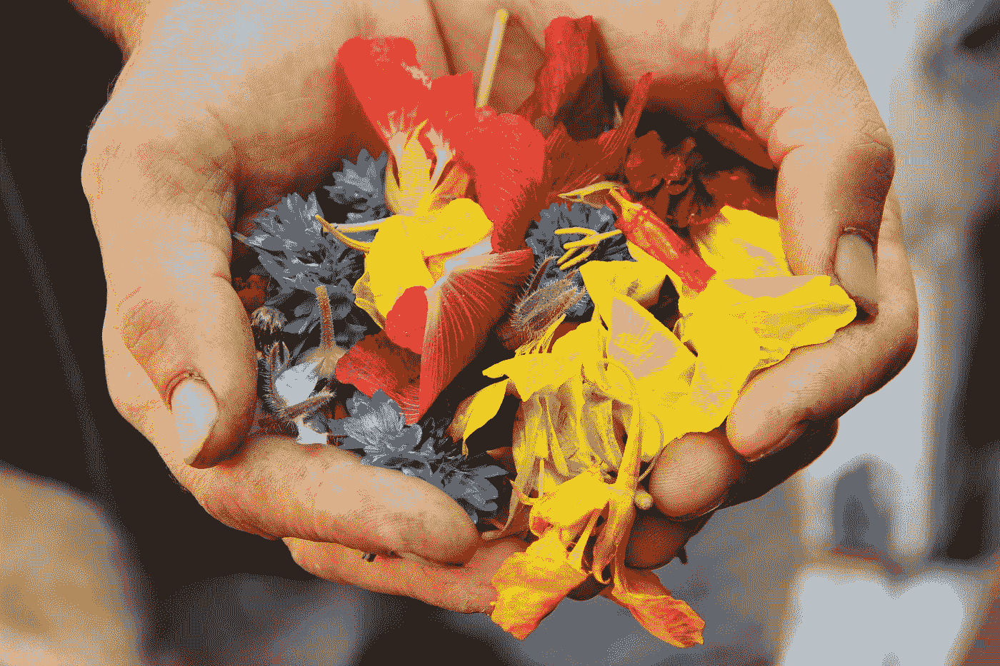

# 最好的感恩实践是给予。

> 原文：<https://medium.datadriveninvestor.com/the-best-gratitude-practice-is-to-give-85970e3b212a?source=collection_archive---------11----------------------->

## 这个假期感恩的三个想法及其原因

Photo by [Jan Canty](https://unsplash.com/@jancanty?utm_source=medium&utm_medium=referral) on [Unsplash](https://unsplash.com?utm_source=medium&utm_medium=referral)

这个假期是不寻常的。然而，它会诱使我们许多人转向购物疗法来平息我们的社交、物质甚至精神渴望。我建议了另一种进入幸福领域的方法，一种我在几年后重新发现的方法。

> 感激是当你收到一份你真正珍视的礼物时，内心升起的感激之情。

我在中学和初高中的时候，就开始如饥似渴地从父亲的图书馆里看书。我当时看的一些书是早期的自助书籍，而另一些书则更具精神性。除了一个方面，这两种类型没有交集——它们都强调，对于我们所收到的礼物，建立一个充满感激的生活是至关重要的。

我仍然记得这个抽象而美丽的想法在我十几岁的时候就有了。我一直是一个快乐的孩子，但我从未有意识地去感激我所拥有的一切。我也很激动，好像这些书揭示了一些成功的大秘密。

## 感激很容易被遗忘。

然而，随着时间的推移，感恩的想法变得平庸。随着对物质和精神的追求成为焦点，“感恩的态度”从意识中滑落到潜意识中，最终被遗忘。它甚至在生活的一些领域完全消失了。

生活不断给我带来惊喜，然而，我的反应是钦佩和惊讶我已经走了这么远，而不是一个安静的，有意识的感谢。有一个微妙但重要的区别。

有时，当事情没有按计划进行时，我甚至充满绝望和怨恨。我的父母经常提醒我要感恩。然而，我的大脑误解了他们的建议，好像他们在建议我接受失败并寻求安慰，在我得到的次优结果中寻找积极的一面。这让我对他们和我面临的挑战更加愤怒。

## 感激会通过朋友再次出现。

在过去的一个多月里，我的校友 [Seena Panicker Pereira](https://medium.com/u/c09e4372b098?source=post_page-----85970e3b212a--------------------------------) 通过集体阅读朗达·拜恩的书《魔法》,让我重新认识了感恩的力量。通过每天与她的小组一起参加长达一小时的读书会，并通过后续的日常实践在我的心理和日常生活中建立感恩，我学到了两件主要的事情:

## 1.感恩是一种实践，而不仅仅是一种感觉。

当你练习的时候，你必须花时间停下来，*也能感觉到。在《魔法》这本书里，朗达·拜恩在每一章的结尾都列举了感恩的做法。*

例如，在我们开始每一天之前，我们列出十个祝福，并对每个祝福说三次谢谢。我们还会在睡觉前在床边放一块小石头，对那天发生的最好的事情说声谢谢。

这些听起来可能很琐碎，甚至很幼稚。然而，它们的力量在于它们的简单。虽然像这样的感恩实践看似简单，但实践的每一个要素都是为了利用我们最自然的生活方式，或一天中最有益的时间来让我们感恩。

> 利用我们的潜意识，这种简单而强大的感恩实践重新编程我们，从不同的角度看待生活。

最重要的是每天用它们来感激我们的生活。

## 2.给予是感恩的最好形式。

我的第二个不太明显的收获是，给予也是一种感恩的实践。我们给予不仅仅是因为我们拥有，而是因为我们感激我们所拥有的。人类渴望与集体分享任何积极的经验。

当我学习内观冥想时，我发现的一个显著的事情是，包括住宿和膳食在内的整个十天课程对任何愿意的学生都是免费的。他们对我的精神成长所需要的只是我追求它的渴望。这是通过在我之前的学生自愿捐款实现的。这个想法是，当我们受益于精神洞察力的礼物时，一种与他人分享这种经验的自然愿望就会在我们的头脑中产生。所以我们通过“达娜”给予这个机会。重要的是，这些捐赠可以是货币形式的，也可以是以向中心提供服务、自愿奉献时间或提供专业知识等形式提供的非货币形式的。只要它不是代替我们所得到的，也不期望任何回报。内观的这一面和冥想本身一样让我感动。

随着我新发现的感恩实践，我意识到给予，没有任何期望，是感受和实践感恩的最高形式。当你给予的时候，你是在说——我已经够了，所以也给你一些。
或者也许，我很快乐，而*你的*快乐会让我更快乐。给予从来不会来自匮乏之地。它总是来自于充实。放弃你所珍视的东西，让另一个人也能拥有那种奇妙的经历——是最深刻的感恩方式。

所以在这个假期，我想给你三个想法来建立你自己的感恩实践:

1.  给一些你自己会用到的东西。
2.  给接受者带来快乐的东西，即使这不是你最喜欢的东西。
3.  给予没有期望，甚至没有一点鼓励。如果你一定要期待什么，那就让它成为撕开礼物包装的声音和接受者脸上的表情。

节日快乐，伙计们！