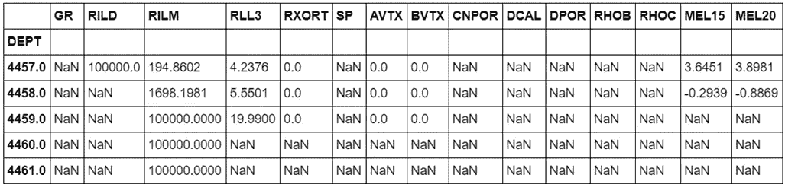
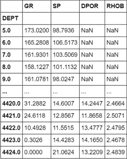
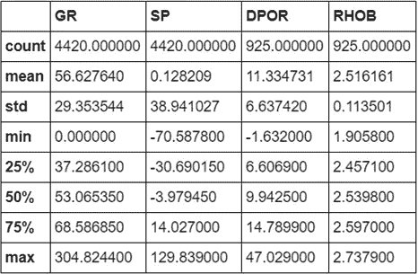
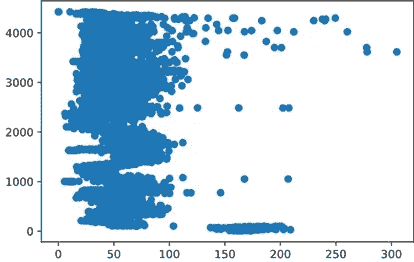
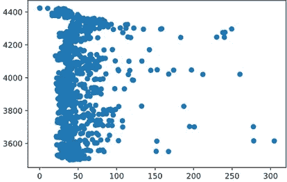
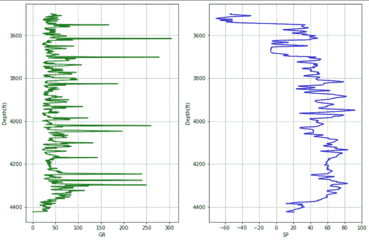
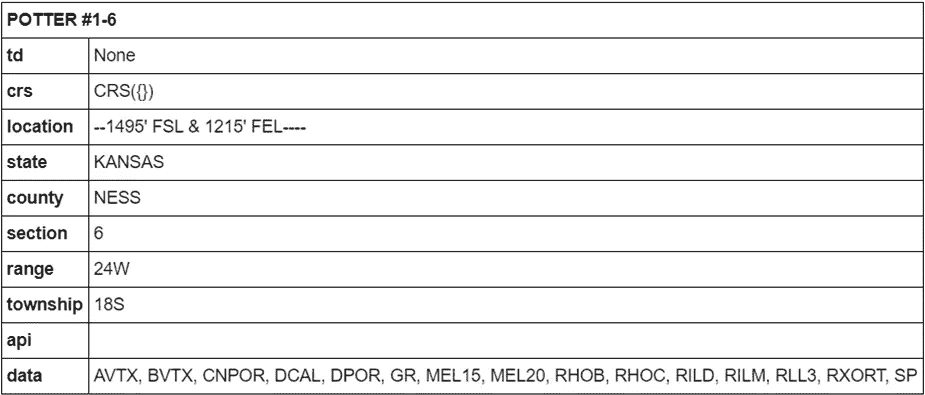
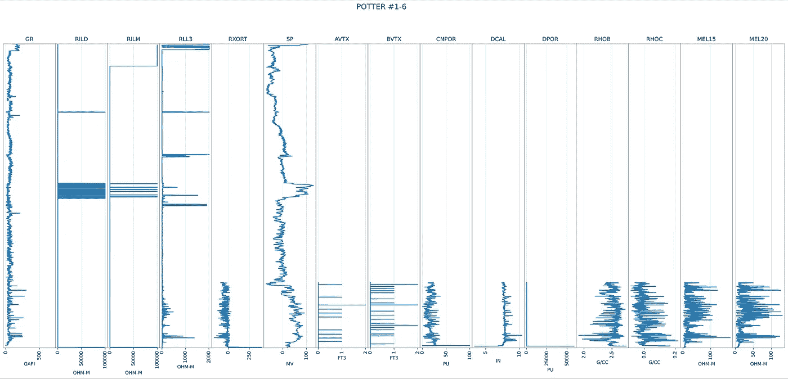
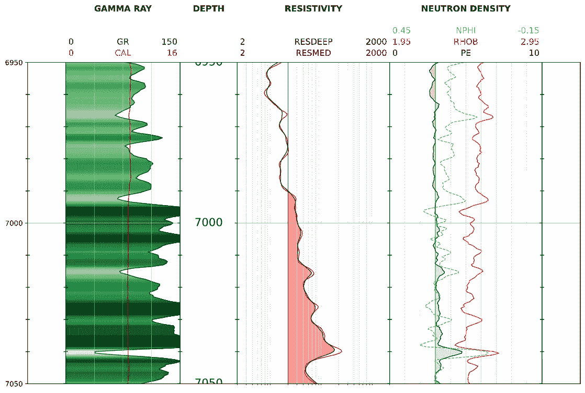

# 用 Python 绘制测井曲线的最佳库

> 原文：<https://medium.datadriveninvestor.com/the-best-library-to-plot-well-logs-with-python-70e9445f77f9?source=collection_archive---------0----------------------->


Photo by [WORKSITE Ltd.](https://unsplash.com/@worksite?utm_source=medium&utm_medium=referral) on [Unsplash](https://unsplash.com?utm_source=medium&utm_medium=referral)

对于一个从未听说过“测井”这个术语的人来说，它是一种工具，告诉你当你在地球上越钻越深时会遇到什么。

这是石油公司特别感兴趣的，因为他们的工作是寻找钻探和生产的前景，所以他们需要使用特殊的数据来减少钻井的不确定性和风险。

这些公司有专门的软件来分析这些数据，并根据这些数据做出决策。问题是这个软件并不是所有人都能接触到的，而且要拿到许可证也是相当昂贵的。

这就是 Python 派上用场的时候，因为您可以使用几个库来操作来自开源数据集的日志数据，并为教育目的甚至实验目的进行有用的可视化。


Photo by [Shahadat Rahman](https://unsplash.com/@hishahadat?utm_source=medium&utm_medium=referral) on [Unsplash](https://unsplash.com?utm_source=medium&utm_medium=referral)

我将向您展示如何使用 Lasio、Welly 和 PetroPy 库在 Python 中绘制油井数据。完成这个工作流程后，您将对这些库的使用有更深入的了解。

Jupyter 笔记本可以在我的 G [itHub](https://github.com/arturoruizs/wells.git) 页面找到。

# **拉西奥**

首先，我们将使用 Lasio，一个由[加拿大测井学会](https://www.cwls.org/products/#products-las)出版的库。油井数据是从 2020 年的堪萨斯地质调查局[公开数据集](http://www.kgs.ku.edu/PRS/Scans/Log_Summary/index.html)中获得的。

[](https://www.datadriveninvestor.com/2020/07/07/introduction-to-time-series-forecasting-of-stock-prices-with-python/) [## 用 Python |数据驱动投资者进行股票价格时间序列预测简介

### 在这个简单的教程中，我们将看看如何将时间序列模型应用于股票价格。更具体地说，一个…

www.datadriveninvestor.com](https://www.datadriveninvestor.com/2020/07/07/introduction-to-time-series-forecasting-of-stock-prices-with-python/) 

如何使用 Lasio 处理井数据的过程基于 Ryan A. Mardani 在 Medium 上发表的这篇伟大的文章。我鼓励你去看看。

首先，我们导入一些用于数据争论的基本库，包括 Lasio。

```
import pandas as pd
import numpy as np
import matplotlib.pyplot as plt
import lasio
```

让我们加载油井数据并使用 Pandas 来处理它

```
las = lasio.read('sample.las')
df = las.df()
df.tail()
```



Raw dataframe. Image by author

我们将只关心这个数据框的一些列。

这些列是伽马射线和自然电位。此外，我们将删除 NaN 行。

```
selected_columns = ['GR','SP']
df_shorter = df[selected_columns]df_clean = df_shorter.dropna(subset=['GR', 'SP'],axis=0, how='any')
```



Shorter dataframe. Image by author

为了准确地描述数据，我们应该首先对其进行规范化。有了 for 循环，我们可以更快地完成这项任务:

```
df_normal = df_clean.copy()for column in df_clean.describe().columns:df_normal = df_clean[(df_clean[column] >    df_clean.describe([column]['min']) & (df_clean[column] <= df_clean.describe()[column]['max'])]
```



Cleaned data. Image by author



Comparing pre-cleaned data (left) and cleaned data (right). Image by author

最后，我们可以使用 Matplotlib 绘制 GR 和 SP 日志:

```
def plotter(): f, ax = plt.subplots(nrows=1, ncols=2, figsize=(12,8))
 logs = ['GR','SP']
 colors = ['green','blue'] for i,log,color in zip(range(2),logs,colors):
   ax[i].plot(df_normal[log], df_normal.DEPTH, color=color)
   ax[i].invert_yaxis()
   ax[i].set_xlabel(log)
   ax[i].set_ylabel("Depth(ft)")
   ax[i].grid()
plotter()
```



GR and SP logs plotted with Lasio and Matplotlib

这个过程并不困难，但绝对是缓慢的。让我们看看韦利会发生什么。

# 活力

这个库是由[敏捷地球科学](https://github.com/agile-geoscience/welly)创建的，绘制测井曲线的速度快得惊人。看看这个:

```
from welly import Well
well = Well.from_las('sample.las')
well
```

我们刚刚从库中导入了一个类，输出是一个如下所示的 well 对象:



Well object created with Welly. Image by author

然后，通过一行简单的代码，我们可以绘制 Welly 在我们的数据中识别的所有日志:

```
well.plot()
```



Well logs plot created with Welly. Image by author

这是非常快速，容易和准确的。

现在是使用 **PetroPy** 的时候了。

# 彼得皮

这个库是托德·海特曼创建的，你可以在这里查看文档。

使用 PetroPy，我们可以使用 ptr 简单地加载我们的日志。这将产生一个 CurvesItem，但是如果任何曲线丢失，它将弹出一个 ValueError，因为 ptr。LogViewer 使用 XML 模板。

让我们尝试使用库附带的一个样本数据集。我们必须使用 ptr.log_data:

```
import petropy as ptrlog_sample = ptr.log_data('WFMP')
viewer_sample = ptr.LogViewer(log_sample,top = 6950, height = 100)
```



Plot produced by PetroPy. Image by author.

如你所见，图像质量相当好。这个库产生视觉上吸引人的图形。

# 最后的想法

用于执行这项任务的库各有优缺点。

在 Welly 的例子中，它非常容易使用，并且只用一行代码就能生成一个图。我认为这是获得油井数据快速绘图的最佳方法。另一个优点是它的文档非常丰富。

Lasio 做得很好，但对某些人来说，这个过程可能很乏味，但有了 Matplotlib 的功能，你可以按你想要的任何方式编辑你的绘图。

如果你想制作一个吸引人和流畅的情节，我会推荐 PetroPy，但是 XML 模板的问题对我来说是一个很大的缺点。

这三个库对于任何想要从井数据中制作快速可视化或漂亮绘图的人来说都是惊人的资源，我鼓励您开始使用它们并构建集成更多开源工具的令人敬畏的项目。

**访问专家视图—** [**订阅 DDI 英特尔**](https://datadriveninvestor.com/ddi-intel)